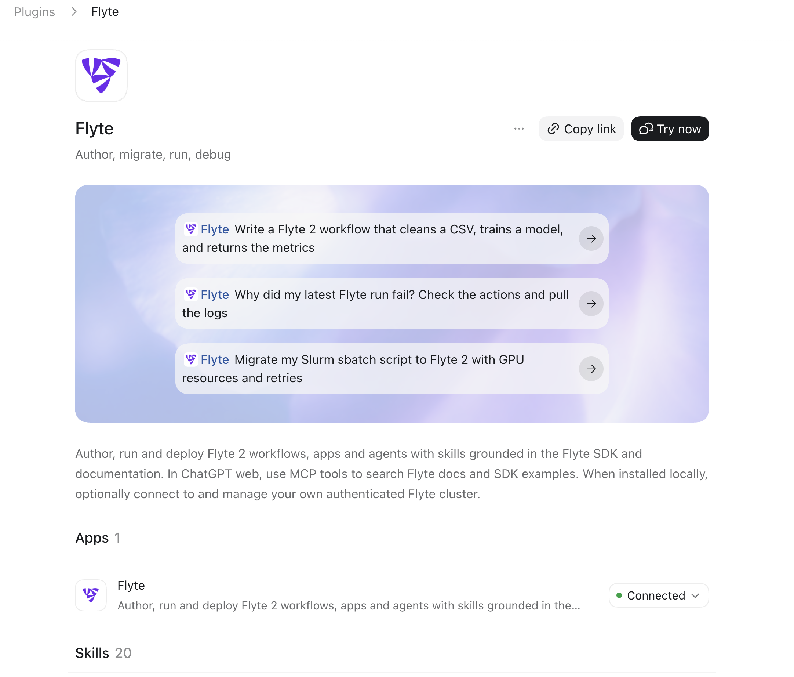
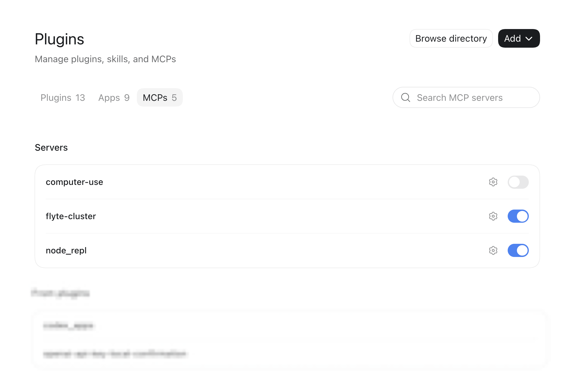

# Flyte agent plugins

[`flyte-agent-plugins`](https://github.com/flyteorg/flyte-agent-plugins) bundles agent
skills and two MCP servers for Flyte. Install it and your coding agent can scaffold
workflows, build and serve apps, run and inspect executions, migrate Flyte 1 code and
Slurm batch jobs to Flyte 2, and deploy clusters, grounded in the Flyte SDK, the
documentation, and optionally your own cluster.

The same skills run in Claude Code, ChatGPT's Codex agent, Hermes, OpenCode, Pi, and any
other harness that supports agent skills. `uvx flyte-skills install` gets the skills into
any harness. In ChatGPT, the official Flyte plugin also provides `flyte-docs`; add the
optional local `flyte-cluster` server separately.

## Compatibility

The skills are plain [Agent Skills](https://agentskills.io) (`SKILL.md` plus YAML
frontmatter), so they load in any harness that supports the standard. The MCP servers
are separate, and only some harnesses can have them configured for you.

| Harness | Skills | MCP servers | Skill installation |
|---------|--------|-------------|--------------------|
| Claude Code | All 21 | Both, via `mcp install` | `--target claude` |
| ChatGPT (Codex) | All 21, through the official Flyte plugin | `flyte-docs` automatic; `flyte-cluster` local | Plugins catalog |
| Codex CLI | All 21 | Both, via `mcp install` | `--target agents` |
| Hermes | All 21, or per-skill | Manual | `--target hermes` |
| OpenCode | All 21 | Manual | `--target opencode` |
| Pi | All 21 | Manual | `--target pi` |

[`flyte-agent-plugins mcp install`](#install-mcp-servers) covers local Claude Code and
Codex because it drives their own CLIs. The official Flyte plugin in ChatGPT includes
`flyte-docs`; `flyte-cluster` is separate because it runs locally with the user's Flyte
credentials. Hermes, OpenCode, and Pi have no equivalent command, so [add their servers
by hand](#adding-mcp-servers-locally).

## Install Flyte Skills

Every command on this page assumes you have
[`uv` installed](https://docs.astral.sh/uv/getting-started/installation/).

This installs the skill files only — no MCP servers. The `flyte-skills` CLI copies all
21 skills into whichever harness directories it finds on your machine, with no arguments
needed:

```bash
uvx flyte-skills install
```

(`pip install flyte-skills` followed by `flyte-skills install` works the same way.)

| `--target` | User-level directory | Project-level (`--project`) | Read by |
|------------|----------------------|-----------------------------|---------|
| `agents` | `~/.agents/skills/` | `.agents/skills/` | Codex, Hermes (project), any harness following the convention |
| `claude` | `~/.claude/skills/` | `.claude/skills/` | Claude Code |
| `hermes` | `~/.hermes/skills/` | `.hermes/skills/` | Hermes |
| `opencode` | `~/.config/opencode/skills/` | `.opencode/skills/` | OpenCode |
| `pi` | `~/.pi/agent/skills/` | — | Pi |

`--target codex` still works as an alias for `agents` — it is the same directory.

```bash
uvx flyte-skills install --target claude --target hermes  # pick harnesses explicitly
uvx flyte-skills install --target agents                  # cross-harness standard location
uvx flyte-skills install --dir ~/somewhere/skills         # any directory you choose
uvx flyte-skills install --project                        # this repo only
uvx flyte-skills install --dry-run                        # preview, change nothing
uvx flyte-skills install --force                          # overwrite existing copies
uvx flyte-skills uninstall                                # remove them again
uvx flyte-skills list                                     # list the bundled skills
```

For a harness-agnostic install, `--target agents` writes to `~/.agents/skills/`, the
convention shared across agent CLIs, so any harness that honors it picks the skills up
without a harness-specific flag. `--dir <path>` writes them anywhere else you like. Both
behave the same with `--project`, `--dry-run`, and `uninstall`.

`flyte-skills` and `flyte-agent-plugins` carry the same 21 skills, so every `install`
command above works under either name. They differ in one thing: only
`flyte-agent-plugins` ships the `mcp` subcommand, so reach for that name when you want
[the MCP servers](#install-mcp-servers) too. To pin a release across any harness:

```bash
uvx --from flyte-skills==<version> flyte-skills install
```

> [!NOTE] This installs the skills, not the MCP servers
> Add them with [`flyte-agent-plugins mcp install`](#install-mcp-servers), or
> [wire them up by hand](#adding-mcp-servers-locally).

### ChatGPT

Open **Plugins** in ChatGPT, search for **Flyte**, and install the official Flyte plugin.
No custom marketplace or GitHub repository is required. Installing it makes the Flyte
skills and `flyte-docs`, the hosted read-only search server, available to ChatGPT's Codex
agent.



The official plugin does not install `flyte-cluster`. For local Codex tasks, add that
server with [`flyte-agent-plugins mcp install`](#install-mcp-servers) or [configure it
manually](#adding-mcp-servers-locally). `flyte-cluster` provides optional local access to
the cluster your Flyte CLI is logged into.



## Install MCP Servers

`flyte-skills install` deliberately writes skills only. To add the two MCP servers, use
the `flyte-agent-plugins` package — it carries the same skills, but it is the only one of
the two names that ships the `mcp` subcommand:

```bash
uvx flyte-agent-plugins mcp install                               # claude/codex on PATH
uvx flyte-agent-plugins mcp install --target claude --scope user  # one harness, one scope
uvx flyte-agent-plugins mcp install --server flyte-docs           # just the docs server
uvx flyte-agent-plugins mcp install --dry-run                     # print commands only
uvx flyte-agent-plugins mcp list                                  # what would be added
uvx flyte-agent-plugins mcp uninstall                             # remove them again
```

This drives each harness's own CLI (`claude mcp add-json`, `codex mcp add`) rather than
editing config files, so the harness owns its format and nothing else in your config is
at risk. It needs `claude` or `codex` on your `PATH`, and covers only those two — Hermes,
OpenCode, and Pi have no equivalent command, so
[add the servers by hand](#adding-mcp-servers-locally) there.

> [!WARNING] These servers are tools the agent can call, not inert Markdown
> `flyte-docs` sends your search queries to a Union-operated endpoint, and
> `flyte-cluster` gets control-plane access to your cluster. Installing `flyte-cluster`
> does not by itself make it work: it needs `uv` and a Flyte login.

## Skills

The plugin ships skills across three areas: authoring Flyte 2 workflows and apps,
migrating existing workloads to Flyte 2, and deploying Flyte clusters.

### SDK & workflow authoring

| Skill | What it helps with |
|-------|--------------------|
| `flyte-sdk-author` | Scaffold projects and generate tasks, workflows, launch plans, and apps from templates. |
| `flyte-sdk-types` | Choose the right types, I/O, and serialization for your data (DataFrames, files, images, HF datasets). |
| `flyte-sdk-ship` | Generate `flyte.Image` specs and Dockerfiles, and manage dependencies and reproducible builds. |
| `flyte-sdk-run` | Run workflows, inspect runs and actions, retrieve logs and outputs, and manage the run lifecycle. |
| `flyte-sdk-eval` | Build evaluation harnesses and unit tests to validate correctness and performance early. |
| `flyte-sdk-optimize` | Improve performance via task granularity, caching, and resource tuning using run metadata. |
| `flyte-sdk-app` | Build and serve apps: FastAPI, Streamlit, vLLM, SGLang, WebSocket, and browser apps. |
| `flyte-sdk-agent` | Build durable agents: ReAct, Plan-and-Execute, LangGraph, PydanticAI, memory, and MCP tools. |
| `flyte-sdk-data` | Author data-engineering patterns: ETL, data-quality checks, fan-out/map tasks, and dynamic workflows. |
| `flyte-sdk-ml` | Author ML workloads: training, hyperparameter optimization, evaluation, and batch/real-time inference. |

### Migration (Flyte 1 → Flyte 2)

| Skill | What it helps with |
|-------|--------------------|
| `flyte-migrate` | Entry-point orchestrator: explains the v1→v2 shift and routes to the sibling migration skills. |
| `flyte-migrate-tasks-workflows` | Convert task and workflow decorators to their Flyte 2 equivalents. |
| `flyte-migrate-config` | Migrate task configuration, images, resources, caching, secrets, scheduling, and CLI usage. |
| `flyte-migrate-control-flow` | Migrate branching, dynamic workflows, failure handling, and fan-out to native Flyte 2 Python. |
| `flyte-migrate-data-io` | Migrate data types and offloaded I/O (`FlyteFile`, `FlyteDirectory`, `StructuredDataset`) to `flyte.io`. |
| `flyte-migrate-ml` | Migrate ML workloads (training, HPO, GPU, batch inference) and adopt net-new v2 patterns. |

### Migration (Slurm → Flyte 2)

| Skill | What it helps with |
|-------|--------------------|
| `flyte-migrate-slurm` | Port HPC batch workloads off Slurm: `#SBATCH` pragmas become `TaskEnvironment` config, job arrays become `flyte.map` or `asyncio.gather`, `--dependency` chains become plain Python, multi-node `srun` becomes a clustered task environment, and `--requeue` splits into retries, checkpoints, and spot capacity. |

> [!NOTE]
> Treat this one as a starting point rather than a mechanical translator, and review what
> it produces. Multi-node, multi-GPU training ports over cleanly; tightly coupled MPI
> simulation is the main thing that stays on Slurm.

### Deployment

| Skill | What it helps with |
|-------|--------------------|
| `flyte-deploy-aws` | Deploy a Flyte v2 cluster on AWS from scratch: EKS + S3 + RDS, behind an ALB, with optional TLS and SSO. |
| `deploy-flyte-kind` | Deploy a Flyte stack on a local [kind](https://kind.sigs.k8s.io/) cluster with hosted PostgreSQL and object storage. |
| `deploy-flyte-kind-vm` | Provision a host (local or a cloud VM) and run the kind-based Flyte deployment on it. |
| `start-dex-local` | Stand up [Dex](https://dexidp.io/) as an in-cluster OIDC provider to test authentication locally. |

> [!NOTE]
> The deployment skills target self-hosted, open-source Flyte: they provision your own
> EKS or kind cluster. On a managed offering Union runs the cluster for you, so these
> skills are mainly useful for evaluation and self-managed deployments.

## MCP servers

The plugin includes instructions for two optional [MCP](https://modelcontextprotocol.io)
servers, split so nothing is duplicated between them. In ChatGPT, `flyte-docs` is
included with the official plugin; configure only the optional local `flyte-cluster`
server separately.

| Server | Transport | Tools | Needs |
|--------|-----------|-------|-------|
| `flyte-docs` | Hosted HTTP | 3 search tools over Flyte SDK examples, docs examples, `llms.txt` | Nothing; automatic in ChatGPT |
| `flyte-cluster` | Local stdio | 29 control-plane tools: tasks, runs, actions, logs, apps, triggers, projects, secrets, conditions, identity | `uv`; a Flyte login for the tools to return data |

### How skills and MCP servers work together

Skills and MCP servers solve different parts of the problem:

- **Skills** are instructions and reusable guidance. They help the coding agent choose
  an appropriate Flyte pattern, write or migrate code, and decide how to validate it.
  Skills do not make network calls themselves. In a local Codex session with an installed
  and authenticated `flyte` CLI, they can guide the agent to use that CLI directly.
- **MCP servers** provide callable tools. `flyte-docs` grounds an answer in current SDK
  examples and documentation; `flyte-cluster` lets the agent read or act on the Flyte
  cluster you are authenticated to through a structured tool interface.

For example, a `flyte-sdk-run` skill can guide an agent through debugging a failed run;
with `flyte-cluster` configured, the agent can also inspect that run and retrieve its
logs through MCP. Without that server, a local agent can still use an available,
authenticated `flyte` CLI to inspect the run; otherwise, the skill can explain the
workflow but cannot look it up. Configure only the tools and access you intend the agent
to have.

### What each one does with your data

`flyte-docs` is read-only, unauthenticated, and operated by Union. In ChatGPT it is
available with the official Flyte plugin; there is no local corpus to download or `uv`
to install. Your search queries do leave your machine.

`flyte-cluster` runs on your machine. It is the SDK's own `flyte-mcp` entry point.
Claude Code runs it through the bundled plugin configuration; for local Codex tasks in
ChatGPT, add the server configuration below. `uvx` fetches it from PyPI at each launch.
This is the command:

```bash
uvx --from "flyte[mcp]==2.6.10" flyte-mcp --transport stdio \
  --tool-groups task,run,action,logs,app,trigger,project,secret,condition,identity \
  --no-init-from-config
```

Calls go straight from your machine to your control plane, so no cluster data passes
through anything Union operates.

Three things in that command matter:

- `2.6.10` caps `mcp` below 2.0. Releases earlier than `2.5.18` can resolve `mcp` 2.0.0
  and die at import; pinning also keeps tool metadata and behavior reproducible.
- The `search` groups are left out. `flyte-docs` already serves them hosted, and enabling
  them here clones roughly 120 MB into `~/.flyte/mcp` on first launch.
- `--no-init-from-config` means an unconfigured client gets a clean MCP error instead of
  the server starting an interactive login on its JSON-RPC stdout.

To send nothing out at all, drop `flyte-docs` and add `search` to the `flyte-cluster`
groups. You trade the hosted lookup for the local corpus.

### A cluster is optional

`flyte-cluster` is tenant-agnostic: it uses the SDK's normal config discovery, so it acts
on whichever control plane your `flyte` CLI is authenticated against. Set
`FLYTE_MCP_PROJECT` and `FLYTE_MCP_DOMAIN` in the MCP environment, or have calls supply
`project` and `domain`, before using the cluster tools. It starts even with no Flyte
config: the tools register either way, and calls then report the missing target rather
than breaking the protocol. So the plugin still helps while you are deploying your first
cluster.

### Adding MCP servers locally

In ChatGPT's Codex agent, `flyte-docs` is already available through the official Flyte
plugin; add only `flyte-cluster` for cluster access. Local Claude Code and Codex can use
[`flyte-agent-plugins mcp install`](#install-mcp-servers). Hermes, OpenCode, and Pi need
manual configuration because the installer cannot configure them. Both servers are
portable: one is a URL, the other needs no checkout or path. Use the Claude Code and
Codex tabs only if you prefer to write the configuration yourself.

#### `flyte-docs`

`flyte-docs` is already connected in ChatGPT through the official Flyte plugin. Use
these snippets for Claude Code, Codex CLI, or another harness:




```json
// .mcp.json
{ "mcpServers": { "flyte-docs": { "type": "http",
  "url": "https://flyte-mcp.apps.demo.hosted.unionai.cloud/flyte-mcp/mcp" } } }
```




```toml
# ~/.codex/config.toml
[mcp_servers.flyte-docs]
url = "https://flyte-mcp.apps.demo.hosted.unionai.cloud/flyte-mcp/mcp"
```




```yaml
# ~/.hermes/config.yaml
mcp_servers:
  flyte-docs:
    url: "https://flyte-mcp.apps.demo.hosted.unionai.cloud/flyte-mcp/mcp"
```




```json
// opencode.json
{ "mcp": { "flyte-docs": { "type": "remote",
  "url": "https://flyte-mcp.apps.demo.hosted.unionai.cloud/flyte-mcp/mcp",
  "enabled": true } } }
```




```json
// ~/.pi/agent/mcp.json
{ "mcpServers": { "flyte-docs": { "type": "http",
  "url": "https://flyte-mcp.apps.demo.hosted.unionai.cloud/flyte-mcp/mcp" } } }
```




#### `flyte-cluster`

`flyte-cluster` is a local stdio process. Its installation is separate from the Flyte
plugin: the local runtime launches `uvx`, which downloads and runs the `flyte[mcp]`
package. It uses the same active Flyte configuration and login as the `flyte` CLI.




```json
// .mcp.json
{ "mcpServers": { "flyte-cluster": {
  "command": "uvx",
  "args": ["--from", "flyte[mcp]==2.6.10", "flyte-mcp", "--transport", "stdio",
           "--tool-groups",
           "task,run,action,logs,app,trigger,project,secret,condition,identity",
           "--no-init-from-config"] } } }
```




```toml
# ~/.codex/config.toml
[mcp_servers.flyte-cluster]
command = "uvx"
args = ["--from", "flyte[mcp]==2.6.10", "flyte-mcp", "--transport", "stdio",
        "--tool-groups", "task,run,action,logs,app,trigger,project,secret,condition,identity",
        "--no-init-from-config"]
```




```yaml
# ~/.hermes/config.yaml
mcp_servers:
  flyte-cluster:
    command: "uvx"
    args: ["--from", "flyte[mcp]==2.6.10", "flyte-mcp", "--transport", "stdio",
           "--tool-groups", "task,run,action,logs,app,trigger,project,secret,condition,identity",
           "--no-init-from-config"]
```




```json
// opencode.json
{ "mcp": { "flyte-cluster": { "type": "local", "enabled": true,
  "command": ["uvx", "--from", "flyte[mcp]==2.6.10", "flyte-mcp", "--transport", "stdio",
              "--tool-groups",
              "task,run,action,logs,app,trigger,project,secret,condition,identity",
              "--no-init-from-config"] } } }
```




```json
// ~/.pi/agent/mcp.json
{ "mcpServers": { "flyte-cluster": {
  "command": "uvx",
  "args": ["--from", "flyte[mcp]==2.6.10", "flyte-mcp", "--transport", "stdio",
           "--tool-groups",
           "task,run,action,logs,app,trigger,project,secret,condition,identity",
           "--no-init-from-config"] } } }
```




### Changing what is served

For Claude Code, edit `args` in the plugin's `.mcp.json`; for local Codex and other
manual setups, edit the server `args` in the client configuration. Pass `--tool-groups`,
`--tools`, or `--read-only` to change what is exposed. Scope the server to one project
and domain with the `FLYTE_MCP_PROJECT` and `FLYTE_MCP_DOMAIN` environment variables.

> [!TIP]
> `flyte-cluster` exposes the same Flyte control-plane tools you can serve yourself with a
> `FlyteMCPAppEnvironment`. See
> [Flyte MCP server](../../user-guide/agents/build-mcp/flyte_mcp_server) for the full tool
> reference, tool groups, and allowlists.
