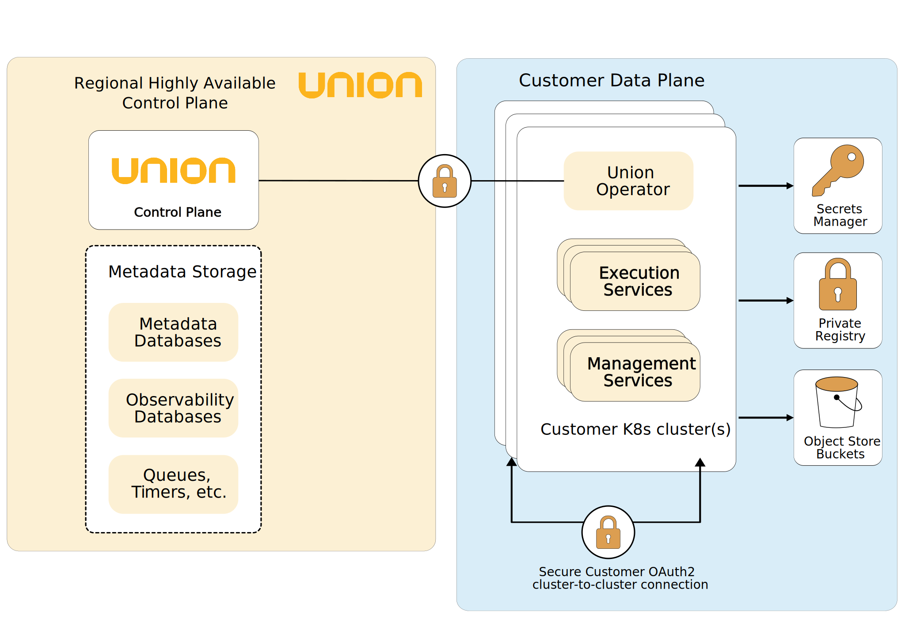

# Architecture

This section covers the architecture of the  system.




Union’s modular architecture allows for great flexibility and control. The customer can decide how many clusters to have, their shape, and who has access to what. All communication is encrypted.

## Control plane

The control plane is responsible for coordinating work across one or more data planes.

## Data plane

All your workflow and task executions are performed in the data plane, which runs within your public, private, or hybrid clouds. In BYOC deployments, the data plane’s clusters are provisioned and managed by the control plane through a resident Union operator with minimal required permissions. In self-managed deployments, you provision and manage the data plane yourself.

### Worker nodes

Worker nodes are responsible for executing your workloads. You have full control over the configuration of your worker nodes.

When worker nodes are not in use, they automatically scale down to the configured minimum (scaling to zero).


