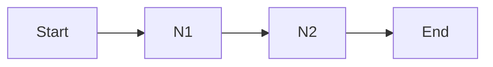

# Workflow timeline

The illustration below shows the timeline view of a workflow execution.

This illustration refers to a simple workflow, with 2 nodes `N1` an `N2`. This can be represented as follows:

## Acceptance Latency

Every workflow starts in the acceptance phase.
Acceptance refers to the time between FlyteAdmin receiving an execution request and FlytePropeller evaluating the first round of workflow.
Usually, within this phase, the Kubernetes queuing latency is the largest contributor to latency where the overall acceptance latency of less than five seconds is desirable.

## Transition Latency

Transition latency refers to the time between successive node executions, that is, between `N1` and `N2`.
For the first node `N1`, this latency also encapsulates executing the start node.

Similarly, the last node also encapsulates executing end node.
`Start Node` and `End Node` are capstones inserted to mark the beginning and end of the DAG.

The latency involves time consumed to:

1. Gather outputs for a node after the node completes execution.

1. Send an observation event to FlyteAdmin.
   Failing to do so will be regarded as an error and will be tried until it succeeds or system max retries are exhausted (the number of max system retries is configured to be 30 by default and can be altered per deployment).

2. Persist data to Kubernetes.

3. Receive the persisted object back from Kubernetes (as this process is eventually consistent using informer caches).

4. Gather inputs for a node before the node starts.

5. Send a queued event for the next node to FlyteAdmin (this is what is persisted and drives the UI/CLI and historical information).

## Queuing Latency

Queuing latency is the time taken by Kubernetes to start the pod, other services to start the job, HTTP throttle to be met, or any rate-limiting that needs to be overcome. This is usually tied to the available resources and quota, and is out of control for Flyte.

## Completion Latency

Completion latency is the time taken to mark the workflow as complete and accumulate outputs of a workflow after the last node completes its execution.

## Overview of Various Latencies in FlytePropeller

Description of main events for workflow execution:

| Events | Description |
|-|-|
| Acceptance | Measures the time between when we receive service call to create an Execution (Unknown) and when it has moved to Queued. |
| Transition Latency | Measures the latency between two consecutive node executions, the time spent in Flyte engine. |
| Queuing Latency | Measures the latency between the time a node’s been queued to the time the handler reported the executable moved to running state. |
| Task Execution | Actual time spent executing user code |
| Repeat steps #2 to #4 for every task | |
| Transition Latency | See #2 |
| Completion Latency | Measures the time between when the WF moved to succeeding/failing state and when it finally moved to a terminal state. |

