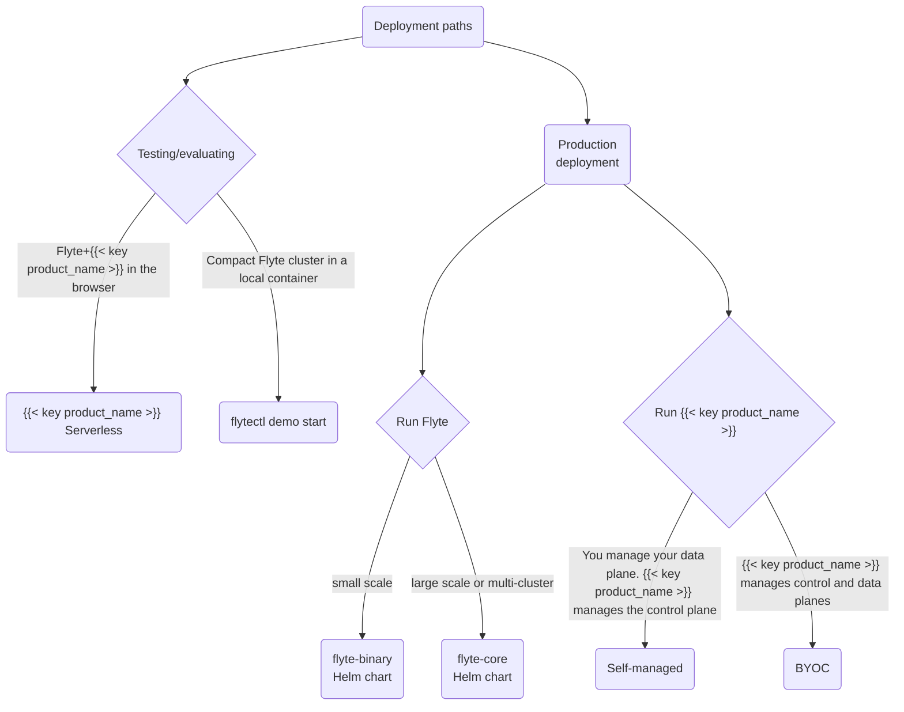

# Platform deployment




The  platform utilizes a split control plane / data plane model that separates workflow orchestration logic (control plane) from user code, data (inputs and outputs), images, and logs (which live in the data plane).
 always operates the control plane in its own cloud infrastructure in Amazon Web Services (AWS). The control plane houses our IDP, workload execution state, the names of tasks and other deployed entities, and pointers to object storage locations in the data plane (but not any user data).

The data plane runs in your cloud account and VPC. It composes the required services to run and monitor workflows - a Kubernetes cluster, and object storage bucket, an image registry, a secrets manager, a logging solution, and IAM role with proper access. When you run a workflow, the code is sent to the object storage bucket, the image is built on a builder node and pushed to the registry, a pod is created and assumes the IAM role, then the image is pulled down, and the container loads its data inputs from and, when the job is complete, saves its outputs to, the object store. All of this happens in the data plane, with the control plane aware only of the workflow execution state, and not the code, data, logs, secrets, or any other proprietary information. The data plane communicates with the control plane through an outgoing port through a zero trust proxy. There is no open incoming port to the data plane.







 is meant to be a fully "serverless in your cloud", turnkey product that enables you to offload all infrastructure management to Union, who will handle deployment, monitoring, Kubernetes upgrades, and all other operational concerns with the platform.
 supports data planes on Amazon WebServices (AWS), Google Cloud Platform (GCP), and Microsoft Azure.






 allows platform operators to manage the Union data plane themselves on a Kubernetes cluster that they control and maintain. In this model, Union only manages the control plane scaling and resiliency. Your platform team manages data plane hardware, upgrades and permissions. You do not need to provide any permissions to the Union system to create a  dataplane.

 supports data planes on Amazon WebServices (AWS), Google Cloud Platform (GCP), Microsoft Azure or Oracle Compute Infrastructure (OCI).







Installing 








Flyte is distributed as a Helm chart with different supported deployment scenarios.
 is the platform built on top of Flyte that extends its capabilities to include RBAC, instant containers, real-time serving and more.
The following diagram describes the available deployment paths for both options:

This section walks you through the process to create a Flyte cluster and cover topics related to enabling and configuring plugins, authentication, performance tuning, and maintaining Flyte as a production-grade service.



