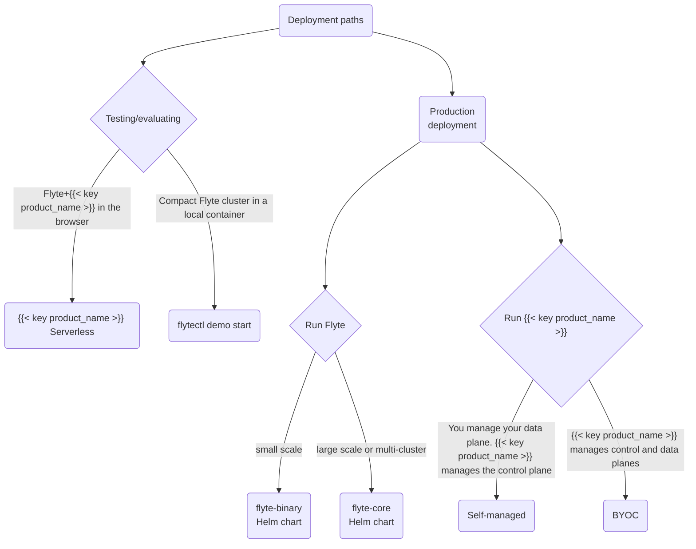

# Deployment




 uses a hybrid model cloud service:  maintains the control plane of the application on its own cloud infrastructure in Amazon Web Services (AWS).
This is where all administration and management functionality resides.

Your data and the actual computation involved in executing your tasks and workflows takes place on the data plane, a virtual private cloud that you control, but that is administered and managed by the  control plane.
To enable the administration and management of your data plane, you grant  the required permissions when you set up your data plane.






 supports data planes on Amazon WebServices (AWS), Google Cloud Platform (GCP), and Microsoft Azure.






Union supports data planes on Kubernetes clusters running on-premise or on cloud providers Amazon WebServices (AWS), Google Cloud Platform (GCP), Microsoft Azure or Oracle Compute Infrastructure







Installing 








Flyte is distributed as a Helm chart with different supported deployment scenarios.
 is the platform built on top of Flyte that extends its capabilities to include RBAC, instant containers, real-time serving and more.
The following diagram describes the available deployment paths for both options:

This section walks you through the process to create a Flyte cluster and cover topics related to enabling and configuring plugins, authentication, performance tuning, and maintaining Flyte as a production-grade service.



