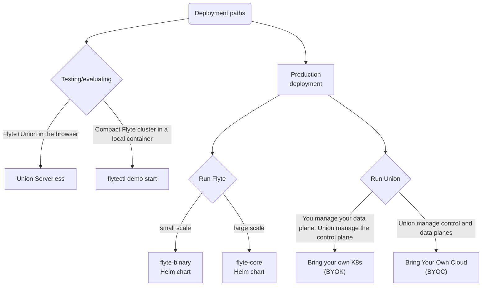

# Deployment



Union uses a hybrid model cloud service: Union maintains the control plane of the application on its own cloud infrastructure in Amazon Web Services (AWS).
This is where all administration and management functionality resides.

Your data and the actual computation involved in executing your Flyte tasks and workflows takes place on the data plane, a virtual private cloud that you control but that is administered and managed by the Union control plane.
To enable the administration and management of your data plane, you grant Union the required permissions when you set up your data plane.

Union supports data planes on Amazon WebServices (AWS), Google Cloud Platform (GCP), and Microsoft Azure.






Flyte is distributed as a Helm chart with different deployment scenarios supported as described in the following diagram:

This section walks you through the process to create a Flyte cluster and cover topics related to enabling and configuring plugins, authentication, performance tuning, and maintaining Flyte as a production-grade service.



