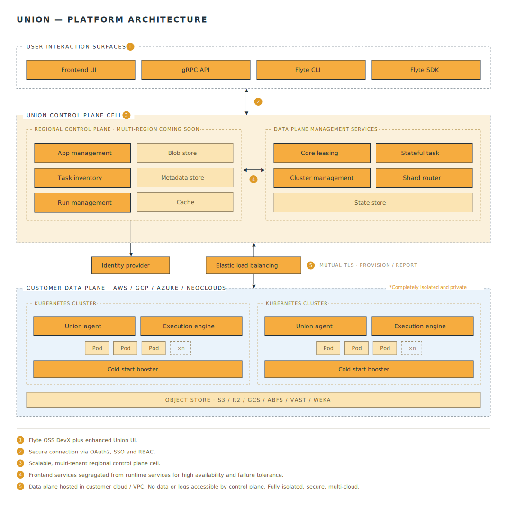

# Platform architecture

The  architecture consists of two virtual private clouds, referred to as planes: the control plane and the data plane.

## Control plane

The control plane:

* Runs within the  AWS account.
* Provides the user interface through which users can access authentication, authorization, observation, and management functions.
* Is responsible for placing executions onto data plane clusters and performing other cluster control and management functions.

## Data plane

All your workflow and task executions are performed in the data plane, which runs within your cloud provider account. Your data plane is a Kubernetes cluster provisioned by the control plane and then managed on an ongoing basis through a resident  operator that runs with minimal required permissions (described in the following section).

 operates one control plane for each supported region, which supports all data planes within that region. You can choose the region in which to locate your data plane. Currently,  supports the `us-west`, `us-east`, `eu-west`, and `eu-central` regions, and more are being added.

### Data plane nodes

Once the data plane is deployed in your cloud provider account, there are different kinds of nodes with different responsibilities running in your cluster. In , we distinguish between default nodes and worker nodes.

Default nodes guarantee the basic operation of the data plane and are always running. Example services that run on these nodes include autoscaling (worker nodes), monitoring services, union operator, and many more.

Worker nodes are responsible for executing your workloads. You have full control over the configuration of your [worker nodes](./configuring-your-data-plane#worker-node-groups).

When worker nodes are not in use, they automatically scale down to the configured minimum. (The default is zero.)

##  operator

The  hybrid architecture lets you maintain ultimate ownership and control of your data and compute infrastructure while enabling  to handle the details of managing that infrastructure. The component that makes this possible is the ** operator**: a dedicated service, resident in your data plane, that acts as the primary channel through which the control plane and your data plane interact. It is designed to perform its functions with only the very minimum set of required permissions.

### How your data plane is provisioned and maintained

Your data plane is created by the control plane, not by the operator. When you onboard, the control plane uses infrastructure-as-code, applied against your cloud account, to provision the Kubernetes cluster (for example, an EKS cluster on AWS) along with the supporting cloud resources the platform requires — such as IAM roles and the object-storage buckets that hold your workflow data and metadata. Once that cluster is up,  deploys the operator onto it.

The control plane periodically re-runs this same provisioning process to apply infrastructure changes to your cluster as part of ongoing deployment and maintenance — for example, adding instance types, adjusting node-group sizes, or updating the versions of platform components — so that upgrades and configuration changes are handled for you.

### What the operator does

Once installed, the operator is the resident data-plane component that keeps your cluster in sync with the control plane. It is the primary way the two systems interact. Working with only the minimum permissions it requires, the operator:

* **Runs your executions.** The control plane assigns executions to your data plane; the operator picks up those operations and carries them out, creating and tearing down the Kubernetes pods that run your tasks and applications.
* **Reports cluster state.** It sends heartbeat, status, health, and resource-usage information back to the control plane, so the control plane can observe and schedule work without needing direct access to your cluster.
* **Maintains platform services.** It manages the data plane's supporting services — including the secure tunnel used for connectivity, API-key provisioning, image building, secret watching, and compute reconciliation.
* **Moves your data.** It runs the data-plane `dataproxy` service, which issues the presigned URLs that let clients read and write your workflow data directly to and from the object store in your data plane (see [Execution data](#execution-data)), so that data never transits the control plane.

The operator also allows 's support engineers to access system-level logs and to apply changes at your request. It _does not_ provide direct access to your secrets or data.

In addition, communication is always initiated by the  operator in the data plane toward the  control plane, not the other way around.
This further enhances the security of your data plane.

 is SOC-2 Type 2 certified. A copy of the audit report is available upon request.

## Registry data

Registry data is composed of:

* Names of workflows, tasks, launch plans, and artifacts
* Input and output types for workflows and tasks
* Execution status, start time, end time, and duration of workflows and tasks
* Version information for workflows, tasks, launchplans, and artifacts
* Artifact definitions

This type of data is stored in the control plane and is used to manage the execution of your workflows.
This does not include any workflow or task code, nor any data that is processed by your workflows or tasks.

## Execution data

Execution data is composed of::

* Event data
* Workflow inputs
* Workflow outputs
* Data passed between tasks (task inputs and outputs)

This data is divided into two categories: _raw data_ and _literal data_.

### Raw data

Raw data is composed of:

* Files and directories
* Dataframes
* Models
* Python-pickled types

These are passed by reference between tasks and are always stored in an object store in your data plane.
They are fetched directly from the data-plane object store via presigned URLs issued by the data-plane `dataproxy` service; the bytes never pass through the control plane.

### Literal data

* Primitive execution inputs (int, string... etc.)
* JSON-serializable dataclasses

These small values are passed by value rather than as a reference to a separately offloaded object. Like raw data, they are stored in the object store in your data plane (inlined within the run's `inputs.pb`/`outputs.pb` payload) and the control plane stores only a URI pointer to them.

For the developer-facing map of which specific records live in the control plane database versus the data plane bucket, including what "metadata" means in different contexts, see [Where your data lives](../../user-guide/core-concepts/where-data-lives).

## Data privacy

All runtime execution data, both raw and literal inputs and outputs, is stored in the object store in your data plane, never in the control plane. The control plane holds orchestration metadata only: task definitions (which include default input values, environment variables, and SQL statements), run state, and error messages (which may include data from Python tracebacks).
