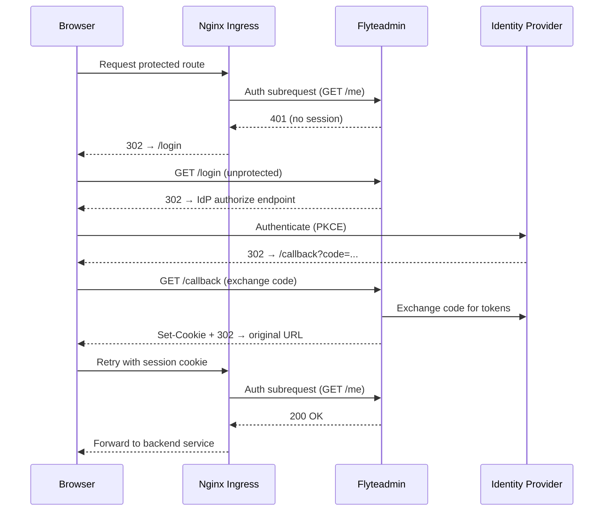

# Authentication

 uses [OpenID Connect (OIDC)](https://openid.net/specs/openid-connect-core-1_0.html) for user authentication and [OAuth 2.0](https://tools.ietf.org/html/rfc6749) for service-to-service authorization. You must configure an external Identity Provider (IdP) to enable authentication on your deployment.

## Overview

Authentication is enforced at two layers:

1. **Ingress layer** — The control plane nginx ingress validates every request to protected routes via an auth subrequest to the `/me` endpoint.
2. **Application layer** — `flyteadmin` manages browser sessions, validates tokens, and exposes OIDC discovery endpoints.

The following diagram shows how these layers interact for browser-based authentication:



## Prerequisites

- A  deployment with the control plane installed.
- An OIDC-compliant Identity Provider (IdP) such as Okta, Azure AD, or Auth0.
- Access to create OAuth applications in your IdP.
- A secret management solution for delivering client secrets to pods (e.g., External Secrets Operator with AWS Secrets Manager, HashiCorp Vault, or native Kubernetes secrets).

## Configuring your Identity Provider

You must create several OAuth applications in your IdP. The table below summarizes the required applications and their purposes:

| Application | Type | Grant Types | Purpose |
|---|---|---|---|
| Web app (browser login) | Web | `authorization_code` | Browser login via OIDC |
| Native app (SDK/CLI) | Native (PKCE) | `authorization_code`, `device_code` | SDK and CLI authentication |
| Internal service app | Service | `client_credentials` | Control plane service-to-service |
| Operator service app | Service | `client_credentials` | Dataplane operator heartbeats |
| Eager service app | Service | `client_credentials` | Eager mode task execution |

### Authorization server setup

1. Create a custom authorization server in your IdP (or use the default).
2. Add a scope named `all`.
3. Add an access policy that allows all registered clients listed above.
4. Add a policy rule that permits `authorization_code`, `client_credentials`, and `device_code` grant types.
5. Note the **Issuer URI** (e.g., `https://dev-12345678.okta.com/oauth2/<server-id>`).

### Application details

**1. Web application (browser login)**

- **Type**: Web Application
- **Sign-on method**: OIDC
- **Grant types**: `authorization_code`
- **Sign-in redirect URI**: `https://<your-domain>/callback`
- **Sign-out redirect URI**: `https://<your-domain>/logout`
- Note the **Client ID** and **Client Secret**.

**2. Native application (SDK/CLI)**

- **Type**: Native Application
- **Sign-on method**: OIDC
- **Grant types**: `authorization_code`, `urn:ietf:params:oauth:grant-type:device_code`
- **Sign-in redirect URI**: `http://localhost:53593/callback`
- **Require PKCE**: Always
- **Consent**: Trusted (skip consent screen)
- Note the **Client ID** (no secret needed for public clients).

**3. Service application (control plane internal)**

- **Type**: Service (machine-to-machine)
- **Grant types**: `client_credentials`
- Note the **Client ID** and **Client Secret**.
- Store the client secret securely for delivery to control plane pods (see [Secret delivery](#secret-delivery)).

**4. Service application (dataplane operator)**

- **Type**: Service (machine-to-machine)
- **Grant types**: `client_credentials`
- Note the **Client ID** and **Client Secret**.
- Store the client secret securely for delivery to dataplane pods (see [Secret delivery](#secret-delivery)).

**5. Service application (eager mode)** *(optional)*

- **Type**: Service (machine-to-machine)
- **Grant types**: `client_credentials`
- Note the **Client ID** and **Client Secret**.
- Only required if you use [eager mode](deployment/configuration/eager-mode) tasks.

## Control plane Helm configuration

The control plane Helm chart requires auth configuration in several sections.

### Flyteadmin OIDC configuration

Configure `flyteadmin` to act as the OIDC relying party:

```yaml
flyte:
  configmap:
    adminServer:
      auth:
        appAuth:
          authServerType: External
          externalAuthServer:
            baseUrl: "<issuer-uri>"  # e.g. "https://dev-12345678.okta.com/oauth2/default"
          thirdPartyConfig:
            flyteClient:
              clientId: "<native-app-client-id>"  # SDK/CLI
              redirectUri: "http://localhost:53593/callback"
              scopes:
                - all
        authorizedUris:
          - "https://<your-domain>"
          - "http://flyteadmin:80"
          - "http://flyteadmin.<namespace>.svc.cluster.local:80"
        disableForGrpc: true
        grpcAuthorizationHeader: flyte-authorization
        httpAuthorizationHeader: flyte-authorization
        userAuth:
          openId:
            baseUrl: "<issuer-uri>"
            clientId: "<web-app-client-id>"
            scopes:
              - profile
              - openid
              - offline_access
      server:
        security:
          useAuth: true
```

Key settings:

- `authServerType: External` — use your IdP as the authorization server (not flyteadmin's built-in server).
- `disableForGrpc: true` — flyteadmin does not enforce auth on gRPC endpoints directly. Instead, nginx enforces auth via the `auth-url` subrequest pattern.
- `grpcAuthorizationHeader: flyte-authorization` — the header name used for bearer tokens. Both the SDK and internal services use this header.
- `useAuth: true` — registers the `/login`, `/callback`, `/me`, and `/logout` HTTP endpoints.

### Service-to-service authentication

Control plane services that communicate through nginx need OAuth tokens. Configure the internal service app credentials:

```yaml
configMap:
  union:
    auth:
      enable: true
      type: ClientSecret
      clientId: "<internal-client-id>"
      clientSecretLocation: "/etc/secrets/union/client_secret"
      authorizationMetadataKey: flyte-authorization
      scopes:
        - all
    connection:
      trustedIdentityClaims:
        enabled: true
        externalIdentityClaim: "<internal-client-id>"
        externalIdentityTypeClaim: "app"
```

The `trustedIdentityClaims` configuration enables identity propagation: when a service authenticates with its client credentials, the interceptor extracts the `sub` claim from the access token and sets `x-user-subject` and `x-user-claim-identitytype` headers on downstream requests.

### Secret delivery

Client secrets must be delivered to pods as files mounted into the container filesystem. The control plane deployment mounts the Kubernetes secret `service-shared-secret` at `/etc/secrets/union/`, so the internal service app client secret must be available at `/etc/secrets/union/client_secret`.

You can populate this secret using any method that works in your environment:

**Option A: External Secrets Operator (recommended)**

If you use [External Secrets Operator (ESO)](https://external-secrets.io/) with a cloud secret store (AWS Secrets Manager, Azure Key Vault, GCP Secret Manager, HashiCorp Vault, etc.), create an `ExternalSecret` that syncs the client secret into the `service-shared-secret` Kubernetes secret:

```yaml
apiVersion: external-secrets.io/v1
kind: ExternalSecret
metadata:
  name: service-shared-secret-internal-auth
spec:
  secretStoreRef:
    name: default
    kind: SecretStore
  refreshPolicy: Periodic
  refreshInterval: 1h
  target:
    name: service-shared-secret
    creationPolicy: Merge
    deletionPolicy: Retain
  data:
    - secretKey: client_secret
      remoteRef:
        key: "<your-secret-store-key>"
```

> [!NOTE]
> `creationPolicy: Merge` ensures this ExternalSecret adds the `client_secret` key alongside any existing keys in `service-shared-secret` (such as the database password).

**Option B: Direct Kubernetes secret**

If you manage secrets directly, add the `client_secret` key to the existing `service-shared-secret`:

```bash
kubectl patch secret service-shared-secret -n <namespace> \
  --type merge -p '{"stringData":{"client_secret":"<your-client-secret>"}}'
```

### Ingress auth annotations

The control plane ingress uses nginx auth subrequests to enforce authentication. These annotations are set on protected ingress routes:

```yaml
ingress:
  protectedIngressAnnotations:
    nginx.ingress.kubernetes.io/auth-url: "https://$host/me"
    nginx.ingress.kubernetes.io/auth-cache-key: "$http_flyte_authorization$http_cookie"
    nginx.ingress.kubernetes.io/auth-response-headers: "Set-Cookie"
    nginx.ingress.kubernetes.io/auth-signin: "https://$host/login?redirect_url=$escaped_request_uri"
```

For every request to a protected route, nginx makes a subrequest to `/me`. If flyteadmin returns 200 (valid session or token), the request is forwarded. If 401, the user is redirected to `/login` for browser clients, or the 401 is returned directly for API clients.

## Dataplane authentication

The dataplane operator and eager mode components authenticate to the control plane using service-to-service OAuth credentials.

### Operator

The union-operator sends cluster heartbeats and status updates to the control plane. It uses the `operator` service app credentials:

```yaml
# Dataplane values (operator section)
operator:
  authType: ClientSecret
  clientId: "<operator-client-id>"
```

The client secret must be delivered into a Kubernetes secret mounted by the operator pod. Use the same secret delivery approach described in [Secret delivery](#secret-delivery) (ESO, direct secret, etc.).

### Eager mode

Eager mode tasks call back to the control plane during execution. The eager service app client secret is delivered as `EAGER_API_KEY` into the flytepropeller pod environment.

## SDK and CLI authentication

The SDK and CLI use PKCE (Proof Key for Code Exchange) for interactive authentication:

1. The SDK calls `AuthMetadataService/GetPublicClientConfig` (an unprotected endpoint) to discover the `flytectl` client ID and redirect URI.
2. The SDK opens a browser to the IdP's authorize endpoint with a PKCE challenge.
3. The user authenticates in the browser.
4. The IdP redirects to `localhost:53593/callback` with an authorization code.
5. The SDK exchanges the code for tokens and stores them locally.
6. Subsequent requests include the token in the `flyte-authorization` header.

No additional SDK configuration is required beyond the standard `uctl` or Union config:

```yaml
admin:
  endpoint: dns:///<your-domain>
  authType: Pkce
  insecure: false
```

For headless environments (CI/CD), use the [Client Credentials](#client-credentials-for-cicd) flow instead.

### Client credentials for CI/CD

For automated pipelines, create a service app in your IdP and configure:

```yaml
admin:
  endpoint: dns:///<your-domain>
  authType: ClientSecret
  clientId: "<your-ci-client-id>"
  clientSecretLocation: "/path/to/client_secret"
```

Or use environment variables:

```bash
export FLYTE_CREDENTIALS_CLIENT_ID="<your-ci-client-id>"
export FLYTE_CREDENTIALS_CLIENT_SECRET="<your-ci-client-secret>"
export FLYTE_CREDENTIALS_AUTH_MODE=basic
```

## Troubleshooting

### Browser login redirects in a loop

Verify that `useAuth: true` is set in `flyte.configmap.adminServer.server.security`. Without this, the `/login`, `/callback`, and `/me` endpoints are not registered.

### SDK gets 401 Unauthenticated

1. Check that the `AuthMetadataService` routes are in the **unprotected** ingress (no auth-url annotation).
2. Verify the SDK can reach the token endpoint. The SDK discovers it via `AuthMetadataService/GetOAuth2Metadata`.
3. Check that `grpcAuthorizationHeader` matches the header name used by the SDK (`flyte-authorization`).

### Internal services get connection refused or 401

1. **Connection refused**: Verify the target service has a connect server running on the expected port. Services using the connect protocol (cluster, authorizer, usage) listen on port 8081, not 8080. Check that `sharedService.connectPort: 8081` is configured at both the root and `configMap` levels.
2. **401 errors**: Verify that `configMap.union.auth.enable: true` and the `client_secret` file exists at the configured `clientSecretLocation`. Check `ExternalSecret` sync status with `kubectl get externalsecret -n <namespace>`.

### Operator heartbeats failing

1. Verify the operator pod has the client secret mounted.
2. Check operator logs for auth-related errors.
3. Verify the operator's service app is included in the authorization server's access policy client whitelist.
