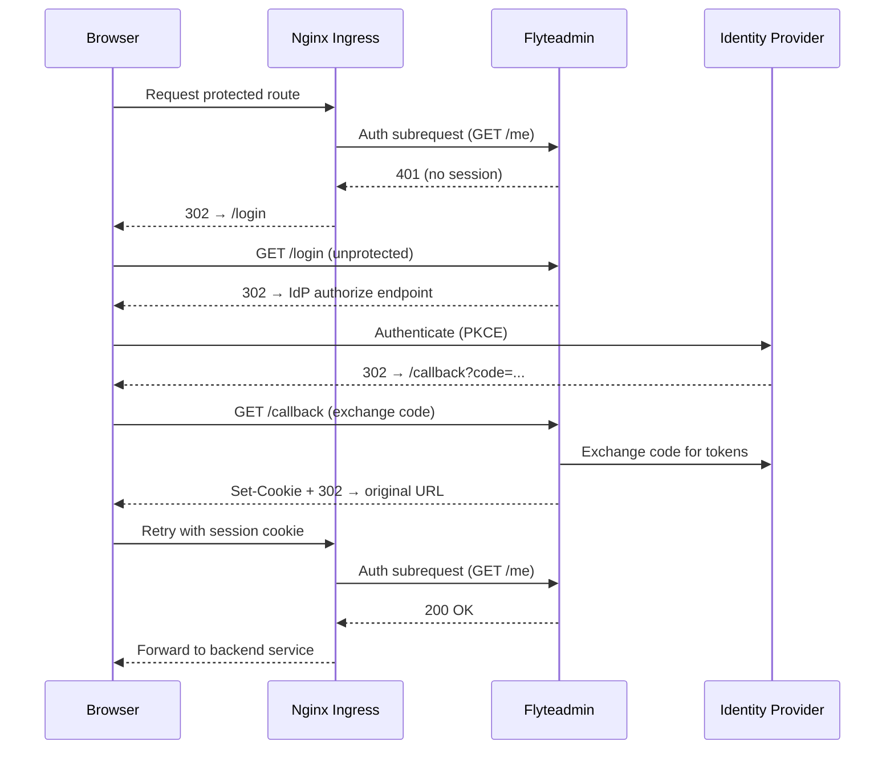

# Authentication

 uses [OpenID Connect (OIDC)](https://openid.net/specs/openid-connect-core-1_0.html) for user authentication and [OAuth 2.0](https://tools.ietf.org/html/rfc6749) for service-to-service authorization. You must configure an external Identity Provider (IdP) to enable authentication on your deployment.

## Overview

Authentication is enforced at two layers:

1. **Ingress layer** — The control plane nginx ingress validates every request to protected routes via an auth subrequest to the `/me` endpoint.
2. **Application layer** — `flyteadmin` manages browser sessions, validates tokens, and exposes OIDC discovery endpoints.

The following diagram shows how these layers interact for browser-based authentication:



## Prerequisites

- A  deployment with the control plane installed.
- An OIDC-compliant Identity Provider (IdP).
- Access to create OAuth applications in your IdP.
- A secret management solution for delivering client secrets to pods (e.g., External Secrets Operator with AWS Secrets Manager, HashiCorp Vault, or native Kubernetes secrets).

## Configuring your Identity Provider

You must create three OAuth applications in your IdP:

| Application | Type | Grant Types | Purpose |
|---|---|---|---|
| Web app (browser login) | Web | `authorization_code` | Console/web UI authentication |
| Native app (SDK/CLI) | Native (PKCE) | `authorization_code`, `device_code` | SDK and CLI authentication |
| Service app (internal) | Service | `client_credentials` | All service-to-service communication |

> [!NOTE]
> A single service app is shared by both control plane and dataplane services. If your security policy requires separate credentials per component, you can create additional service apps, but the configuration below assumes a single shared client.

### Authorization server setup

1. Create a custom authorization server in your IdP (or use the default).
2. Add a scope named `all`.
3. Add an access policy that allows all registered clients listed above.
4. Add a policy rule that permits `authorization_code`, `client_credentials`, and `device_code` grant types.
5. Note the **Issuer URI** (e.g., `https://your-idp.example.com/oauth2/<server-id>`).
6. Note the **Token endpoint** (e.g., `https://your-idp.example.com/oauth2/<server-id>/v1/token`).

### Application details

#### 1. Web application (browser login)

- **Type**: Web Application
- **Sign-on method**: OIDC
- **Grant types**: `authorization_code`
- **Sign-in redirect URI**: `https://<your-domain>/callback`
- **Sign-out redirect URI**: `https://<your-domain>/logout`
- Note the **Client ID** → used as `OIDC_CLIENT_ID`
- Note the **Client Secret** → stored in `flyte-admin-secrets` (see [Secret delivery](#secret-delivery))

#### 2. Native application (SDK/CLI)

- **Type**: Native Application
- **Sign-on method**: OIDC
- **Grant types**: `authorization_code`, `urn:ietf:params:oauth:grant-type:device_code`
- **Sign-in redirect URI**: `http://localhost:53593/callback`
- **Require PKCE**: Always
- **Consent**: Trusted (skip consent screen)
- Note the **Client ID** → used as `CLI_CLIENT_ID` (no secret needed for public clients)

#### 3. Service application (internal)

- **Type**: Service (machine-to-machine)
- **Grant types**: `client_credentials`
- Note the **Client ID** → used as `INTERNAL_CLIENT_ID` (control plane) and `AUTH_CLIENT_ID` (dataplane)
- Note the **Client Secret** → stored in multiple Kubernetes secrets (see [Secret delivery](#secret-delivery))

## Control plane Helm configuration

The control plane Helm chart requires auth configuration in several sections. All examples below use the global variables defined in `values.<cloud>.selfhosted-intracluster.yaml`.

### Global variables

Set these in your customer overrides file:

```yaml
global:
  OIDC_BASE_URL: "<issuer-uri>"             # e.g. "https://your-idp.example.com/oauth2/default"
  OIDC_CLIENT_ID: "<web-app-client-id>"     # Browser login
  CLI_CLIENT_ID: "<native-app-client-id>"   # SDK/CLI
  INTERNAL_CLIENT_ID: "<service-client-id>" # Service-to-service
  AUTH_TOKEN_URL: "<token-endpoint>"         # e.g. "https://your-idp.example.com/oauth2/default/v1/token"
```

### Flyteadmin OIDC configuration

Configure `flyteadmin` to act as the OIDC relying party. This enables the `/login`, `/callback`, `/me`, and `/logout` endpoints:

```yaml
flyte:
  configmap:
    adminServer:
      server:
        security:
          useAuth: true
      auth:
        grpcAuthorizationHeader: flyte-authorization
        httpAuthorizationHeader: flyte-authorization
        authorizedUris:
          - "http://flyteadmin:80"
          - "http://flyteadmin.<namespace>.svc.cluster.local:80"
        appAuth:
          authServerType: External
          externalAuthServer:
            baseUrl: "<issuer-uri>"
          thirdPartyConfig:
            flyteClient:
              clientId: "<native-app-client-id>"
              redirectUri: "http://localhost:53593/callback"
              scopes:
                - all
        userAuth:
          openId:
            baseUrl: "<issuer-uri>"
            clientId: "<web-app-client-id>"
            scopes:
              - profile
              - openid
              - offline_access
          cookieSetting:
            sameSitePolicy: LaxMode
            domain: ""
          idpQueryParameter: idp
```

Key settings:

- `useAuth: true` — registers the `/login`, `/callback`, `/me`, and `/logout` HTTP endpoints. **Required** for auth to function.
- `authServerType: External` — use your IdP as the authorization server (not flyteadmin's built-in server).
- `grpcAuthorizationHeader: flyte-authorization` — the header name used for bearer tokens. Both the SDK and internal services use this header.

### Flyteadmin and scheduler admin SDK client

Flyteadmin and the scheduler use the admin SDK to communicate with other control plane services. Configure client credentials so these calls are authenticated:

```yaml
flyte:
  configmap:
    adminServer:
      admin:
        clientId: "<service-client-id>"
        clientSecretLocation: "/etc/secrets/client_secret"
```

The secret is mounted from the `flyte-admin-secrets` Kubernetes secret (see [Secret delivery](#secret-delivery)).

### Scheduler auth secret

The flyte-scheduler mounts a separate Kubernetes secret (`flyte-secret-auth`) at `/etc/secrets/`. Enable this mount:

```yaml
flyte:
  secrets:
    adminOauthClientCredentials:
      enabled: true
      clientSecret: "placeholder"
```

> [!NOTE]
> Setting `clientSecret: "placeholder"` causes the subchart to render the `flyte-secret-auth` Kubernetes Secret. Use External Secrets Operator with `creationPolicy: Merge` to overwrite the placeholder with the real credential, or create the secret directly before installing the chart.

### Service-to-service authentication

Control plane services communicate through nginx and need OAuth tokens. Configure the admin SDK client credentials and the union service auth:

```yaml
configMap:
  admin:
    clientId: "<service-client-id>"
    clientSecretLocation: "/etc/secrets/union/client_secret"
  union:
    auth:
      enable: true
      type: ClientSecret
      clientId: "<service-client-id>"
      clientSecretLocation: "/etc/secrets/union/client_secret"
      tokenUrl: "<token-endpoint>"
      authorizationMetadataKey: flyte-authorization
      scopes:
        - all
```

The secret is mounted from the control plane service secret (see [Secret delivery](#secret-delivery)).

### Executions service

The executions service has its own admin client connection that also needs auth:

```yaml
services:
  executions:
    configMap:
      executions:
        app:
          adminClient:
            connection:
              authorizationHeader: flyte-authorization
              clientId: "<service-client-id>"
              clientSecretLocation: "/etc/secrets/union/client_secret"
              tokenUrl: "<token-endpoint>"
              scopes:
                - all
```

### Ingress auth annotations

The control plane ingress uses nginx auth subrequests to enforce authentication. These annotations are set on protected ingress routes:

```yaml
ingress:
  protectedIngressAnnotations:
    nginx.ingress.kubernetes.io/auth-url: "https://$host/me"
    nginx.ingress.kubernetes.io/auth-signin: "https://$host/login?redirect_url=$escaped_request_uri"
    nginx.ingress.kubernetes.io/auth-response-headers: "Set-Cookie"
    nginx.ingress.kubernetes.io/auth-cache-key: "$http_flyte_authorization$http_cookie"
  protectedIngressAnnotationsGrpc:
    nginx.ingress.kubernetes.io/auth-url: "https://$host/me"
    nginx.ingress.kubernetes.io/auth-response-headers: "Set-Cookie"
    nginx.ingress.kubernetes.io/auth-cache-key: "$http_authorization$http_flyte_authorization$http_cookie"
```

For every request to a protected route, nginx makes a subrequest to `/me`. If flyteadmin returns 200 (valid session or token), the request is forwarded. If 401, the user is redirected to `/login` for browser clients, or the 401 is returned directly for API clients.

## Dataplane Helm configuration

When the control plane has OIDC enabled, the dataplane must also authenticate. All dataplane services use the same service app credentials (`AUTH_CLIENT_ID`), which is the same client as `INTERNAL_CLIENT_ID` on the control plane.

### Dataplane global variables

```yaml
global:
  AUTH_CLIENT_ID: "<service-client-id>"  # Same as INTERNAL_CLIENT_ID
```

### Cluster resource sync

```yaml
clusterresourcesync:
  config:
    union:
      auth:
        enable: true
        type: ClientSecret
        clientId: "<service-client-id>"
        clientSecretLocation: "/etc/union/secret/client_secret"
        authorizationMetadataKey: flyte-authorization
        tokenRefreshWindow: 5m
```

### Operator (union service auth)

```yaml
config:
  union:
    auth:
      enable: true
      type: ClientSecret
      clientId: "<service-client-id>"
      clientSecretLocation: "/etc/union/secret/client_secret"
      authorizationMetadataKey: flyte-authorization
      tokenRefreshWindow: 5m
```

### Propeller admin client

```yaml
config:
  admin:
    admin:
      clientId: "<service-client-id>"
      clientSecretLocation: "/etc/union/secret/client_secret"
```

### Executor (eager mode)

Injects the `EAGER_API_KEY` secret into task pods for authenticated eager-mode execution:

```yaml
executor:
  config:
    unionAuth:
      injectSecret: true
      secretName: EAGER_API_KEY
```

### Dataplane secrets

Enable the `union-secret-auth` Kubernetes secret mount for dataplane pods:

```yaml
secrets:
  admin:
    enable: true
    create: false
    clientId: "<service-client-id>"
    clientSecret: "placeholder"
```

> [!NOTE]
> `create: false` means the chart does not create the `union-secret-auth` Kubernetes Secret. You must provision it externally (see [Secret delivery](#secret-delivery)). Setting `clientSecret: "placeholder"` with `create: true` is also supported if you want the chart to create the secret and then overwrite it via External Secrets Operator.

## Secret delivery

Client secrets must be delivered to pods as files mounted into the container filesystem. The table below lists the required Kubernetes secrets, their mount paths, and which components use them:

| Kubernetes Secret | Mount Path | Components | Namespace |
| --- | --- | --- | --- |
| `flyte-admin-secrets` | `/etc/secrets/` | flyteadmin | `union-cp` |
| `flyte-secret-auth` | `/etc/secrets/` | flyte-scheduler | `union-cp` |
| Control plane service secret | `/etc/secrets/union/` | executions, cluster, usage, and other CP services | `union-cp` |
| `union-secret-auth` | `/etc/union/secret/` | operator, propeller, CRS | `union` |

All secrets must contain a key named `client_secret` with the service app's OAuth client secret value.

### Option A: External Secrets Operator (recommended)

If you use [External Secrets Operator (ESO)](https://external-secrets.io/) with a cloud secret store, create `ExternalSecret` resources that sync the client secret into each Kubernetes secret:

```yaml
apiVersion: external-secrets.io/v1
kind: ExternalSecret
metadata:
  name: flyte-admin-secrets-auth
  namespace: union-cp
spec:
  secretStoreRef:
    name: default
    kind: SecretStore
  refreshInterval: 1h
  target:
    name: flyte-admin-secrets
    creationPolicy: Merge
    deletionPolicy: Retain
  data:
    - secretKey: client_secret
      remoteRef:
        key: "<your-secret-store-key>"
---
apiVersion: external-secrets.io/v1
kind: ExternalSecret
metadata:
  name: flyte-secret-auth
  namespace: union-cp
spec:
  secretStoreRef:
    name: default
    kind: SecretStore
  refreshInterval: 1h
  target:
    name: flyte-secret-auth
    creationPolicy: Merge
    deletionPolicy: Retain
  data:
    - secretKey: client_secret
      remoteRef:
        key: "<your-secret-store-key>"
---
apiVersion: external-secrets.io/v1
kind: ExternalSecret
metadata:
  name: union-secret-auth
  namespace: union
spec:
  secretStoreRef:
    name: default
    kind: SecretStore
  refreshInterval: 1h
  target:
    name: union-secret-auth
    creationPolicy: Merge
    deletionPolicy: Retain
  data:
    - secretKey: client_secret
      remoteRef:
        key: "<your-secret-store-key>"
```

> [!NOTE]
> `creationPolicy: Merge` ensures the ExternalSecret adds the `client_secret` key alongside any existing keys in the target secret.

### Option B: Direct Kubernetes secrets

If you manage secrets directly:

```bash
# Control plane — flyteadmin
kubectl create secret generic flyte-admin-secrets \
  --from-literal=client_secret='<SERVICE_CLIENT_SECRET>' \
  -n union-cp

# Control plane — scheduler
kubectl create secret generic flyte-secret-auth \
  --from-literal=client_secret='<SERVICE_CLIENT_SECRET>' \
  -n union-cp

# Control plane — union services (add to existing secret)
kubectl create secret generic union-controlplane-secrets \
  --from-literal=pass.txt='<DB_PASSWORD>' \
  --from-literal=client_secret='<SERVICE_CLIENT_SECRET>' \
  -n union-cp --dry-run=client -o yaml | kubectl apply -f -

# Dataplane — operator, propeller, CRS
kubectl create secret generic union-secret-auth \
  --from-literal=client_secret='<SERVICE_CLIENT_SECRET>' \
  -n union
```

## SDK and CLI authentication

The SDK and CLI use PKCE (Proof Key for Code Exchange) for interactive authentication:

1. The SDK calls `AuthMetadataService/GetPublicClientConfig` (an unprotected endpoint) to discover the `flytectl` client ID and redirect URI.
2. The SDK opens a browser to the IdP's authorize endpoint with a PKCE challenge.
3. The user authenticates in the browser.
4. The IdP redirects to `localhost:53593/callback` with an authorization code.
5. The SDK exchanges the code for tokens and stores them locally.
6. Subsequent requests include the token in the `flyte-authorization` header.

No additional SDK configuration is required beyond the standard `uctl` or Union config:

```yaml
admin:
  endpoint: dns:///<your-domain>
  authType: Pkce
  insecure: false
```

For headless environments (CI/CD), use the [Client Credentials](#client-credentials-for-cicd) flow instead.

### Client credentials for CI/CD

For automated pipelines, create a service app in your IdP and configure:

```yaml
admin:
  endpoint: dns:///<your-domain>
  authType: ClientSecret
  clientId: "<your-ci-client-id>"
  clientSecretLocation: "/path/to/client_secret"
```

Or use environment variables:

```bash
export FLYTE_CREDENTIALS_CLIENT_ID="<your-ci-client-id>"
export FLYTE_CREDENTIALS_CLIENT_SECRET="<your-ci-client-secret>"
export FLYTE_CREDENTIALS_AUTH_MODE=basic
```

## Troubleshooting

### Browser login redirects in a loop

Verify that `useAuth: true` is set in `flyte.configmap.adminServer.server.security`. Without this, the `/login`, `/callback`, and `/me` endpoints are not registered.

### SDK gets 401 Unauthenticated

1. Check that the `AuthMetadataService` routes are in the **unprotected** ingress (no auth-url annotation).
2. Verify the SDK can reach the token endpoint. The SDK discovers it via `AuthMetadataService/GetOAuth2Metadata`.
3. Check that `grpcAuthorizationHeader` matches the header name used by the SDK (`flyte-authorization`).

### Internal services get 401

1. Verify that `configMap.union.auth.enable: true` and the `client_secret` file exists at the configured `clientSecretLocation`.
2. Check `ExternalSecret` sync status: `kubectl get externalsecret -n <namespace>`.
3. Verify the secret contains the correct key: `kubectl get secret <secret-name> -n <namespace> -o jsonpath='{.data.client_secret}' | base64 -d`.

### Operator or propeller cannot authenticate

1. Verify `union-secret-auth` exists in the dataplane namespace and contains `client_secret`.
2. Check operator logs for auth errors: `kubectl logs -n union -l app.kubernetes.io/name=operator --tail=50 | grep -i auth`.
3. Verify the `AUTH_CLIENT_ID` matches the control plane's `INTERNAL_CLIENT_ID`.
4. Verify the service app is included in the authorization server's access policy.

### Scheduler fails to start

1. Verify `flyte-secret-auth` exists in the control plane namespace: `kubectl get secret flyte-secret-auth -n union-cp`.
2. Check that `flyte.secrets.adminOauthClientCredentials.enabled: true` is set.
3. Check scheduler logs: `kubectl logs -n union-cp deploy/flytescheduler --tail=50`.
