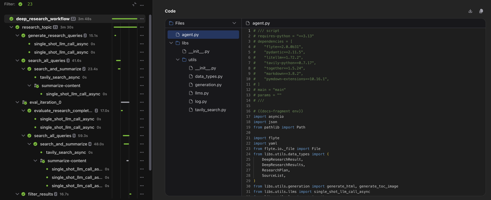
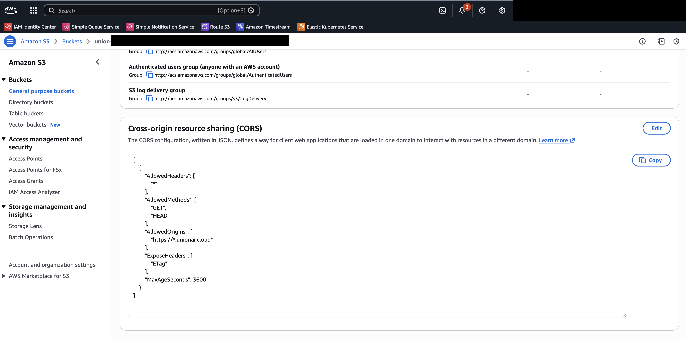

# Code Viewer

The Union UI allows you to view the exact code that executed a specific task. Union securely transfers the [code bundle](../../user-guide/run-scaling/life-of-a-run#phase-2-image-building) directly to your browser without routing it through the control plane.



## Enable CORS policy on your fast registration bucket

To support this feature securely, your bucket must allow CORS access from Union. The configuration steps vary depending on your cloud provider.





1. Open the AWS Console.
2. Navigate to the S3 dashboard.
3. Select your fast registration bucket. By default, this is the same as the metadata bucket configured during initial deployment.
4. Click the **Permissions** tab and scroll to **Cross-origin resource sharing (CORS)**.
5. Click **Edit** and enter the following policy:


```
[
    {
        "AllowedHeaders": [
            "*"
        ],
        "AllowedMethods": [
            "GET",
            "HEAD",
        ],
        "AllowedOrigins": [
            "https://*.unionai.cloud"
        ],
        "ExposeHeaders": [
            "ETag"
        ],
        "MaxAgeSeconds": 3600
    }
]
```

For more details, see the [AWS S3 CORS documentation](https://docs.aws.amazon.com/AmazonS3/latest/userguide/cors.html).






Google Cloud Storage requires CORS configuration via the command line.

1. Create a `cors.json` file with the following content:
    ```json
    [
        {
        "origin": ["https://*.unionai.cloud"],
        "method": ["HEAD", "GET"],
        "responseHeader": ["ETag"],
        "maxAgeSeconds": 3600
        }
    ]
    ```
2. Apply the CORS configuration to your bucket:
    ```bash
    gcloud storage buckets update gs://<fast_registration_bucket> --cors-file=cors.json
    ```
3. Verify the configuration was applied:
   ```bash
   gcloud storage buckets describe gs://<fast_registration_bucket> --format="default(cors_config)"

   cors_config:
   - maxAgeSeconds: 3600
     method:
     - GET
     - HEAD
     origin:
     - https://*.unionai.cloud
     responseHeader:
     - ETag
   ```
For more details, see the [Google Cloud Storage CORS documentation](https://docs.cloud.google.com/storage/docs/using-cors#command-line).






For Azure Storage CORS configuration, see the [Azure Storage CORS documentation](https://learn.microsoft.com/en-us/rest/api/storageservices/cross-origin-resource-sharing--cors--support-for-the-azure-storage-services).





## Troubleshooting

| Error Message | Cause | Fix |
|---------------|-------|-----|
| `Not available: No code available for this action.` | The task does not have a code bundle. This occurs when the code is baked into the Docker image or the task is not a code-based task. | This is expected behavior for tasks without code bundles. |
| `Not Found: The code bundle file could not be found. This may be due to your organization's data retention policy.` | The code bundle was deleted from the bucket, likely due to a retention policy. | Review your fast registration bucket's retention policy settings. |
| `Error: Code download is blocked by your storage bucket's configuration. Please contact your administrator to enable access.` | CORS is not configured on the bucket. | Configure CORS on your bucket using the instructions above. |