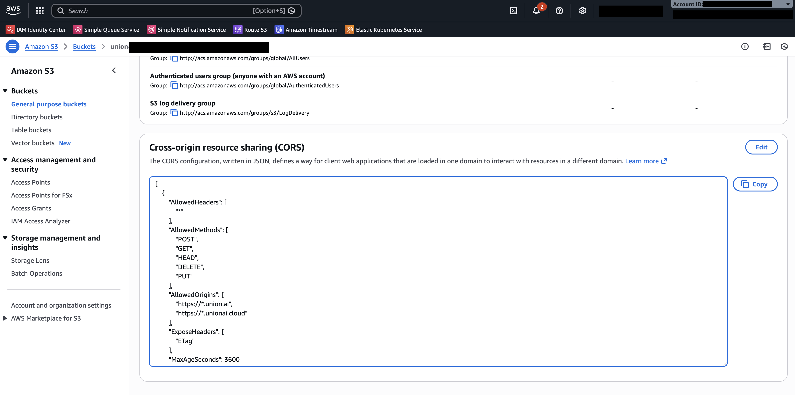

# Code Viewer
One of the powerful capabilities in the Union UI is the ability to view the exact code that ran a particular task. 
Union Union implements a secure mechanism to transfer the [code bundle](../../user-guide/run-scaling/life-of-a-run.md/#phase-2-image-building) to the browser without passing through the control plane.


## Enable CORS policy on your fast registration bucket
In order to support this functionality securely, your bucket must allow CORS access for Union. Depending on which cloud the bucket is located in, these configurations vary.



1. Access AWS Console
2. Access S3 dashboard
3. Choose the fast registration bucket. Unless configured differently, this is the same as the metadata bucket configured when you first
    deployed.
4. Click on "Permissions" tab and scroll to "CORS Policy"
5. Click on Edit and enter the policy below

```
[
    {
        "AllowedHeaders": [
            "*"
        ],
        "AllowedMethods": [
            "GET",
            "HEAD",
        ],
        "AllowedOrigins": [
            "https://*.union.ai",
            "https://*.unionai.cloud"
        ],
        "ExposeHeaders": [
            "ETag"
        ],
        "MaxAgeSeconds": 3600
    }
]
```


foo


