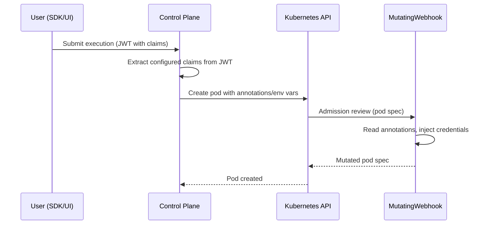

# Identity injection

Identity injection maps OAuth/OIDC claims from authenticated users to pod annotations and environment variables on task execution pods. This enables you to build [MutatingAdmissionWebhooks](https://kubernetes.io/docs/reference/access-authn-authz/extensible-admission-controllers/) that inject credentials or other resources based on caller identity.

## Overview

When a user submits a workflow execution,  extracts configured claims from the caller's JWT and applies them as annotations and/or environment variables on the resulting task pods. This lets you:

- Identify which user launched a given pod via annotations (e.g. `union.ai/created-by`)
- Build admission webhooks that mutate pods based on caller identity (e.g. inject cloud credentials, mount user-specific secrets)
- Pass caller identity to tasks via environment variables



## Prerequisites

- [Authentication](/deployment/configuration/authentication/) must be configured and working.
- Your IdP must include the desired claims in the issued JWT tokens (e.g. `preferred_username`, `sub`, `email`, `groups`).

## Configuration

Identity injection is configured in the control plane Helm values. Both the flyteadmin (V1) and executions (V2) services need the same configuration.

### Configuration structure

```yaml
identityInjection:
  enabled: true
  annotations:
    - claimName: "<oauth-claim>"
      targetKey: "<pod-annotation-key>"
      required: true    # optional, logs warning if claim is missing
  environmentVariables:
    - claimName: "<oauth-claim>"
      targetKey: "<env-var-name>"
      required: true    # optional
```

| Field | Description |
|---|---|
| `enabled` | Enable or disable identity injection. |
| `annotations` | List of claim-to-annotation mappings applied to task pods. |
| `environmentVariables` | List of claim-to-environment-variable mappings applied to task containers. |
| `claimName` | The OAuth/OIDC claim name from the JWT (e.g. `sub`, `preferred_username`, `email`, `groups`). |
| `targetKey` | The Kubernetes annotation key or environment variable name to set. |
| `required` | If `true`, a warning is logged when the claim is not present in the token. The pod is still created. |

### Applying to the control plane

The configuration must be set in two places because the control plane has two execution paths:

1. **Flyteadmin** (V1 API) — under `flyte.configmap.adminServer.server`
2. **Executions service** (V2 API) — under `services.executions.configMap.executions.task`

The `values.<cloud>.selfhosted-intracluster.yaml` overlay file supports a YAML anchor pattern so you define the mapping once and reference it in both locations:

```yaml
# Define the mapping once using a YAML anchor
_identityInjection: &identityInjection
  enabled: true
  annotations:
    - claimName: "preferred_username"
      targetKey: "union.ai/created-by"
      required: true

# Apply to executions service (V2)
services:
  executions:
    configMap:
      executions:
        task:
          identityInjection: *identityInjection

# Apply to flyteadmin (V1)
flyte:
  configmap:
    adminServer:
      server:
        identityInjection: *identityInjection
```

> [!NOTE]
> The YAML anchor (`&identityInjection` / `*identityInjection`) is a standard YAML feature, not Helm-specific. It ensures both services receive identical configuration from a single definition. You can also set each section independently if needed.

### Example: mapping multiple claims

```yaml
_identityInjection: &identityInjection
  enabled: true
  annotations:
    - claimName: "preferred_username"
      targetKey: "union.ai/created-by"
      required: true
    - claimName: "email"
      targetKey: "union.ai/user-email"
    - claimName: "groups"
      targetKey: "union.ai/user-groups"
  environmentVariables:
    - claimName: "sub"
      targetKey: "UNION_USER_SUBJECT"
      required: true
    - claimName: "preferred_username"
      targetKey: "UNION_USER_EMAIL"
```

This configuration would produce task pods with:

```yaml
metadata:
  annotations:
    union.ai/created-by: "jane.doe"
    union.ai/user-email: "jane.doe@example.com"
    union.ai/user-groups: "engineering,platform"
spec:
  containers:
    - env:
        - name: UNION_USER_SUBJECT
          value: "00u1abc2def3ghi4j5k6"
        - name: UNION_USER_EMAIL
          value: "jane.doe"
```

## Common claims

The claims available depend on your IdP and authorization server configuration. Common OIDC claims include:

| Claim | Description | Typical use |
|---|---|---|
| `sub` | Unique subject identifier | Stable user ID for audit trails |
| `preferred_username` | Human-readable username | Display name on annotations |
| `email` | User's email address | Notification routing, identity |
| `groups` | Group memberships | Role-based credential injection |

> [!NOTE]
> Verify that your IdP includes the desired claims in the access token (not just the ID token). Some IdPs require explicit configuration to include claims like `groups` or `preferred_username` in access tokens.

## Use case: credential injection with MutatingAdmissionWebhook

A common pattern is to combine identity injection with a MutatingAdmissionWebhook that injects cloud credentials based on the caller's identity:

1. Configure identity injection to annotate pods with `union.ai/created-by`
2. Deploy a MutatingAdmissionWebhook that watches for pods with that annotation
3. The webhook reads the annotation value and injects the appropriate credentials (e.g. AWS IAM role, GCP service account, Azure managed identity)

This allows per-user credential isolation without requiring each user to manage their own Kubernetes service accounts.

## Troubleshooting

### Annotations not appearing on pods

1. Verify that `identityInjection.enabled: true` is set in **both** the flyteadmin and executions service configurations.
2. Check that [authentication](/deployment/configuration/authentication/) is configured — identity injection requires JWT claims from authenticated requests.
3. Inspect the flyteadmin or executions service logs for identity injection messages:
   ```bash
   kubectl logs -n union-cp deploy/flyteadmin --tail=50 | grep -i "identity injection"
   ```

### Claim value is empty

1. Verify the claim is included in the access token issued by your IdP. Decode a token at [jwt.io](https://jwt.io) to inspect its claims.
2. Some IdPs only include certain claims (e.g. `groups`, `preferred_username`) when explicitly configured in the authorization server's claims policy.
3. If `required: true` is set for a missing claim, a warning will appear in the service logs but the pod will still be created without that annotation/env var.
