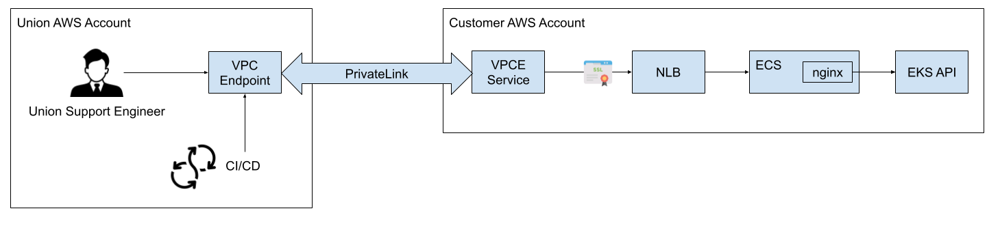

# Data plane setup on AWS

To set up your data plane on Amazon Web Services (AWS) you must allow  to provision and maintain compute resources under your AWS account.
You will need to set up an IAM role for  to use that has sufficient permissions to do this provisioning.
Setting the permissions can be done either through CloudFormation or the AWS console.

Additionally, if you wish to manage your own Virtual Private Cloud (VPC) then you will need to set up the VPC according to the guidelines described below.
If you do not wish to manage your own VPC then no additional configuration is needed.

## Setting permissions through CloudFormation

You can do the setup quickly using AWS CloudFormation.

### Click the Launch Stack button

Ensure that you are logged into the desired AWS account and then select the appropriate region and launch the corresponding CloudFormation stack:

| Region         | Launch Stack                                                                                                                                                                                                                                                                                                                                                                                                         |
| -------------- | -------------------------------------------------------------------------------------------------------------------------------------------------------------------------------------------------------------------------------------------------------------------------------------------------------------------------------------------------------------------------------------------------------------------- |
| `us-east-1`    | [](https://us-east-1.console.aws.amazon.com/cloudformation/home?region=us-east-1#/stacks/quickcreate?templateURL=https%3A%2F%2Funion-public.s3.amazonaws.com%2Ftemplates%2Fv0.13%2Funion-ai-admin-role.template.yaml&stackName=UnionCloudAccess&param_CrossAccountRoleName=union-ai-admin)       |
| `us-east-2`    | [](https://us-east-2.console.aws.amazon.com/cloudformation/home?region=us-east-2#/stacks/quickcreate?templateURL=https%3A%2F%2Funion-public.s3.amazonaws.com%2Ftemplates%2Fv0.13%2Funion-ai-admin-role.template.yaml&stackName=UnionCloudAccess&param_CrossAccountRoleName=union-ai-admin)       |
| `us-west-2`    | [](https://us-west-2.console.aws.amazon.com/cloudformation/home?region=us-west-2#/stacks/quickcreate?templateURL=https%3A%2F%2Funion-public.s3.amazonaws.com%2Ftemplates%2Fv0.13%2Funion-ai-admin-role.template.yaml&stackName=UnionCloudAccess&param_CrossAccountRoleName=union-ai-admin)       |
| `eu-west-1`    | [](https://eu-west-1.console.aws.amazon.com/cloudformation/home?region=eu-west-1#/stacks/quickcreate?templateURL=https%3A%2F%2Funion-public.s3.amazonaws.com%2Ftemplates%2Fv0.13%2Funion-ai-admin-role.template.yaml&stackName=UnionCloudAccess&param_CrossAccountRoleName=union-ai-admin)       |
| `eu-west-2`    | [](https://eu-west-2.console.aws.amazon.com/cloudformation/home?region=eu-west-2#/stacks/quickcreate?templateURL=https%3A%2F%2Funion-public.s3.amazonaws.com%2Ftemplates%2Fv0.13%2Funion-ai-admin-role.template.yaml&stackName=UnionCloudAccess&param_CrossAccountRoleName=union-ai-admin)       |
| `eu-central-1` | [](https://eu-central-1.console.aws.amazon.com/cloudformation/home?region=eu-central-1#/stacks/quickcreate?templateURL=https%3A%2F%2Funion-public.s3.amazonaws.com%2Ftemplates%2Fv0.13%2Funion-ai-admin-role.template.yaml&stackName=UnionCloudAccess&param_CrossAccountRoleName=union-ai-admin) |

> [!NOTE] CloudFormation template
> All of these buttons launch the same CloudFormation template, just in different regions.
> The CloudFormation template itself is available at this URL:
>
> [https://union-public.s3.amazonaws.com/templates/v0.13/union-ai-admin-role.template.yaml](https://union-public.s3.amazonaws.com/templates/v0.13/union-ai-admin-role.template.yaml)
>
> For details on the functionality enabled by each of the permissions,
> see the [release notes](https://github.com/unionai/union-cloud-infrastructure/releases).

### Confirm the details

Once you have selected **Launch Stack**, you will be taken to the CloudFormation interface. Do the following:

1. Check the profile name in the top right corner to confirm that you are in the correct account.
2. Leave the default values in place:
   - `UnionCloudAccess` for the **Stack Name**.
   - `union-ai-admin` for **Cross Account Role Name**.
3. Enter the `external ID` provided by  team for **ExternalId**  
4. Select the checkbox indicating that you acknowledge that AWS CloudFormation may create IAM resources with custom names.
5. Select **Create Stack**.

### Share the role ARN

Once the above steps are completed, you will need to get the ARN of the newly created role (`union-ai-admin`) and send it to the  team:

1. In the navigation pane of the IAM console, choose **Roles**.
1. In the list of roles, choose the `union-ai-admin` role.
1. In the **Summary** section of the details pane, copy the **role ARN** value.
1. Share the ARN with the  team.
1. The  team will get back to you to verify that they are able to assume the role.

### Updating permissions through CloudFormation

From time to time  may need to update the `union-ai-admin` role to support new or improved functionality.

If you used CloudFormation to set up your stack in the first place, you will have to perform the update by replacing your CloudFormation template with a new one.

When an update is required:

- The  team will inform you that you need to perform the update.
- The URL of the template will be published above, in the **CloudFormation template** info box. This is always kept up to date with the latest template.

To perform the update on your system, copy the template URL and follow the directions here:

### Update your CloudFormation template

1. Log in to the AWS web console and navigate to **CloudFormation** for the region within which your data plane is deployed.
2. Select the `UnionCloudAccess` stack.
3. Select **Stack Actions > Create change set for current stack**.
4. Select **Replace current template**.
5. Input the new CloudFormation template URL provided to you by the  team (and published above in the **Current template** info box).
6. Select **Next**.
7. On the **Specify stack details** page, accept the defaults and select **Next**.
8. On the **Configure stack options** page, accept the defaults and select **Next**.
9. On the **Review UnionCloudAccess** page, accept the acknowledgment at the bottom of the page and select **Submit**.
10. Wait for the changeset to be generated by AWS (refresh the page if necessary).
11. Select **Execute change set**.

## Setting permissions manually

If you want to perform the setup manually, instead of using the CloudFormation method described above, do the following.

### Prepare the policy documents

First, copy the policy document `UnionIAMPolicy.json` below to an editor and replace`${AWS::Region}` with the correct region and `${AWS::AccountID}` with your account ID.

You will use this policy in a later step.

```json
{
   "Version":"2012-10-17",
   "Statement":[
      {
         "Action":[
            "logs:ListTagsLogGroup",
            "logs:TagLogGroup",
            "logs:UntagLogGroup",
            "logs:DescribeLogGroups",
            "rds:DescribeDBSubnetGroups",
            "logs:DeleteLogGroup",
            "eks:CreateNodegroup",
            "eks:UpdateNodegroupConfig",
            "rds:CreateDBSubnetGroup",
            "logs:CreateLogGroup",
            "ec2:AllocateAddress",
            "eks:DeleteCluster",
            "rds:DeleteDBSubnetGroup",
            "kms:CreateAlias",
            "eks:DescribeCluster",
            "logs:PutRetentionPolicy",
            "kms:DeleteAlias"
         ],
         "Resource":[
            "arn:aws:kms:${AWS::Region}:${AWS::AccountID}:alias/*",
            "arn:aws:rds:${AWS::Region}:${AWS::AccountID}:subgrp:*",
            "arn:aws:ec2:${AWS::Region}:${AWS::AccountID}:elastic-ip/*",
            "arn:aws:eks:${AWS::Region}:${AWS::AccountID}:cluster/opta-*",
            "arn:aws:logs:${AWS::Region}:${AWS::AccountID}:log-group:opta-*",
            "arn:aws:logs:${AWS::Region}:${AWS::AccountID}:log-group::log-stream*",
            "arn:aws:logs:${AWS::Region}:${AWS::AccountID}:log-group:/aws/eks/opta-*:*"
         ],
         "Effect":"Allow",
         "Sid":"0"
      },
      {
         "Action":[
            "sqs:CreateQueue",
            "sqs:DeleteQueue",
            "sqs:SetQueueAttributes",
            "sqs:TagQueue",
            "sqs:UntagQueue"
         ],
         "Resource":[
            "arn:aws:sqs:${AWS::Region}:${AWS::AccountID}:Karpenter*"
         ],
         "Effect":"Allow"
      },
      {
         "Action":[
            "events:DescribeRule",
            "events:DeleteRule",
            "events:ListTargetsByRule",
            "events:PutRule",
            "events:PutTargets",
            "events:RemoveTargets",
            "events:TagResource"
         ],
         "Resource":[
            "arn:aws:events:${AWS::Region}:${AWS::AccountID}:rule/Karpenter*"
         ],
         "Effect":"Allow"
      },
      {
         "Action":[
            "eks:TagResource",
            "eks:UntagResource",
            "eks:ListTagsForResource",
            "eks:CreateAccessEntry",
            "eks:DescribeAccessEntry",
            "eks:UpdateAccessEntry",
            "eks:DeleteAccessEntry"
         ],
         "Resource":[
            "arn:aws:eks:${AWS::Region}:${AWS::AccountID}:cluster/opta-*"
         ],
         "Effect":"Allow",
         "Sid":"112"
      },
      {
         "Action":[
            "kms:EnableKeyRotation",
            "kms:PutKeyPolicy",
            "kms:GetKeyPolicy",
            "ec2:AttachInternetGateway",
            "kms:ListResourceTags",
            "kms:TagResource",
            "kms:UntagResource",
            "ec2:DetachInternetGateway",
            "eks:DescribeNodegroup",
            "kms:GetKeyRotationStatus",
            "eks:DeleteNodegroup",
            "ec2:CreateInternetGateway",
            "kms:ScheduleKeyDeletion",
            "kms:CreateAlias",
            "kms:DescribeKey",
            "ec2:DeleteInternetGateway",
            "kms:DeleteAlias",
            "kms:CreateGrant"
         ],
         "Resource":[
            "arn:aws:eks:${AWS::Region}:${AWS::AccountID}:nodegroup/*",
            "arn:aws:ec2:${AWS::Region}:${AWS::AccountID}:internet-gateway/*",
            "arn:aws:kms:${AWS::Region}:${AWS::AccountID}:key/*"
         ],
         "Effect":"Allow",
         "Sid":"1"
      },
      {
         "Action":[
            "ec2:CreateNatGateway",
            "ec2:DeleteNatGateway"
         ],
         "Resource":[
            "arn:aws:ec2:${AWS::Region}:${AWS::AccountID}:natgateway/*"
         ],
         "Effect":"Allow",
         "Sid":"2"
      },
      {
         "Action":[
            "ec2:CreateRoute",
            "ec2:DeleteRoute",
            "ec2:CreateRouteTable",
            "ec2:DeleteRouteTable",
            "ec2:AssociateRouteTable"
         ],
         "Resource":[
            "arn:aws:ec2:${AWS::Region}:${AWS::AccountID}:route-table/*",
            "arn:aws:ec2:${AWS::Region}:${AWS::AccountID}:subnet/subnet-*"
         ],
         "Effect":"Allow",
         "Sid":"3"
      },
      {
         "Action":[
            "ec2:AuthorizeSecurityGroupEgress",
            "ec2:AuthorizeSecurityGroupIngress"
         ],
         "Resource":[
            "arn:aws:ec2:${AWS::Region}:${AWS::AccountID}:security-group-rule/*"
         ],
         "Effect":"Allow",
         "Sid":"4"
      },
      {
         "Action":[
            "ec2:RevokeSecurityGroupIngress",
            "ec2:AuthorizeSecurityGroupEgress",
            "ec2:AuthorizeSecurityGroupIngress",
            "ec2:CreateSecurityGroup",
            "ec2:RevokeSecurityGroupEgress",
            "ec2:DeleteSecurityGroup"
         ],
         "Resource":[
            "arn:aws:ec2:${AWS::Region}:${AWS::AccountID}:security-group/*",
            "arn:aws:ec2:${AWS::Region}:${AWS::AccountID}:vpc/vpc-*"
         ],
         "Effect":"Allow",
         "Sid":"5"
      },
      {
         "Action":[
            "ec2:DeleteSubnet",
            "ec2:CreateNatGateway",
            "ec2:CreateSubnet",
            "ec2:ModifySubnetAttribute"
         ],
         "Resource":[
            "arn:aws:ec2:${AWS::Region}:${AWS::AccountID}:subnet/*"
         ],
         "Effect":"Allow",
         "Sid":"6"
      },
      {
         "Action":[
            "ec2:CreateNatGateway"
         ],
         "Resource":[
            "arn:aws:ec2:${AWS::Region}:${AWS::AccountID}:elastic-ip/eipalloc-*"
         ],
         "Effect":"Allow",
         "Sid":"7"
      },
      {
         "Action":[
            "ec2:DeleteFlowLogs",
            "ec2:CreateFlowLogs"
         ],
         "Resource":[
            "arn:aws:ec2:${AWS::Region}:${AWS::AccountID}:vpc-flow-log/*",
            "arn:aws:ec2:${AWS::Region}:${AWS::AccountID}:vpc/vpc*"
         ],
         "Effect":"Allow",
         "Sid":"8"
      },
      {
         "Action":[
            "ec2:CreateVpc",
            "ec2:CreateRouteTable",
            "ec2:AttachInternetGateway",
            "ec2:ModifyVpcAttribute",
            "ec2:DetachInternetGateway",
            "ec2:DeleteVpc",
            "ec2:CreateSubnet",
            "ec2:DescribeVpcAttribute",
            "ec2:AssociateVpcCidrBlock"
         ],
         "Resource":[
            "arn:aws:ec2:${AWS::Region}:${AWS::AccountID}:vpc/*"
         ],
         "Effect":"Allow",
         "Sid":"VisualEditor8"
      },
      {
         "Action":[
            "iam:DeleteOpenIDConnectProvider",
            "iam:GetOpenIDConnectProvider",
            "iam:CreateOpenIDConnectProvider",
            "iam:TagOpenIDConnectProvider",
            "iam:UntagOpenIDConnectProvider",
            "iam:ListOpenIDConnectProviderTags"
         ],
         "Resource":[
            "arn:aws:iam::${AWS::AccountID}:oidc-provider/*"
         ],
         "Effect":"Allow",
         "Sid":"VisualEditor9"
      },
      {
         "Action":[
            "iam:CreatePolicy",
            "iam:CreatePolicyVersion",
            "iam:DeletePolicyVersion",
            "iam:GetPolicyVersion",
            "iam:GetPolicy",
            "iam:ListPolicyVersions",
            "iam:DeletePolicy",
            "iam:ListPolicyTags",
            "iam:TagPolicy",
            "iam:UntagPolicy"
         ],
         "Resource":[
            "arn:aws:iam::${AWS::AccountID}:policy/*"
         ],
         "Effect":"Allow",
         "Sid":"VisualEditor10"
      },
      {
         "Action":[
            "iam:GetRole",
            "iam:TagRole",
            "iam:UntagRole",
            "iam:ListRoleTags",
            "iam:CreateRole",
            "iam:DeleteRole",
            "iam:AttachRolePolicy",
            "iam:PutRolePolicy",
            "iam:ListInstanceProfilesForRole",
            "iam:PassRole",
            "iam:CreateServiceLinkedRole",
            "iam:DetachRolePolicy",
            "iam:ListAttachedRolePolicies",
            "iam:DeleteRolePolicy",
            "iam:ListRolePolicies",
            "iam:GetRolePolicy"
         ],
         "Resource":[
            "arn:aws:iam::${AWS::AccountID}:role/*"
         ],
         "Effect":"Allow",
         "Sid":"VisualEditor111"
      },
      {
         "Action":[
            "ec2:DescribeAddresses",
            "ec2:EnableEbsEncryptionByDefault",
            "ec2:GetEbsEncryptionByDefault",
            "ec2:DescribeFlowLogs",
            "ec2:ResetEbsDefaultKmsKeyId",
            "ec2:DescribeInternetGateways",
            "ec2:DescribeNetworkInterfaces",
            "ec2:DescribeAvailabilityZones",
            "ec2:GetEbsDefaultKmsKeyId",
            "ec2:DescribeAccountAttributes",
            "kms:CreateKey",
            "ec2:DescribeNetworkAcls",
            "ec2:DescribeRouteTables",
            "ec2:ModifyEbsDefaultKmsKeyId",
            "eks:CreateCluster",
            "eks:UpdateClusterVersion",
            "eks:UpdateClusterConfig",
            "ec2:ReleaseAddress",
            "rds:AddTagsToResource",
            "rds:RemoveTagsFromResource",
            "rds:ListTagsForResource",
            "ec2:DescribeVpcClassicLinkDnsSupport",
            "ec2:CreateTags",
            "ec2:DescribeNatGateways",
            "ec2:DisassociateRouteTable",
            "ec2:DescribeSecurityGroups",
            "ec2:DescribeVpcClassicLink",
            "ec2:DescribeVpcs",
            "kms:ListAliases",
            "ec2:DisableEbsEncryptionByDefault",
            "sts:GetCallerIdentity",
            "ec2:DescribeSubnets",
            "ec2:DescribeSecurityGroupRules",
            "ec2:AllocateAddress",
            "ec2:AssociateAddress",
            "ec2:DisassociateAddress",
            "ec2:DescribeInstanceTypeOfferings",
            "logs:DescribeLogStreams",
            "iam:ListRoles",
            "iam:ListPolicies",
            "ec2:DescribeInstanceTypes",
            "servicequotas:GetServiceQuota",
            "cloudwatch:GetMetricStatistics"
         ],
         "Resource":"*",
         "Effect":"Allow",
         "Sid":"VisualEditor12"
      },
      {
         "Action":"dynamodb:*",
         "Resource":[
            "arn:aws:dynamodb:${AWS::Region}:${AWS::AccountID}:table/opta-*"
         ],
         "Effect":"Allow",
         "Sid":"VisualEditor13"
      },
      {
         "Action":"s3:*",
         "Resource":[
            "arn:aws:s3:::opta-*",
            "arn:aws:s3:::opta-*/",
            "arn:aws:s3:::union-*",
            "arn:aws:s3:::union-*/"
         ],
         "Effect":"Allow",
         "Sid":"VisualEditor14"
      },
      {
         "Action":[
            "events:DescribeRule",
            "events:ListTargetsByRule",
            "events:ListTagsForResource",
            "events:UntagResource"
         ],
         "Resource":[
            "arn:aws:events:${AWS::Region}:${AWS::AccountID}:rule/Karpenter*"
         ],
         "Effect":"Allow"
      },
      {
         "Action":[
            "sqs:GetQueueAttributes",
            "sqs:ListQueueTags"
         ],
         "Resource":[
            "arn:aws:sqs:${AWS::Region}:${AWS::AccountID}:Karpenter*"
         ],
         "Effect":"Allow"
      },
      {
         "Action":[
            "elasticache:CreateCacheSubnetGroup",
            "elasticache:AddTagsToResource",
            "elasticache:RemoveTagsFromResource",
            "elasticache:ListTagsForResource",
            "elasticache:DescribeCacheSubnetGroups",
            "elasticache:DeleteCacheSubnetGroup"
         ],
         "Resource":[
            "arn:aws:elasticache:${AWS::Region}:${AWS::AccountID}:subnetgroup:opta-*"
         ],
         "Effect":"Allow",
         "Sid":"ElastiCache"
      },
      {
         "Action":[
            "iam:CreateInstanceProfile",
            "iam:AddRoleToInstanceProfile",
            "iam:RemoveRoleFromInstanceProfile",
            "iam:DeleteInstanceProfile",
            "iam:TagInstanceProfile",
            "iam:UntagInstanceProfile",
            "iam:ListInstanceProfileTags",
            "iam:GetInstanceProfile",
            "iam:UpdateAssumeRolePolicy"
         ],
         "Resource":[
            "arn:aws:iam::${AWS::AccountID}:instance-profile/*"
         ],
         "Effect":"Allow",
         "Sid":"self0"
      },
      {
         "Action":[
            "ec2:RunInstances",
            "ec2:CreateTags",
            "ec2:DescribeTags",
            "ec2:DeleteTags",
            "ec2:DescribeImages",
            "ec2:CreateLaunchTemplate",
            "ec2:CreateLaunchTemplateVersion",
            "ec2:DescribeLaunchTemplates",
            "ec2:DescribeLaunchTemplateVersions",
            "ec2:DeleteLaunchTemplate",
            "ec2:DeleteLaunchTemplateVersions",
            "ec2:ModifyLaunchTemplate"
         ],
         "Resource":"*",
         "Effect":"Allow",
         "Sid":"self1"
      },
      {
         "Action":[
            "autoscaling:CreateAutoScalingGroup",
            "autoscaling:DeleteAutoScalingGroup",
            "autoscaling:DescribeAutoScalingGroups",
            "autoscaling:UpdateAutoScalingGroup",
            "autoscaling:CreateLaunchConfiguration",
            "autoscaling:SetInstanceProtection",
            "autoscaling:DescribeScalingActivities",
            "autoscaling:CreateOrUpdateTags",
            "autoscaling:DescribeTags",
            "autoscaling:DeleteTags"
         ],
         "Resource":"*",
         "Effect":"Allow",
         "Sid":"self2"
      },
      {
         "Action":[
            "eks:UpdateNodegroupConfig",
            "eks:ListNodegroups",
            "eks:UpdateNodegroupVersion",
            "eks:TagResource",
            "eks:UntagResource",
            "eks:ListTagsForResource",
            "eks:DescribeUpdate",
            "eks:DeleteNodegroup"
         ],
         "Resource":[
            "arn:aws:eks:${AWS::Region}:${AWS::AccountID}:nodegroup/opta-*/opta-*/*",
            "arn:aws:eks:${AWS::Region}:${AWS::AccountID}:nodegroup/opta-*",
            "arn:aws:eks:${AWS::Region}:${AWS::AccountID}:nodegroup/*",
            "arn:aws:eks:${AWS::Region}:${AWS::AccountID}:cluster/opta-*",
            "arn:aws:eks:${AWS::Region}:${AWS::AccountID}:addon/opta-*/*/*"
         ],
         "Effect":"Allow",
         "Sid":"AllowUpdateNodegroupConfig"
      },
      {
         "Action":[
            "eks:CreateAddon",
            "eks:UpdateAddon",
            "eks:DeleteAddon",
            "eks:DescribeAddonVersions",
            "eks:DescribeAddon",
            "eks:ListAddons"
         ],
         "Resource":[
            "arn:aws:eks:${AWS::Region}:${AWS::AccountID}:cluster/opta-*",
            "arn:aws:eks:${AWS::Region}:${AWS::AccountID}:addon/opta-*/*/*"
         ],
         "Effect":"Allow",
         "Sid":"AllowUpdateEKSAddonConfig"
      },
      {
         "Action":[
            "ec2:CreateVpcEndpoint",
            "ec2:ModifyVpcEndpoint",
            "ec2:DeleteVpcEndpoints"
         ],
         "Resource":[
            "arn:aws:ec2:${AWS::Region}:${AWS::AccountID}:vpc/vpc*",
            "arn:aws:ec2:${AWS::Region}:${AWS::AccountID}:vpc-endpoint/*",
            "arn:aws:ec2:${AWS::Region}:${AWS::AccountID}:route-table/*",
            "arn:aws:ec2:${AWS::Region}:${AWS::AccountID}:subnet/*",
            "arn:aws:ec2:${AWS::Region}:${AWS::AccountID}:security-group/*"
         ],
         "Effect":"Allow",
         "Sid":"AllowVpcEndpoints"
      },
      {
         "Action":[
            "ec2:DescribeVpcEndpoints",
            "ec2:DescribePrefixLists"
         ],
         "Resource":"*",
         "Effect":"Allow",
         "Sid":"AllowVpcEndpointReadPermissions"
      },
      {
         "Action":[
            "ecr:CreateRepository",
            "ecr:DeleteRepository",
            "ecr:TagResource",
            "ecr:UntagResource",
            "ecr:PutLifecyclePolicy",
            "ecr:DeleteLifecyclePolicy",
            "ecr:PutImageTagMutability",
            "ecr:PutImageScanningConfiguration",
            "ecr:BatchDeleteImage",
            "ecr:DeleteRepositoryPolicy",
            "ecr:SetRepositoryPolicy",
            "ecr:GetRepositoryPolicy",
            "ecr:PutReplicationConfiguration",
            "ecr:DescribeRepositories",
            "ecr:ListTagsForResource",
            "ecr:GetLifecyclePolicy",
            "ecr:GetRepositoryPolicy",
            "ecr:DescribeImages"
         ],
         "Resource":[
            "arn:aws:ecr:*:${AWS::AccountID}:repository/union/*"
         ],
         "Effect":"Allow",
         "Sid":"UnionImageBuilderRepoAdmin"
      },
      {
         "Action":[
            "ecr:GetAuthorizationToken"
         ],
         "Resource":"*",
         "Effect":"Allow",
         "Sid":"UnionAdminAuthToken"
      }
   ]
}
```

### Create the role manually

Next, you must create the role. Follow the directions here:

1. Sign in to the **AWS Management Console** as an administrator of your account, and open the **IAM console**.
2. Choose **Roles** and then select **Create role**.
3. Under **Select trusted entity**, choose **AWS account**.
4. Under **An AWS account**, select **Another AWS account**.
5. In the **Account ID** field, enter the  account ID: `479331373192`.
6. Under **Options,** you will see two items: **Require external ID** and **Require MFA**. At this point in the process, you can leave these unchecked.
7. Select **Next**. This will take you to the **Add permissions** page.
8. Select **Next**. We will setup permissions in a later step.
9. Enter the role name `union-ai-admin`.
10. (Optional) For **Description**, enter a description for the new role.
11. (Optional) Under **Tags**, add tags as key-value pairs. For more information about using tags in IAM, see[ Tagging IAM resources](https://docs.aws.amazon.com/IAM/latest/UserGuide/id_tags.html).
12. After reviewing the role, choose **Create role**.
13. Search for the `union-ai-admin` role in the IAM Roles list and click on it.
14. Click **Add permissions** and select **Create inline policy** from the drop down menu.
15. On the Create policy screen, click the **JSON** tab.
16. Replace the contents of the policy editor with the **UnionIAMPolicy.json** file that you edited earlier.
17. Click **Review policy**.
18. Name the policy **UnionIAMPolicyManual** and click **Create policy**.

### Share the role ARN

Now you must obtain the Amazon Resource Name (ARN) of the role, a unique identifier for the role:

1. In the navigation pane of the IAM console, choose **Roles**.
2. In the list of roles, choose the `union-ai-admin` role.
3. In the **Summary** section of the details pane, copy the **role ARN** value.

Share the ARN with the  team.
The  team will get back to you to verify that they are able to assume the role.

### Updating permissions manually

From time to time  may need to update the `union-ai-admin` role to support new or improved functionality.
If you set up your role manually in the first place (as opposed to using CloudFormation), you will have to perform the update manually as well.
follow the directions here:

1. Sign in to the **AWS Management Console** as an administrator of your account, and open the **IAM console**.
2. Choose **Roles**
3. Search for the `union-ai-admin` role in the IAM Roles list and click on it.
4. Under **Permissions policies**, select the previously created policy (if you followed the above directions, it should be called **UnionIAMPolicyManual**).
5. The next screen will display the JSON for current policy.
6. Replace the current policy JSON with the updated copy of **UnionIAMPolicy.json** and click **Next**.
7. On the next page, review the new policy and click **Save changes**.

## Setting up and managing your own VPC (optional)

If you decide to manage your own VPC, instead of leaving it to , then you will need to set it up yourself.
The VPC should be configured with the following characteristics.

- **Multiple availability zones**:
  - We recommend a minimum of 3.
- **A sufficiently large CIDR range**:
  - We recommend a /16 for the VPC, /28 for each public subnet, and /18 for each private subnet.
  - With most CNIs, a safe assumption is one IP allocated per pod. Small subnets can limit the number of pods that can be spun up when projects scale.
- **A public subnet** with:
  - An internet gateway configured for internet access.
- **A private subnet** with:
  - A NAT gateway setup for internet access.
- Enable **(Recommended) VPC Endpoints** to mitigate unnecessary NAT gateway network traffic:
  - Enable [S3 VPC gateway endpoint with appropriate route table association](https://docs.aws.amazon.com/vpc/latest/privatelink/vpc-endpoints-s3.html).
  - Enable [VPC interface endpoints](https://docs.aws.amazon.com/vpc/latest/privatelink/create-interface-endpoint.html) for the following services `com.amazonaws.<REGION>.logs`, `com.amazonaws.<REGION>.ecr.dkr`, `com.amazonaws.<REGION>.ec2`
    - Ensure the service names include the region that contains the aforementioned availability zones.
    - Ensure the subnet IDs are configured to include all the aforementioned availability zones.
    - Ensure the security groups allow all traffic from within the VPC.
    - Enable [Private DNS](https://docs.aws.amazon.com/vpc/latest/privatelink/vpc-endpoints-s3.html#private-dns-s3) to support out of the box compatibility with data plane services.

Once your VPC is set up, you will need to provide the  team with the following information:

- **VPC ID**
  - Example: `vpc-8580ec61d96caf837`
- **Public subnet IDs** (one per availability zone)
  - Example: `subnet-d7d3ce57d1a546401`
- **Private subnet IDs** (one per availability zone)
  - Example: `subnet-bc2eafd5c11180be0`

## Private EKS endpoint

The requirements described so far, enable Union to operate with a `Public` or `Public and Private` EKS endpoint. 

To deploy the Union operator in your EKS cluster and to perform troubleshooting at the Kubernetes layer, Union requires access to the [EKS endpoint](https://docs.aws.amazon.com/eks/latest/userguide/cluster-endpoint.html). 

> This connection is not used for executions, only for cluster onboarding, upgrades and support.

For additional security, the EKS endpoint can be configured as `Private` only. In such case, Union implements a VPC Endpoint connection over [Private Link](https://docs.aws.amazon.com/vpc/latest/userguide/endpoint-services-overview.html), a lightweight yet robust mechanism to ensure management traffic doesn't leave the AWS network.

When AWS rolls out changes to the EKS endpoint, its IP address might change. To handle this and prevent any disconnect, the Union automation sets up a "jumper" ECS container in the customer account which forwards the incoming requests to the EKS Endpoint, acting as a reverse proxy, while a Network Load Balancer exposes an stable endpoint address. In this way, you get the security of a fully private connection and a reliable channel for Union staff to manage your cluster proactively or troubleshoot issues when needed.



For this setup, there are additional requirements you'll need to complete in your AWS account:

### Create additional roles for ECS

#### ECS Task Execution role
- **Role name**: `unionai-access-<REGION>-ecs-execution-role` 
- **Attached policy**: `AmazonECSTaskExecutionRolePolicy` (built-in policy)
- **Trust Relationship**:
```json
 {
    "Version": "2012-10-17",
    "Statement": [
        {
            "Effect": "Allow",
            "Principal": {
                "Service": "ecs-tasks.amazonaws.com"
            },
            "Action": "sts:AssumeRole"
        }
    ]
}
```

#### ECS Task Definition role
- **Role name**: `unionai-access-<REGION>-ecs-task-role`  
- **Attached policy**:

```json
{
    "Version": "2012-10-17",
    "Statement": [
        {
            "Sid": "AllowSSMMessageChannels",
            "Effect": "Allow",
            "Action": [
                "ssmmessages:OpenDataChannel",
                "ssmmessages:OpenControlChannel",
                "ssmmessages:CreateDataChannel",
                "ssmmessages:CreateControlChannel"
            ],
            "Resource": "*"
        },
        {
            "Sid": "UpdateInstanceInfo",
            "Effect": "Allow",
            "Action": "ssm:UpdateInstanceInformation",
            "Resource": "*"
        }
    ]
}
```
- **Trust Relationship**:
```json
 {
    "Version": "2012-10-17",
    "Statement": [
        {
            "Effect": "Allow",
            "Principal": {
                "Service": "ecs-tasks.amazonaws.com"
            },
            "Action": "sts:AssumeRole"
        }
    ]
}
```
### Attach a new IAM policy to the Union role

Add the following permissions as a new IAM policy attached to the `union-ai-admin` role (described in the [Prepare the policy document](#prepare-the-policy-documents) section) , replacing `REGION` and `ACCOUNT_ID` to match your environment:

```json
{
    "Statement": [
        {
            "Action": [
                "iam:GetRole"
            ],
            "Effect": "Allow",
            "Resource": [
                "arn:aws:iam::<<ACCOUNT_ID>>:role/unionai-access-<<REGION>>-ecs-execution-role",
                "arn:aws:iam::<<ACCOUNT_ID>>:role/unionai-access-<<REGION>>-ecs-task-role"
            ],
            "Sid": "ECSTaskRoles"
        },
        {
            "Action": [
                "application-autoscaling:DescribeScalableTargets",
                "application-autoscaling:DescribeScalingActivities",
                "application-autoscaling:DescribeScalingPolicies",
                "cloudwatch:GetMetricData",
                "cloudwatch:GetMetricStatistics",
                "cloudwatch:ListMetrics",
                "ec2:DescribeNetworkInterfaces",
                "ec2:DescribeSecurityGroups",
                "ec2:DescribeSubnets",
                "ec2:DescribeVpcAttribute",
                "ec2:DescribeVpcEndpoints",
                "ec2:DescribeVpcEndpointConnections",
                "ec2:DescribeVpcEndpointServiceConfigurations",
                "ec2:DescribeVpcs",
                "ec2:DescribeInstances",
                "ec2:DescribeInstanceStatus",
                "ec2:GetConsoleOutput",
                "ecs:DeregisterTaskDefinition",
                "ecs:DescribeContainerInstances",
                "ecs:DescribeServiceDeployments",
                "ecs:DescribeServices",
                "ecs:DescribeTaskDefinition",
                "ecs:DescribeTasks",
                "ecs:GetTaskProtection",
                "ecs:ListClusters",
                "ecs:ListServices",
                "ecs:ListTaskDefinitionFamilies",
                "ecs:ListTaskDefinitions",
                "ecs:ListTasks",
                "eks:DescribeClusterVersions",
                "elasticloadbalancing:DescribeListeners",
                "elasticloadbalancing:DescribeLoadBalancerAttributes",
                "elasticloadbalancing:DescribeLoadBalancers",
                "elasticloadbalancing:DescribeTags",
                "elasticloadbalancing:DescribeTargetGroupAttributes",
                "elasticloadbalancing:DescribeTargetGroups",
                "elasticloadbalancing:DescribeTargetHealth",
                "logs:DescribeLogGroups",
                "servicediscovery:ListNamespaces",
                "iam:SimulatePrincipalPolicy",
                "ssm:StartSession"
            ],
            "Effect": "Allow",
            "Resource": "*",
            "Sid": "GlobalPermissions"
        },
        {
            "Action": [
                "ec2:AcceptVpcEndpointConnections",
                "ec2:CreateTags",
                "ec2:CreateVpcEndpointServiceConfiguration",
                "ec2:DeleteVpcEndpointServiceConfigurations",
                "ec2:DescribeVpcEndpointServicePermissions",
                "ec2:ModifyVpcEndpointServiceConfiguration",
                "ec2:ModifyVpcEndpointServicePermissions",
                "ec2:RejectVpcEndpointConnections",
                "ec2:StartVpcEndpointServicePrivateDnsVerification",
                "vpce:AllowMultiRegion"
            ],
            "Effect": "Allow",
            "Resource": "arn:aws:ec2:<<REGION>>:<<ACCOUNT_ID>>:vpc-endpoint-service/*",
            "Sid": "EC2ResourceSpecific"
        },
        {
            "Action": [
                "ec2:AuthorizeSecurityGroupEgress",
                "ec2:AuthorizeSecurityGroupIngress",
                "ec2:CreateSecurityGroup",
                "ec2:CreateTags",
                "ec2:DeleteSecurityGroup",
                "ec2:RevokeSecurityGroupEgress"
            ],
            "Effect": "Allow",
            "Resource": [
                "arn:aws:ec2:<<REGION>>:<<ACCOUNT_ID>>:security-group/*",
                "arn:aws:ec2:<<REGION>>:<<ACCOUNT_ID>>:vpc/*"
            ],
            "Sid": "EC2SecurityGroups"
        },
        {
            "Action": [
                "eks:AccessKubernetesApi",
                "eks:DeleteNodegroup",
                "eks:DescribeCluster",
                "eks:DescribeNodegroup"
            ],
            "Effect": "Allow",
            "Resource": "arn:aws:eks:<<REGION>>:<<ACCOUNT_ID>>:cluster/*",
            "Sid": "EKSClusters"
        },
        {
            "Action": [
                "acm:AddTagsToCertificate",
                "acm:DeleteCertificate",
                "acm:DescribeCertificate",
                "acm:ListTagsForCertificate",
                "acm:RequestCertificate"
            ],
            "Effect": "Allow",
            "Resource": "arn:aws:acm:<<REGION>>:<<ACCOUNT_ID>>:certificate/*",
            "Sid": "ACMCertificates"
        },
        {
            "Action": [
                "logs:CreateLogGroup",
                "logs:DeleteLogGroup",
                "logs:DescribeLogGroups",
                "logs:FilterLogEvents",
                "logs:GetLogEvents",
                "logs:ListTagsForResource",
                "logs:PutRetentionPolicy",
                "logs:TagResource",
                "logs:UntagResource"
            ],
            "Effect": "Allow",
            "Resource": [
                "arn:aws:logs:<<REGION>>:<<ACCOUNT_ID>>:log-group:/ecs/unionai/proxy-*",
                "arn:aws:logs:<<REGION>>:<<ACCOUNT_ID>>:log-group::log-stream"
            ],
            "Sid": "LogGroups"
        },
        {
            "Action": [
                "elasticloadbalancing:AddTags",
                "elasticloadbalancing:CreateListener",
                "elasticloadbalancing:CreateLoadBalancer",
                "elasticloadbalancing:CreateTargetGroup",
                "elasticloadbalancing:DescribeListeners",
                "elasticloadbalancing:DescribeLoadBalancerAttributes",
                "elasticloadbalancing:DescribeLoadBalancers",
                "elasticloadbalancing:DescribeTargetGroups",
                "elasticloadbalancing:DescribeTargetGroupAttributes",
                "elasticloadbalancing:DescribeTags",
                "elasticloadbalancing:DeleteListener",
                "elasticloadbalancing:DeleteLoadBalancer",
                "elasticloadbalancing:DeleteTargetGroup",
                "elasticloadbalancing:ModifyLoadBalancerAttributes",
                "elasticloadbalancing:ModifyTargetGroup",
                "elasticloadbalancing:ModifyTargetGroupAttributes"
            ],
            "Effect": "Allow",
            "Resource": [
                "arn:aws:elasticloadbalancing:<<REGION>>:<<ACCOUNT_ID>>:loadbalancer/net/unionai-access-*/*",
                "arn:aws:elasticloadbalancing:<<REGION>>:<<ACCOUNT_ID>>:targetgroup/unionai-access-*/*",
                "arn:aws:elasticloadbalancing:<<REGION>>:<<ACCOUNT_ID>>:listener/net/unionai-access-*/*"
            ],
            "Sid": "LoadBalancer"
        },
        {
            "Action": [
                "ecs:CreateCluster",
                "ecs:CreateService",
                "ecs:DeleteCluster",
                "ecs:DeleteService",
                "ecs:DescribeClusters",
                "ecs:DescribeContainerInstances",
                "ecs:DescribeServices",
                "ecs:DescribeServiceDeployments",
                "ecs:DescribeServiceRevisions",
                "ecs:DescribeTaskDefinition",
                "ecs:ExecuteCommand",
                "ecs:ListClusters",
                "ecs:ListTagsForResource",
                "ecs:ListTaskDefinitions",
                "ecs:ListServices",
                "ecs:RegisterTaskDefinition",
                "ecs:TagResource",
                "ecs:UntagResource",
                "ecs:UpdateService",
                "ecs:StartTask",
                "ecs:StopTask"
            ],
            "Effect": "Allow",
            "Resource": [
                "arn:aws:ecs:<<REGION>>:<<ACCOUNT_ID>>:cluster/unionai-access-*",
                "arn:aws:ecs:<<REGION>>:<<ACCOUNT_ID>>:service/unionai-access-*/*",
                "arn:aws:ecs:<<REGION>>:<<ACCOUNT_ID>>:task/unionai-access-*/*",
                "arn:aws:ecs:<<REGION>>:<<ACCOUNT_ID>>:task-definition/unionai-access-*:*"
            ],
            "Sid": "ECSClusterServiceTask"
        },
        {
            "Action": [
                "logs:DescribeLogGroups",
                "logs:DescribeLogStreams",
                "logs:GetLogEvents",
                "logs:GetQueryResults",
                "logs:StartQuery",
                "logs:StopQuery"
            ],
            "Effect": "Allow",
            "Resource": "arn:aws:logs:<<REGION>>:<<ACCOUNT_ID>>:log-group:/aws/ecs/containerinsights/unionai-access-*/*",
            "Sid": "ContainerInsights"
        }
    ],
    "Version": "2012-10-17"
}
```
Share the ARN of the two roles with the  team.
The  team will get back to you to verify that they are able to assume the role.

### Configure VPC Endpoints

Ensure your VPC include these endpoints so when the Union stack needs to connect to the corresponding AWS services, it does so without leaving the AWS network:

- `com.amazonaws.<REGION>.autoscaling`
- `com.amazonaws.<REGION>.xray`
- `com.amazonaws.<REGION>.s3`
- `com.amazonaws.<REGION>.sts`
- `com.amazonaws.<REGION>.ecr.api`
- `com.amazonaws.<REGION>.ssm`
- `com.amazonaws.<REGION>.ec2messages`
- `com.amazonaws.<REGION>.ec2`
- `com.amazonaws.<REGION>.ssmmessages`
- `com.amazonaws.<REGION>.ecr.dkr`
- `com.amazonaws.<REGION>.logs`
- `com.amazonaws.<REGION>.eks-auth`
- `com.amazonaws.<REGION>.eks`
- `com.amazonaws.<REGION>.elasticloadbalancing`