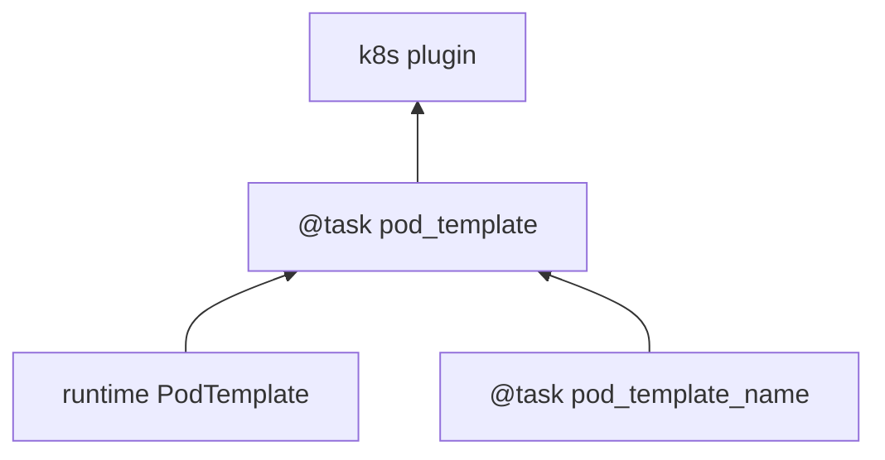

# Configuring task pods with K8s PodTemplates


The [PodTemplate](https://kubernetes.io/docs/concepts/workloads/pods/#pod-templates)
is a K8s-native resource used to define a K8s Pod. It contains all the fields in the PodSpec, in addition to ObjectMeta to control resource-specific metadata such as Labels or Annotations. PodTemplates are commonly applied in resources like Deployments or ReplicaSets to define the managed Pod configuration.

Within Flyte, you can use them to configure Pods created as part
of Flyte's task execution. This ensures complete control over Pod configuration, supporting all options available through the resource and ensuring maintainability in future versions.

There are three ways of defining [PodTemplate](https://kubernetes.io/docs/concepts/workloads/pods/#pod-templates) in Flyte:
1. Compile-time PodTemplate defined at the task level
2. Runtime PodTemplates
3. Cluster-wide default PodTemplate

> These approaches can be used simultaneously, where the cluste-wide configuration will override the default PodTemplate values.

## A note about containers kinds

In a Kubernetes Pod, you can have multiple containers but typically there is one considered "primary", or the one that runs the microservice or main application.
You can also have [initContainers](https://kubernetes.io/docs/concepts/workloads/pods/init-containers/#understanding-init-containers) which are designed to run before the primary to perform anciliary tasks like downloading data. They run sequentially and must complete succesfully before the primary container can run. You would define them under a separate section of the PodTemplate spec:

```yaml
apiVersion: v1
kind: PodTemplate
metadata:
  name: myPodTemplate
template:
  spec:
    containers:
    - name: myapp-container #primary container
      image: busybox:1.28
      command: ['sh', '-c', 'echo The app is running! && sleep 3600']
    initContainers:
    - name: init-mydb
      image: busybox:1.28
      command: ['sh', '-c', "until nslookup mydb.$(cat /var/run/secrets/kubernetes.io/serviceaccount/namespace).svc.cluster.local; do echo waiting for mydb; sleep 2; done"]
```
A special case of `initContainer` are the [sidecar containers](https://kubernetes.io/docs/concepts/workloads/pods/sidecar-containers/#pod-sidecar-containers). They are also designed to extend the functionality of the primary container but they remain running even after the Pod startup process completes.
You would configure them as an `initContainer` but with a policy that enables them to be restarted independently from the primary container:

```yaml
apiVersion: v1
kind: PodTemplate
metadata:
  name: myPodTemplate
template:
  spec:
    containers:
    - name: myapp-container #primary container
      image: busybox:1.28
      command: ['sh', '-c', 'echo The app is running! && sleep 3600']
    initContainers:
    - name: init-mydb
      image: busybox:1.28
      command: ['sh', '-c', "until nslookup mydb.$(cat /var/run/secrets/kubernetes.io/serviceaccount/namespace).svc.cluster.local; do echo waiting for mydb; sleep 2; done"]
    - name: logshipper
        image: alpine:latest
        restartPolicy: Always #overrides the Pod's restart policy. This makes it a sidecar container
        command: ['sh', '-c', 'tail -F /opt/logs.txt']
        volumeMounts:
          - name: data
            mountPath: /opt
```
Flyte support any of the above mentioned container kinds. In the following sections you will learn how to use PodTemplates in Flyte for different scenarios.

## Compile-time PodTemplates

Using the [Kubernetes Python client](https://github.com/kubernetes-client/python), we can define a compile-time PodTemplate as part of the configuration of a [Task](https://docs.flyte.org/en/latest/api/flytekit/generated/flytekit.task.html#flytekit-task).

Example:

```python

from flytekit import task, workflow, PodTemplate
from kubernetes.client import V1PodSpec, V1Container, V1ResourceRequirements, V1EnvVar, V1Volume, V1Toleration

pod_template=PodTemplate(
            primary_container_name="primary",
            labels={"lKeyA": "lValA", "lKeyB": "lValB"},
            annotations={"aKeyA": "aValA", "aKeyB": "aValB"},
            pod_spec=V1PodSpec(
                containers=[
                    V1Container(
                        name="primary",
                        image="repo/placeholderImage:0.0.0",
                        command="echo",
                        args=["wow"],
                        resources=V1ResourceRequirements(limits={"cpu": "24", "gpu": "10"}),
                        env=[V1EnvVar(name="eKeyC", value="eValC"), V1EnvVar(name="eKeyD", value="eValD")],
                    ),
                ],
                volumes=[V1Volume(name="volume")],
                tolerations=[
                    V1Toleration(
                        key="num-gpus",
                        operator="Equal",
                        value="1",
                        effect="NoSchedule",
                    ),
                ],
            )
        )

@task(pod_template=pod_template)
def my_flyte_task(input_str: str) -> str:
    print(f"Running task with input: {input_str}")
    return f"Processed {input_str}"

# Define a workflow to use the task
@workflow
def my_workflow(input_str: str) -> str:
    return my_flyte_task(input_str="Hello")
```
Which is rendered as a Pod which includes the following configuration:

```yaml
...
Labels:           ...
                  lKeyA=lValA
                  lKeyB=lValB
                  ...
Annotations:      aKeyA: aValA
                  aKeyB: aValB
                  primary_container_name: primary
...
Containers:
  primary:
    Image:      repo/placeholderImage:0.0.0
    Port:       <none>
    Host Port:  <none>
    ...
    Limits:
      cpu:             24
      memory:          1Gi
      nvidia.com/gpu:  10
    Requests:
      cpu:             24
      memory:          1Gi
      nvidia.com/gpu:  10
    Environment:
      eKeyC:                              eValC
      eKeyD:                              eValD
      ...
Volumes:
  volume:
    Type:       EmptyDir (a temporary directory that shares a pod's lifetime)
    Medium:
    SizeLimit:  <unset>
 ...
Tolerations:                 ...
                             num-gpus=1:NoSchedule
```

Notice how in this example we are defining a new PodTemplate inline, which allows us to define a full [V1PodSpec](https://github.com/kubernetes-client/python/blob/master/kubernetes/docs/V1PodSpec.md) and also define the name of the primary container, labels, and annotations.

The term "compile-time" here refers to the fact that the pod template definition is part of the [TaskSpec](https://docs.flyte.org/en/latest/api/flyteidl/docs/admin/admin.html#ref-flyteidl-admin-taskclosure).

## Runtime PodTemplates

Runtime PodTemplates, as the name suggests, are applied during runtime, as part of building the resultant Pod. In terms of how
they are applied, you have two choices: (1) you either elect one specific PodTemplate to be considered as default, or (2) you
define a PodTemplate name and use that in the declaration of the task. Those two options are mutually exclusive, meaning that
in the situation where a default PodTemplate is set and a PodTemplate name is present in the task definition, only the
PodTemplate name will be used.

## Set the ``default-pod-template-name`` in FlytePropeller

This [option](https://docs.flyte.org/en/latest/deployment/cluster_config/flytepropeller_config.html#default-pod-template-name-string)
initializes a K8s informer internally to track system PodTemplate updates
(creates, updates, etc) so that FlytePropeller is
[aware](https://docs.flyte.org/en/latest/deployment/cluster_config/flytepropeller_config.html#config-k8spluginconfig)
of the latest PodTemplate definitions in the K8s environment. You can find this
setting in [FlytePropeller](https://github.com/flyteorg/flyte/blob/e3e4978838f3caee0d156348ca966b7f940e3d45/deployment/eks/flyte_generated.yaml#L8239-L8244)
config map, which is not set by default.

An example configuration is:

```yaml

    plugins:
      k8s:
        co-pilot:
          name: "flyte-copilot-"
          image: "cr.flyte.org/flyteorg/flytecopilot:v0.0.15"
          start-timeout: "30s"
        default-pod-template-name: <your_template_name>
```
---
## Create a PodTemplate resource


Flyte recognizes PodTemplate definitions with the ``default-pod-template-name`` at two granularities.

1. A system-wide configuration can be created in the same namespace that
   FlytePropeller is running in (typically `flyte`).
2. PodTemplates can be applied from the same namespace that the Pod will be
   created in. FlytePropeller always favors the PodTemplate with the more
   specific namespace. For example, a Pod created in the ``flytesnacks-development``
   namespace will first look for a PodTemplate from the ``flytesnacks-development``
   namespace. If that PodTemplate doesn't exist, it will look for a PodTemplate
   in the same namespace that FlytePropeller is running in (in our example, ``flyte``),
   and if that doesn't exist, it will begin configuration with an empty PodTemplate.

Flyte configuration supports all the fields available in the PodTemplate
resource, including container-level configuration. Specifically, containers may
be configured at two granularities, namely "default" and "primary".

In this scheme, if the default PodTemplate contains a container with the name
"default", that container will be used as the base configuration for all
containers Flyte constructs. Similarly, a container named "primary" will be used
as the base container configuration for all primary containers. If both container
names exist in the default PodTemplate, Flyte first applies the default
configuration, followed by the primary configuration.

Note: Init containers can be configured with similar granularity using "default-init"
and "primary-init" init container names.

The ``containers`` field is required in each k8s PodSpec. If no default
configuration is desired, specifying a container with a name other than "default"
or "primary" (for example, "noop") is considered best practice. Since Flyte only
processes the "default" or "primary" containers, this value will always be dropped
during Pod construction. Similarly, each k8s container is required to have an
``image``. This value will always be overridden by Flyte, so this value may be
set to anything. However, we recommend using a real image, for example
``docker.io/rwgrim/docker-noop``.

## Using ``pod_template_name`` in a Task


It's also possible to use PodTemplate in tasks by specifying ``pod_template_name`` in the task definition. For example:

```python

    @task(
        pod_template_name="a_pod_template",
    )
    def t1() -> int:
        ...
```
In this example we're specifying that a previously created Runtime PodTemplate resource named ``a_pod_template`` is going to be applied.
The only requirement is that this PodTemplate exists at the moment this task is about to be executed.

## Flyte's K8s Plugin Configuration


The FlytePlugins repository defines `configuration <https://github.com/flyteorg/flyteplugins/blob/902b902fcf487f30ebb5dbeee3bb14e17eb0ec21/go/tasks/pluginmachinery/flytek8s/config/config.go#L67-L162)
for the Flyte K8s Plugin. They contain a variety of common options for Pod configuration
which are applied when constructing a Pod. Typically, these options map one-to-one
with K8s Pod fields. This makes it difficult to maintain configuration options as K8s
versions change and fields are added/deprecated.

## Evaluation Order in PodTemplates

The following diagram shows the precedence in evaluation order between the different types of PodTemplates and K8s Plugin Configuration. The precedence is higher at the top and decreases as the height of the tree increases.



To better understand how Flyte constructs task execution Pods based on Compile-time and Runtime PodTemplates,
and K8s plugin configuration options, let's take a few examples.

### Example 1: Runtime PodTemplate and K8s Plugin Configuration


If you have a Runtime PodTemplate defined in the ``flyte`` namespace
(where FlytePropeller instance is running), then it is applied to all Pods that
Flyte creates, unless a **more specific** PodTemplate is defined in the namespace
where you start the Pod.

An example PodTemplate is shown:

```yaml

    apiVersion: v1
    kind: PodTemplate
    metadata:
      name: flyte-template
      namespace: flyte
    template:
      metadata:
        labels:
          foo: from-pod-template
        annotations:
          foo: initial-value
          bar: initial-value
      spec:
        containers:
          - name: default
            image: docker.io/rwgrim/docker-noop
            terminationMessagePath: "/dev/foo"
        hostNetwork: false
```
In addition, the K8s plugin configuration in FlytePropeller defines the default
Pod Labels, Annotations, and enables the host networking.

```yaml

    plugins:
       k8s:
        default-labels:
          bar: from-default-label
        default-annotations:
          foo: overridden-value
          baz: non-overridden-value
        enable-host-networking-pod: true
```
To construct a Pod, FlytePropeller initializes a Pod definition using the default
PodTemplate. This definition is applied to the K8s plugin configuration values,
and any task-specific configuration is overlaid. During the process, when lists
are merged, values are appended and when maps are merged, the values are overridden.
The resultant Pod using the above default PodTemplate and K8s Plugin configuration is shown:

```yaml

    apiVersion: v1
    kind: Pod
    metadata:
      name: example-pod
      namespace: flytesnacks-development
      labels:
        foo: from-pod-template # maintained initial value
        bar: from-default-label # value appended by k8s plugin configuration
      annotations:
        foo: overridden-value # value overridden by k8s plugin configuration
        bar: initial-value # maintained initial value
        baz: non-overridden-value # value added by k8s plugin configuration
    spec:
      containers:
        - name: ax9kd5xb4p8r45bpdv7v-n0-0
          image: ghcr.io/flyteorg/flytecookbook:core-bfee7e549ad749bfb55922e130f4330a0ebc25b0
          terminationMessagePath: "/dev/foo"
          # remaining container configuration omitted
      hostNetwork: true # overridden by the k8s plugin configuration
```
The last step in constructing a Pod is to apply any task-specific configuration.
These options follow the same rules as merging the default PodTemplate and K8s
Plugin configuration (that is, list appends and map overrides). Task-specific
options are intentionally robust to provide fine-grained control over task
execution in diverse use-cases. Therefore, exploration is beyond this scope
and has therefore been omitted from this documentation.

### Example 2: A Runtime and Compile-time PodTemplates


In this example we're going to have a Runtime PodTemplate and a Compile-time PodTemplate defined in a task.

Let's say we have this Runtime PodTemplate defined in the same namespace as the one used to kick off an execution
of the task. For example:

```yaml

    apiVersion: v1
    kind: PodTemplate
    metadata:
      name: flyte-template
      namespace: flytesnacks-development
    template:
      metadata:
        annotations:
          annotation_1: initial-value
          bar: initial-value
      spec:
        containers:
          - name: default
            image: docker.io/rwgrim/docker-noop
            terminationMessagePath: "/dev/foo"
```
And the definition of the Compile-time PodTemplate in a task:

```python

    @task(
        pod_template=PodTemplate(
            primary_container_name="primary",
            labels={
              "label_1": "value-1",
              "label_2": "value-2",
            },
            annotations={
              "annotation_1": "value-1",
              "annotation_2": "value-2",
            },
            pod_spec=V1PodSpec(
                containers=[
                    V1Container(
                        name="primary",
                        image="a.b.c/image:v1",
                        command="cmd",
                        args=[],
                    ),
                ],
            )
        )
    )
    def t1() -> int:
        ...
```
The resultant Pod is as follows:

```yaml

    apiVersion: v1
    kind: Pod
    metadata:
      name: example-pod
      namespace: flytesnacks-development
      labels:
        label_1: value-1  # from Compile-time value
        label_2: value-2  # from Compile-time value
      annotations:
        annotation_1: value-1  # value overridden by Compile-time PodTemplate
        annotation_2: value-2  # from Compile-time PodTemplate
        bar: initial-value  # from Runtime PodTemplate
    spec:
      containers:
        - name: default
          image: docker.io/rwgrim/docker-noop
          terminationMessagePath: "/dev/foo"
        - name: primary
          image: a.b.c/image:v1
          command: cmd
          args: []
          # remaining container configuration omitted
```
Notice how options follow the same merging rules, i.e. lists append and maps override.

### Example 3: Runtime and Compile-time PodTemplates and K8s Plugin Configuration


Now let's make a slightly more complicated example where now we have both Compile-time and Runtime PodTemplates being combined
with K8s Configuration.

Here's the definition of a Compile-time PodTemplate:

```python

    @task(
        pod_template=PodTemplate(
            primary_container_name="primary",
            labels={
              "label_1": "value-compile",
              "label_2": "value-compile",
            },
            annotations={
              "annotation_1": "value-compile",
              "annotation_2": "value-compile",
            },
            pod_spec=V1PodSpec(
                containers=[
                    V1Container(
                        name="primary",
                        image="a.b.c/image:v1",
                        command="cmd",
                        args=[],
                    ),
                ],
                host_network=True,
            )
        )
    )
    def t1() -> int:
        ...

```
And a Runtime PodTemplate:

```yaml

    apiVersion: v1
    kind: PodTemplate
    metadata:
      name: flyte-template
      namespace: flyte
    template:
      metadata:
        labels:
          label_1: value-runtime
          label_2: value-runtime
          label_3: value-runtime
        annotations:
          foo: value-runtime
          bar: value-runtime
      spec:
        containers:
          - name: default
            image: docker.io/rwgrim/docker-noop
            terminationMessagePath: "/dev/foo"
        hostNetwork: false
```
And the following K8s Plugin Configuration:

```yaml

    plugins:
       k8s:
        default-labels:
          label_1: value-plugin
        default-annotations:
          annotation_1: value-plugin
          baz: value-plugin
```
The resultant pod for that task is as follows:

```yaml

    apiVersion: v1
    kind: Pod
    metadata:
      name: example-pod
      namespace: flytesnacks-development
      labels:
        label_1: value-plugin
        label_2: value-compile
      annotations:
        annotation_1: value-plugin
        annotation_2: value-compile
        foo: value-runtime
        bar: value-runtime
        baz: value-plugin
    spec:
      containers:
        - name: default
          image: docker.io/rwgrim/docker-noop
          terminationMessagePath: "/dev/foo"
        - name: primary
          image: a.b.c/image:v1
          command: cmd
          args: []
          # remaining container configuration omitted
```