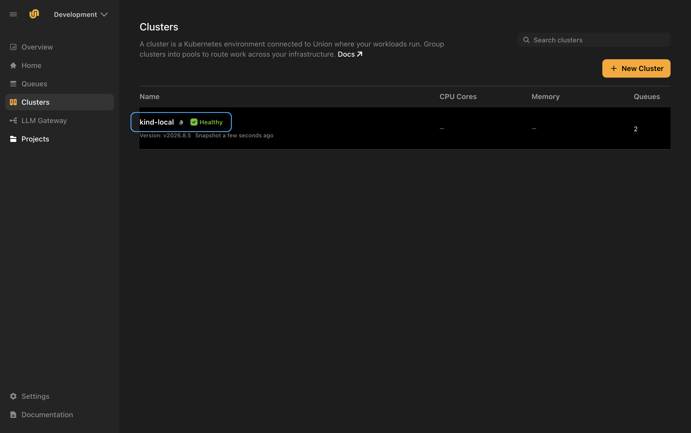

# Connect your cluster

You have an organization. Now give  a Kubernetes cluster to run workloads on. Your code, data and credentials stay in that cluster.

**Nothing dials in.** You install an agent into your cluster, and the agent connects out to . You do not open a port, expose an endpoint, or hand over cluster credentials.

> [!NOTE] This is not the same as a self-managed deployment
> On this path you register the cluster first, and the agent then installs the data plane for you. The [Self-managed deployment](../selfmanaged/_index) guides describe the opposite order: you provision and install the data plane yourself, then register the control-plane record. Follow one or the other, not both.

## What you'll need

- A Kubernetes cluster you can reach with `kubectl`.
- An S3-compatible object store that the cluster can reach, and its access key and secret.
- Optionally, a container registry the cluster can push to and pull from.

All of this works on a local cluster. See [Trying it on a local cluster](#trying-it-on-a-local-cluster).

## 1. Set up a cluster pool

A cluster pool groups clusters that share an object store, secrets and an image registry. Your first cluster needs one, and a new organization starts without any, so the console asks for this first.

Select your provider, then fill in the store the cluster will use:

| Field | What it is |
|-------|------------|
| **Object store** | The S3-compatible bucket, and optional prefix,  stores metadata in. For example, `s3://union-data`. |
| **Object store endpoint** | Where the S3-compatible API is reached **from inside the cluster**. Plain `http://` is fine for a store running in the cluster. |
| **Image registry** | Optional. The registry images are pushed to and pulled from. |

The endpoint is resolved by the agent from inside your cluster, not by , so an address that only exists on your cluster network is expected here.


> [!NOTE] Pick the On-Prem tab
> The form opens on **AWS**, which asks for a full set of IAM roles and ARNs. **On-Prem** is the tab this guide uses, and it asks for two fields.

Select **Create cluster pool**. The console then takes you to **Clusters**, ready to connect one.

## 2. Create the storage secret

Your object store's keys stay in your cluster.  is only told the *name* of the Kubernetes secret that holds them.

Create the namespace and the secret:

```bash
kubectl create namespace union --dry-run=client -o yaml | kubectl apply -f -

kubectl create secret generic storage-credentials \
  --namespace union \
  --from-literal=access_key_id=<your-access-key> \
  --from-literal=secret_key=<your-secret-key>
```

You can do this before or straight after registering the cluster. The agent reads it when it connects. The console shows this same command in the connect dialog, so you can copy it from there instead of typing it.

## 3. Register the cluster

Select **New Cluster** and fill in three things:

| Field | Notes |
|-------|-------|
| **Cluster name** | The name the cluster is registered under. It **cannot be changed** once the cluster is connected. |
| **Cluster pool** | The pool from step 1. It supplies the object store the cluster deploys with. |
| **Credentials secret name** | The name of the secret you created in step 2, for example `storage-credentials`. |


Select **Register cluster**. The cluster now exists as a record, and the console moves on to installing the agent.

Registering does not put anything on your cluster by itself. That is the next step.

## 4. Install the agent

<!-- Captured live on staging 2026-09-04: the console produced the command for org my-org,
     cluster kind-local. Chart version 1.18.25 is read from the install kit rather than pinned in
     our code, so treat the version below as an example, not a constant. The earlier note here
     said this was blocked on ENG26-1184; that ticket is still Todo, but the work shipped under
     other PRs (cloud #17954, #18059, #18094, #18139, #18162) and is live on staging.
     STILL UNVERIFIED: the helm run itself. See the comment in section 5. -->

The console shows a command to run against the cluster you want  to use. Run it, and the agent installs itself and connects out.

The command has two parts: a block that writes a `values.yaml` for your cluster, and the `helm` line that installs the agent from it.

```bash
cat <<'UNION_DP_AGENT_VALUES' > values.yaml
# the values the console generated for your cluster
UNION_DP_AGENT_VALUES

helm upgrade --install dp-agent oci://ghcr.io/omnistrate/dataplane-agent-chart \
  --version 1.18.25 \
  --namespace dataplane-agent --create-namespace --values values.yaml \
  --set nameOverride=dp-agent --timeout 10m0s --wait
```

Copy the whole thing from the console rather than retyping it. The values are generated for this one cluster, and the chart version comes from the console, so it can differ from the one shown here.

> [!WARNING] The values are a credential
> The `values.yaml` block contains the agent's client certificate and private key. Treat it like any other secret: do not paste it into a ticket, a chat message, or a shared document, and delete the file once the agent is installed.

> [!NOTE] This step is yours to run, by design
>  cannot install the agent for you, because nothing dials in to your cluster. Running this command from inside your network is what opens the connection outwards. It is the one step that leaves the console.

### If the install fails with `denied: denied`

```
Error: failed to perform "FetchReference" on source: ...
GET "https://ghcr.io/token?scope=repository%3Aomnistrate%2Fdataplane-agent-chart%3Apull&service=ghcr.io":
response status code 403: denied: denied
```

The agent chart is public, so this is almost always a stale login rather than a permissions problem. If you have signed in to `ghcr.io` before and the credential has since expired, Helm sends it anyway, and the registry rejects the expired credential instead of falling back to anonymous access.

Sign out of that registry and run the command again:

```bash
docker logout ghcr.io
```

You do not need an account to pull the chart. Sign back in afterwards if you use `ghcr.io` for your own images.

## 5. Wait for the data plane

Installation runs in two phases, both shown in the console:

| Phase | What is happening |
|-------|-------------------|
| **Agent installation** | The agent starts in your cluster and connects out to . |
| **Union installation** |  installs the data plane through that connection. |

Alongside them the console reports **connectivity** and **health** for the cluster.

Only the first phase needs you. Once the agent connects,  applies the data plane itself, so there is nothing further to run.

> [!NOTE] Where the data plane lands
> The data plane installs into its own namespace, named `instance-` followed by an identifier, not into the `union` namespace. `union` holds only the storage secret you created in step 2. If you are checking progress with `kubectl`, list pods across all namespaces rather than looking in `union` and concluding nothing happened.

Installing the data plane takes a few minutes on a new cluster, mostly spent pulling images. You can leave the page while it runs.

When the cluster is ready, it shows as **Healthy** in the cluster list, with the data-plane version it is running:



<!-- ⚠️ THIS IMAGE IS RETOUCHED. Captured on staging 2026-09-04, then the AWS logo and the
     "EKS / us-east-1" line were hidden in the DOM before the shot was taken, so the image is a
     real render of a modified page rather than an edited bitmap.
     Why: the console labels this on-prem cluster as EKS / us-east-1, though it was registered on
     the On-Prem tab and the console's own generated values carry cloudProvider: byoc-onprem and
     cloudRegion: on-prem. That is a console bug, raised with eng. Peeter's call to ship the shot
     with the label removed rather than hold the section (2026-09-04).
     They were REMOVED, not replaced: we do not know what the fixed console will display, and
     inventing a label risks being wrong a second time.
     originals/cluster-healthy.png is the UNRETOUCHED capture and still shows the bug -- keep it,
     it is the evidence.
     RE-SHOOT once the label is fixed, and drop this comment with it.
     ⚠️ ALSO RE-SHOOT FOR A SECOND REASON. CPU Cores and Memory read "—" in this shot, and that is
     NOT kind declining to report capacity, which is what an earlier version of this comment said.
     It is the visible symptom of a data plane that did not fully install: union-operator-prometheus
     was stuck Pending on "Insufficient memory", so nothing reported capacity. The console still
     said Healthy, but the scheduler did not -- `flyte run` failed with "all enabled clusters for
     organization my-org and cluster pool default are unhealthy". So this image shows a cluster
     that cannot actually run a workload. Replace it with a shot of a cluster that can. -->

<!-- screenshot, still open: the in-dialog Status panel showing both phases, connectivity and
     health together. It only renders while the connect dialog is open, and this session closed it
     before the install finished. To get it, register a cluster and leave the dialog open. The
     image above carries the same conclusion for the reader, so this is a nice-to-have. -->

## 6. Run a workload on the cluster

<!-- ⚠️ STILL UNVERIFIED, but no longer blocked: the cluster is Healthy as of 2026-09-04, so a
     real on-cluster run can now be made. Confirm the exact command and what the reader sees. -->

With a connected cluster, drop `--local` and the same code runs on-cluster instead of in your Python process:

```bash
flyte run temperatures.py hottest
```

The run appears under **Runs** in your project, not under **Tracked Runs**. That section is for runs that execute on your own machine. See [Run modes](../../user-guide/get-started/run-modes/_index) for how the two differ.

## Trying it on a local cluster

<!-- VERIFIED END TO END on kind 2026-09-04: cluster union-onprem-docs, in-cluster MinIO, org
     my-org, cluster kind-local. Pool, secret, registration, agent install, and the data plane all
     work; the console reached Healthy at version v2026.8.5. It takes a while -- roughly 20 minutes
     from the helm run on a laptop-sized kind cluster, most of it pulling images.
     An earlier note here said the data plane never landed. That was wrong: it goes into an
     Omnistrate-generated instance-<id> namespace, not into `union`, and `union` holds only the
     storage secret. See the note in section 5. -->

You do not need cloud infrastructure to see this working. A local Kubernetes cluster and an in-cluster object store are enough, and the endpoint field is designed for exactly this.

> [!WARNING] Give Docker enough memory first
> The data plane asks for a little over 8 GB of memory in pod requests, so a Docker VM with the common 8 GB default is not enough: the monitoring component never schedules. Give Docker at least 12 GB before you start.

<!-- The memory figure above is measured: at 7.65 GB, running pods request 7.33 GB and
     union-operator-prometheus wants 1.00 GB more, so it sits Pending on "Insufficient memory".
     Raising Docker to 11.67 GB clears that.

     ⚠️ BUT MEMORY IS NOT WHY A RUN FAILS, and section 6 is still blocked by a PRODUCT BUG.
     Root cause found 2026-09-04, with evidence, not inference:

       union-operator-prometheus has a namespaced RoleBinding
       (union-operator-prometheus-rbac) and NO ClusterRoleBinding, but its service discovery
       needs cluster scope. Its own log repeats:
         pods is forbidden: User "system:serviceaccount:<instance-ns>:union-operator-prometheus"
         cannot list resource "pods" in API group "" at the cluster scope
       ...and the same for services, endpoints and nodes.
       `kubectl auth can-i list nodes --as=<that SA>` answers "no".

     TESTED, and the RBAC gap alone does NOT explain the failed run. Adding the missing
     ClusterRoleBinding by hand fixed exactly what it should: `can-i list nodes` went no -> yes and
     the forbidden errors stopped dead. Observability still reads Unknown, CPU/Memory still read
     "—", and the run still fails the same way -- including after restarting prometheus so its
     informers started with the permissions rather than having begun life denied.

     So record these as TWO facts, not one story:
       1. The prometheus service account is packaged with namespaced RBAC and needs cluster scope.
          Independently verifiable in one `kubectl auth can-i`. Almost certainly a real bug.
       2. Something keeps this cluster unschedulable while the console header says Healthy.
          Six `flyte run` attempts over ~an hour, data plane fully up at 26 pods, everything
          except Observability reading Healthy.
     Whether they are the same bug is UNKNOWN. An earlier version of this comment asserted the
     chain (no RBAC -> no metrics -> no capacity -> scheduler refuses) as though it were
     established. It is not, and stating it would send the next reader down a settled-looking path
     that is not settled.

     BEST LEAD, found last and not chased further: the cluster detail page's COMPUTE tab reads
       "No node groups found -- This cluster hasn't reported any node group configuration yet."
     Node groups are the machine configuration the scheduler places work against, and they are
     reported by a different mechanism than prometheus metrics. A cluster with none is plausibly
     unselectable by definition, which would explain "all enabled clusters are unhealthy" without
     involving observability at all. Untested -- it is the first thing to look at next.

     Fact 1 is ENG26-1184's own open question ("Identify the RBAC that the agent should have").
     All of it is raised with eng. Do not write section 6, and do not publish "trying it on a local
     cluster" as a working path, until a run is actually observed to succeed. -->

Create a cluster with [kind](https://kind.sigs.k8s.io):

```bash
kind create cluster --name union-local
```

Deploy MinIO into it and create a bucket. Putting MinIO in a namespace called `minio` gives it the in-cluster address `http://minio.minio.svc.cluster.local:9000`, which is what you enter as the object store endpoint:

<!-- code include: the MinIO manifest belongs in unionai-examples once this page is unblocked,
     rather than being pasted inline here. Verified working: namespace + Deployment + Service,
     quay.io/minio/minio, emptyDir storage, root user/password via a Secret. -->

Then follow the steps above, using:

| Field | Value |
|-------|-------|
| Object store | `s3://union-data` |
| Object store endpoint | `http://minio.minio.svc.cluster.local:9000` |
| Image registry | leave blank |

> [!WARNING] For evaluation only
> A local cluster has no persistent storage, no capacity to speak of, and disappears when you delete it. Use it to understand the flow, not to run real work.

## Next steps

That is the setup complete. You subscribed or signed up, created your organization, and connected a cluster, and  is now running your workloads on your own infrastructure.

From here:

- **[Cluster pools](../../user-guide/cluster-workload-management/cluster-pools)**. Managing pools from the CLI, including multiple pools.
- **[Clusters](../../user-guide/cluster-workload-management/clusters)**. Inspecting cluster state and capacity, and moving a cluster between pools.
- **[Queues](../../user-guide/cluster-workload-management/queues)**. Routing workloads across your clusters.
