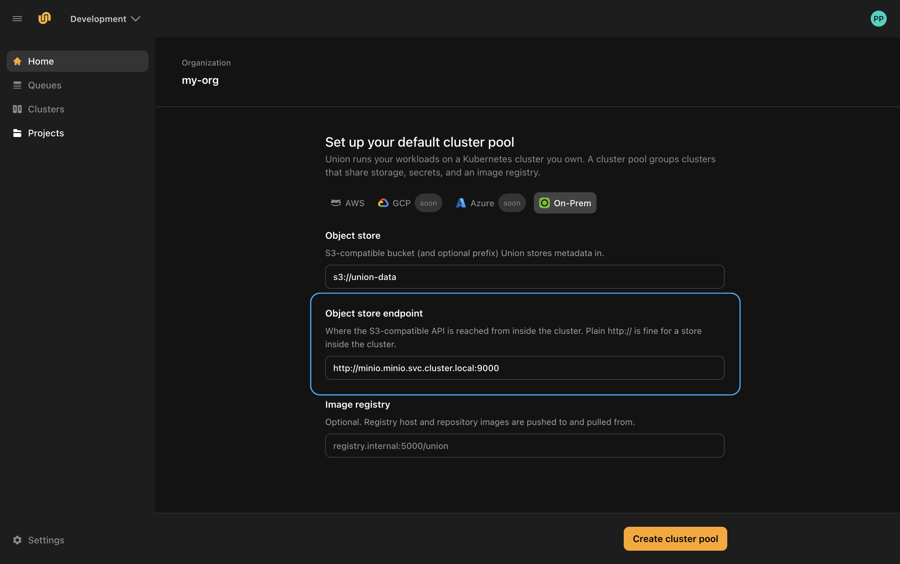
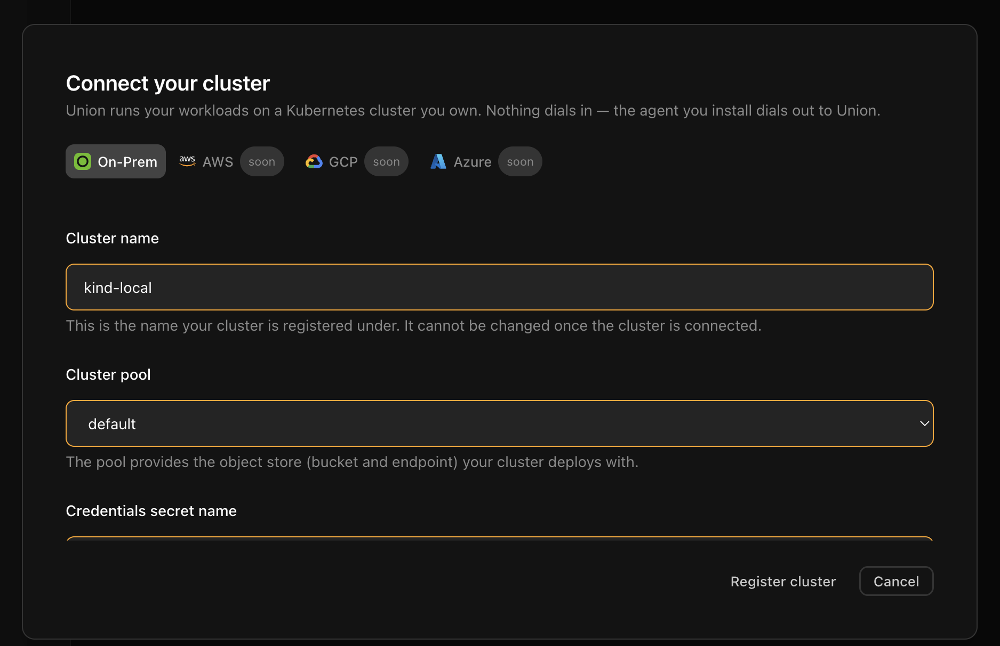

# Connect your own cluster

You have an organization. Now give  a Kubernetes cluster to run workloads on. Your code, data and credentials stay in that cluster.

**Nothing dials in.** You install an agent into your cluster, and the agent connects out to . You do not open a port, expose an endpoint, or hand over cluster credentials.

> [!NOTE] This is not the same as a self-managed deployment
> On this path you register the cluster first, and the agent then installs the data plane for you. The [Self-managed deployment](../selfmanaged/_index) guides describe the opposite order: you provision and install the data plane yourself, then register the control-plane record. Follow one or the other, not both.

## What you'll need

- A Kubernetes cluster you can reach with `kubectl`.
- An S3-compatible object store that the cluster can reach, and its access key and secret.
- Optionally, a container registry the cluster can push to and pull from.

All of this works on a local cluster. See [Trying it on a local cluster](#trying-it-on-a-local-cluster).

## 1. Set up a cluster pool

A cluster pool groups clusters that share an object store, secrets and an image registry. Your first cluster needs one, and a new organization starts without any, so the console asks for this first.

Select your provider, then fill in the store the cluster will use:

| Field | What it is |
|-------|------------|
| **Object store** | The S3-compatible bucket, and optional prefix,  stores metadata in. For example, `s3://union-data`. |
| **Object store endpoint** | Where the S3-compatible API is reached **from inside the cluster**. Plain `http://` is fine for a store running in the cluster. |
| **Image registry** | Optional. The registry images are pushed to and pulled from. |

The endpoint is resolved by the agent from inside your cluster, not by , so an address that only exists on your cluster network is expected here.



> [!NOTE] Pick the On-Prem tab
> The form opens on **AWS**, which asks for a full set of IAM roles and ARNs. **On-Prem** is the tab this guide uses, and it asks for two fields.

Select **Create cluster pool**. The console then takes you to **Clusters**, ready to connect one.

## 2. Create the storage secret

Your object store's keys stay in your cluster.  is only told the *name* of the Kubernetes secret that holds them.

Create the namespace and the secret:

```bash
kubectl create namespace union --dry-run=client -o yaml | kubectl apply -f -

kubectl create secret generic storage-credentials \
  --namespace union \
  --from-literal=access_key_id=<your-access-key> \
  --from-literal=secret_key=<your-secret-key>
```

You can do this before or straight after registering the cluster. The agent reads it when it connects. The console shows this same command in the connect dialog, so you can copy it from there instead of typing it.

## 3. Register the cluster

Select **New Cluster** and fill in three things:

| Field | Notes |
|-------|-------|
| **Cluster name** | The name the cluster is registered under. It **cannot be changed** once the cluster is connected. |
| **Cluster pool** | The pool from step 1. It supplies the object store the cluster deploys with. |
| **Credentials secret name** | The name of the secret you created in step 2, for example `storage-credentials`. |



Select **Register cluster**. The cluster now exists as a record, and the console moves on to installing the agent.

Registering does not put anything on your cluster by itself. That is the next step.

## 4. Install the agent

<!-- Captured live on staging 2026-09-04: the console produced the command for org my-org,
     cluster kind-local. Chart version 1.18.25 is read from the install kit rather than pinned in
     our code, so treat the version below as an example, not a constant. The earlier note here
     said this was blocked on ENG26-1184; that ticket is still Todo, but the work shipped under
     other PRs (cloud #17954, #18059, #18094, #18139, #18162) and is live on staging.
     STILL UNVERIFIED: the helm run itself. See the comment in section 5. -->

The console shows a command to run against the cluster you want  to use. Run it, and the agent installs itself and connects out.

The command has two parts: a block that writes a `values.yaml` for your cluster, and the `helm` line that installs the agent from it.

```bash
cat <<'UNION_DP_AGENT_VALUES' > values.yaml
# the values the console generated for your cluster
UNION_DP_AGENT_VALUES

helm upgrade --install dp-agent oci://ghcr.io/omnistrate/dataplane-agent-chart \
  --version 1.18.25 \
  --namespace dataplane-agent --create-namespace --values values.yaml \
  --set nameOverride=dp-agent --timeout 10m0s --wait
```

Copy the whole thing from the console rather than retyping it. The values are generated for this one cluster, and the chart version comes from the console, so it can differ from the one shown here.

> [!WARNING] The values are a credential
> The `values.yaml` block contains the agent's client certificate and private key. Treat it like any other secret: do not paste it into a ticket, a chat message, or a shared document, and delete the file once the agent is installed.

> [!NOTE] This step is yours to run, by design
>  cannot install the agent for you, because nothing dials in to your cluster. Running this command from inside your network is what opens the connection outwards. It is the one step that leaves the console.

## 5. Wait for the data plane

Installation runs in two phases, both shown in the console:

| Phase | What is happening |
|-------|-------------------|
| **Agent installation** | The agent starts in your cluster and connects out to . |
| **Union installation** |  installs the data plane through that connection. |

Alongside them the console reports **connectivity** and **health** for the cluster.

Only the first phase needs you. Once the agent connects,  applies the data plane itself, so there is nothing further to run.

Installing the data plane takes a few minutes on a new cluster, mostly spent pulling images. You can leave the page while it runs.

<!-- screenshot: STILL OPEN. The Status panel exists and was seen live on staging 2026-09-04:
     it reads "Agent installation: installing… <elapsed>", "Union installation: waiting",
     "connectivity: disconnected", "health: —". That is the correct pre-install state, and it
     stays there until someone runs the section-4 command, which is the design.
     A shot of the SUCCESSFUL state still needs the helm run to complete. It was attempted this
     session and blocked in the sandbox: helm's request for the ghcr.io pull token returned 403
     while the same URL returned 200 from curl, so it is an environment restriction, not a
     product fault. The chart is public. Run the helm line outside the sandbox, then capture. -->

## 6. Run a workload on the cluster

<!-- ⚠️ STILL UNVERIFIED. Blocked behind the helm run, not behind the console any more.
     Confirm the exact command and what the reader sees before publishing. -->

With a connected cluster, drop `--local` and the same code runs on-cluster instead of in your Python process:

```bash
flyte run temperatures.py hottest
```

The run appears under **Runs** in your project, not under **Tracked Runs** — that section is for runs that execute on your own machine. See [Run modes](../../user-guide/get-started/run-modes/_index) for how the two differ.

## Trying it on a local cluster

You do not need cloud infrastructure to see this working. A local Kubernetes cluster and an in-cluster object store are enough, and the endpoint field is designed for exactly this.

Create a cluster with [kind](https://kind.sigs.k8s.io):

```bash
kind create cluster --name union-local
```

Deploy MinIO into it and create a bucket. Putting MinIO in a namespace called `minio` gives it the in-cluster address `http://minio.minio.svc.cluster.local:9000`, which is what you enter as the object store endpoint:

<!-- code include: the MinIO manifest belongs in unionai-examples once this page is unblocked,
     rather than being pasted inline here. Verified working: namespace + Deployment + Service,
     quay.io/minio/minio, emptyDir storage, root user/password via a Secret. -->

Then follow the steps above, using:

| Field | Value |
|-------|-------|
| Object store | `s3://union-data` |
| Object store endpoint | `http://minio.minio.svc.cluster.local:9000` |
| Image registry | leave blank |

> [!WARNING] For evaluation only
> A local cluster has no persistent storage, no capacity to speak of, and disappears when you delete it. Use it to understand the flow, not to run real work.

## Next steps

- **[Cluster pools](../../user-guide/cluster-workload-management/cluster-pools)** — managing pools from the CLI, including multiple pools.
- **[Clusters](../../user-guide/cluster-workload-management/clusters)** — inspecting cluster state and capacity, and moving a cluster between pools.
- **[Queues](../../user-guide/cluster-workload-management/queues)** — routing workloads across your clusters.
