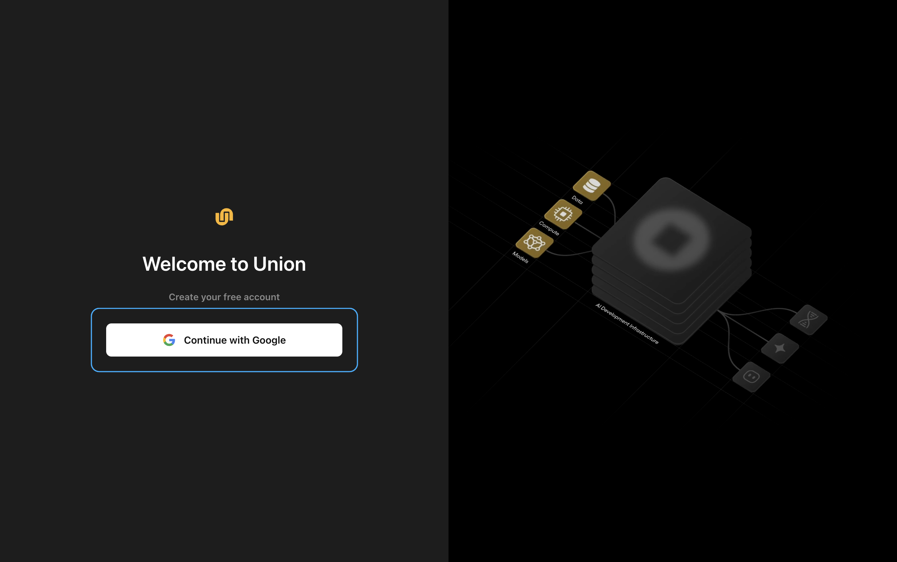
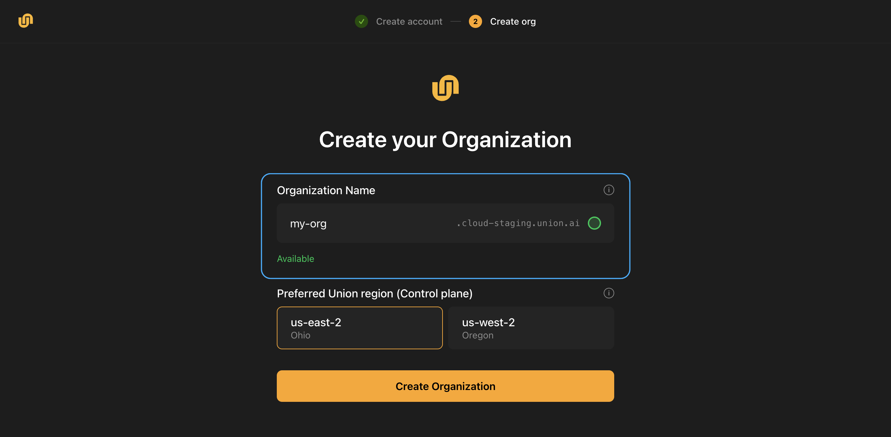
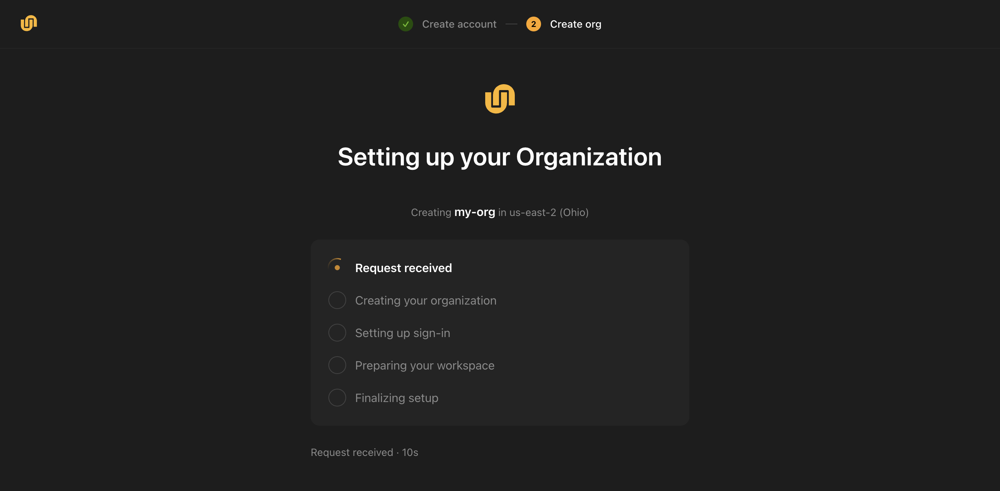

# Sign in and create your Union.ai organization

Sign in with your work account and create an organization. Your organization is your workspace in : it holds your projects, workflows, resources and team members, and everything you do afterwards happens inside it.

Once it exists you can run a workflow straight away. Nothing runs on a cluster: your first workflow executes on your own machine and reports its progress to , so you can see how  works before connecting any infrastructure.

> [!NOTE] Subscribed through AWS Marketplace?
> Your subscription needs to be claimed by the organization you create, so start at [Start from AWS Marketplace](./from-aws-marketplace) rather than here. It rejoins this page at the organization step.

## What you'll need

- A Google Workspace account. Signing in uses your work email, and personal Gmail addresses are not accepted.
- Python 3.10+ in a virtual environment.

## Create your account

Go to [signup.hosted.unionai.cloud](https://signup.hosted.unionai.cloud) and select **Continue with Google**. Choose the account you want to use for .

<!-- ⚠️ HOSTNAME IN FLUX — confirm with eng before this page goes live.
     signup.hosted.unionai.cloud is what serves today: verified 2026-09-04, HTTP 200 -> /sign-in,
     runtime config reports environment=production, gitSha e2b8a68a46 = cloud#18091 "add production
     pipeline for signup app", which is merged to main. It matches the production env_domain in
     cloud origin/main:signup/deploy/signup.yaml:49.
     The page previously said signup.union.ai. That host does not resolve at all and never did --
     it is a leftover from the Serverless era (cloud clients/website/workshop/README.md).
     But an UNMERGED commit moves production to signup.unionai.cloud:
     cloud e3d8023d65 on branch nathan/fix-signup-prod-host, 2026-09-01, "update signup-prod host".
     That host currently returns 530. So the front door may move before the 1 Oct launch (DOC-1538).
     Ask Nathan which host is final rather than guessing. -->



<!-- Captured on signup.cloud-staging.union.ai 2026-09-04 (Peeter chose staging as the capture
     surface). The shot carries no hostname, so it is safe to keep when the prose moves to the
     production host. CDP captures the viewport only, so there is no URL bar to crop. -->

## Create your organization

An organization is your top-level workspace in . It is where your projects, workflows, resources, and team members live.

1. **Organization name.** This becomes your organization's web address, so it must be unique across , and it cannot be changed later. Use lowercase letters, digits, and hyphens. As you type,  checks whether the name is available.

   

   <!-- ⚠️ CAPTURED ON STAGING, so the suffix in the shot reads .cloud-staging.union.ai while the
        prose says my-org.hosted.unionai.cloud, and the region list shows only us-east-2 and
        us-west-2. Peeter chose staging as the capture surface (2026-09-04). Re-shoot on
        production before this page goes live, or the reader sees a domain they cannot reach. -->

2. **Preferred Union region.** This is where your control plane runs. The control plane is the  service that manages your workflows, metadata, and user interface. If you later connect a cluster of your own, choose the region closest to it. If you are not sure, keep the default.

3. Select **Create Organization**.

 sets up your organization in about thirty seconds. You'll see each step complete: receiving the request, creating the organization, setting up sign-in, preparing your workspace, and finalizing.



## Sign in to your organization

When setup finishes,  takes you to your new organization's sign-in page. Select **Continue with Google** and choose the same account again.

> [!NOTE]
> You may be asked to choose your Google account more than once during sign-up. This is expected: your account, your organization, and the console each confirm who you are.

You land in the  console. Your organization's address is shown at the top of the page, in the form `my-org.hosted.unionai.cloud`. You'll need it in the next step.

> [!NOTE] You don't need a cluster yet
> The console first asks you to set up a cluster pool. That is [connecting your own cluster](./connect-a-cluster), and you can come back to it any time. For your first run, skip it: select **Projects** in the sidebar. Your organization already has a `default` project ready to use.

## Set up the CLI

Install the Flyte SDK, which includes the `flyte` command:

```bash
pip install flyte
```

Create a configuration file that points the CLI at your organization. Replace the endpoint with your organization's address from the previous step:

```bash
flyte create config \
    --endpoint my-org.hosted.unionai.cloud \
    --project default \
    --domain development \
    --builder remote
```

This writes `.flyte/config.yaml` in the current directory. The first command that contacts your organization opens a browser window so you can sign in; after that, the CLI remembers you.

<!-- verify on the capture pass: confirm the exact sign-in behaviour a brand-new user sees from the CLI (device flow vs browser redirect) and reconcile this paragraph to it. -->

## Run your first workflow

Run a built-in example workflow. It needs no files of its own:

```bash
flyte run --tracked hello
```

The `--tracked` flag runs the workflow on your machine and reports its progress to your organization as it goes. You'll see output like this:

```bash
Using the built-in example from /tmp/flyte-hello-<user>/task/hello.py
Copy it into your own project to start editing.

Completed Local Run
Path: https://my-org.hosted.unionai.cloud/v2/domain/development/project/default/tracked-runs/local-54ce6d6e
Outputs: ActionOutputs(o0=14.0)
```

The example fans a small computation out over a list of inputs with `flyte.map` and averages the results. The path  prints is the run's page in the console.

## See your run in the console

Open the printed path, or select **Tracked Runs** in the sidebar of your project. Tracked runs have their own section, separate from **Runs**, which shows runs that executed on a cluster.

<!-- screenshot: tracked-run details page for the hello run. Frame on the action tree (main + 10 workers). Evidence shot exists at 1x: shots/evidence-tracked-run-details-1x.jpg; recapture at 2x. -->

The run's page shows:

- The run and each of its actions, with status and timing. The example has one parent action and ten child actions, one per input.
- The environment the task belongs to.
- Under **Summary**, the inputs the run received and the outputs it produced.

Everything you see here came from a run on your own machine.  recorded it as it happened.

## Next steps

- **Run your own code the same way.** Write a workflow following the [Quickstart](../../user-guide/get-started/quickstart), then run it with `flyte run --tracked temperatures.py hottest`. See [Track local runs in the console](../../user-guide/get-started/run-modes/running-locally#track-local-runs-in-the-console) for what tracking does and does not report.
- **Connect a cluster.** When you want  to run your workloads for you, with GPUs and cluster-scale resources, return to the cluster pool setup in the console. See [Run on a remote cluster](../../user-guide/get-started/run-modes/running-remote).
- **Learn the concepts.** [Core concepts](../../user-guide/get-started/core-concepts/_index) explains tasks, environments, projects, and runs.
