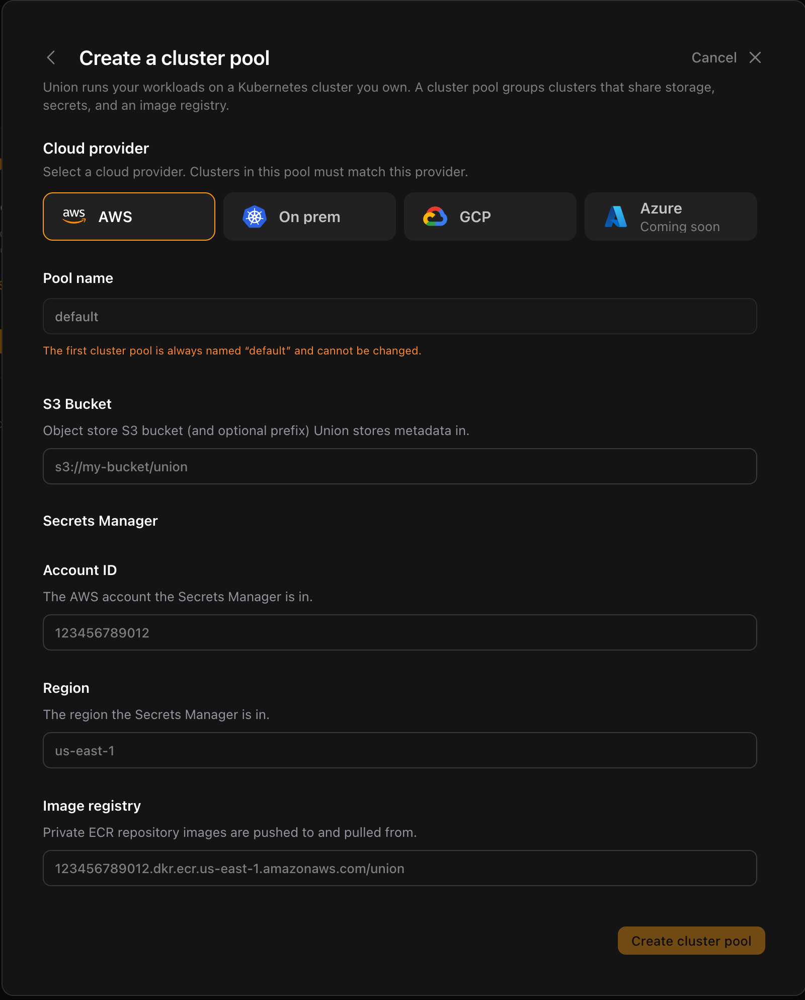
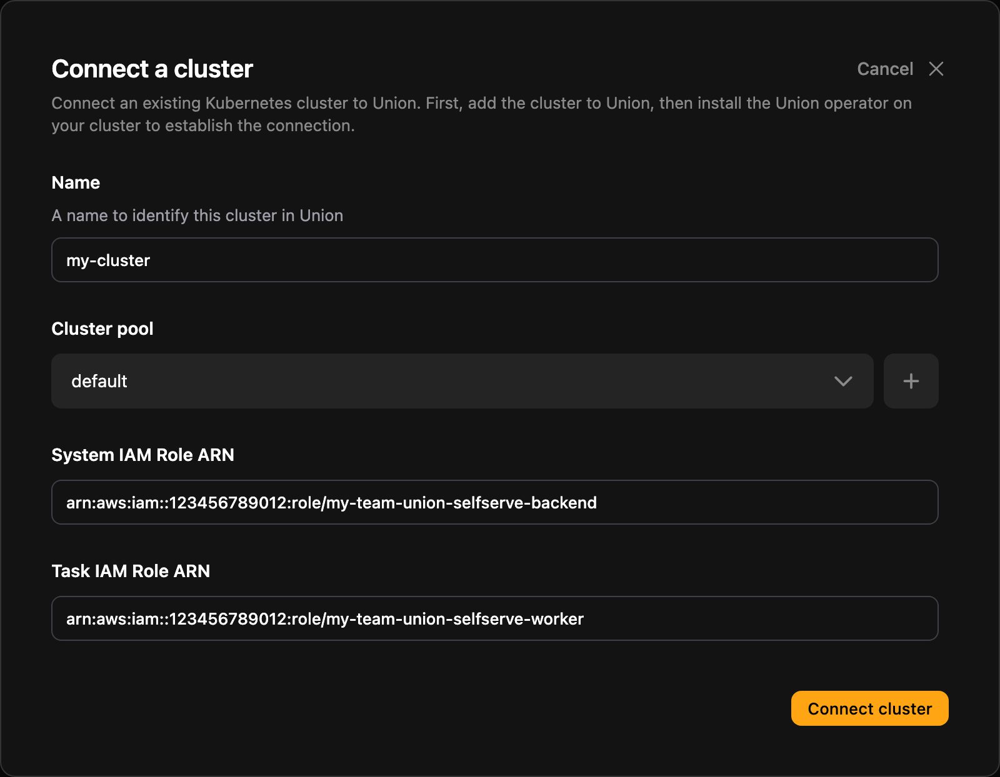
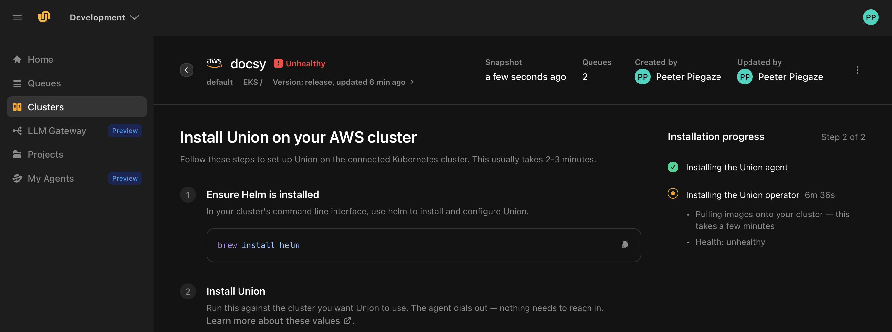

# Connect your cluster

You have an organization and the AWS resources your data plane runs on. Now connect your EKS cluster to Union.ai, and Union.ai installs the data plane into it. Your code, data and credentials stay in your AWS account.

**Nothing dials in.** You install an agent into your cluster, and the agent connects out to Union.ai. You do not open a port, expose an endpoint, or hand over cluster credentials.

<!-- Flow traced in source, not yet watched end to end on AWS: cloud origin/main,
     clientsv2/src/components/pages/SettingsClusters/ConnectCluster/ (ConnectClusterDialog.tsx,
     ConnectClusterPoolFlow.tsx, NoClusterPoolStep.tsx) and ClusterInstall/ (ClusterInstallPanel.tsx,
     InstallProgressRail.tsx). Check labels against the console on the capture pass. -->

## What you'll need

The values printed at the end of [Provision your AWS resources](./aws-infrastructure#8-collect-the-values-for-connecting-your-cluster). If you are using AWS resources you already had, collect the same values for them, and check that they meet the [requirements](./aws-infrastructure#provision-your-aws-resources) first:

- **S3 bucket URI**: the metadata bucket, for example `s3://my-team-union-selfserve-metadata`
- **AWS account ID**: the 12-digit ID of the account that holds Secrets Manager
- **AWS Region**: the Region the cluster and Secrets Manager are in
- **Image registry URI**: the address of the ECR repository. It has the form `<account-id>.dkr.ecr.<region>.amazonaws.com/<repository-name>`, for example `123456789012.dkr.ecr.us-east-2.amazonaws.com/my-team-union-selfserve`.
- **System IAM role ARN**
- **Task IAM role ARN**

You also need [Helm](https://helm.sh/docs/intro/install/) installed, and `kubectl` access to the EKS cluster from the shell where you ran `aws eks update-kubeconfig`.

## 1. Create the cluster pool

A cluster pool groups clusters that share an S3 bucket, a secret store and an image registry. A new organization has none, so you create one first.

1. In the Union.ai UI, select **Connect your cluster**, on the home page or in the sidebar.
2. The dialog tells you there is no cluster pool yet. Select **Create cluster pool**.
3. Select **AWS**, and fill in the form:

   | Field | Value |
   |---|---|
   | **S3 Bucket** | The S3 bucket URI |
   | **Account ID** | The AWS account ID |
   | **Region** | The AWS Region |
   | **Image registry** | The image registry URI |

   Your first pool is always named `default`, so the **Pool name** field is already filled in.

   

4. Select **Create cluster pool**.

No secret needs to exist in Secrets Manager yet. The data plane creates and manages runtime secrets in that account and Region as it needs them.

## 2. Connect the cluster

When the pool is created, the dialog moves straight on to **Connect a cluster**, with your new pool already selected. Fill in:

| Field | Value |
|---|---|
| **Name** | A name for the cluster in Union.ai, for example `my-cluster`. You cannot change it once the cluster is connected. |
| **System IAM Role ARN** | The system IAM role ARN |
| **Task IAM Role ARN** | The task IAM role ARN |



Select **Connect cluster**. Union.ai registers the cluster and takes you to its page, where you install the agent. Registering does not put anything on your cluster by itself.

## 3. Install the agent

The cluster's page, **Install Union on your AWS cluster**, shows an install command generated for this cluster. Copy it with **Copy install command**, and run it in the shell where `kubectl` can reach the cluster. The agent installs itself and connects out to Union.ai.



The command writes a `values.yaml` for your cluster, then installs the agent from it with Helm. In outline, with the generated values left out, it looks like this:

```bash
cat <<'UNION_DP_AGENT_VALUES' > values.yaml
# ...the values the UI generated for your cluster...
UNION_DP_AGENT_VALUES

helm upgrade --install dp-agent oci://ghcr.io/omnistrate/dataplane-agent-chart \
  --version <chart-version> \
  --namespace dataplane-agent --create-namespace --values values.yaml \
  --set nameOverride=dp-agent --timeout 10m0s --wait
```

This outline is only to show you what the command does, and you cannot run it as shown. Use **Copy install command** to get the real command from the UI, with the values and chart version for your cluster.

> [!WARNING] The values are a credential
> The `values.yaml` block contains the agent's client certificate and private key. Treat it like any other secret: do not paste it into a ticket, a chat message, or a shared document, and delete the file once the agent is installed.

## 4. Wait for the data plane

The **Installation progress** panel on the cluster's page tracks two phases:

| Phase | What is happening |
|-------|-------------------|
| **Installing the Union agent** | The agent starts in your cluster and connects out to Union.ai. The panel shows the connection status. |
| **Installing the Union operator** | Union.ai installs the data plane through that connection. The panel shows the cluster's health. |

Only the first phase needs you. Once the agent connects, Union.ai installs the data plane itself, so there is nothing more to run. The second phase takes a few minutes on a new cluster, mostly spent pulling images. You can leave the page while it runs and come back to it later. Until it finishes, the cluster shows as **Unhealthy** at the top of the page. That is expected during the install.

If you check progress with `kubectl`, list pods across all namespaces. The data plane installs into its own namespace, named `instance-` followed by an identifier.

When the install finishes, the panel reads **Complete**, and the cluster shows as **Healthy** in the cluster list.

## 5. Run a workload on the cluster

With a connected cluster, run the `hello.py` workflow from [Run your first workflow locally](./run-locally) again, this time without `--tracked`. The same code now runs on your cluster instead of on your own machine:

```bash
flyte run hello.py main
```

The run appears under **Runs** in your project, not under **Tracked Runs**, which is for runs that execute on your own machine. See [Run modes](../../user-guide/get-started/run-modes/_index) for how the two differ.

## Next steps

That completes the setup. Union.ai now runs your workloads on your own infrastructure.

To learn how to build workflows with Union.ai, continue with [Get started](../../user-guide/get-started/_index) in the user guide.
