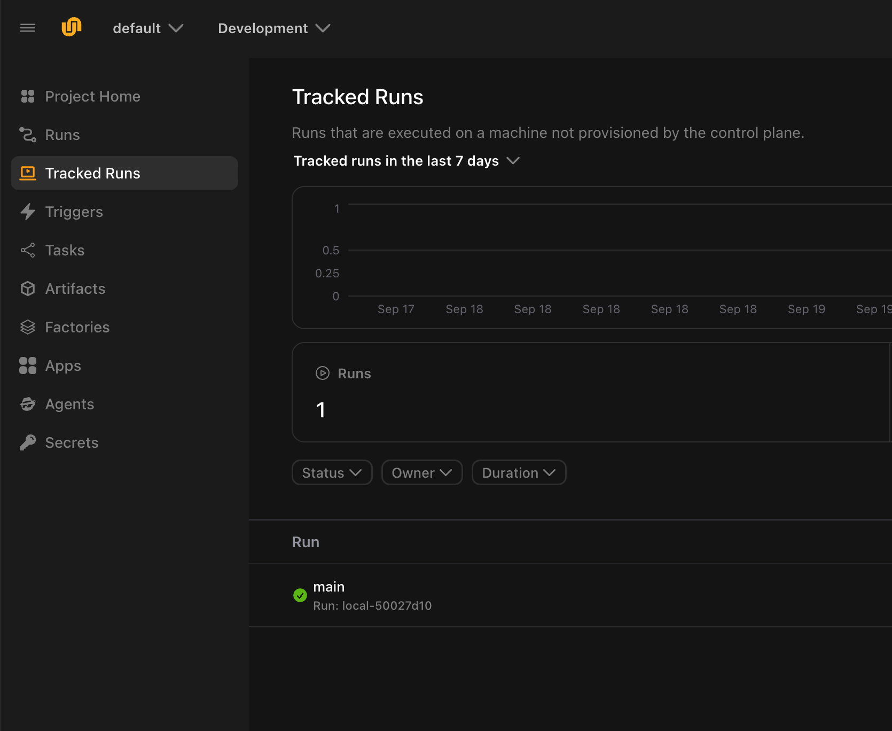
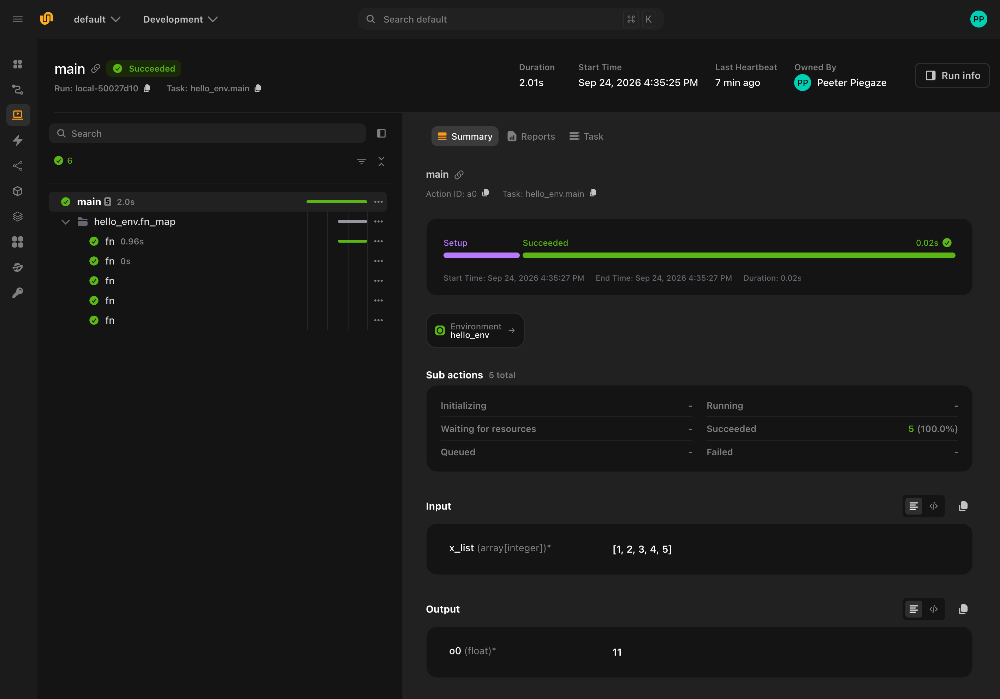

# Run your first workflow locally

Your Union.ai account can display locally run workflows before you connect any cloud infrastructure. A workflow you run with `--tracked` executes on your own machine and reports its progress to Union.ai as it goes, so you can see how Union.ai works before you create a cluster.

## What you'll need

- A Union.ai organization. See [Sign up for Union.ai](./sign-up).
- Your organization's address, in the form `<your-org>.hosted.unionai.cloud`. It is in your browser's address bar when you are signed in to the Union.ai UI.
- Python 3.10+ in a virtual environment.

## Set up the CLI

Install the Flyte SDK, which includes the `flyte` command:

```bash
pip install flyte
```

Create a configuration file that points the CLI at your organization. Replace the endpoint with your organization's address:

```bash
flyte create config \
    --endpoint <your-org>.hosted.unionai.cloud \
    --domain development \
    --project default \
    --builder remote
```

This writes `.flyte/config.yaml` in the current directory. The first command that contacts your organization opens a browser window so you can sign in; after that, the CLI remembers you.

## Create and run your own workflow

Save this file as `hello.py`:

```python
import flyte

env = flyte.TaskEnvironment(name="hello_env")

@env.task
def fn(x: int) -> int:
    slope, intercept = 2, 5
    return slope * x + intercept

@env.task
def main(x_list: list[int] = [1, 2, 3, 4, 5]) -> float:
    y_list = list(flyte.map(fn, x_list))
    return sum(y_list) / len(y_list)
```

Run it with:

```bash
flyte run --tracked hello.py main
```

The `--tracked` flag runs the workflow on your machine and reports its progress to your organization as it goes.

The example fans a small computation out over a list of inputs with `flyte.map` and averages the results. The path Union.ai prints is the run's page in the UI.

## See your run in the UI

Open the path printed in your terminal. Or, from your organization's home page, select **Projects**, open the **default** project, and select **Tracked Runs**. Tracked runs have their own section, separate from **Runs**, which shows runs that executed on a cluster.



Select **main** to see the run itself:



The run page shows:

- The run and each of its actions, with status and timing. The example has one parent action and five child actions, one per input.
- The environment the task belongs to.
- Under **Summary**, the inputs the run received and the outputs it produced.

Everything you see here came from a run on your own machine. Union.ai recorded it as it happened.

## Next steps

When you want to start running your workflows on your AWS infrastructure, proceed with:

- **[Provision your AWS resources](./aws-infrastructure)**. Optional if you already have AWS resources that meet the requirements.
- **[Connect your cluster](./connect-a-cluster)**.

Before that, two things you can do without a cluster are:

- **Try running more code the same way.** Write a workflow following the [Quickstart](../../user-guide/get-started/quickstart). See [Track local runs in the console](../../user-guide/get-started/run-modes/running-locally#track-local-runs-in-the-console) for what tracking does and does not report.
- **Learn the concepts.** [Core concepts](../../user-guide/get-started/core-concepts/_index) explains tasks, environments, projects, and runs.
