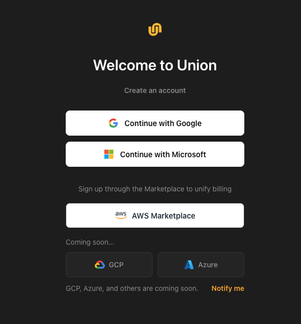
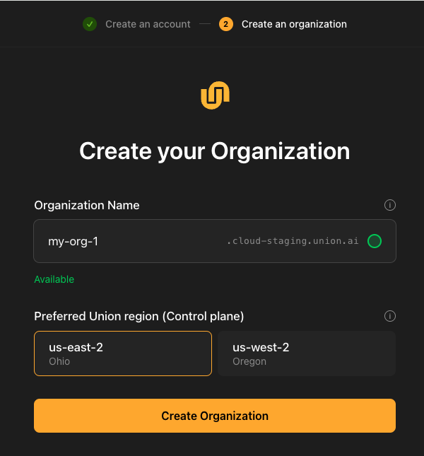
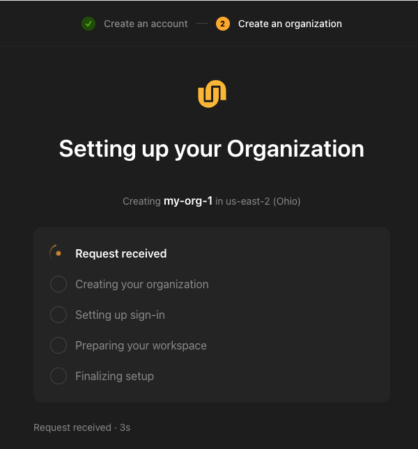
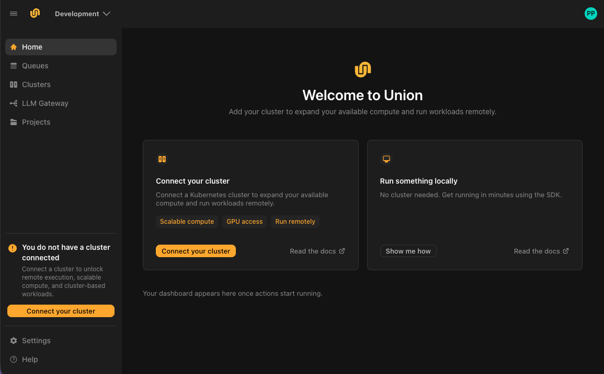
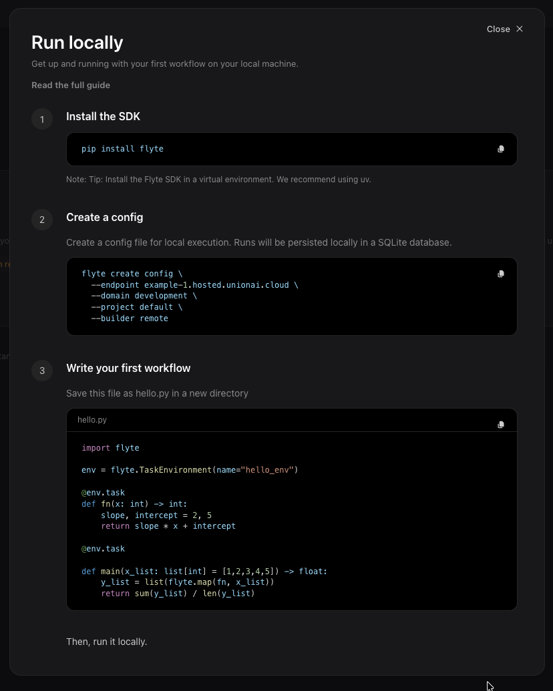

# Sign up to Union.ai

Here you create your account and an organization. Your organization is your workspace in Union.ai. It holds your projects, workflows, resources and team members, and everything you do afterward happens inside it.

Once it exists, you can [run a workflow on your own machine](./run-locally) and follow it in the Union.ai UI, so you can see how Union.ai works before connecting any infrastructure.

## What you'll need

A Google or Microsoft account for work. Union.ai sign-up is currently only available through these identity providers.

## Create your account

Go to [signup.hosted.unionai.cloud](https://signup.hosted.unionai.cloud) and select **Continue with Google** or **Continue with Microsoft**. Choose the account you want to use for Union.ai.

> [!NOTE] Subscribed through AWS Marketplace?
> Your organization needs to be associated with a subscription. If you do not yet have a subscription to Union.ai, just click go to the [**AWS Marketplace**](./aws-marketplace) button and go there first. You will rejoin this step after you complete the subscription.

## Create your organization

The organization is the top-level workspace in Union.ai. It is where your projects, workflows, resources, and team members live.

1. **Organization name.** This becomes your organization's web address, so it must be unique across Union.ai, and it cannot be changed later. Use lowercase letters, digits, and hyphens. As you type, Union.ai checks whether the name is available.

   

2. **Preferred Union region.** This is where your control plane runs. The control plane is the Union.ai service that manages your workflows, metadata, and user interface. You should choose the region closest to where you plan to install your data plane.

3. Select **Create Organization**.

Union.ai sets up your organization in about thirty seconds. You'll see each step complete: receiving the request, creating the organization, setting up sign-in, preparing your workspace, and finalizing.

## Sign in to your organization

When setup finishes, Union.ai takes you to your organization's home page. Your organization's address, in the form `<your-org>.hosted.unionai.cloud`, is in your browser's address bar. You'll need it when you [set up the CLI](./run-locally#set-up-the-cli).

## Choose how to start

The home page offers two ways to start:

- **Run something locally.**
- **Connect your cluster.**

The local route works straight away. You can connect a cluster at any time.

### Run something locally

Select **Show me how** on the **Run something locally** card for a short in-app guide: install the SDK, create a config file that points at your organization, and write a first workflow.

[Run your first workflow locally](./run-locally) covers the same steps as the in-product guide.

###  Provision and connect

When you are ready to start running workflows in your AWS infrastructure, proceed to the following steps:

- **[Provision your AWS resources](./aws-infrastructure)**.
- **[Connect your cluster](./connect-a-cluster)**, when you want Union.ai to run your workloads on your own infrastructure.
