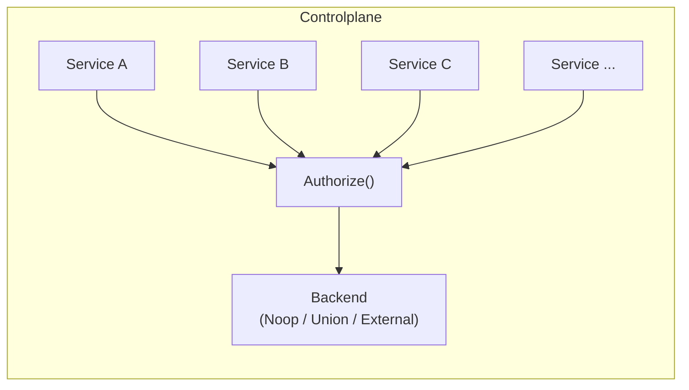

# Authorization

 self-hosted deployments support configurable authorization backends to control who can perform which actions on platform resources. The authorization mode determines how access control decisions are made for API requests from the console, CLI, and SDK.

Unlike other deployment models where  manages RBAC for you, **self-hosted deployments let you choose the authorization model** that fits your organization's security requirements.

## Prerequisites

Authorization builds on top of [authentication](). Before configuring authorization, ensure:

1. **Authentication is configured and working** — all five OAuth2 applications are created and the control plane is accepting authenticated requests.
2. **Custom claims are configured on your authorization server:**

| Claim | Values | Required for | Used for |
|-------|--------|-------------|----------|
| `sub` | User's internal ID or app's client ID | All modes | Primary identity for authorization decisions |
| `identitytype` | `"user"` or `"app"` | Union mode | Distinguishes human users from service accounts. Not strictly required for External mode — your external server can determine identity type from the `sub` claim or JWT payload directly. |
| `preferred_username` | User login or app client ID | All modes | Identity injection ("Owned By" display in the console) |

3. **You understand which OAuth apps generate which identity types:**

| OAuth App | # | Token `sub` claim | Identity type | Purpose in authorization |
|-----------|---|-------------------|---------------|--------------------------|
| Browser login | 1 | User's internal ID | `user` | End-user console/UI actions |
| CLI | 2 | User's internal ID (interactive) or app's client ID (service credentials) | `user` or `app` | End-user or automated CLI actions |
| Service-to-service | 3 | App's client ID | `app` | Internal platform calls |
| Operator | 4 | App's client ID | `app` | Dataplane → controlplane operations |
| EAGER | 5 | App's client ID | `app` | Task pod operations on behalf of users |

> [!NOTE]
> Apps 3–5 are internal platform service accounts. Your external authorization server must grant them appropriate permissions for the platform to function. See [Service account permissions](#service-account-permissions) below.

## Architecture

All controlplane services route authorization decisions through a centralized authorization component that delegates to the configured backend:



Each controlplane service forwards `Authorize()` calls and the configured backend returns allow/deny decisions.

## Authorization modes

 supports three authorization modes:

| Mode | Backend | Best for | Enforcement | Configuration |
|------|---------|----------|-------------|---------------|
| **Noop** | None | Development, small teams | All requests allowed | Default, no config needed |
| **Union** |  RBAC | Production deployments | -managed policies | Built-in, enable via config |
| **External** | Customer-provided gRPC server | Organizations with existing RBAC systems | Customer-defined policies | Requires external server |

### Noop (default)

No authorization enforcement — all authenticated requests are allowed. This is the default mode.

**When to use:**
- Development and testing environments
- Small teams where all users are trusted
- Initial deployment before configuring authorization
- Environments where authentication alone provides sufficient access control

**Trade-offs:**
- No access control beyond authentication
- Any authenticated user can perform any action on any resource
- No audit trail of authorization decisions

### Union (built-in RBAC) — recommended

's built-in authorization engine, **embedded in the controlplane Helm chart**. It deploys automatically when enabled, with no separate chart installation required. Provides role-based access control with predefined roles (Admin, Contributor, Viewer) and policy-based fine-grained permissions.

> [!NOTE]
> The Helm config value `type: "UserClouds"` is a legacy name from an earlier implementation. It activates 's built-in authorization engine. This will be renamed to `type: "Union"` in a future release.

**When to use:**
- Production deployments wanting out-of-the-box RBAC with no additional infrastructure
- Organizations that need role management through the  console
- Teams wanting a performant, battle-tested authorization backend with low operational burden

**Trade-offs:**
- Built-in role management (Admin, Contributor, Viewer) with full RBAC — assign users and groups to roles with resource-level granularity
- Zero additional infrastructure — embedded in the controlplane chart, managed by 
- Uses the controlplane database for policy storage — no separate database required
- This is the same authorization engine used by 's managed deployments

### External

Delegates authorization decisions to a customer-provided gRPC server. The external server receives the caller's identity, the requested action, and the target resource, and returns an allow/deny decision.

> [!WARNING]
> The external authorization server is called on **every API request**. Its latency directly impacts platform response times. Ensure your server can handle the request volume with low latency (<10ms p99 recommended).

**When to use:**
- Organizations with existing RBAC/policy engines (e.g. OPA, Cedar, custom systems) where a sync with 's native authorization is undesirable or not possible
- Enterprises requiring authorization integration with internal identity management
- Deployments needing custom authorization logic beyond role-based access

**Trade-offs:**
- Full control over authorization policies and logic
- Requires building, deploying, and operating an external authorization server
- The external server is on the critical path — its reliability and performance directly impact platform availability
- Higher operational burden than Union mode — you own the server's uptime, scaling, and policy management
-  owns the authorization routing layer; the customer owns the external backend

> [!NOTE]
> A **fail-open** option (`failOpen: true`) allows requests when the external server is unreachable. This trades security for availability — use with caution in production.

## Configuration

Authorization mode is set in the controlplane Helm values. Contact  support for the specific values for your deployment — the exact Helm paths depend on the deployment topology. The key configuration fields are:

- **`type`** — `"Noop"` (default), `"UserClouds"` (Union built-in RBAC), or `"External"` (customer-provided server)
- **`externalClient.grpcConfig.host`** — gRPC target for your external server (External mode only). Uses standard gRPC name resolution (`dns:///`, `unix:///`, etc.)
- **`externalClient.grpcConfig.insecure`** — `true` for plaintext, `false` for TLS
- **`externalClient.failOpen`** — `true` to allow requests when the external server is unreachable (default: `false`)

## External authorization server contract

This section applies only to **External** mode and defines what your authorization server must implement.

### gRPC contract

Your server must implement the `AuthorizerService.Authorize` unary RPC:

```protobuf
service AuthorizerService {
  rpc Authorize(AuthorizeRequest) returns (AuthorizeResponse);
}
```

**Request fields:**

| Field | Type | Description |
|-------|------|-------------|
| `identity` | `Identity` | The caller — an `external_identity` containing the subject string and the raw OIDC token (when available) |
| `action` | `Action` enum | The operation being requested |
| `resource` | `Resource` | The target resource (organization, domain, project, or cluster) |
| `organization` | `string` | The organization identifier |

**Response:**

| Field | Type | Description |
|-------|------|-------------|
| `allowed` | `bool` | `true` to allow the request, `false` to deny |

### Identity resolution

The caller's identity is resolved and forwarded to your server through two channels:

1. **`AuthorizeRequest.identity` protobuf field** (recommended) — always an `external_identity` containing:
   - `subject`: the caller's identity (resolved from `X-User-Subject` for browser/CLI requests, or from the JWT `sub` claim for service-to-service requests)
   - `token`: the raw OIDC/JWT token (when available)

   This provides a consistent interface regardless of how the caller authenticated.

2. **gRPC metadata headers** — the raw JWT/OIDC token is forwarded to your server in the `authorization` metadata header (as `Bearer <token>`). Your server can decode the JWT payload to read claims (`sub`, `identitytype`, `email`, `groups`, etc.) without signature verification — the token has already been validated upstream by the platform.

> [!NOTE]
> **Token availability by auth flow:**
> - **SDK/CLI (PKCE):** The token arrives via the `authorization` header and is available in both the protobuf `identity.token` field and forwarded metadata.
> - **Browser (cookie-based):** The token is extracted from the encrypted session cookie by the `/me` auth subrequest and forwarded via the `X-User-Token` header. The authorizer normalizes it to the standard `authorization` header before calling the external server, so your server sees a consistent interface on all paths.
> - **Service-to-service:** The token arrives via the `authorization` or `flyte-authorization` header.

### Actions

Your server must handle the following authorization actions:

| Action | Description | Typical callers |
|--------|-------------|-----------------|
| `ACTION_VIEW_FLYTE_INVENTORY` | View workflows, tasks, launch plans | All users and services |
| `ACTION_VIEW_FLYTE_EXECUTIONS` | View executions and run details | All users and services |
| `ACTION_REGISTER_FLYTE_INVENTORY` | Register workflows, tasks, launch plans | Contributors, operators, EAGER |
| `ACTION_CREATE_FLYTE_EXECUTIONS` | Launch executions | Contributors, operators, EAGER |
| `ACTION_ADMINISTER_PROJECT` | Manage project settings | Admins |
| `ACTION_MANAGE_PERMISSIONS` | Manage user roles and policies | Admins |
| `ACTION_ADMINISTER_ACCOUNT` | Account-level administration | Admins |
| `ACTION_MANAGE_CLUSTER` | Cluster lifecycle operations | Operators (App 4) |
| `ACTION_EDIT_EXECUTION_RELATED_ATTRIBUTES` | Modify execution attributes | Contributors, operators |
| `ACTION_EDIT_CLUSTER_RELATED_ATTRIBUTES` | Modify cluster attributes | Operators |
| `ACTION_EDIT_UNUSED_ATTRIBUTES` | Modify other attributes | Contributors |
| `ACTION_SUPPORT_SYSTEM_LOGS` | Access system logs | Admins |
| `ACTION_VIEW_IDENTITIES` | View user/app identities | Admins |

### Service account permissions

Your external authorization server must grant appropriate permissions to the internal platform service accounts (OAuth Apps 3–5 from [Authentication]()). Without these, internal platform operations will fail.

| OAuth App | # | Subject (`sub` claim) | Required permissions |
|-----------|---|----------------------|----------------------|
| Service-to-service | 3 | `INTERNAL_CLIENT_ID` value | All actions listed above (this is the internal platform identity) |
| Operator | 4 | `AUTH_CLIENT_ID` value | `MANAGE_CLUSTER`, `VIEW_FLYTE_INVENTORY`, `VIEW_FLYTE_EXECUTIONS`, `CREATE_FLYTE_EXECUTIONS` |
| EAGER | 5 | EAGER app client ID | `VIEW_FLYTE_INVENTORY`, `VIEW_FLYTE_EXECUTIONS`, `REGISTER_FLYTE_INVENTORY`, `CREATE_FLYTE_EXECUTIONS`, `EDIT_EXECUTION_RELATED_ATTRIBUTES`, `EDIT_CLUSTER_RELATED_ATTRIBUTES` |

> [!WARNING]
> If the operator service account (App 4) is not granted `MANAGE_CLUSTER`, the dataplane will be unable to register with the controlplane or send heartbeats. If the EAGER service account (App 5) is not granted execution permissions, task pods will fail to launch child tasks or register workflow artifacts.

**Example:** If your external server uses a static subject-to-role mapping, the configuration might look like:

```yaml
subjects:
  # Human users
  "user@example.com": Admin

  # Internal platform service accounts — use the OAuth app client IDs
  # from your identity provider. These are the same client IDs configured
  # in the authentication step.
  "<INTERNAL_CLIENT_ID>": PlatformAdmin      # App 3: internal platform identity
  "<AUTH_CLIENT_ID>": ClusterOperator         # App 4: dataplane operator
  "<EAGER_CLIENT_ID>": RuntimeService         # App 5: task execution
```

Your implementation may use different role names or a different permission model entirely — the requirement is that these subjects are granted the listed actions.

### Configuring service accounts

The three internal OAuth apps must be registered in your external server's permission mapping. Their `sub` claims are the OAuth **client IDs** from your identity provider — the same values configured during [authentication setup]().

To find the client IDs for your deployment, check the controlplane Helm values:

| OAuth App | # | Helm global variable | Role / permissions needed |
|-----------|---|---------------------|---------------------------|
| Service-to-service | 3 | `INTERNAL_CLIENT_ID` | All actions (platform admin) |
| Operator | 4 | `AUTH_CLIENT_ID` | `MANAGE_CLUSTER`, `VIEW_FLYTE_INVENTORY`, `VIEW_FLYTE_EXECUTIONS`, `CREATE_FLYTE_EXECUTIONS` |
| EAGER | 5 | (EAGER app client ID) | `VIEW_FLYTE_INVENTORY`, `VIEW_FLYTE_EXECUTIONS`, `REGISTER_FLYTE_INVENTORY`, `CREATE_FLYTE_EXECUTIONS`, `EDIT_EXECUTION_RELATED_ATTRIBUTES`, `EDIT_CLUSTER_RELATED_ATTRIBUTES` |

> [!WARNING]
> If the operator service account (App 4) is not granted `MANAGE_CLUSTER`, the dataplane will be unable to register with the controlplane or send heartbeats. If the EAGER service account (App 5) is not granted execution permissions, task pods will fail to launch child tasks or register workflow artifacts.

### Reference implementation

The following is a complete Python example of an external authorization server. It uses a static YAML config to map subjects to roles, and roles to permitted actions.

**config.yaml** — subject-to-role mapping:

```yaml
port: 50051

subjects:
  # Human users — map by the 'sub' claim from your identity provider
  "user@example.com": Admin
  "developer@example.com": Develop

  # Internal platform service accounts — REQUIRED for platform operation.
  # Use the OAuth app client IDs from your identity provider (the same
  # values configured in authentication setup).
  "<INTERNAL_CLIENT_ID>": Admin             # App 3: service-to-service
  "<AUTH_CLIENT_ID>": _ClusterManager       # App 4: dataplane operator
  "<EAGER_CLIENT_ID>": _RuntimeService      # App 5: task execution

  # Default role for unknown subjects (optional — omit to deny unknowns)
  # "*": Report
```

**server.py** — extracting identity, token, and request fields:

```python
#!/usr/bin/env python3
"""Example: extracting identity and token from Union's Authorize() RPC."""

import base64
import json
import logging
from concurrent import futures

import grpc

from gen.authorizer import authorizer_pb2_grpc, payload_pb2
from gen.common import authorization_pb2

log = logging.getLogger("authz")

# Action enum → name for logging
ACTION_NAMES = {
    v.number: v.name
    for v in authorization_pb2.DESCRIPTOR.enum_types_by_name["Action"].values
    if v.number != 0
}


def decode_jwt_payload(token: str) -> dict | None:
    """Base64-decode the JWT payload (no signature verification needed —
    the token is pre-validated by the platform)."""
    parts = token.split(".")
    if len(parts) != 3:
        return None
    payload = parts[1] + "=" * ((-len(parts[1])) % 4)
    return json.loads(base64.urlsafe_b64decode(payload))


class AuthorizerServicer(authorizer_pb2_grpc.AuthorizerServiceServicer):

    def Authorize(self, request, context):
        # --- 1. Extract identity from the proto request (recommended) ---
        # The platform always sends ExternalIdentity with subject + token.
        subject = ""
        token = None
        identity = request.identity
        if identity.HasField("external_identity"):
            subject = identity.external_identity.subject
            token = identity.external_identity.token or None

        # --- 2. Extract token from gRPC metadata (alternative) ---
        # The raw JWT is also forwarded in the "authorization" metadata header.
        # Use whichever source fits your architecture.
        metadata = dict(context.invocation_metadata())
        auth_header = metadata.get("authorization", "")
        if auth_header.lower().startswith("bearer ") and not token:
            token = auth_header[7:]

        # --- 3. Decode JWT claims ---
        # The token is pre-validated upstream. Decode to read claims like
        # sub, identitytype, email, groups, preferred_username, iss, aud, exp.
        claims = decode_jwt_payload(token) if token else None

        # --- 4. Extract the action and resource ---
        action = request.action
        action_name = ACTION_NAMES.get(action, str(action))
        organization = request.organization

        # Resource is a oneof: project, domain, organization, or cluster
        resource = request.resource
        resource_desc = ""
        if resource.HasField("project"):
            p = resource.project
            domain = p.domain.name if p.HasField("domain") else "?"
            resource_desc = f"{organization}/{domain}/{p.name}"
        elif resource.HasField("domain"):
            resource_desc = f"{organization}/{resource.domain.name}"
        elif resource.HasField("cluster"):
            resource_desc = f"{organization}/{resource.cluster.name}"
        else:
            resource_desc = organization

        # --- 5. Log what was received ---
        log.info("subject=%s action=%s resource=%s", subject, action_name, resource_desc)
        if claims:
            log.info(
                "  JWT: sub=%s type=%s iss=%s exp=%s",
                claims.get("sub"), claims.get("identitytype"),
                claims.get("iss"), claims.get("exp"),
            )

        # --- 6. Make your authorization decision ---
        # Replace this with your own authorization logic (OPA, Cedar,
        # internal RBAC, policy engine, etc.)
        allowed = True  # TODO: implement your authorization logic

        return payload_pb2.AuthorizeResponse(allowed=allowed)


if __name__ == "__main__":
    logging.basicConfig(level=logging.INFO, format="%(asctime)s %(levelname)s %(message)s")
    server = grpc.server(futures.ThreadPoolExecutor(max_workers=4))
    authorizer_pb2_grpc.add_AuthorizerServiceServicer_to_server(
        AuthorizerServicer(), server
    )
    server.add_insecure_port("[::]:50051")
    server.start()
    log.info("External AuthZ server listening on port 50051")
    server.wait_for_termination()
```

**Proto definitions:** The server requires generated Python code from Union's authorization protobuf definitions. Contact  support for access to the `.proto` files, or use [buf](https://buf.build) to generate them:

```shell
pip install grpcio grpcio-tools protobuf pyyaml
buf generate  # using buf.gen.yaml pointing to Union's IDL
python server.py --config config.yaml
```

> [!NOTE]
> This reference implementation is intended for testing and development. Production implementations should integrate with your organization's identity and policy management systems.

## Observability

The controlplane exposes Prometheus metrics for monitoring authorization decisions and backend health. These are included in the controlplane Grafana dashboard under the **Authorizer** row.

### Key metrics

| Metric | Type | Description |
|--------|------|-------------|
| `authz_allowed{action}` | Counter | Allowed decisions by action type |
| `authz_denied{action}` | Counter | Denied decisions by action type |
| `authorize_duration` | Histogram | End-to-end Authorize() latency |
| `authorize_errors_total{error_source}` | Counter | Errors by source (backend, identity_resolution) |
| `authz_type_info{type}` | Gauge | Active authorization mode |
| `external:errors{grpc_code}` | Counter | External backend errors by gRPC status code |
| `external:authorize_duration` | Histogram | External backend call latency |
| `external:fail_open_activated` | Counter | Fail-open bypass events |
| `external:connection_state` | Gauge | gRPC connection state to external backend |

### Alerts

When [alerting is enabled](), the following authorization-specific alerts are available:

| Alert | Severity | Condition |
|-------|----------|-----------|
| `UnionCPAuthorizerExternalErrors` | Warning | External backend errors >0.1/s for 5 minutes |
| `UnionCPAuthorizerFailOpenActive` | Critical | Fail-open is actively bypassing authorization |
| `UnionCPAuthorizerHighDenyRate` | Warning | Authorization deny rate exceeds 50% for 10 minutes |

## Verification

After configuring authorization, verify it's working:

1. **Check the authorization component is running:**

```shell
kubectl get pods -n <controlplane-namespace> -l app.kubernetes.io/name=authorizer
```

2. **Verify the authorization mode in logs:**

```shell
kubectl logs -n <controlplane-namespace> deployment/authorizer | grep "Authz client config"
# Expected: Authz client config: type=External (or Noop, UserClouds)
```

3. **For External mode, verify connectivity:**

```shell
kubectl logs -n <controlplane-namespace> deployment/authorizer | grep "external authorization"
# Expected: Initializing an external authorization proxy service with endpoint ...
```

4. **Verify from the console:** Navigate to the  console and confirm you can view projects and runs without errors.

5. **Verify from the CLI:** Trigger a workflow execution to confirm the non-browser flow works:

```shell
uctl get project
uctl create execution --project <project> --domain development --launch-plan <launch-plan>
```

6. **For External mode, verify service account access:** Monitor the external server logs for requests from the internal platform service accounts (Apps 3, 4, 5). Ensure all are receiving `ALLOWED` decisions.

## Troubleshooting

### All requests denied

- **Check service account mappings** — the most common cause is that the internal platform service accounts (Apps 3, 4, 5) are not granted permissions in the external server. Check the external server logs for `DENIED` decisions with service account subjects.
- Check that the external authorization server is running and reachable
- Verify the `grpcConfig.host` endpoint is correct (use `dns:///` prefix for DNS-based resolution)
- Temporarily set `failOpen: true` to confirm the issue is with the external backend

### Dataplane cannot register or heartbeat

The operator (App 4) needs `ACTION_MANAGE_CLUSTER` permission. Check:

```shell
kubectl logs -n <controlplane-namespace> deployment/authorizer | grep "MANAGE_CLUSTER"
```

If you see denied decisions for the operator's client ID, add it to your external server's permission configuration.

### Workflows fail to launch child tasks

The EAGER service account (App 5) needs `ACTION_CREATE_FLYTE_EXECUTIONS` and `ACTION_REGISTER_FLYTE_INVENTORY`. Check:

```shell
kubectl logs -n <controlplane-namespace> deployment/authorizer | grep "<EAGER_CLIENT_ID>"
```

### "Owned By: Unknown" in the console

The `preferred_username` claim is not configured in your identity provider. See [Authentication — Authorization server setup]().

### Authorization component crashlooping

- Check logs: `kubectl logs -n <controlplane-namespace> deployment/authorizer`
- Verify the `type` field is a valid value (`Noop`, `External`, or `UserClouds` for Union RBAC)
- Ensure the `externalClient.grpcConfig.host` is set when using `External` mode

### High latency on API calls

- Check `external:authorize_duration` metrics in the Grafana dashboard
- The authorization backend is on the critical path — external backend latency directly impacts API response times
- Consider reducing `perRetryTimeout` or setting `maxRetries: 0` for fail-fast behavior

### Connection errors to external backend

- Check `external:errors{grpc_code}` metrics for the failure mode:
  - `Unavailable`: Network connectivity issue — verify the service endpoint and port
  - `DeadlineExceeded`: Timeout — the external server is too slow to respond
  - `Internal`/`Unknown`: Application error in the external server
- Use `insecure: true` for plaintext connections within the cluster
- Use `insecureSkipVerify: true` only for testing with self-signed certificates
