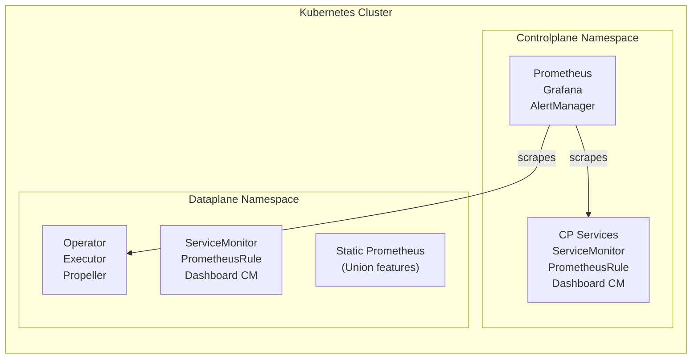
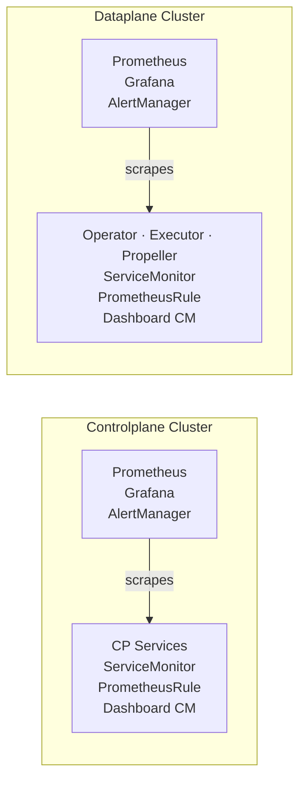

# Monitoring

 provides built-in monitoring with Prometheus, Grafana dashboards, alerting rules, and SLO tracking. The monitoring stack is deployed and configured through the Helm charts.

## Architecture

### Self-hosted intra-cluster

In a self-hosted deployment, the controlplane and dataplane share a single Kubernetes cluster. The controlplane namespace runs Prometheus, Grafana, and AlertManager. Prometheus scrapes metrics from services in both namespaces.



### Separate controlplane and dataplane clusters

When the controlplane and dataplane run in separate clusters, each cluster can run its own monitoring stack independently. The dataplane chart includes the same Prometheus, Grafana, and alerting capabilities.



## Dashboards

 ships two pre-built Grafana dashboards delivered as ConfigMaps. They are defined in the Helm charts:

- [controlplane chart](https://github.com/unionai/helm-charts/tree/main/charts/controlplane) — `union-controlplane-overview`
- [dataplane chart](https://github.com/unionai/helm-charts/tree/main/charts/dataplane) — `union-dataplane-overview`

### Controlplane Overview

| Row            | What it shows                                                                 |
| -------------- | ----------------------------------------------------------------------------- |
| SLOs           | Service availability, error budget, ingress success rate, ingress latency p99 |
| Health         | Service availability, pod restarts, handler panics, Connect error rate        |
| Ingress        | Request rate by path, error rate, latency percentiles, active connections     |
| Connect / gRPC | Per-service request rate and errors, CacheService gRPC                        |
| FlyteAdmin     | Active executions, event rates, endpoint latency, auth decisions              |
| Executions     | Execution lifecycle, assignment duration, workqueue operations                |
| Queue          | Scheduler throughput, queue lengths, dispatcher operations, worker capacity   |
| Cluster        | Heartbeat rate, cluster health, managed cluster cache                         |
| CacheService   | Cache hit/miss rate, reservation contention                                   |
| Authorizer     | Allow/deny rate, authorize latency                                            |
| Data Proxy     | Cache rates, image read latency, secret proxy errors                          |
| Usage          | Billable usage reports, message pipeline                                      |
| Infrastructure | CPU, memory, and pod restarts by service                                      |

### Dataplane Overview

| Row            | What it shows                                                                     |
| -------------- | --------------------------------------------------------------------------------- |
| SLOs           | Service availability, error budget, execution success rate, propeller latency p99 |
| Health         | Service availability, pod restarts, handler panics, active workflows              |
| Union Operator | Work queue operations, heartbeat latency, config sync, billing                    |
| Executor (V2)  | Active actions, capacity, evaluator latency, system failures                      |
| Propeller (V1) | Round time, success/error rate, workflow updates, event recording                 |
| gRPC Client    | DP→CP request rate, errors, latency                                              |
| Infrastructure | CPU, memory, and pod restarts by service                                          |

### Adding custom dashboards

Create a ConfigMap with the `grafana_dashboard` label in any namespace. The Grafana sidecar discovers it automatically:

```yaml
apiVersion: v1
kind: ConfigMap
metadata:
  name: my-custom-dashboard
  labels:
    grafana_dashboard: "1"
data:
  my-dashboard.json: |
    { ... Grafana dashboard JSON ... }
```

## Service Level Objectives (SLOs)

The SLO row at the top of each dashboard provides at-a-glance visibility into platform health. These panels are always visible — no configuration needed.

### What the SLOs measure

| SLO                            | What it represents                                                                                                                                                                                                 | Controlplane                                                                             | Dataplane                                                                                  |
| ------------------------------ | ------------------------------------------------------------------------------------------------------------------------------------------------------------------------------------------------------------------ | ---------------------------------------------------------------------------------------- | ------------------------------------------------------------------------------------------ |
| **Service Availability** | Are all deployments running their desired replica count? Measures infrastructure health — pods that are down, crashlooping, or pending reduce this metric.                                                        | Deployment availability across all CP services                                           | Deployment availability across all DP services                                             |
| **Success Rate**         | Are API requests and task executions completing without errors? This is the primary indicator of whether the platform is functioning correctly for users.                                                          | Ingress success rate (non-5xx responses) — measures what SDK and API callers experience | Execution success rate (combined V1 propeller round success + V2 executor task completion) |
| **Latency**              | Are requests being served within acceptable time? High latency degrades user experience even when success rate is high.                                                                                            | Ingress p99 latency — the worst-case response time callers experience                   | Propeller round p99 — the worst-case time to process one workflow reconciliation          |
| **Error Budget**         | How much room is left before the availability target is breached? Derived from the success rate and the configured availability target (default 99.9%). When the budget reaches zero, reliability is below target. | Based on ingress success rate vs target                                                  | Based on execution success rate vs target                                                  |

### Enabling SLO recording rules

The SLO dashboard panels show basic metrics by default. For error budget tracking, enable the SLO recording rules:

```yaml
monitoring:
  slos:
    enabled: true
    targets:
      availability: 0.999   # 99.9% — adjust to your requirements
      latencyP99: 5         # seconds — adjust to your requirements
```

The recording rules pre-compute success rates and error budget remaining as Prometheus metrics. These are recommended starting points — tune the targets based on your traffic patterns and performance baseline.

## Alerting

 includes two layers of alerting that you can enable independently.

### Operational alerts

Operational alerts detect basic infrastructure failures — services that are down, containers that are crashlooping, or code panics. Enable them in your values:

```yaml
monitoring:
  alerting:
    enabled: true
```

| Alert           | Severity | Fires when                                        |
| --------------- | -------- | ------------------------------------------------- |
| ServiceDown     | critical | Any deployment has 0 available replicas for 5 min |
| HighRestartRate | warning  | A container restarts more than 5 times in 1 hour  |
| HandlerPanic    | critical | Any service handler panic in the last hour        |

These alerts fire on both the controlplane and dataplane.

### SLO-based alerts

SLO alerts track error budget consumption and latency against configurable targets. These are provided as recommended starting points — adjust the targets and thresholds to match your operational requirements.

```yaml
monitoring:
  slos:
    enabled: true
    alerting:
      enabled: true
    targets:
      availability: 0.999   # 99.9% — adjust to your requirements
      latencyP99: 5         # seconds — adjust to your requirements
```

| Alert                | Severity | Fires when                              |
| -------------------- | -------- | --------------------------------------- |
| HighErrorBudgetBurn  | warning  | Error budget more than 50% consumed     |
| ErrorBudgetExhausted | critical | Error budget fully consumed             |
| LatencySLOBreach     | warning  | p99 latency exceeding target for 10 min |

> [!NOTE]
> The default SLO targets (99.9% availability, 5s p99 latency) are starting points. Every deployment has different traffic patterns and performance characteristics. Review the SLO dashboard panels after enabling to understand your baseline, then tune the targets to values that are meaningful for your environment.

### Configuring notifications

By default, alerts are evaluated and visible in Grafana but do not send notifications. To receive notifications when alerts fire:

1. Open Grafana at `https://<your-domain>/grafana`
2. Navigate to **Alerting → Contact points**
3. Click **Add contact point**
4. Select your notification channel (Slack, PagerDuty, email, etc.) and configure it
5. Under **Alerting → Notification policies**, route alerts to your contact point

Alternatively, configure AlertManager receivers directly in your Helm values:

```yaml
monitoring:
  alertmanager:
    config:
      route:
        receiver: my-slack
      receivers:
        - name: my-slack
          slack_configs:
            - api_url: "https://hooks.slack.com/services/..."
              channel: "#alerts"
```

## Configuration

### ServiceMonitors and PrometheusRules

 creates ServiceMonitors, PrometheusRules, and dashboard ConfigMaps independently of the kube-prometheus-stack subchart. These resources are controlled by their own flags:

```yaml
monitoring:
  # ServiceMonitor CRDs for Union services.
  # Discovered by any Prometheus Operator in the cluster.
  serviceMonitors:
    enabled: true

  # PrometheusRule CRDs with recording rules.
  # Alerting rules require monitoring.alerting.enabled.
  prometheusRules:
    enabled: true

  # Dashboard ConfigMaps discovered by Grafana sidecar.
  dashboards:
    enabled: true
    label: grafana_dashboard
    labelValue: "1"
```

These flags default to `true` and work regardless of whether `monitoring.enabled` is set. This is useful when you bring your own Prometheus or Grafana —  resources are created without deploying the full kube-prometheus-stack.

### Dashboard label configuration

If your Grafana sidecar uses a different label, configure it:

```yaml
monitoring:
  dashboards:
    label: my-custom-label
    labelValue: "true"
```

## Accessing Grafana

When the kube-prometheus-stack subchart is enabled (`monitoring.enabled: true`), Grafana is deployed in the controlplane namespace and served at:

```
https://<your-domain>/grafana
```

Authentication is handled by the same ingress auth gate as other controlplane services. No separate Grafana credentials are needed.

> [!NOTE]
> Grafana is part of the optional kube-prometheus-stack subchart. If you use your own Grafana instance, set `monitoring.grafana.enabled: false` and configure your Grafana to discover the dashboard ConfigMaps using the `grafana_dashboard` label.

## Customization

### Remote write

Forward metrics to an external time-series database (Amazon Managed Prometheus, Grafana Cloud, Thanos) while keeping the full local Prometheus:

```yaml
monitoring:
  prometheus:
    prometheusSpec:
      remoteWrite:
        - url: "https://aps-workspaces.<REGION>.amazonaws.com/workspaces/<ID>/api/v1/remote_write"
          sigv4:
            region: <REGION>
```

This runs Prometheus in fan-out mode — metrics are stored locally and forwarded to the remote backend. Recording rules, alerting, and Grafana all continue to work against the local Prometheus.

### Using your own Prometheus

If you already run Prometheus, scrape  services directly. All services expose metrics on port 10254 at `/metrics`.

#### ServiceMonitor

```yaml
apiVersion: monitoring.coreos.com/v1
kind: ServiceMonitor
metadata:
  name: union-services
spec:
  selector:
    matchLabels:
      platform.union.ai/prometheus-group: "union-services"
  namespaceSelector:
    matchNames:
      - controlplane
      - dataplane
  endpoints:
    - port: debug
      path: /metrics
      interval: 30s
```

#### Static scrape config

```yaml
scrape_configs:
  - job_name: union-services
    kubernetes_sd_configs:
      - role: endpoints
        namespaces:
          names: [controlplane, dataplane]
    relabel_configs:
      - source_labels: [__meta_kubernetes_service_label_platform_union_ai_prometheus_group]
        regex: union-services
        action: keep
      - source_labels: [__meta_kubernetes_endpoint_port_name]
        regex: debug
        action: keep
```

## Managed Prometheus examples

The following examples show how to replace the local Prometheus with a managed Prometheus service for durable storage and scalable query. In each case, Prometheus runs in **agent mode** — it only scrapes and forwards metrics, with no local TSDB.

### Amazon Managed Prometheus (AMP)

For AWS deployments where a single Prometheus instance may not scale with high-burst workloads, switch to PrometheusAgent mode with AMP as the backend.

```yaml
monitoring:
  prometheus:
    enabled: true
    agentMode: true
    serviceAccount:
      create: true
      annotations:
        eks.amazonaws.com/role-arn: "<PROMETHEUS_IRSA_ROLE_ARN>"
    prometheusSpec:
      remoteWrite:
        - url: "https://aps-workspaces.<REGION>.amazonaws.com/workspaces/<ID>/api/v1/remote_write"
          sigv4:
            region: <REGION>
          queueConfig:
            maxSamplesPerSend: 1000
            maxShards: 200
            capacity: 2500
  alertmanager:
    enabled: false
  grafana:
    sidecar:
      datasources:
        defaultDatasourceEnabled: false
    serviceAccount:
      create: true
      annotations:
        eks.amazonaws.com/role-arn: "<GRAFANA_IRSA_ROLE_ARN>"
    grafana.ini:
      auth:
        sigv4_auth_enabled: true
    additionalDataSources:
      - name: AMP
        type: prometheus
        url: "https://aps-workspaces.<REGION>.amazonaws.com/workspaces/<ID>/"
        access: proxy
        isDefault: true
        jsonData:
          sigV4Auth: true
          sigV4Region: <REGION>
          httpMethod: POST
```

This requires two IRSA roles:
- **Prometheus write**: `aps:RemoteWrite` permission on the AMP workspace
- **Grafana read**: `aps:QueryMetrics`, `aps:GetMetricMetadata`, `aps:GetSeries`, `aps:GetLabels` permissions on the AMP workspace

> [!NOTE]
> PrometheusAgent cannot evaluate recording or alerting rules. PrometheusRule CRDs are deployed but inert in agent mode. Dashboard panels that rely on raw metrics (Health, Ingress, Connect, Infrastructure rows) work normally. SLO panels that depend on recording rules (`union:cp:slo:*`, `union:dp:slo:*`) will show no data unless you configure [AMP Ruler](https://docs.aws.amazon.com/prometheus/latest/userguide/AMP-ruler.html) to evaluate those rules server-side. The PrometheusRule template files in the Helm charts (`templates/monitoring/prometheusrule.yaml`) contain the rule definitions in standard Prometheus format and can be uploaded directly to AMP Ruler.
