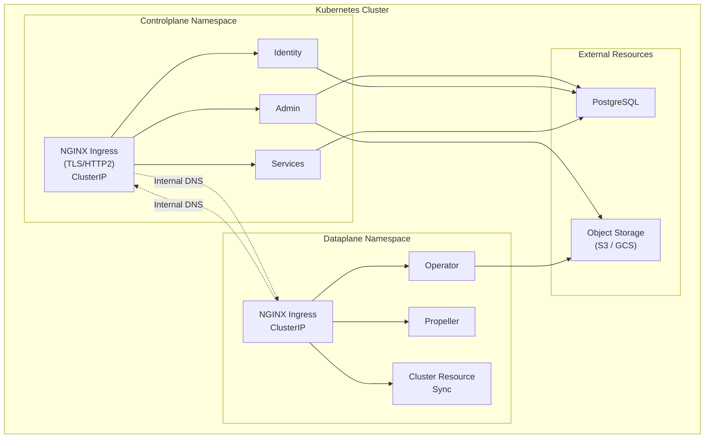

# Self-hosted deployment

In a self-hosted deployment, you host both the **control plane** and the **data plane** in the same Kubernetes cluster. This gives you complete control over your  installation with full data sovereignty.

> [!NOTE]
> Self-hosted deployment is distinct from [self-managed deployment](../selfmanaged/_index), where  hosts the control plane and you manage only the data plane.

## When to use self-hosted deployment

Choose self-hosted deployment when:

- You need full control over both control plane and data plane
- You have strict data locality or sovereignty requirements
- You want to minimize network egress costs
- You are running in an air-gapped or restricted network environment

Choose [self-managed deployment](../selfmanaged/_index) when:

- You want  to manage the control plane
- You need 's managed services and support
- Control plane and data plane are in separate clusters

## Architecture

In a self-hosted intra-cluster deployment, the control plane and data plane communicate using Kubernetes internal networking rather than external endpoints.

**Key characteristics:**

- **Simplified networking**: All communication stays within the cluster via Kubernetes DNS
- **No external dependencies**: No internet connectivity required for control plane to data plane communication
- **Cost-effective**: No network egress costs between control plane and data plane
- **Self-signed certificates**: Can use self-signed certificates for intra-cluster TLS
- **Single-tenant mode**: Simplified security model with explicit organization configuration

## Prerequisites

### Infrastructure

- **Kubernetes cluster** (>= 1.28.0) with sufficient resources for both control plane and data plane. Recommended: at least 6 nodes with 8 CPU / 16GB RAM each.
- **PostgreSQL database** (12+), either cloud-managed (RDS, Cloud SQL) or self-hosted.
- **Object storage** (S3 or GCS) for metadata and artifacts.
- **IAM roles** or **service accounts** configured for cloud resource access.

### Tools

- [Helm](https://helm.sh/docs/intro/install/) 3.18+
- `kubectl` configured to access your cluster
- `openssl` or `cert-manager` for TLS certificate generation

### Registry access

 control plane images are hosted in a private registry. You will receive registry credentials from the  team for your organization.

## Deployment guides

Deploy the control plane first, then the data plane.




Deploy the control plane with Amazon RDS and S3



Deploy the control plane with Cloud SQL and GCS



Deploy the data plane with S3 and IRSA



Deploy the data plane with GCS and Workload Identity



Configure OIDC/OAuth2 authentication for your deployment



Configure authorization mode (Noop, External, or Union built-in RBAC)



Register the image builder for automatic container image builds



