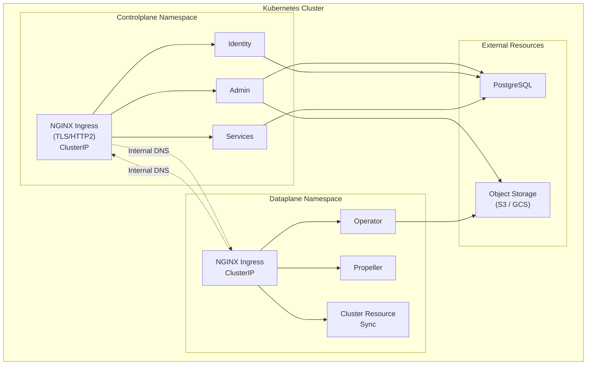

# Self-hosted deployment

In a self-hosted deployment, you host both the **control plane** and the **data plane**. You choose the topology that fits your operational and regulatory requirements — both planes in a single Kubernetes cluster, in separate clusters, in different regions, or any combination.  gives you complete control over the installation with full data sovereignty.

> [!NOTE]
> Self-hosted deployment is distinct from [self-managed deployment](../selfmanaged/_index), where  hosts the control plane and you manage only the data plane.

## When to use self-hosted deployment

Choose self-hosted deployment when:

- You need full control over both control plane and data plane
- You have strict data locality or sovereignty requirements
- You want to minimize network egress costs
- You are running in an air-gapped or restricted network environment
- You need to colocate the control plane with the data plane for latency, isolation, or regulatory reasons

Choose [self-managed deployment](../selfmanaged/_index) when:

- You want  to manage the control plane
- You need 's managed services and support

## Topologies

Self-hosted deployments support two topologies, distinguished by how the control plane and data plane are placed relative to each other:

- **Separate-cluster (default and recommended)** — control plane in one Kubernetes cluster, one or more data planes in separate clusters (often per environment, region, or business unit). Communication is via the control plane's external ingress; each data plane authenticates to the CP as a workload identity. Data planes may run on different cloud providers than the CP. This is the topology [Infrastructure requirements](./infrastructure-requirements) is written around.
- **Intra-cluster (special case)** — both planes in the same Kubernetes cluster, communicating over internal DNS. The simplest topology; used by the [Getting started](./getting-started) walkthrough and for footprint-constrained or evaluation deployments. The chart ships `values.{aws,gcp}.selfhosted-intracluster.yaml` for this case. See [Infrastructure requirements → Intra-cluster topology](./infrastructure-requirements#intra-cluster-topology) for the differences from separate-cluster.

The architecture diagram below shows the intra-cluster topology — the simplest layout to visualize. Separate-cluster uses the same chart components in different cluster boundaries.

## Architecture

In an intra-cluster deployment, the control plane and data plane communicate using Kubernetes internal networking rather than external endpoints.

**Key characteristics:**

- **Simplified networking**: All communication stays within the cluster via Kubernetes DNS
- **No external dependencies**: No internet connectivity required for control plane to data plane communication
- **Cost-effective**: No network egress costs between control plane and data plane
- **Self-signed certificates**: Can use self-signed certificates for intra-cluster TLS
- **Single-tenant mode**: Simplified security model with explicit organization configuration

## Deployment guides

Start with [Getting started](./getting-started) for an end-to-end walkthrough. Review [Infrastructure requirements](./infrastructure-requirements) before provisioning your cloud substrate. The remaining pages cover individual deployment components in depth.




End-to-end walkthrough: provision, install, configure, smoke test



What to provision — substrate, CP and DP sizing, scaling constraints, topology choice



Configure OIDC/OAuth2 authentication for your deployment



Configure authorization mode (Noop, External, or Union built-in RBAC)



Register the image builder for automatic container image builds



Operational guides: CI/CD integration, key rotation, and more



