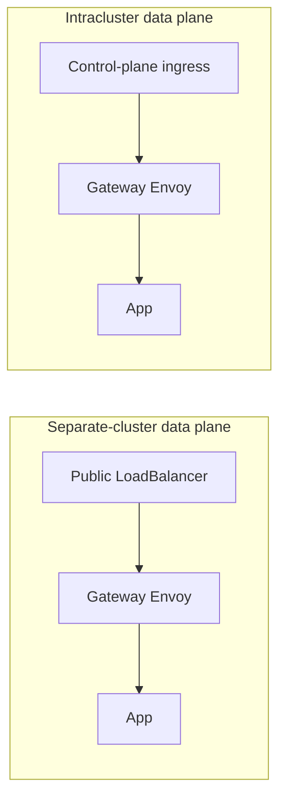

# App serving

App serving lets your data plane run long-lived applications — Streamlit dashboards, FastAPI services, and other custom apps — alongside batch tasks. In a self-hosted deployment the data plane chart ships a vendored serving stack (Knative Serving + Kourier + an Envoy gateway) that scales each app from zero, routes traffic to it, and enforces  authentication in front of it.

This page covers how app serving is exposed, the DNS and TLS it requires, and the Helm values that turn it on.

## How it works

When app serving is enabled, each deployed app becomes a Knative Service in the data plane. Requests reach it through the gateway Envoy:

1. A request for `https://<app>.apps.<cluster>.<control-plane-host>` arrives at the gateway.
2. Envoy authenticates the request against the control plane (`/me`). Unauthenticated browsers are redirected to `/login` on the control plane and returned to the app after sign-in.
3. Envoy forwards the authenticated request to the app's Knative Service, scaling it up from zero if needed.

App hostnames are **subdomains of the control-plane host** by default. This is deliberate: the control-plane session cookie is scoped to the control-plane host, so every app subdomain shares it and users get single sign-on without a second login.

## Topologies

The gateway is exposed differently depending on where your data plane runs relative to the control plane.



### Separate-cluster data plane

A data plane that runs in its own cluster has no shared control-plane ingress to borrow, so the gateway is fronted by its own public, internet-facing LoadBalancer:

```
*.apps.<cluster>.<control-plane-host>  ->  public LoadBalancer  ->  gateway Envoy  ->  app
```

Envoy terminates TLS at the edge using a wildcard certificate (see [DNS and TLS](#dns-and-tls)).

### Intracluster data plane

A data plane co-located with the control plane routes app traffic through the shared control-plane ingress instead of a dedicated LoadBalancer. Leave `gateway.publicLoadBalancer` disabled and make sure the control-plane ingress and its TLS certificate cover `*.apps.<cluster>.<control-plane-host>`.

## Prerequisites

- A healthy self-hosted deployment with the control plane and data plane running (see [Getting started](./getting-started)).
- App serving CRDs installed in the data plane cluster from the vendored `helm-charts/crds/` directory (the [Getting started](./getting-started) data-plane steps install these).
- For a separate-cluster data plane: the ability to publish a wildcard DNS record and provision a wildcard TLS certificate for the apps domain (see [DNS and TLS](#dns-and-tls)).

## Configuration

App serving is configured in the **data plane** Helm values. The gateway is on by default; the values below control how it is exposed and how it authenticates.

### Enable the gateway

```yaml
gateway:
  enabled: true   # default — the vendored Knative + Kourier + Envoy serving stack
```

### Apps domain

Each app is served at `<app>.<apps-domain>`. The apps domain defaults to `apps.<CLUSTER_NAME>.<control-plane-host>`, a subdomain of the control-plane host, so apps inherit control-plane SSO automatically. It is derived from `global.CLUSTER_NAME` and the control-plane host and normally needs no override:

```yaml
global:
  CLUSTER_NAME: dp-1                 # unique cluster identifier
  CONTROLPLANE_HOST: union.example.com
# -> apps domain: apps.dp-1.union.example.com
```

> [!WARNING]
> Serving apps on a domain that is **not** a subdomain of the control-plane host breaks single sign-on: the control-plane session cookie will not reach the app, and users are bounced to `/login`. Keep apps under the control-plane host unless you are deliberately configuring a separate auth flow.

### Stable app URLs and multiple data planes

By default the control plane builds each app's URL from the data plane that runs it, using that data plane's apps domain (above). This is what lets **more than one data plane** serve apps for the same org or cluster pool: every app is reachable at a hostname that carries its data plane's name — `<app>.apps.dp-1.<host>` on one data plane, `<app>.apps.dp-2.<host>` on another — so two data planes never collide. The trade-off is that an app's hostname **changes if it moves to a different data plane**, because the data plane name is part of the domain.

If you would rather every app share one **stable URL pattern**, the control plane can instead compose app URLs from a single global pattern (`executions.apps.publicURLPattern`). To use it, set that pattern on the control plane and leave the data-plane apps domain empty, so the control plane falls back to the global pattern:

```yaml
# Data-plane values — empty apps domain, so the control plane uses its global pattern
updateStatus:
  connectionConfig:
    apps:
      domain: ""
```

> [!WARNING]
> The global pattern works only with a **single data plane**. Every app resolves to the same wildcard hostname (`*.apps.<host>`), and one wildcard record can route to just one data plane at a time — so apps can only be served from one cluster. If you run **multiple data planes**, leave `executions.apps.publicURLPattern` unset and use the per-data-plane apps domain above. A single URL that stays stable as an app moves between data planes is not yet available.

### Expose a separate-cluster data plane

For a data plane in its own cluster, enable the public LoadBalancer and annotate it with the cloud LoadBalancer scheme and the wildcard external-dns hostname. For example, on AWS:

```yaml
gateway:
  publicLoadBalancer:
    enabled: true
    annotations:
      service.beta.kubernetes.io/aws-load-balancer-scheme: internet-facing
      service.beta.kubernetes.io/aws-load-balancer-type: external
      external-dns.alpha.kubernetes.io/hostname: "*.apps.dp-1.union.example.com"
```

Intracluster data planes leave `publicLoadBalancer.enabled: false`.

### Authentication

The gateway authenticates app requests against the control plane. All auth endpoints default off the control-plane host, so apps get SSO out of the box and you normally leave these empty:

```yaml
gateway:
  auth:
    enable: true
    tenantAuthURL: ""            # empty -> https://<control-plane-host>/me
    tenantAuthSignInURL: ""      # empty -> https://<control-plane-host>/login
    tenantControlPlaneURL: ""    # empty -> https://<control-plane-host>
    organization: ""             # empty -> your org name
```

Override these only to point app authentication at a different tenant URL.

## DNS and TLS

A separate-cluster data plane needs two things for the apps domain:

1. **A wildcard DNS record** — `*.apps.<cluster>.<control-plane-host>` resolving to the gateway's public LoadBalancer. The `external-dns.alpha.kubernetes.io/hostname` annotation above lets external-dns publish this automatically.
2. **A wildcard TLS certificate** — the gateway Envoy terminates TLS with a certificate covering `*.apps.<cluster>.<control-plane-host>`. Provision it into a Kubernetes Secret named `dataplane-apps-letsencrypt-tls` in the data plane namespace; the gateway mounts that Secret and serves it on the HTTPS listener.

A common way to obtain the wildcard certificate is cert-manager with a DNS-01 `ClusterIssuer` (a wildcard cert cannot be issued over HTTP-01):

```yaml
apiVersion: cert-manager.io/v1
kind: Certificate
metadata:
  name: dataplane-apps-letsencrypt-tls
  namespace: <data-plane-namespace>
spec:
  secretName: dataplane-apps-letsencrypt-tls
  dnsNames:
    - "*.apps.dp-1.union.example.com"
  issuerRef:
    name: letsencrypt-issuer
    kind: ClusterIssuer
```

Intracluster data planes do not need a dedicated apps certificate — app traffic is served through the control-plane ingress, so its existing TLS coverage applies. Extend the control-plane ingress certificate to include `*.apps.<cluster>.<control-plane-host>`.

## Verify

Deploy an app to the data plane, then request its URL:

```bash
curl -sI https://<app>.apps.<cluster>.<control-plane-host>/
```

- An unauthenticated request returns `302` redirecting to `/login` on the control-plane host — auth is being enforced.
- After signing in to the console, the same URL serves the app.
- `curl -v` should show the wildcard certificate (`CN=*.apps.<cluster>.<control-plane-host>`) and a valid chain.

If requests hang or return `503`, confirm the gateway pods are running and the app's Knative Service is `Ready`. If an authenticated browser is still redirected to `/login`, confirm the app is under the control-plane host and that the control-plane session cookie is scoped to that host.
