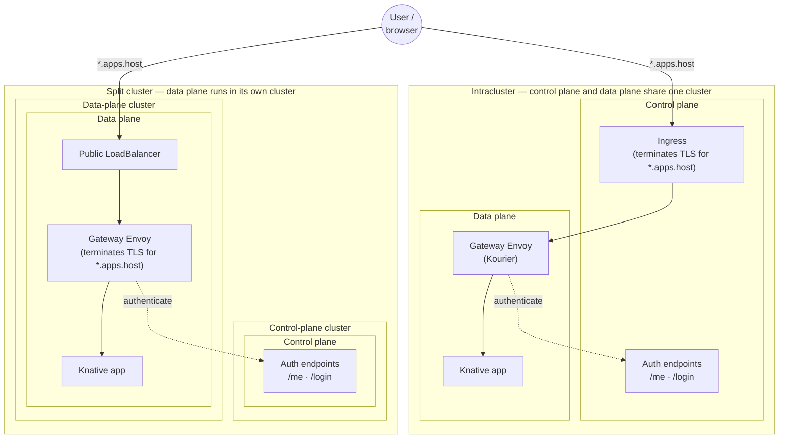

# App serving

App serving lets your data plane run long-lived applications — Streamlit dashboards, FastAPI services, and other custom apps — alongside batch tasks. In a self-hosted deployment the data plane chart ships a vendored serving stack (Knative Serving + Kourier + an Envoy gateway) that scales each app from zero, routes traffic to it, and enforces  authentication in front of it.

This page covers the supported setup, how apps are exposed, the DNS and TLS they require, and the Helm values that turn app serving on.

## Supported configuration

App serving is supported for a **single data plane**. Every app in a deployment is served from one data plane, under one wildcard apps domain (`*.apps.<control-plane-host>`).

> [!NOTE]
> Serving apps from more than one data plane — giving each data plane its own apps domain — is **not yet supported**. A per-data-plane apps domain field exists but is reserved for that future configuration; leave it unset (see [App URLs](#app-urls)).

Within the single-data-plane model there are two setups, depending on where the data plane runs relative to the control plane:

- **[Shared control plane and data plane](#shared-control-plane-and-data-plane)** — the data plane is co-located with the control plane, and apps are served through the control-plane ingress.
- **[Split cluster with a public load balancer](#split-cluster-with-a-public-load-balancer)** — the data plane runs in its own cluster, and apps are served through a dedicated public load balancer in front of the gateway.

The two setups differ in **which cluster the app-serving components live in** and **where TLS terminates**. Solid arrows are the request path; the dashed arrow is the gateway authenticating each request against the control plane.



In both setups the gateway Envoy and the Knative app are **data plane** components; the auth endpoints (`/me`, `/login`) are **control plane** components. The difference is the front door and TLS: intracluster reuses the control-plane ingress (TLS terminates there), while a split cluster adds a dedicated public load balancer and terminates TLS at the gateway Envoy in the data-plane cluster.

## How it works

When app serving is enabled, each deployed app becomes a Knative Service in the data plane. Requests reach it through the gateway Envoy:

1. A request for `https://<app>.apps.<control-plane-host>` arrives at the gateway.
2. Envoy authenticates the request against the control plane (`/me`). Unauthenticated browsers are redirected to `/login` on the control plane and returned to the app after sign-in.
3. Envoy forwards the authenticated request to the app's Knative Service, scaling it up from zero if needed.

App hostnames are **subdomains of the control-plane host**. This is deliberate: the control-plane session cookie is scoped to the control-plane host, so every app subdomain shares it and users get single sign-on without a second login.

## Prerequisites

- A healthy self-hosted deployment with the control plane and a single data plane running (see [Getting started](./getting-started)).
- App serving CRDs installed in the data plane cluster from the vendored `helm-charts/crds/` directory (the [Getting started](./getting-started) data-plane steps install these).
- The ability to resolve and serve the apps wildcard `*.apps.<control-plane-host>` — see [DNS and TLS](#dns-and-tls). A split-cluster data plane additionally needs to publish a wildcard DNS record and provision a wildcard TLS certificate.

## App URLs

The control plane assigns every app a URL from a single global pattern, `executions.apps.publicURLPattern`, set in the **control-plane** values. The pattern is `https://%s.apps.<control-plane-host>`, where `%s` is the app's subdomain:

```yaml
# Control-plane values
executions:
  configMap:
    executions:
      apps:
        publicURLPattern: "https://%s.apps.union.example.com"
# -> an app named "my-dashboard" is served at https://my-dashboard.apps.union.example.com
```

Every app therefore resolves to a subdomain of `apps.<control-plane-host>` — a **single wildcard** (`*.apps.<control-plane-host>`) that the DNS and TLS setup below covers once.

Leave the **data-plane** apps domain unset (its default) so the control plane uses this global pattern:

```yaml
# Data-plane values — apps domain unset (default)
updateStatus:
  connectionConfig:
    apps:
      domain: ""
```

> [!NOTE]
> The per-data-plane apps domain (`apps.<data-plane>.<control-plane-host>`, with the data plane's name baked into the hostname) is reserved for serving apps from more than one data plane, which is not yet supported. Leaving it empty is required for a single-data-plane deployment — the control plane then falls back to `executions.apps.publicURLPattern` above.

## Shared control plane and data plane

When the data plane is co-located with the control plane, apps are served through the **control-plane ingress** — no separate load balancer.

Leave the public load balancer disabled in the data-plane values (the default):

```yaml
gateway:
  publicLoadBalancer:
    enabled: false   # default
```

Then make sure the control-plane ingress routes the apps wildcard `*.apps.<control-plane-host>` to the gateway, and that its TLS certificate covers that wildcard. Because apps share the control-plane host, extending the existing control-plane ingress certificate to include `*.apps.<control-plane-host>` is usually all that is needed — no dedicated apps certificate (see [DNS and TLS](#dns-and-tls)).

## Split cluster with a public load balancer

When the data plane runs in its own cluster it has no control-plane ingress to borrow, so the gateway is fronted by its own public, internet-facing load balancer:

```
*.apps.<control-plane-host>  ->  public LoadBalancer  ->  gateway Envoy  ->  app
```

Enable the public load balancer and annotate it with the cloud load-balancer scheme and the wildcard external-dns hostname. For example, on AWS:

```yaml
gateway:
  publicLoadBalancer:
    enabled: true
    annotations:
      service.beta.kubernetes.io/aws-load-balancer-scheme: internet-facing
      service.beta.kubernetes.io/aws-load-balancer-type: external
      external-dns.alpha.kubernetes.io/hostname: "*.apps.union.example.com"
```

The gateway Envoy terminates TLS at the edge with a wildcard certificate provisioned into the `dataplane-apps-letsencrypt-tls` Secret, then routes straight to the app (see [DNS and TLS](#dns-and-tls)).

## Authentication

The gateway authenticates every app request against the control plane. By default all auth endpoints derive from the control-plane host, so apps get SSO out of the box and you normally leave these empty:

```yaml
gateway:
  auth:
    enable: true
    tenantAuthURL: ""            # empty -> https://<control-plane-host>/me
    tenantAuthSignInURL: ""      # empty -> https://<control-plane-host>/login
    tenantControlPlaneURL: ""    # empty -> https://<control-plane-host>
    organization: ""             # empty -> global.ORG_NAME (leave empty; the chart derives it)
```

Override the `tenant*` URLs only to point app authentication at a different endpoint (see [Control plane on a private DNS or endpoint](#control-plane-on-a-private-dns-or-endpoint)). Leave `organization` empty: when unset the chart falls back to your deployment's org (`global.ORG_NAME`), so setting it here only risks drifting from the control plane's org.

### Control plane on a private DNS or endpoint

If the data plane reaches the control plane over a **private** DNS name or endpoint (for example a VPC-internal address or split-horizon DNS) that differs from the public host users browse to, split the endpoints — the three values do not play the same role:

| Value                     | Role                                                            | Direction                     | Must be reachable by                      |
| ------------------------- | --------------------------------------------------------------- | ----------------------------- | ----------------------------------------- |
| `tenantAuthSignInURL`   | `/login` redirect target                                      | The user's browser follows it | **The end user — keep it public**  |
| `tenantAuthURL`         | `/me` auth subrequest                                         | Gateway → control plane      | The gateway (may be the private endpoint) |
| `tenantControlPlaneURL` | Control-plane gRPC dial (OAuth2 metadata, token, authorization) | Gateway → control plane      | The gateway (may be the private endpoint) |

Point the two server-side values at the private endpoint and keep the browser-facing sign-in URL on the public host:

```yaml
gateway:
  auth:
    enable: true
    tenantAuthSignInURL: "https://union.example.com/login"       # public — users are redirected here
    tenantAuthURL: "https://cp.internal.example.com/me"          # private — gateway -> control plane
    tenantControlPlaneURL: "https://cp.internal.example.com"     # private — gateway -> control plane
```

> [!WARNING]
> If the private control-plane endpoint serves a self-signed or internal-CA certificate, the gateway's auth plugin fails to start with `x509: unknown authority`. Give it the CA to trust (or, for non-production, skip verification) — this mirrors the operator's `config.union.connection` posture:
>
> ```yaml
> gateway:
>   auth:
>     controlPlaneCAFile: /etc/ssl/certs/internal-ca.pem     # trust the internal CA
>     # or, non-production only:
>     # controlPlaneInsecureSkipVerify: true
> ```

## DNS and TLS

App serving needs the apps wildcard `*.apps.<control-plane-host>` to resolve and to be served over TLS. How you provide it depends on the setup.

**Shared control plane and data plane.** The chart emits an app-serving Ingress (`ingress.serving`, enabled by default) that fronts the gateway on the shared nginx via `ingress.serving.class` and the host `*.apps.<control-plane-host>`. TLS terminates at that nginx. You have two options:

- **Reuse the control-plane wildcard cert** (simplest): extend the existing control-plane ingress certificate to cover `*.apps.<control-plane-host>`. No dedicated apps certificate and no extra values are required.
- **Attach a dedicated cert to the serving Ingress** via `ingress.serving.tls`, which is passed straight into the Ingress `tls:` block:
  ```yaml
  ingress:
    serving:
      tls:
        - hosts: ["*.apps.union.example.com"]
          secretName: dataplane-apps-letsencrypt-tls
  ```

**Split cluster with a public load balancer.** The data plane needs its own:

1. **A wildcard DNS record** — `*.apps.<control-plane-host>` resolving to the gateway's public load balancer. The `external-dns.alpha.kubernetes.io/hostname` annotation above lets external-dns publish this automatically.
2. **A wildcard TLS certificate** — the gateway Envoy terminates TLS on its `apps_https:8443` listener with a certificate covering `*.apps.<control-plane-host>`. Provide it in a Kubernetes Secret (`tls.crt`/`tls.key`) in the data plane namespace and name that Secret with `gateway.publicLoadBalancer.tlsSecretName`:
   ```yaml
   gateway:
     publicLoadBalancer:
       enabled: true
       tlsSecretName: dataplane-apps-letsencrypt-tls   # default; override for a BYO cert
   ```
   `tlsSecretName` is **required** when `publicLoadBalancer.enabled` — the chart fails to render if it is empty, because terminating TLS at the load balancer (rather than at Envoy) is not yet supported. The data plane does **not** create this Secret; supply it however you issue certs (cert-manager, a corporate CA, ACM sync, …).

A common way to obtain the wildcard certificate is cert-manager with a DNS-01 `ClusterIssuer` (a wildcard cert cannot be issued over HTTP-01):

```yaml
apiVersion: cert-manager.io/v1
kind: Certificate
metadata:
  name: dataplane-apps-letsencrypt-tls
  namespace: <data-plane-namespace>
spec:
  secretName: dataplane-apps-letsencrypt-tls
  dnsNames:
    - "*.apps.union.example.com"
  issuerRef:
    name: letsencrypt-issuer
    kind: ClusterIssuer
```

## WebSocket apps

Apps that use WebSockets — Streamlit's live UI (`/_stcore/stream`), FastAPI WebSocket endpoints, and similar real-time apps — open the connection with an HTTP upgrade request. That request carries the same authentication context as any other request to the app, so the handshake headers include the  session cookie and, depending on your identity provider, a bearer token. With a provider that issues large tokens (for example, when many group claims are included), those headers can grow to tens of kilobytes.

The gateway forwards headers of this size, but the **application server** inside the app has its own limit on how large a single request's headers may be. When the handshake exceeds that limit the server rejects it with `431 Request Header Fields Too Large`, and the WebSocket never connects. The symptom is an app that loads its page but never comes alive — a Streamlit app renders its skeleton and then hangs, and the browser console shows the WebSocket request failing or pending.

The fix is to raise the app server's header limits, which are configured **in the app** (not in the Helm chart) through environment variables:

| Environment variable                      | Applies to                                                   | Library default                  |
| ----------------------------------------- | ------------------------------------------------------------ | -------------------------------- |
| `WEBSOCKETS_MAX_LINE_LENGTH`            | any app using the`websockets` library, including Streamlit | `8192` (8 KiB) per header line |
| `WEBSOCKETS_MAX_NUM_HEADERS`            | same                                                         | `128` headers                  |
| `UVICORN_H11_MAX_INCOMPLETE_EVENT_SIZE` | uvicorn / FastAPI apps                                       | 16 KiB for the whole request     |

Set them as environment variables on your app definition, raised enough to cover your identity provider's largest tokens (64 KiB is a comfortable ceiling). For example, for a Streamlit app:

```python
env_vars = {
    "WEBSOCKETS_MAX_LINE_LENGTH": "65536",
    "WEBSOCKETS_MAX_NUM_HEADERS": "256",
}
```

> [!NOTE]
> This limit is specific to the app's own server. The gateway and the Knative serving components in front of it already accept headers of this size, so raising these values in the app is sufficient — no data plane chart change is required.

## Verify

Deploy an app to the data plane, then request its URL:

```bash
curl -sI https://<app>.apps.<control-plane-host>/
```

- An unauthenticated request returns `302` redirecting to `/login` on the control-plane host — auth is being enforced.
- After signing in to the console, the same URL serves the app.
- `curl -v` should show the wildcard certificate (`CN=*.apps.<control-plane-host>`) and a valid chain.

If something is wrong:

- **Requests hang or return `503`** — confirm the gateway pods are running and the app's Knative Service is `Ready`.
- **An authenticated browser is still redirected to `/login`** — confirm the app is under the control-plane host and that the control-plane session cookie is scoped to that host. If the control plane is on a private endpoint, confirm `tenantAuthSignInURL` still points at the **public** host (see [Control plane on a private DNS or endpoint](#control-plane-on-a-private-dns-or-endpoint)).
- **A WebSocket app loads but never connects** (for example a Streamlit app that shows only its skeleton) — raise the app's header limits (see [WebSocket apps](#websocket-apps)).
