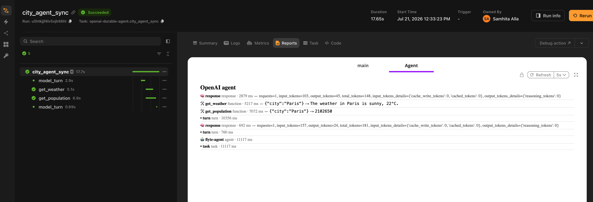

# Agent frameworks

Agent frameworks are good at deciding what an agent should do next. They are less good at what happens when the worker running the agent dies on turn seven, when one tool needs a GPU and another needs 200 MB of RAM, or when you need to explain to someone what the agent actually did last Tuesday.

The Flyte agent plugins cover that half. You keep writing agents in your framework's own idioms. Flyte becomes the runtime underneath: completed model turns replay instead of re-billing, every tool call is a containerized child action with its own resources and cache, conversations persist across runs, and the whole thing renders as a timeline in the task report.

Ten frameworks are supported, each as a separate package on a shared core. The call shape is identical across all of them, so switching frameworks is mostly a change of import.

## Supported frameworks

| Framework | Page | Package |
|---|---|---|
| [OpenAI Agents SDK](https://openai.github.io/openai-agents-python/) | [OpenAI](./openai) | `flyteplugins-agents-openai` |
| [Claude Agent SDK](https://github.com/anthropics/claude-agent-sdk-python) | [Claude](./claude-agent-sdk) | `flyteplugins-agents-claude` |
| [Google ADK](https://github.com/google/adk-python) | [Google ADK](./google-adk) | `flyteplugins-agents-google` |
| [Mistral Agents](https://docs.mistral.ai/agents/agents_introduction/) | [Mistral](./mistral) | `flyteplugins-agents-mistral` |
| [LangChain](https://docs.langchain.com/oss/python/langchain/agents) | [LangChain](./langchain) | `flyteplugins-agents-langchain` |
| [LangGraph](https://langchain-ai.github.io/langgraph/) | [LangGraph](./langgraph) | `flyteplugins-agents-langgraph` |
| [Deep Agents](https://docs.langchain.com/oss/python/deepagents/overview) | [Deep Agents](./deepagents) | `flyteplugins-agents-deepagents` |
| [CrewAI](https://docs.crewai.com/) | [CrewAI](./crewai) | `flyteplugins-agents-crewai` |
| [Pydantic AI](https://ai.pydantic.dev/) | [Pydantic AI](./pydantic-ai) | `flyteplugins-agents-pydantic-ai` |
| [Hermes](https://pypi.org/project/hermes-agent/) | [Hermes](./hermes) | `flyteplugins-agents-hermes` |

Install the one you need. Each package pulls in `flyteplugins-agents-core` and the underlying SDK.

```bash
pip install flyteplugins-agents-openai
```

## Two decorators

Every adapter exports the same two things: `tool` and `run_agent`.

`tool` stacks on top of `@env.task`. The result is simultaneously a normal Flyte task and a tool your framework recognizes, so when the model calls it, the call becomes a durable child action rather than a function call inside the agent process.

`run_agent` drives the framework's own agent loop from inside a Flyte task. That task is the durable parent: give it `retries=` for self-healing and `report=True` for the timeline.

```python
import flyte
from flyteplugins.agents.openai import run_agent, tool

env = flyte.TaskEnvironment("agent")

@tool
@env.task(cache="auto", retries=3)
async def get_weather(city: str) -> str:
    """Get the current weather for a city."""
    return f"The weather in {city} is sunny, 22C."

@env.task(report=True, retries=3)
async def city_agent(question: str) -> str:
    return await run_agent(question, tools=[get_weather], model="gpt-4.1")
```

Swap the import line for `flyteplugins.agents.crewai` or `flyteplugins.agents.langchain` and the rest of the file stays as it is, apart from the model name.

## Quick start

A complete, runnable agent. The API key is read from the environment, so wire it as a Flyte secret rather than passing it as a task input.

```python{hl_lines=[2, 6, 14, 21, "30-35"]}
import flyte
from flyteplugins.agents.openai import run_agent, tool

env = flyte.TaskEnvironment(
    "city-agent",
    secrets=[flyte.Secret(key="openai_api_key", as_env_var="OPENAI_API_KEY")],
    image=flyte.Image.from_debian_base().with_pip_packages(
        "flyteplugins-agents-openai",
    ),
    resources=flyte.Resources(cpu=1),
)


@tool
@env.task(cache="auto", retries=3)
async def get_weather(city: str) -> str:
    """Get the current weather for a city."""
    return f"The weather in {city} is sunny, 22C."


@tool
@env.task(cache="auto", retries=3)
async def get_population(city: str) -> int:
    """Get the population of a city."""
    return {"Paris": 2102650, "Tokyo": 13929286}.get(city, 1_000_000)


@env.task(report=True, retries=3)
async def city_agent(question: str) -> str:
    return await run_agent(
        question,
        tools=[get_weather, get_population],
        instructions="You are a concise city-facts assistant. Use the tools to answer.",
        model="gpt-4.1",
    )


if __name__ == "__main__":
    flyte.init_from_config()
    run = flyte.run(city_agent, question="What's the weather and population of Paris?")
    print(run.url)
```

Run it:

```bash
flyte run city_agent.py city_agent --question "What's the weather and population of Paris?"
```

Add `--local` right after `run` to execute on your machine instead. The durability, memory and observability layers become transparent no-ops outside a task context, so the same file runs unchanged.



## What Flyte adds

| Capability | What it means |
|---|---|
| Tools as child actions | Each tool call runs in its own container with its own resources, retries and cache. A retrieval tool can hold a GPU while the agent task holds one CPU. |
| Model-turn replay | Completed turns are recorded. When the parent task is retried, they replay from the record instead of calling the model again. |
| Self-healing | `retries=` on the agent task, combined with per-turn and per-tool replay, means a transient failure resumes rather than restarting. |
| Cross-run memory | A `memory_key` continues a conversation across separate runs, workers and restarts, backed by object storage. |
| Observability | Turns, tool calls, results and token usage render into the task report. |
| Human in the loop | A tool can suspend on a Flyte condition and wait for a human. The run survives restarts while it waits. |

[How it works](./how-it-works) covers each of these in detail, including where the durability seam sits and why.

## Capability matrix

The adapters share a contract but the underlying SDKs differ, so durability lands in different places.

| Framework | Model-turn durability | Tool type | What memory persists | Python |
|---|---|---|---|---|
| [OpenAI](./openai) | Per turn | `FunctionTool` | Conversation transcript | 3.10+ |
| [Claude](./claude-agent-sdk) | Per session, via resume | In-process MCP tool | Conversation transcript | 3.10+ |
| [Google ADK](./google-adk) | Per turn | Plain callable | Session events | 3.10+ |
| [Mistral](./mistral) | Per turn | Plain callable | Server-side conversation ID | 3.10+ |
| [LangChain](./langchain) | Per turn, built agents | `StructuredTool` | Conversation transcript | 3.10+ |
| [LangGraph](./langgraph) | Per turn, via `ai_node` | `StructuredTool` | Conversation transcript | 3.10+ |
| [Deep Agents](./deepagents) | Per turn, built agents | `StructuredTool` | Transcript and virtual filesystem | 3.11+ |
| [CrewAI](./crewai) | Per turn, built agents | `BaseTool` | Conversation transcript | 3.10+ |
| [Pydantic AI](./pydantic-ai) | Per turn | Plain callable | Message history | 3.10+ |
| [Hermes](./hermes) | Not available | Registry tool | Conversation transcript | 3.11+ |

"Built agents" means durability applies when `run_agent` constructs the agent for you. If you hand it a fully pre-built agent, Flyte cannot reach inside to wrap the model, so you wrap it yourself. Each page says exactly how.

Tool calls are durable in every case, including Hermes, regardless of the `durable` setting.

## Choosing a framework

The plugins do not have an opinion here. Pick the framework you would have picked anyway. The two things worth knowing:

- If you want per-turn replay and you are starting fresh, everything except Hermes gives it to you on the builder path.
- If you already own a compiled graph or a configured agent object, check the framework's page for how durability is applied on the pre-built path. LangGraph is designed around this case: you build the `StateGraph`, and `ai_node` and `tool_node` supply the durable pieces.

## Next steps

- [How it works](./how-it-works): the runtime model, from the durable parent down to the trace leaf.
- Pick a framework page above for SDK-specific setup, options and limitations.
- [Build an agent](../../user-guide/build-agent/_index): Flyte's own agent harness, if you would rather not bring a framework at all.
