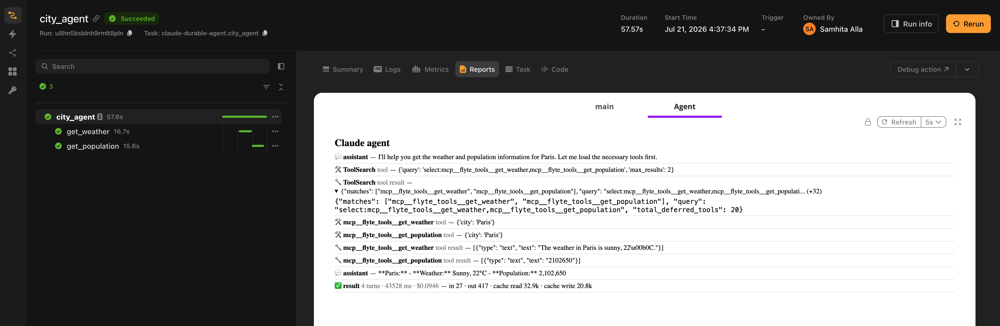

# Claude Agent SDK

Run [Claude Agent SDK](https://github.com/anthropics/claude-agent-sdk-python) agents on Flyte. Tools you expose become durable Flyte child actions, the run streams into the task report as a timeline, and a crashed attempt resumes the conversation instead of restarting it.

This adapter differs from the others in one respect worth knowing up front: the Claude SDK runs its agent loop inside the Claude Code runtime, a subprocess Flyte does not intercept. Durability is therefore whole-session rather than per-turn. The section on [durability](#durability) explains what that means in practice.

## Installation

```bash
pip install flyteplugins-agents-claude
```

Requires Python 3.10 or later.

The `claude-agent-sdk` wheel bundles the native `claude` CLI as a per-platform binary, including the `manylinux` build. It is around 250 MB, and it means the runtime image needs no separate Node.js install. A pip install and an Anthropic API key is the whole setup.

## Quick start

```python{hl_lines=[2, 6, 11, 20]}
import flyte
from flyteplugins.agents.claude import run_agent, tool

env = flyte.TaskEnvironment(
    "claude-agent",
    secrets=[flyte.Secret(key="anthropic_api_key", as_env_var="ANTHROPIC_API_KEY")],
    image=flyte.Image.from_debian_base().with_pip_packages("flyteplugins-agents-claude"),
)


@tool
@env.task(cache="auto", retries=3)
async def get_weather(city: str) -> str:
    """Get the current weather for a city."""
    return f"The weather in {city} is sunny, 22C."


@env.task(report=True, retries=3)
async def city_agent(question: str) -> str:
    return await run_agent(question, tools=[get_weather], model="claude-sonnet-4-5")
```

## How it maps to Flyte

**Tools:** The Claude SDK exposes custom tools as in-process MCP tools. `tool` wraps an `@env.task` as an `SdkMcpTool` whose handler dispatches to the task, so a tool call becomes a durable child action with its own container, resources, retries and cache. The input schema is derived through the Flyte type engine, which handles `Literal` enums, `File`, `Dir`, `DataFrame` and dataclasses correctly.

`run_agent` builds an in-process MCP server from the tools you pass, registers it under `server_name`, and adds the tool names to `allowed_tools`.

**The loop:** `run_agent` runs the SDK's loop inside your task, streams the messages, and renders assistant turns, tool calls, cost and token usage into the report.

## Durability

**Tool calls** are durable Flyte child actions always, regardless of the `durable` setting. Their retries and caching behave exactly as they do for any Flyte task.

**The conversation** survives a crash through session resume. With `durable=True`, `run_agent` wires the SDK's own session mirror onto a `flyte.Checkpoint`. A deterministic `session_id`, derived from the task's action so it is stable across retries, is pinned on the first attempt. On a retry, the prior attempt's transcript is restored from the checkpoint and the run resumes.

The reason for delegating to the SDK here is structural. A model turn cannot be a `flyte.trace` leaf when the loop that produces it runs in a subprocess. Session resume is the coarser-grained equivalent: whole-session rather than per-turn. It no-ops cleanly when there is no checkpoint context, such as a local run.

## Observability

With `report=True`, the timeline shows assistant turns from the streamed messages plus each tool's outcome. The message stream does not surface tool results, so `run_agent` installs `PostToolUse` and `PostToolUseFailure` hooks to capture them.

If you pass your own `ClaudeAgentOptions(hooks=...)`, the Flyte hooks are merged into yours rather than replacing them. They observe only and return an empty decision, so they never affect the agent's behavior.

The result row carries the turn count, wall-clock duration, the SDK's cost estimate, and a token breakdown covering input, output, cache reads and cache writes. Those are the counts that drive the dollar figure, so you can check it at a glance.



## Bring your own options

Pass a fully-built `ClaudeAgentOptions` to keep SDK-native configuration such as subagents, permissions, hooks and session settings. The `tools`, `model`, `instructions` and `max_turns` arguments are layered on top of it.

```python{hl_lines=[1, 9]}
from claude_agent_sdk import ClaudeAgentOptions


@env.task(report=True, retries=3)
async def support(request: str) -> str:
    return await run_agent(
        request,
        tools=[lookup_account],
        options=ClaudeAgentOptions(agents={"billing": {...}}),
        model="claude-sonnet-4-5",
    )
```

## Human in the loop

A tool that pauses for human approval is a durable gate the SDK has no equivalent for. The run genuinely suspends and survives restarts while it waits.

```python{hl_lines=[5, 10]}
@tool
@env.task(retries=3)
async def issue_refund(account_id: str, amount_usd: float) -> str:
    """Issue a refund. Requires human approval before it runs."""
    condition = await flyte.new_condition.aio(
        f"approve_refund_{account_id}",
        prompt=f"Approve a ${amount_usd:.2f} refund to account {account_id}?",
        data_type=bool,
    )
    if not await condition.wait.aio():
        return f"Refund to {account_id} was declined by a human reviewer."
    return f"refunded ${amount_usd:.2f} to account {account_id}"
```

## Memory

```python
await run_agent(message, model="claude-sonnet-4-5", memory_key="user-alice")
```

The transcript is persisted to a durable, keyed `MemoryStore` and resumed through the SDK's session mirror on the next run with the same key.

Memory takes precedence over the per-run `durable` checkpoint, because it covers crash resume as well. When `memory_key` is set, the checkpoint path is not used.

## `run_agent` parameters

| Parameter | Type | Default | Description |
|---|---|---|---|
| `input` | `str` | required | The user prompt |
| `tools` | `Sequence` | `()` | Tools to expose. Accepts `tool`-wrapped tools or bare `@env.task` templates |
| `model` | `str \| None` | `"claude-sonnet-4-5"` | Model name |
| `instructions` | `str \| None` | `None` | System prompt |
| `max_turns` | `int \| None` | `None` | Maximum turns. `None` uses the SDK default |
| `durable` | `bool` | `True` | Wire session resume onto a `flyte.Checkpoint` |
| `observability` | `bool` | `True` | Render the timeline into the task report |
| `options` | `ClaudeAgentOptions \| None` | `None` | SDK-native configuration, layered under the arguments above |
| `server_name` | `str` | `"flyte_tools"` | Name of the in-process MCP server holding the tools |
| `memory_key` | `str \| None` | `None` | Stable user or thread ID for cross-run memory |

Returns the final text. Use `run_agent_sync` with the same signature from a sync task.

## Examples

Full runnable examples live in the SDK repository under [`plugins/agents/claude/examples`](https://github.com/flyteorg/flyte-sdk/tree/main/plugins/agents/claude/examples):

- `claude_durable_agent.py`: a single durable agent with tool outcomes in the report.
- `claude_crash_resume.py`: the task crashes on its first attempt and resumes the conversation from the checkpoint on retry.
- `claude_multi_agent.py`: a planner, parallel researchers and an editor, each its own durable action.
- `claude_hitl.py`: a refund tool gated on human approval.
- `claude_memory.py`: two separate runs sharing a `memory_key`.
- `claude_handoffs.py`: native subagent delegation, with the whole run durable on Flyte.
