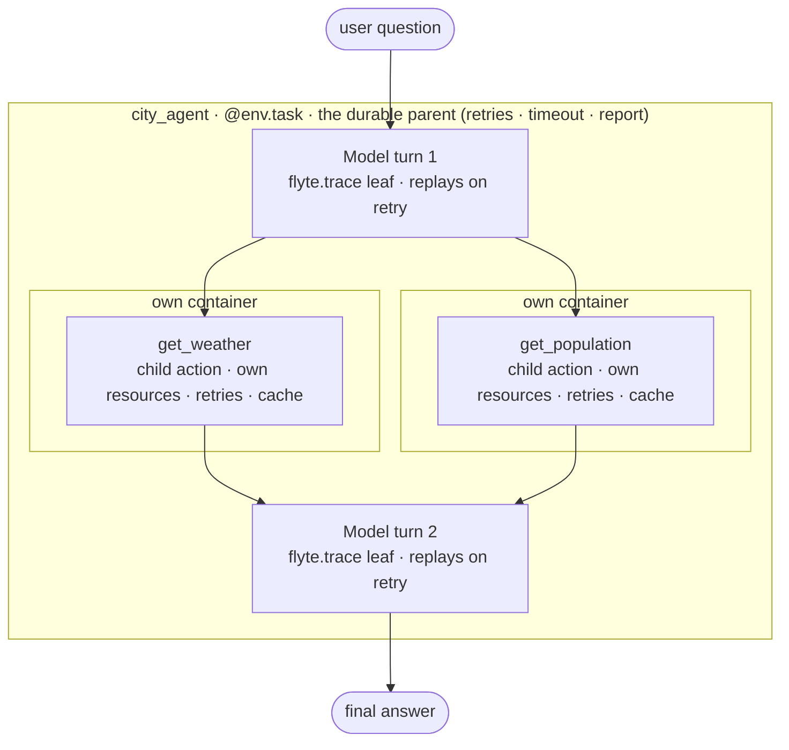
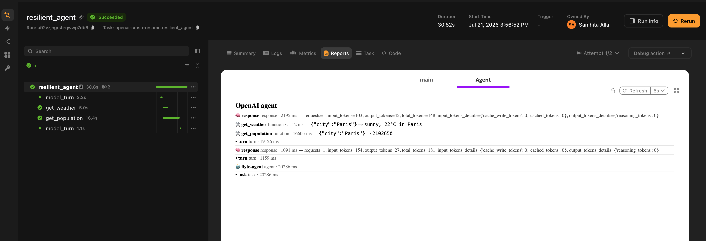
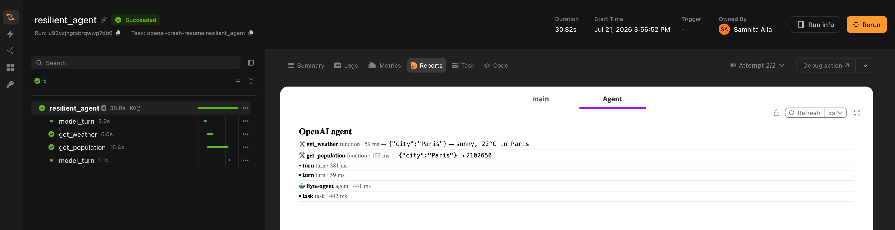
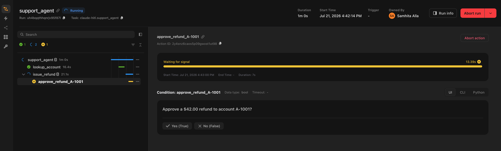

# How it works

Every adapter follows the same division of labor. Understanding it once means you can read any of the framework pages quickly, and it explains why some capabilities land differently depending on the SDK.

## The division of labor

Three levels, each mapping to a Flyte primitive:

| Level | Flyte primitive | What it gives you |
|---|---|---|
| The agent run | An `@env.task` (the durable parent) | Retries, timeout, resources, the report |
| Each model turn | A `flyte.trace` leaf | Replay on retry, no repeat billing |
| Each tool call | A child action | Own container, own resources, retries, caching |

The framework still owns the loop. Nothing here reimplements tool-calling or turn management. `run_agent` starts the SDK's own runner inside your task and instruments the seams around it.

```python
@env.task(report=True, retries=3)      # the durable parent
async def city_agent(question: str) -> str:
    return await run_agent(            # the SDK's loop runs in here
        question,
        tools=[get_weather],           # each call is a child action
        model="gpt-4.1",
    )
```



The parent task is the box. The model turns inside it are `flyte.trace` leaves that replay on retry. Each tool call is a child action in its own container, sized and cached on its own terms.

## Tools are Flyte tasks

Stacking `tool` on `@env.task` produces one object that is both things at once. The framework sees whatever tool type it expects, and Flyte sees the task.

```python
@tool
@env.task(cache="auto", retries=3, resources=flyte.Resources(gpu="T4"))
async def embed_documents(query: str) -> list[float]:
    """Embed a query for semantic search."""
    ...
```

When the model calls `embed_documents`, Flyte submits a child action. That action runs in its own container with a T4, retries on failure, and hits the cache on identical inputs. The agent task itself keeps whatever modest resources you gave it.

This is the part that is hard to get any other way. A tool in a normal agent process is a function call: same machine, same memory limit, same failure domain. Here each tool is sized and cached on its own terms, and a tool crash does not take down the conversation.

The tool's schema, name and description come from the task. The docstring becomes the description the model sees, so write it for the model.

> [!NOTE] Docstrings are prompts
> The first line of the docstring is what the model reads when deciding whether to call the tool. Vague docstrings produce vague tool selection.

### Passing tools

`tools=` accepts `tool`-wrapped tasks. It also accepts bare `@env.task` templates, which are wrapped for you:

```python
await run_agent(question, tools=[get_weather])       # tool-wrapped, or
await run_agent(question, tools=[some_plain_task])   # bare task, wrapped on the fly
```

Wrap explicitly with `@tool` when you want the tool object at module scope, for example to attach it to a pre-built agent or a subagent.

### Renaming a tool

```python
search = tool(query_warehouse, name="search", description="Search the product catalog.")
```

The OpenAI adapter forwards to the SDK's own kwargs (`name_override`, `description_override`) instead.

## Durable model turns

A retried task normally starts from scratch. For an agent that means paying for every completed turn a second time, and getting different answers the second time around.

Instead, each model turn is recorded as a `flyte.trace` leaf keyed by a fingerprint of the request. On a retry, a turn whose fingerprint already has a record returns that record without calling the model.

The recording happens at the seam below the framework's loop, not around it. For the OpenAI adapter that is a `ModelProvider`; for Google ADK it is `BaseLlm.generate_content_async`; for the LangChain family it is the chat model itself; for Mistral it is the two HTTP methods the runner uses per turn. Different seam, same mechanism. The loop above it is untouched, so handoffs, guardrails, structured output and everything else the SDK does keep working.

Turn durability is on by default. Switch it off with `durable=False`.

```python
await run_agent(question, tools=[get_weather], model="gpt-4.1", durable=False)
```

### What replay means in practice

A task that crashes partway through an agent run, with `retries=3`, resumes like this:

1. Completed model turns return from their trace records. No model calls, no tokens.
2. Completed tool calls return from cache, if the task was declared with `cache="auto"`.
3. Execution continues from the first step that never finished.

Transient model failures such as 429s and 5xx are a separate matter. Those are retried in place by the provider's own client, below the durable wrapper, so a turn is only recorded once it has actually succeeded.

Here is that recovery in the Flyte report. It is one crash-resume run viewed at each attempt, using the `openai_crash_resume.py` example: the task runs the agent for real, crashes on its first attempt, and Flyte retries it. The `Attempt` selector at the top right switches between the two views.

**Attempt 1, the first run.** The agent does the full job. Both model turns are live calls with real token usage (103 and 154 input tokens), and both tools execute as child actions, `get_weather` in 5.1 s and `get_population` in 16.6 s. The agent timeline totals 20.3 s. The task then crashes.



**Attempt 2, the retry.** The two model `response` rows are gone. The turns replayed from their `flyte.trace` records, so the model was never called and no tokens were spent. The tool calls are cache hits, `get_weather` in 59 ms and `get_population` in 102 ms. Same answer, with the agent timeline down from 20.3 s to 0.44 s.



The absence of those model rows on the retry is the replay. The second attempt re-drives the agent loop, but every completed turn comes back from its record and every tool from cache, so no work is repeated and nothing is re-billed.

### Where durability does not reach

Two cases, both called out on the relevant framework pages:

**Pre-built agents:** If you construct the agent object yourself and pass it as `run_agent(agent=...)`, Flyte often cannot reach the model inside it to wrap it. The LangChain family exposes `DurableChatModel` for this; Pydantic AI applies the wrapper through `Agent.override`. Tool calls stay durable either way.

**Subprocess loops:** The Claude Agent SDK runs its loop in the Claude Code runtime, a subprocess Flyte does not intercept, so a turn cannot be a trace leaf. That adapter uses the SDK's own session resume against a `flyte.Checkpoint` instead. It is coarser, whole-session rather than per-turn, but it is real. Hermes exposes no per-turn hook at all, so `durable=` is accepted and ignored there.

## Cross-run memory

Pass a `memory_key` and the conversation continues across separate runs, separate workers and restarts:

```python
@env.task(report=True, retries=3)
async def chat(message: str, memory_key: str) -> str:
    return await run_agent(message, model="gpt-4.1", memory_key=memory_key)
```

```bash
flyte run chat.py chat --message "Hi, I'm Alice and I love hiking." --memory_key user-alice
flyte run chat.py chat --message "What do I like?" --memory_key user-alice
```

The second run answers correctly. It is a separate run on possibly a different worker, and the transcript came from object storage.

The backing store is Flyte's keyed `MemoryStore`, which resolves a deterministic remote path from the key and the run context. Two runs sharing a key share one store. It carries a message transcript and a path-addressed key-value space with audit and version history, so the same key covers both conversation history and durable named facts.

What each adapter actually persists differs, because the SDKs represent conversation state differently. Mistral keeps transcripts server-side, so only the conversation ID is stored. Google ADK persists its event list. Deep Agents persists the virtual filesystem alongside the transcript. The [capability matrix](./_index) has the full list.

`memory_key` should be a single segment, such as a user or thread ID. Memory is best-effort by design: if no durable store can be resolved, the adapter logs a warning and the run continues without memory rather than failing.

> [!NOTE] Memory needs a configured context
> The store path is derived from the active org, project and domain. Run with `flyte.init_from_config()` or against a backend. Local runs without a context skip memory silently.

## Observability

With `report=True` on the agent task, the run renders as a timeline in the report tab: assistant turns, tool calls with their arguments, tool results, errors, and a token usage summary.

```python
@env.task(report=True, retries=3)
async def city_agent(question: str) -> str:
    return await run_agent(question, tools=[get_weather], model="gpt-4.1")
```

Turn it off with `observability=False`.

Token accounting is honest about replay. On a retried run, turns served from their durable records are counted as cached rather than presented as fresh spend.

## Human in the loop

A tool is a Flyte task, and a Flyte task can suspend on a condition. That gives you an approval gate no agent SDK has an equivalent for, because the run genuinely suspends rather than blocking a thread, and survives a restart while it waits.

```python
@tool
@env.task(retries=3)
async def issue_refund(account_id: str, amount_usd: float) -> str:
    """Issue a refund. Requires human approval before it runs."""
    condition = await flyte.new_condition.aio(
        f"approve_refund_{account_id}",
        prompt=f"Approve a ${amount_usd:.2f} refund to account {account_id}?",
        data_type=bool,
    )
    if not await condition.wait.aio():
        return f"Refund to {account_id} was declined by a human reviewer."
    return f"refunded ${amount_usd:.2f} to account {account_id}"
```

The model decides whether to call the tool. You decide what happens when it does. The agent sees the decline as an ordinary tool result and carries on.



## Multi-agent orchestration

Handoffs and subagents inside a single `run_agent` work as the framework defines them. Flyte adds a layer above: each agent can be its own task, composed with ordinary control flow.

```python
@env.task(retries=3)
async def research(subtopic: str) -> str:
    return await run_agent(f"Research: {subtopic}", tools=[search_web], model="gpt-4.1")


@env.task(report=True, retries=3)
async def pipeline(topic: str) -> str:
    subtopics = await plan(topic)
    with flyte.group("parallel-research"):
        findings = await asyncio.gather(*(research(s) for s in subtopics))
    return await synthesize(topic, list(findings))
```

Each researcher is a separate durable action with its own retries, cache and report. The fan-out is real distributed parallelism across workers, not asyncio inside one process.

## Sync and async

`run_agent` is a coroutine function. Await it from an async task. From a sync task, call `run_agent_sync`, which every adapter also exports with the same signature.

```python
@env.task(report=True)
async def async_agent(q: str) -> str:
    return await run_agent(q, tools=[get_weather], model="gpt-4.1")


@env.task(report=True)
def sync_agent(q: str) -> str:
    return run_agent_sync(q, tools=[get_weather], model="gpt-4.1")
```

## Running locally

Call `run_agent` from inside an `@env.task`. That task is what makes the durability, memory and observability layers real.

Outside a task context they are transparent no-ops: `flyte.trace` passes through, memory resolves to nothing, the report is not rendered. The same file runs locally unchanged, which is what you want for iteration, but it also means a local run tells you nothing about whether replay works. Run on a backend to see that.

## The shared contract

Every adapter exports `tool`, `run_agent` and `run_agent_sync`, and every `run_agent` accepts `tools`, `model`, `instructions`, `durable`, `observability` and `memory_key`. This is enforced in CI by a conformance check that each adapter runs as a one-line test, so the surface cannot drift between packages.

Adapters add their own keyword arguments on top where the SDK calls for it, such as `run_config` for OpenAI, `options` for Claude, `agent_id` for Mistral, and `subagents` for Deep Agents. Those are documented on each framework's page.

The shared machinery lives in `flyteplugins-agents-core`, which every adapter depends on. It has no agent SDK dependency of its own. If you are writing an adapter for a framework that is not listed, that package is the contract to implement.

## Next steps

- [Agent frameworks](./_index): the supported list and the capability matrix.
- [Secrets](../../user-guide/task-configuration/secrets): how to wire provider API keys.
- [Caching](../../user-guide/task-configuration/caching): what `cache="auto"` does on a tool task.
