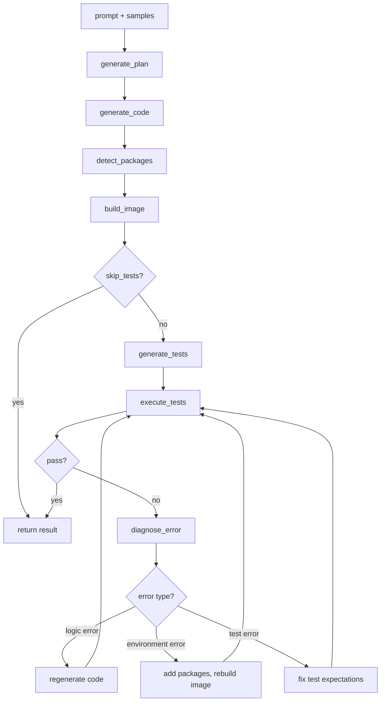

# Code generation

The code generation plugin turns natural-language prompts into tested, production-ready Python code.

You describe what the code should do, along with sample data, schema definitions, constraints, and typed inputs/outputs, and the plugin handles the rest: generating code, writing tests, building an isolated [code sandbox](/user-guide/sandboxing/code-sandboxing) with the right dependencies, running the tests, diagnosing failures, and iterating until everything passes. The result is a validated script you can execute against real data or deploy as a reusable Flyte task.

## Installation

```bash
pip install flyteplugins-codegen

# For Agent mode (Claude-only)
pip install flyteplugins-codegen[agent]
```

## Quick start

```python{hl_lines=[3, 4, 6, 12, 14, "20-25"]}
import flyte
from flyte.io import File
from flyte.sandbox import sandbox_environment
from flyteplugins.codegen import AutoCoderAgent

agent = AutoCoderAgent(model="gpt-4.1", name="summarize-sales")

env = flyte.TaskEnvironment(
    name="my-env",
    secrets=[flyte.Secret(key="openai_key", as_env_var="OPENAI_API_KEY")],
    image=flyte.Image.from_debian_base().with_pip_packages(
        "flyteplugins-codegen",
    ),
    depends_on=[sandbox_environment],
)


@env.task
async def process_data(csv_file: File) -> tuple[float, int, int]:
    result = await agent.generate.aio(
        prompt="Read the CSV and compute total_revenue, total_units and row_count.",
        samples={"sales": csv_file},
        outputs={"total_revenue": float, "total_units": int, "row_count": int},
    )
    return await result.run.aio()
```

The `depends_on=[sandbox_environment]` declaration is required. It ensures the sandbox runtime is available when dynamically-created sandboxes execute.


## Two execution backends

The plugin supports two backends for generating and validating code. Both share the same `AutoCoderAgent` interface and produce the same `CodeGenEvalResult`.

### LiteLLM (default)

Uses structured-output LLM calls to generate code, detect packages, build sandbox images, run tests, diagnose failures, and iterate. Works with any model that supports structured outputs (GPT-4, Claude, Gemini, etc. via LiteLLM).

```python{hl_lines=[1, 3]}
agent = AutoCoderAgent(
    name="my-task",
    model="gpt-4.1",
    max_iterations=10,
)
```

The LiteLLM backend follows a fixed pipeline:



The loop continues until tests pass or `max_iterations` is reached.


### Agent (Claude)

Uses the Claude Agent SDK to autonomously generate, test, and fix code. The agent has access to `Bash`, `Read`, `Write`, and `Edit` tools and decides what to do at each step. Test execution commands (`pytest`) are intercepted and run inside isolated sandboxes.

```python{hl_lines=["3-4"]}
agent = AutoCoderAgent(
    name="my-task",
    model="claude-sonnet-4-5-20250929",
    backend="claude",
)
```

> [!NOTE]
> Agent mode requires `ANTHROPIC_API_KEY` as a Flyte secret and is Claude-only.

**Key differences from LiteLLM:**

|                       | LiteLLM                           | Agent                                          |
| --------------------- | --------------------------------- | ---------------------------------------------- |
| **Execution**         | Fixed generate-test-fix pipeline  | Autonomous agent decides actions               |
| **Model support**     | Any model with structured outputs | Claude only                                    |
| **Iteration control** | `max_iterations`                  | `agent_max_turns`                              |
| **Test execution**    | Direct sandbox execution          | `pytest` commands intercepted via hooks        |
| **Tool safety**       | N/A                               | Commands classified as safe/denied/intercepted |
| **Observability**     | Logs + token counts               | Full tool call tracing in Flyte UI             |

In Agent mode, Bash commands are classified before execution:

- **Safe** (`ls`, `cat`, `grep`, `head`, etc.) — allowed to run directly
- **Intercepted** (`pytest`) — routed to sandbox execution
- **Denied** (`apt`, `pip install`, `curl`, etc.) — blocked for safety

## Providing data

### Sample data

Pass sample data via `samples` as `File` objects or pandas `DataFrame`s. The plugin automatically:

1. Converts DataFrames to CSV files
2. Infers [Pandera](https://pandera.readthedocs.io/) schemas from the data — column types, nullability
3. Parses natural-language `constraints` into Pandera checks (e.g., `"quantity must be positive"` becomes `pa.Check.gt(0)`)
4. Extracts data context — column statistics, distributions, patterns, sample rows
5. Injects all of this into the LLM prompt so the generated code is aware of the exact data structure

Pandera is used purely for prompt enrichment, not runtime validation. The generated code does not import Pandera — it benefits from the LLM knowing the precise data structure. The generated schemas are stored on `result.generated_schemas` for inspection.

```python{hl_lines=[3]}
result = await agent.generate.aio(
    prompt="Clean and validate the data, remove duplicates",
    samples={"orders": orders_df, "products": products_file},
    constraints=["quantity must be positive", "price between 0 and 10000"],
    outputs={"cleaned_orders": File},
)
```

### Schema and constraints

Use `schema` to provide free-form context about data formats or target structures (e.g., a database schema). Use `constraints` to declare business rules that the generated code must respect:

```python{hl_lines=["4-17"]}
result = await agent.generate.aio(
    prompt=prompt,
    samples={"readings": sensor_df},
    schema="""Output JSON schema for report_json:
    {
        "sensor_id": str,
        "avg_temp": float,
        "min_temp": float,
        "max_temp": float,
        "avg_humidity": float,
    }
    """,
    constraints=[
        "Temperature values must be between -40 and 60 Celsius",
        "Humidity values must be between 0 and 100 percent",
        "Output report must have one row per unique sensor_id",
    ],
    outputs={
        "report_json": str,
        "total_anomalies": int,
    },
)
```


### Inputs and outputs

Declare `inputs` for non-sample arguments (e.g., thresholds, flags) and `outputs` for the expected result types.

Supported output types: `str`, `int`, `float`, `bool`, `datetime.datetime`, `datetime.timedelta`, `File`.

Sample entries are automatically added as `File` inputs — you do not need to redeclare them.

```python{hl_lines=[4, 5]}
result = await agent.generate.aio(
    prompt="Filter transactions above the threshold",
    samples={"transactions": tx_file},
    inputs={"threshold": float, "include_pending": bool},
    outputs={"filtered": File, "count": int},
)
```

## Running generated code

`agent.generate()` returns a `CodeGenEvalResult`. If `result.success` is `True`, the generated code passed all tests and you can execute it against real data. If `max_iterations` (LiteLLM) or `agent_max_turns` (Agent) is reached without tests passing, `result.success` is `False` and `result.error` contains the failure details.

Both `run()` and `as_task()` return output values as a tuple in the order declared in `outputs`. If there is a single output, the value is returned directly (not wrapped in a tuple).

### One-shot execution with `result.run()`

Runs the generated code in a sandbox. If samples were provided during `generate()`, they are used as default inputs.

```python
# Use sample data as defaults
total_revenue, total_units, count = await result.run.aio()

# Override specific inputs
total_revenue, total_units, count = await result.run.aio(threshold=0.5)

# Sync version
total_revenue, total_units, count = result.run()
```

`result.run()` accepts optional configuration:

```python{hl_lines=["4-6"]}
total_revenue, total_units, count = await result.run.aio(
    name="execute-on-data",
    resources=flyte.Resources(cpu=2, memory="4Gi"),
    retries=2,
    timeout=600,
    cache="auto",
)
```

### Reusable task with `result.as_task()`

Creates a callable sandbox task from the generated code. Useful when you want to run the same generated code against different data.

```python{hl_lines=[1, "6-7", "9-10"]}
task = result.as_task(
    name="run-sensor-analysis",
    resources=flyte.Resources(cpu=1, memory="512Mi"),
)

# Call with sample defaults
report, total_anomalies = await task.aio()

# Call with different data
report, total_anomalies = await task.aio(readings=new_data_file)
```

## Error diagnosis

The LiteLLM backend classifies test failures into three categories and applies targeted fixes:

| Error type    | Meaning                       | Action                                           |
| ------------- | ----------------------------- | ------------------------------------------------ |
| `logic`       | Bug in the generated code     | Regenerate code with specific patch instructions |
| `environment` | Missing package or dependency | Add the package and rebuild the sandbox image    |
| `test_error`  | Bug in the generated test     | Fix the test expectations                        |

If the same error persists after a fix, the plugin reclassifies it (e.g., `logic` to `test_error`) to try the other approach.

In Agent mode, the agent diagnoses and fixes issues autonomously based on error output.

## Durable execution

Code generation is expensive — it involves multiple LLM calls, image builds, and sandbox executions. Without durability, a transient failure in the pipeline (network blip, OOM, downstream service error) would force the entire process to restart from scratch: regenerating code, rebuilding images, re-running sandboxes, making additional LLM calls.

Flyte solves this through two complementary mechanisms: **replay logs** and **caching**.

### Replay logs

Flyte maintains a replay log that records every trace and task execution within a run. When a task crashes and retries, the system replays the log from the previous attempt rather than recomputing everything:

- No additional model calls
- No code regeneration
- No sandbox re-execution
- No container rebuilds

The workflow breezes through the earlier steps and resumes from the failure point. This applies as long as the traces and tasks execute in the same order and use the same inputs as the first attempt.

### Caching

Separately, Flyte can cache task results across runs. With `cache="auto"`, sandbox executions (image builds, test runs, code execution) are cached. This is useful when you re-run the same pipeline — not just when recovering from a crash, but across entirely separate invocations with the same inputs.

Together, replay logs handle crash recovery within a run, and caching avoids redundant work across runs.

### Non-determinism in Agent mode

One challenge with agents is that they are inherently non-deterministic — the sequence of actions can vary between runs, which could break replay.

In practice, the codegen agent follows a predictable pattern (write code, generate tests, run tests, inspect results), which works in replay's favor. The plugin also embeds logic that instructs the agent not to regenerate or re-execute steps that already completed successfully in the first run. This acts as an additional safety check alongside the replay log to account for non-determinism.


On the first attempt, the full pipeline runs. If a transient failure occurs, the system instantly replays the traces (which track model calls) and sandbox executions, allowing the pipeline to resume from the point of failure.


## Observability

### LiteLLM backend

- Logs every iteration with attempt count, error type, and package changes
- Tracks total input/output tokens across all LLM calls (available on `result.total_input_tokens` and `result.total_output_tokens`)
- Results include full conversation history for debugging (`result.conversation_history`)

### Agent backend

- Traces each tool call (name + input) via `PostToolUse` hooks
- Traces tool failures via `PostToolUseFailure` hooks
- Traces a summary when the agent finishes (total tool calls, tool distribution, final image/packages)
- Classifies Bash commands as safe, denied, or intercepted (for sandbox execution)
- All traces appear in the Flyte UI

## Examples

### Processing CSVs with different schemas

Generate code that handles varying CSV formats, then run on real data:

```python{hl_lines=[1, 3, 14, 16, 27]}
from flyteplugins.codegen import AutoCoderAgent

agent = AutoCoderAgent(
    name="sales-processor",
    model="gpt-4.1",
    max_iterations=5,
    resources=flyte.Resources(cpu=1, memory="512Mi"),
    litellm_params={"temperature": 0.2, "max_tokens": 4096},
)


@env.task
async def process_sales(csv_file: File) -> dict[str, float | int]:
    result = await agent.generate.aio(
        prompt="Read the CSV and compute total_revenue, total_units, and transaction_count.",
        samples={"csv_data": csv_file},
        outputs={
            "total_revenue": float,
            "total_units": int,
            "transaction_count": int,
        },
    )

    if not result.success:
        raise RuntimeError(f"Code generation failed: {result.error}")

    total_revenue, total_units, transaction_count = await result.run.aio()

    return {
        "total_revenue": total_revenue,
        "total_units": total_units,
        "transaction_count": transaction_count,
    }
```

### DataFrame analysis with constraints

Pass DataFrames directly and enforce business rules with constraints:

```python{hl_lines=[10, "15-19"]}
agent = AutoCoderAgent(
    model="gpt-4.1",
    name="sensor-analysis",
    base_packages=["numpy"],
    max_sample_rows=30,
)


@env.task
async def analyze_sensors(sensor_df: pd.DataFrame) -> tuple[File, int]:
    result = await agent.generate.aio(
        prompt="""Analyze IoT sensor data. For each sensor, calculate mean/min/max
temperature, mean humidity, and count warnings. Output a summary CSV.""",
        samples={"readings": sensor_df},
        constraints=[
            "Temperature values must be between -40 and 60 Celsius",
            "Humidity values must be between 0 and 100 percent",
            "Output report must have one row per unique sensor_id",
        ],
        outputs={
            "report": File,
            "total_anomalies": int,
        },
    )

    if not result.success:
        raise RuntimeError(f"Code generation failed: {result.error}")

    task = result.as_task(
        name="run-sensor-analysis",
        resources=flyte.Resources(cpu=1, memory="512Mi"),
    )

    return await task.aio(readings=result.original_samples["readings"])
```

### Agent mode

The same task using Claude as an autonomous agent:

```python{hl_lines=[3]}
agent = AutoCoderAgent(
    name="sales-agent",
    backend="claude",
    model="claude-sonnet-4-5-20250929",
    resources=flyte.Resources(cpu=1, memory="512Mi"),
)


@env.task
async def process_sales_with_agent(csv_file: File) -> dict[str, float | int]:
    result = await agent.generate.aio(
        prompt="Read the CSV and compute total_revenue, total_units, and transaction_count.",
        samples={"csv_data": csv_file},
        outputs={
            "total_revenue": float,
            "total_units": int,
            "transaction_count": int,
        },
    )

    if not result.success:
        raise RuntimeError(f"Agent code generation failed: {result.error}")

    total_revenue, total_units, transaction_count = await result.run.aio()

    return {
        "total_revenue": total_revenue,
        "total_units": total_units,
        "transaction_count": transaction_count,
    }
```

## Configuration

### LiteLLM parameters

Tune model behavior with `litellm_params`:

```python{hl_lines=["5-8"]}
agent = AutoCoderAgent(
    name="my-task",
    model="anthropic/claude-sonnet-4-20250514",
    api_key="ANTHROPIC_API_KEY",
    litellm_params={
        "temperature": 0.3,
        "max_tokens": 4000,
    },
)
```

### Image configuration

Control the registry and Python version for sandbox images:

```python{hl_lines=["6-10"]}
from flyte.sandbox import ImageConfig

agent = AutoCoderAgent(
    name="my-task",
    model="gpt-4.1",
    image_config=ImageConfig(
        registry="my-registry.io",
        registry_secret="registry-creds",
        python_version=(3, 12),
    ),
)
```

### Skipping tests

Set `skip_tests=True` to skip test generation and execution. The agent still generates code, detects packages, and builds the sandbox image, but does not generate or run tests.

```python{hl_lines=[4]}
agent = AutoCoderAgent(
    name="my-task",
    model="gpt-4.1",
    skip_tests=True,
)
```

> [!NOTE]
> `skip_tests` only applies to LiteLLM mode. In Agent mode, the agent autonomously decides when to test.

### Base packages

Ensure specific packages are always installed in every sandbox:

```python{hl_lines=[4]}
agent = AutoCoderAgent(
    name="my-task",
    model="gpt-4.1",
    base_packages=["numpy", "pandas"],
)
```

## Best practices

- **One agent per task.** Each `generate()` call builds its own sandbox image and manages its own package state. Running multiple agents in the same task can cause resource contention and makes failures harder to diagnose.
- **Keep `cache="auto"` (the default).** Caching flows to all internal sandboxes, making retries near-instant. Use `"disable"` during development if you want fresh executions, or `"override"` to force re-execution and update the cached result.
- **Set `max_iterations` conservatively.** Start with 5-10 iterations. If the model cannot produce correct code in that budget, the prompt or constraints likely need refinement.
- **Provide constraints for data-heavy tasks.** Explicit constraints (e.g., `"quantity must be positive"`) produce better schemas and better generated code.
- **Inspect `result.generated_schemas`.** Review the inferred Pandera schemas to verify the model understood your data structure correctly.

## API reference

### `AutoCoderAgent` constructor

| Parameter         | Type              | Default        | Description                                                                            |
| ----------------- | ----------------- | -------------- | -------------------------------------------------------------------------------------- |
| `name`            | `str`             | `"auto-coder"` | Unique name for tracking and image naming                                              |
| `model`           | `str`             | `"gpt-4.1"`    | LiteLLM model identifier                                                               |
| `backend`         | `str`             | `"litellm"`    | Execution backend: `"litellm"` or `"claude"`                                           |
| `system_prompt`   | `str`             | `None`         | Custom system prompt override                                                          |
| `api_key`         | `str`             | `None`         | Name of the environment variable containing the LLM API key (e.g., `"OPENAI_API_KEY"`) |
| `api_base`        | `str`             | `None`         | Custom API base URL                                                                    |
| `litellm_params`  | `dict`            | `None`         | Extra LiteLLM params (temperature, max_tokens, etc.)                                   |
| `base_packages`   | `list[str]`       | `None`         | Always-install pip packages                                                            |
| `resources`       | `flyte.Resources` | `None`         | Resources for sandbox execution (default: 1 CPU, 1Gi)                                  |
| `image_config`    | `ImageConfig`     | `None`         | Registry, secret, and Python version                                                   |
| `max_iterations`  | `int`             | `10`           | Max generate-test-fix iterations (LiteLLM mode)                                        |
| `max_sample_rows` | `int`             | `100`          | Rows to sample from data for LLM context                                               |
| `skip_tests`      | `bool`            | `False`        | Skip test generation and execution (LiteLLM mode)                                      |
| `sandbox_retries` | `int`             | `0`            | Flyte task-level retries for each sandbox execution                                    |
| `timeout`         | `int`             | `None`         | Timeout in seconds for sandboxes                                                       |
| `env_vars`        | `dict[str, str]`  | `None`         | Environment variables for sandboxes                                                    |
| `secrets`         | `list[Secret]`    | `None`         | Flyte secrets for sandboxes                                                            |
| `cache`           | `str`             | `"auto"`       | Cache behavior: `"auto"`, `"override"`, or `"disable"`                                 |
| `agent_max_turns` | `int`             | `50`           | Max turns when `backend="claude"`                                                      |

### `generate()` parameters

| Parameter     | Type                           | Default  | Description                                                                             |
| ------------- | ------------------------------ | -------- | --------------------------------------------------------------------------------------- |
| `prompt`      | `str`                          | required | Natural-language task description                                                       |
| `schema`      | `str`                          | `None`   | Free-form context about data formats or target structures                               |
| `constraints` | `list[str]`                    | `None`   | Natural-language constraints (e.g., `"quantity must be positive"`)                      |
| `samples`     | `dict[str, File \| DataFrame]` | `None`   | Sample data. DataFrames are auto-converted to CSV files.                                |
| `inputs`      | `dict[str, type]`              | `None`   | Non-sample input types (e.g., `{"threshold": float}`)                                   |
| `outputs`     | `dict[str, type]`              | `None`   | Output types. Supported: `str`, `int`, `float`, `bool`, `datetime`, `timedelta`, `File` |

### `CodeGenEvalResult` fields

| Field                      | Type                      | Description                                               |
| -------------------------- | ------------------------- | --------------------------------------------------------- |
| `success`                  | `bool`                    | Whether tests passed                                      |
| `solution`                 | `CodeSolution`            | Generated code (`.code`, `.language`, `.system_packages`) |
| `tests`                    | `str`                     | Generated test code                                       |
| `output`                   | `str`                     | Test output                                               |
| `exit_code`                | `int`                     | Test exit code                                            |
| `error`                    | `str \| None`             | Error message if failed                                   |
| `attempts`                 | `int`                     | Number of iterations used                                 |
| `image`                    | `str`                     | Built sandbox image with all dependencies                 |
| `detected_packages`        | `list[str]`               | Pip packages detected                                     |
| `detected_system_packages` | `list[str]`               | Apt packages detected                                     |
| `generated_schemas`        | `dict[str, str] \| None`  | Pandera schemas as Python code strings                    |
| `data_context`             | `str \| None`             | Extracted data context                                    |
| `original_samples`         | `dict[str, File] \| None` | Sample data as Files (defaults for `run()`/`as_task()`)   |
| `total_input_tokens`       | `int`                     | Total input tokens across all LLM calls                   |
| `total_output_tokens`      | `int`                     | Total output tokens across all LLM calls                  |
| `conversation_history`     | `list[dict]`              | Full LLM conversation history for debugging               |

### `CodeGenEvalResult` methods

| Method                              | Description                                                        |
| ----------------------------------- | ------------------------------------------------------------------ |
| `result.run(**overrides)`           | Execute generated code in a sandbox. Sample data used as defaults. |
| `await result.run.aio(**overrides)` | Async version of `run()`.                                          |
| `result.as_task(name, ...)`         | Create a reusable callable sandbox task from the generated code.   |

Both `run()` and `as_task()` accept optional `name`, `resources`, `retries`, `timeout`, `env_vars`, `secrets`, and `cache` parameters.
