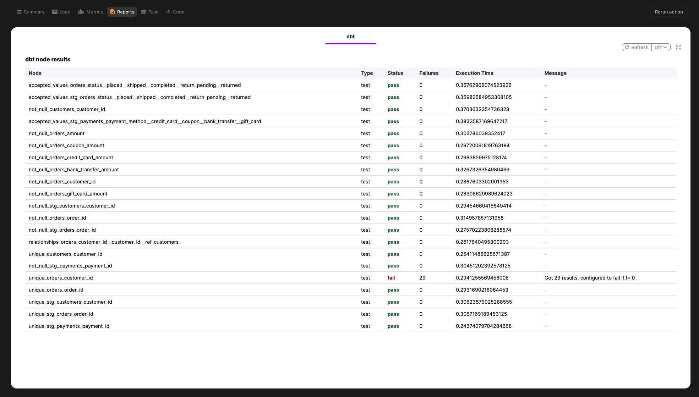

# DBT

The dbt plugin lets you run [dbt](https://www.getdbt.com/) CLI invocations as Flyte tasks. A `DbtTask` maps one `dbtRunner.invoke(...)` call to one Flyte task, so each dbt command appears as its own node in the Flyte run graph.

Use this plugin when you want to orchestrate dbt commands alongside Python tasks, chain dbt invocations with other workflow steps, capture dbt node results as typed task outputs, and optionally render a dbt report in the Flyte UI.

## Installation

```bash
pip install flyteplugins-dbt
```

Install the dbt adapter required by your project in the task image as well, such as `dbt-duckdb`, `dbt-bigquery`, or `dbt-snowflake`.

```python
import flyte

image = (
    flyte.Image.from_debian_base(python_version=(3, 12))
    .with_pip_packages(
        "flyteplugins-dbt",
        "dbt-duckdb",
    )
)
```

## Quick start

Put your dbt project and profiles directory in the task image, then create a `DbtTask` with project-level configuration. Pass the dbt command when you call the task.

```python
from pathlib import Path

import flyte
from flyteplugins.dbt import DbtNodeResult, DbtTask

DBT_PROJECT_DIR = "jaffle_shop"
DBT_PROFILES_DIR = "dbt-profiles"

image = (
    flyte.Image.from_debian_base(python_version=(3, 12))
    .with_pip_packages("flyteplugins-dbt", "dbt-duckdb")
    .with_source_folder(Path(DBT_PROJECT_DIR))
    .with_source_folder(Path(DBT_PROFILES_DIR))
)

env = flyte.TaskEnvironment(name="dbt-jaffle-shop", image=image)

dbt_build = DbtTask(
    name="dbt-build",
    task_environment=env,
    project_dir=DBT_PROJECT_DIR,
    profiles_dir=DBT_PROFILES_DIR,
    profile=DBT_PROJECT_DIR,
    report=True,
)

@env.task
async def main() -> list[DbtNodeResult]:
    return await dbt_build.aio(command="build")
```

`project_dir`, `profiles_dir`, `profile`, and `target_path` are configured on the task because they describe the dbt project layout. The actual dbt invocation is a task input, so the same `DbtTask` can run different commands.

## Commands and arguments

Pass `command` as either a shell-style string or an explicit list of tokens:

```python
await dbt_build.aio(command="build")
await dbt_build.aio(command="docs generate")
await dbt_build.aio(command=["source", "freshness"])
```

Use the typed task inputs for common dbt selectors and targets:

```python
await dbt_build.aio(
    command="test",
    select=["stg_orders+"],
    exclude=["tag:slow"],
    target="prod",
)
```

Use `extra_args` for dbt flags that are not modeled directly:

```python
await dbt_build.aio(
    command="run",
    extra_args=["--full-refresh"],
)
```

`DbtTask` manages these flags itself, so do not pass them in `extra_args`: `--project-dir`, `--profiles-dir`, `--profile`, `--target`, `--target-path`, `--select`, and `--exclude`.

## Chaining dbt tasks

dbt does not support [parallel programmatic invocations](https://docs.getdbt.com/reference/programmatic-invocations?version=2#parallel-execution-not-supported) in the same Python process. When orchestrating multiple dbt commands from one Flyte task, run them sequentially:

```python
@env.task
async def dbt_pipeline() -> list[DbtNodeResult]:
    await dbt_build.aio(command="run")
    return await dbt_build.aio(command="test")
```

You can override task execution settings per call:

```python
@env.task
async def dbt_pipeline():
    await dbt_build.override(short_name="dbt-run").aio(command="run")
    await dbt_build.override(short_name="dbt-test").aio(command="test")
```

## Outputs

`DbtTask` returns a list of `DbtNodeResult` values summarized from dbt node results.

```python
from flyteplugins.dbt import DbtNodeResult

@env.task
async def count_failed_tests() -> int:
    results: list[DbtNodeResult] = await dbt_build.aio(command="test")
    return sum(result.status.lower() == "fail" for result in results)
```

Each `DbtNodeResult` includes:

| Field | Description |
| ----- | ----------- |
| `unique_id` | dbt unique node ID |
| `name` | dbt node name |
| `resource_type` | dbt resource type, such as `model`, `test`, or `source` |
| `status` | dbt node status |
| `message` | dbt message, when available |
| `failures` | Failure count, when dbt provides one |
| `execution_time` | Node execution time, when available |
| `relation_name` | Relation name, when dbt provides one |

Some dbt commands, such as commands that return plain strings instead of node result objects, may return an empty list. The dbt command output is still available in task logs.

## Reports and failures

Set `report=True` to write a dbt report tab for the task. The report is a table with one row per dbt node, showing the node name, resource type, status, failure count, execution time, and message. It does not include relation names; read `relation_name` from the returned `DbtNodeResult` values instead.

```python
dbt_test = DbtTask(
    name="dbt-test",
    task_environment=env,
    project_dir=DBT_PROJECT_DIR,
    profiles_dir=DBT_PROFILES_DIR,
    profile=DBT_PROJECT_DIR,
    report=True,
)
```

If dbt reports failure, the task fails. If dbt provides an exception, the plugin raises that exception. Otherwise, it raises `DbtInvocationError` with a summary of the failing node results.

The report is written before the failure is raised, so a failed dbt task can still show which nodes succeeded and which nodes failed.

For example, a failing `dbt test` task can still show the full node result table in the report:



## Custom dbt callbacks

Pass dbt event callbacks to `DbtTask` when you need custom logging or event handling.

```python
from dbt_common.events.base_types import EventMsg

def print_version_callback(event: EventMsg):
    if event.info.name == "MainReportVersion":
        print(f"We are thrilled to be running dbt{event.data.version}")

dbt_build = DbtTask(
    name="dbt-build",
    task_environment=env,
    project_dir=DBT_PROJECT_DIR,
    profiles_dir=DBT_PROFILES_DIR,
    callbacks=[print_version_callback],
)
```

The callback receives dbt's structured `EventMsg`, including `event.info` metadata and event-specific `event.data` fields. For remote execution, callback functions must be importable. If you define a callback in the same file as your `DbtTask`, the plugin serializes it by import path when the workflow is registered. Import-path strings are also supported:

```python
dbt_build = DbtTask(
    name="dbt-build",
    task_environment=env,
    project_dir=DBT_PROJECT_DIR,
    callbacks=["my_project.callbacks.print_version_callback"],
)
```

## Reference

### `DbtTask`

| Parameter | Default | Description |
| --------- | ------- | ----------- |
| `name` | - | Flyte task name |
| `task_environment` | `None` | Task environment that owns the task |
| `project_dir` | `None` | Path to the dbt project directory |
| `profiles_dir` | `None` | Path to the dbt profiles directory |
| `profile` | `None` | dbt profile name |
| `target_path` | `None` | dbt target path |
| `callbacks` | `[]` | dbt event callbacks or import-path strings |
| `report` | `False` | Write a dbt report tab in the Flyte UI |

`DbtTask` also accepts normal Flyte task settings such as `resources`, `secrets`, `queue`, `interruptible`, and `short_name`. Caching is not supported yet; leave `cache` unset or set it to `"disable"`.

If you leave `cache` unset, `DbtTask` inherits the cache setting of its `task_environment`. A `TaskEnvironment` created with `cache="auto"` (or any other enabled cache) therefore makes the `DbtTask` constructor raise `ValueError: DbtTask does not support caching yet`. To keep caching for the environment's other tasks, pass `cache="disable"` to the `DbtTask` explicitly:

```python
env = flyte.TaskEnvironment(name="dbt-jaffle-shop", image=image, cache="auto")

dbt_build = DbtTask(
    name="dbt-build",
    task_environment=env,
    project_dir=DBT_PROJECT_DIR,
    cache="disable",
)
```

### Invocation inputs

| Input | Default | Description |
| ----- | ------- | ----------- |
| `command` | - | dbt command as a string or token list |
| `select` | `None` | dbt selectors passed as `--select` |
| `exclude` | `None` | dbt selectors passed as `--exclude` |
| `target` | `None` | dbt target passed as `--target` |
| `extra_args` | `None` | Additional dbt CLI arguments |
