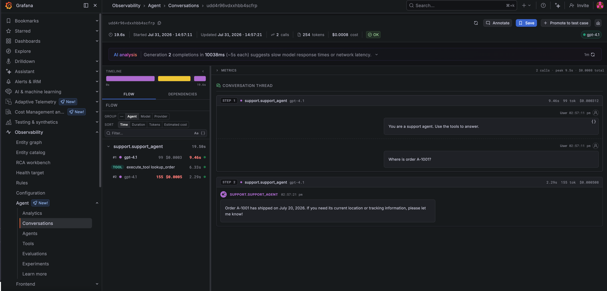
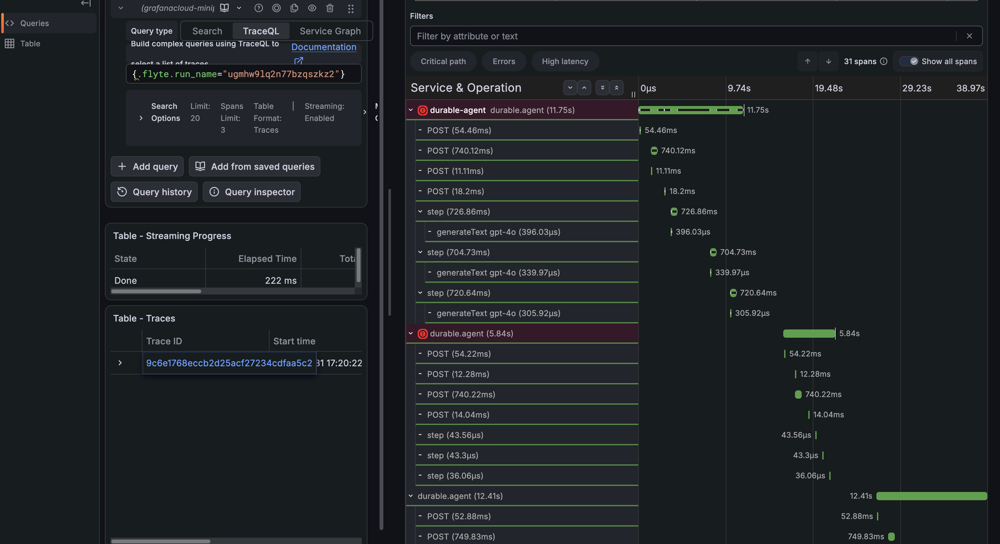
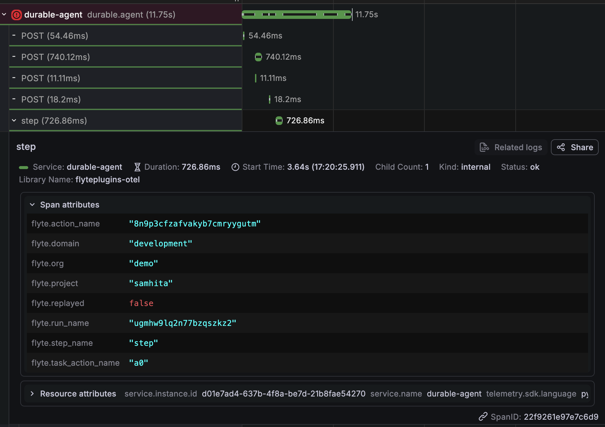
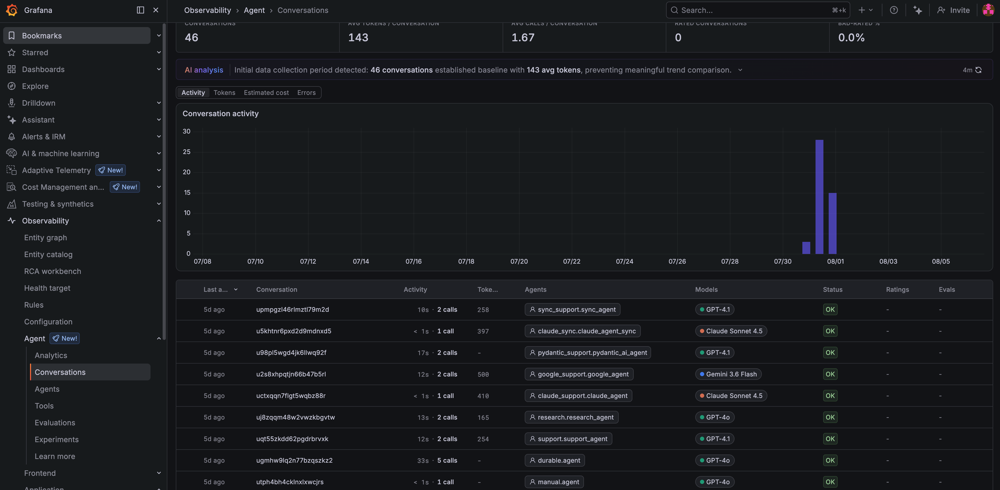
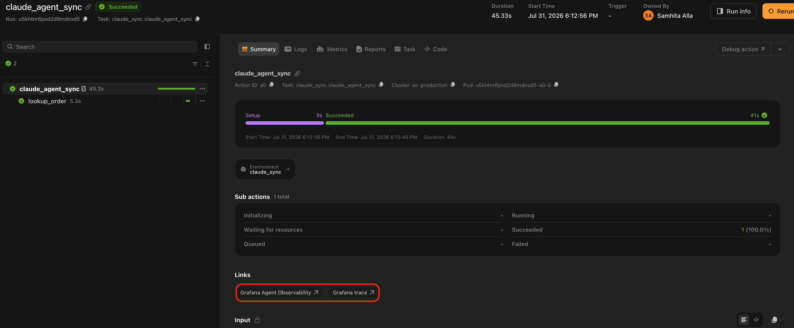

# Grafana Agent Observability

`flyteplugins-agento11y` sends your agent's generations, tool calls, token usage and cost to [Grafana Agent Observability](https://grafana.com/docs/grafana-cloud/observe-and-act/agent-observability/), nested inside the Flyte task span and grouped by Flyte run.

It instruments agents built with the [agent framework plugins](../agents/_index), the `flyteplugins-agents-*` adapters that run a framework's agent loop inside a Flyte task, with each model turn as a durable traced step and each tool as a child action.

One call at module scope is the whole integration. Your agent code does not change:

```python{hl_lines=[3,7]}
import flyte
from flyteplugins.agents.openai import run_agent, tool
from flyteplugins.agento11y import init

# Module scope, not inside a task. The task span opens before the task body runs,
# and the Flyte identity binding rides on that span.
init(service_name="my-agent")

env = flyte.TaskEnvironment(
    name="agent_env",
    image=flyte.Image.from_debian_base().with_pip_packages(
        "flyteplugins-agents-openai",
        "flyteplugins-agento11y[openai]",
    ),
    secrets=[flyte.Secret(key="openai_api_key", as_env_var="OPENAI_API_KEY")],
)


@env.task
async def lookup_order(order_id: str) -> str:
    """A durable Flyte child action, and a tool call in Grafana."""
    return f"Order {order_id} shipped on 2026-07-20."


@env.task
async def support_agent(question: str) -> str:
    return await run_agent(
        question,
        tools=[tool(lookup_order)],
        model="gpt-4.1",
        instructions="You are a support agent. Use the tools to answer.",
    )
```

That covers instrumentation. [Configuration](#configuration) covers the credentials that decide where the generations actually go.



*The agent above, in Agent Observability. The flow on the left is the two model calls with the `lookup_order` tool call between them; the thread on the right is the prompt and the answer. Call count, token usage, and cost sit in the header.*

This plugin builds on [`flyteplugins-otel`](../opentelemetry/_index), which it initializes for you. Read that page first if you want to understand where the spans come from.

## Installation

```bash
pip install "flyteplugins-agento11y[openai]"
```

The extra is what makes your framework's instrumentor available. Install the one matching the agent adapter you use:

| Extra         | Agent adapter                     | agento11y integration package |
| ------------- | --------------------------------- | ----------------------------- |
| `langchain`   | `flyteplugins-agents-langchain`   | `agento11y-langchain`         |
| `langgraph`   | `flyteplugins-agents-langgraph`   | `agento11y-langgraph`         |
| `openai`      | `flyteplugins-agents-openai`      | `agento11y-openai-agents`     |
| `claude`      | `flyteplugins-agents-claude`      | `agento11y-claude-agent-sdk`  |
| `google`      | `flyteplugins-agents-google`      | `agento11y-google-adk`        |
| `pydantic-ai` | `flyteplugins-agents-pydantic-ai` | `agento11y-pydantic-ai`       |

Nothing else has to be configured: `init()` registers an instrumentor for every framework whose integration package it finds. `instrumented_frameworks()` returns the ones that were registered, which is the quickest way to confirm the extra actually installed.

```python
from flyteplugins.agento11y import instrumented_frameworks

print(instrumented_frameworks())   # ('openai',)
```

## What you get beyond agento11y on its own

agento11y works inside a Flyte task without any of this and Grafana's dashboards will light up because they are driven by generation records rather than by trace structure. What is missing is everything Flyte knows and agento11y cannot.

Without the plugin, three model calls in a task become three unrelated root traces. There is no task boundary, nothing tying a generation to the run that produced it, and on a resume the replayed steps produce nothing at all.

### Generations nest inside the task span

One run is one trace, and generation records carry that trace ID. That ID is the link from a generation in Grafana back to the Flyte run that produced it.



*A durable agent's trace. Each `generateText` span sits inside the `flyte.trace` step that produced it, which sits inside the task span. In the second attempt the steps are microsecond replays with no `generateText` child at all: the resume did not call the model again.*



*Expanding one generation shows the binding described below: `gen_ai.conversation.id` is the Flyte run name, `gen_ai.agent.name` the task, and `gen_ai.agent.version` the task version.*

### Flyte identity is bound onto agento11y's context

Nothing has to be restated by hand:

| agento11y concept | Flyte value  |
| ----------------- | ------------ |
| Conversation ID   | Run name     |
| Agent name        | Task name    |
| Agent version     | Task version |

A Flyte run therefore shows up in Grafana as one conversation, and a redeploy shows up as a new agent version, so the before and after of a prompt change is directly comparable.



*The conversations list, one row per Flyte run. **Conversation** holds run names and **Agents** holds task names, so runs driving different frameworks and models line up in a single view.*

Both bindings are switchable because both assume something that is not always true:

- `bind_conversation=False` keeps your own conversation IDs, for a product where a conversation spans more than one run.
- `bind_agent_name=False` lets each framework name its own agents, for a task that drives several: a planner and a worker would otherwise both report as the task.

### Durability is preserved end to end

A crashed and resumed run stays a single trace, because [the trace ID is derived from the run identity](../opentelemetry/durable-traces#one-run-one-trace) rather than generated per process.

Steps the resumed run replayed from its durable log appear marked `flyte.replayed`, so the trace has no holes where durability did its job. And those steps do not call the model again, so a resume does not pay for the generations the first attempt already bought.

## Framework coverage

All six frameworks in the table above capture generations and tool calls. Two capture more:

| Framework   | Also captures                                                                         |
| ----------- | ------------------------------------------------------------------------------------- |
| `langgraph` | Workflow steps, so non-LLM nodes (routing, retrieval) appear too                      |
| `claude`    | Model turns read off the SDK's message stream, via a call wrapper rather than options |

Adapters without an agento11y integration package, crewai and mistral among them, still work: their runs are traced and their tasks and tool calls appear as spans. Only the generations are not captured automatically. [Record them by hand](#recording-generations-by-hand).

## Configuration

With no arguments, `init()` reads the standard `AGENTO11Y_*` variables, which is how the Grafana documentation configures it.

| Variable                   | What it is                                                                 |
| -------------------------- | -------------------------------------------------------------------------- |
| `AGENTO11Y_ENDPOINT`       | Generation export endpoint, for example `https://<your-stack>.grafana.net` |
| `AGENTO11Y_AUTH_MODE`      | `none` (the agento11y default) or `basic`                                  |
| `AGENTO11Y_AUTH_TOKEN`     | The token or password                                                      |
| `AGENTO11Y_AUTH_TENANT_ID` | Basic-auth username. On Grafana Cloud this is your instance ID             |

Supply the credentials as a `flyte.Secret` rather than hardcoding them:

```python{hl_lines=[4,"6-8"]}
env = flyte.TaskEnvironment(
    name="agent_env",
    image=image,
    env_vars={"AGENTO11Y_AUTH_MODE": "basic"},
    secrets=[
        flyte.Secret(key="agento11y_endpoint", as_env_var="AGENTO11Y_ENDPOINT"),
        flyte.Secret(key="agento11y_token", as_env_var="AGENTO11Y_AUTH_TOKEN"),
        flyte.Secret(key="agento11y_tenant_id", as_env_var="AGENTO11Y_AUTH_TENANT_ID"),
        # Spans go to Tempo over OTLP; generations go to Agent Observability over
        # their own channel. Both are needed for the two UI links to resolve.
        flyte.Secret(key="otlp_endpoint", as_env_var="OTEL_EXPORTER_OTLP_ENDPOINT"),
        flyte.Secret(key="otlp_headers", as_env_var="OTEL_EXPORTER_OTLP_HEADERS"),
    ],
)
```

> [!WARNING] Set the auth mode explicitly on Grafana Cloud
> agento11y defaults `AGENTO11Y_AUTH_MODE` to `none`, so a token on its own is never sent and
> the export comes back `401`. Grafana Cloud uses Basic auth with the instance ID as the
> username, which agento11y fills from `AGENTO11Y_AUTH_TENANT_ID` when the mode is `basic`.

Generations and spans travel over two different channels. `AGENTO11Y_ENDPOINT` decides where generations go; `OTEL_EXPORTER_OTLP_ENDPOINT` decides where spans go. Configuring one does not configure the other.

### `init()` parameters

| Parameter           | Default              | What it does                                                                                                     |
| ------------------- | -------------------- | ---------------------------------------------------------------------------------------------------------------- |
| `service_name`      | None                 | Value for `service.name` on the OpenTelemetry side                                                               |
| `endpoint`          | `AGENTO11Y_ENDPOINT` | Generation export endpoint                                                                                       |
| `client`            | None                 | Use an agento11y client you built yourself. It is left alone and not shut down                                   |
| `client_options`    | None                 | Extra `ClientConfig` fields: auth mode, protocol, content capture, a custom generation exporter                  |
| `bind_conversation` | `True`               | Bind the Flyte run name as the conversation ID                                                                   |
| `bind_agent_name`   | `True`               | Bind the Flyte task name as the agent name                                                                       |
| `trace`             | `True`               | Also initialize `flyteplugins-otel`. Turn off if you configure tracing yourself, or if you only want generations |

Anything else is forwarded to `flyteplugins.otel.init()`, including `tracer_provider` for an [OpenTelemetry setup you already have](../opentelemetry/configuration#adopting-a-tracer-provider-you-already-have), and `exporter`, `headers` and `disable_batch`.

`init()` returns the agento11y client and `get_client()` returns it later for recording generations directly.

## Linking back from Grafana

`GrafanaAgentObservability` links a Flyte action to its conversation in Agent Observability, rendered on the action in the Flyte UI. It works precisely because this plugin binds the run name as the conversation ID.

```python{hl_lines=["6-7"]}
from flyteplugins.agento11y import GrafanaAgentObservability
from flyteplugins.otel.grafana import GrafanaTrace


@env.task(links=(
    GrafanaAgentObservability(host="https://myorg.grafana.net"),
    GrafanaTrace(host="https://myorg.grafana.net", datasource_uid="<tempo-uid>"),
))
async def support_agent(question: str) -> str:
    ...
```



*Both links on the same action. **Grafana Agent Observability** opens this run's conversation; **Grafana trace** opens its spans in Tempo.*

The two answer different questions. The first goes to the generations, prompts and cost. The second goes to the distributed trace in Tempo; it lives in [`flyteplugins-otel`](../opentelemetry/configuration#linking-back-from-grafana) because it needs nothing from this package.

The conversation link opens the conversation itself rather than the filtered list, and fills the app's back navigation with the list scoped to the same run.

| Parameter           | Default                                     | What it does                                             |
| ------------------- | ------------------------------------------- | -------------------------------------------------------- |
| `host`              | Required                                    | Stack URL, for example `https://myorg.grafana.net`       |
| `name`              | `"Grafana Agent Observability"`             | Label shown in the Flyte UI                              |
| `app_id`            | `"grafana-agento11y-app"`                   | Grafana app plugin ID                                    |
| `conversation_path` | `"conversations/{conversation_id}/explore"` | Path template within the app                             |
| `list_path`         | `"conversations"`                           | Path of the conversations list, used for back navigation |
| `return_to`         | `True`                                      | Include the back-navigation parameter                    |
| `by_run`            | `True`                                      | Address the conversation by the Flyte run                |

Set `by_run=False` when something other than Flyte owns the conversation ID, typically alongside `bind_conversation=False`. The link then lands on the conversations list rather than on a URL that resolves to nothing.

> [!NOTE]
> The Grafana app moved from `grafana-sigil-app` to `grafana-agento11y-app`. The old ID still
> resolves but is deprecated, which is why the ID and both path templates are settable.

## Recording generations by hand

The client is available whether or not a framework integration is installed, so you can record generations explicitly. They still land inside the Flyte task span and still carry the run's identity because neither of those depends on a framework integration.

This is the path for an agent written against a provider SDK directly or for an adapter that has no agento11y package yet.

```python{hl_lines=[5,8]}
from agento11y import GenerationStart, ModelRef, assistant_text_message, user_text_message
from flyteplugins.agento11y import get_client


@flyte.trace
async def ask(question: str) -> str:
    """A durable model turn, recorded as a generation."""
    client = get_client()
    with client.start_generation(GenerationStart(model=ModelRef(provider="openai", name="gpt-4o"))) as rec:
        answer = await call_the_model(question)
        rec.set_result(
            input=[user_text_message(question)],
            output=[assistant_text_message(answer)],
        )
    return answer
```

Putting the call inside a [`flyte.trace`](../../user-guide/tasks/task-programming/traces) step is what makes it durable: a resumed run replays the recorded result instead of calling the model again.

## Content capture

agento11y sends metadata by default (model, token usage, tool names, timing) and keeps prompts and responses local unless you opt in.

That is an agento11y setting rather than a Flyte one. `client_options` is the passthrough for it: every key becomes a field on agento11y's own `ClientConfig`, so content capture is switched on exactly as it would be outside Flyte. Check the [agento11y documentation](https://grafana.com/docs/grafana-cloud/monitor-applications/agent-observability/) for the current field names and defaults; they belong to that library, not to this plugin.

The same passthrough covers anything else `init()` does not surface: auth mode and token, protocol or a custom generation exporter.

```python
init(service_name="my-agent", client_options={"generation_exporter": MyExporter()})
```

`init()` sets three `ClientConfig` fields itself: `tracer` (so generations nest inside the Flyte task span), `generation_export_endpoint` (from `endpoint=`), and `generation_exporter` (a no-op when no endpoint is configured). Anything you put in `client_options` wins over all three.

## Instrumenting a different backend

`flyteplugins-agents-core` exposes two registries that let an out-of-tree package instrument the frameworks the adapters drive. They are how this plugin attaches agento11y's handlers to calls the adapter owns rather than you, and neither knows anything about Grafana. If you maintain instrumentation for a different vendor, register against the same hooks.

Use `register_instrumentor` when the framework accepts a handler in its run payload. The adapter offers you the framework-native payload and uses whatever you return:

```python
from flyteplugins.agents.core import register_instrumentor


def add_my_handler(config):
    config = dict(config or {})
    config.setdefault("callbacks", []).append(MyHandler())
    return config


register_instrumentor("langgraph", add_my_handler)
```

Use `register_call_wrapper` when the SDK cannot be instrumented by handing it an object, and the only way in is to wrap the call itself. That is the case for the Claude Agent SDK, whose model turns arrive as messages on the stream returned by `query`:

```python
from flyteplugins.agents.core import register_call_wrapper


def wrap(call):
    def instrumented(*args, **kwargs):
        return my_recording_query(_query_fn=call, **kwargs)

    return instrumented


register_call_wrapper("claude", wrap)
```

Framework names match the adapter directory: `langchain`, `langgraph`, `openai`, `claude`, `google`, `pydantic_ai`.

Both registries are best-effort by construction. If your instrumentor or wrapper raises, the adapter logs at debug level and runs the agent uninstrumented, because observing an agent must never be the reason it stops working. The flip side is that a handler which never attaches fails quietly, so confirm registration with `flyteplugins.agents.core.instrumented_frameworks()` rather than assuming it.

## Limitations

**`init()` must be called at module scope:** The task span opens before the task body runs, so initializing from inside the body means that task's span and the identity binding that rides on it have already been missed. `flyteplugins-otel` logs a warning when it detects this.

**Not every adapter has an integration:** crewai and mistral have Flyte adapters but no agento11y package, so their generations are not captured automatically.

**Short tasks need the exit flush:** agento11y batches generations and flushes on an interval and unlike OpenTelemetry's tracer provider it registers no exit hook of its own. The plugin registers one for a client it created, so a task that finishes inside the flush window does not lose its generations. A client you pass in with `client=` is yours to flush.

**With no endpoint configured, generations are dropped:** Without `AGENTO11Y_ENDPOINT` or `endpoint=`, the plugin installs a no-op exporter and logs a warning once. OpenTelemetry spans are unaffected and follow their own exporter settings.

## Related

- **[OpenTelemetry](../opentelemetry/_index)**: the tracing layer this plugin builds on.
- **[Traces across crashes and resumes](../opentelemetry/durable-traces)**: why a durable run needs more than a stock OpenTelemetry setup.
- **[Agent frameworks](../agents/_index)**: the `flyteplugins-agents-*` adapters this instruments.
- **[Build an agent](../../user-guide/agents/build-agent/_index)**: building the agent in the first place.

> [!NOTE] Runnable examples
> The plugin ships [worked examples](https://github.com/flyteorg/flyte-sdk/tree/main/plugins/agento11y/examples)
> for OpenAI Agents, LangGraph, Claude, Google ADK, PydanticAI, manual generations and a
> crash-and-resume agent whose trace stays intact.
