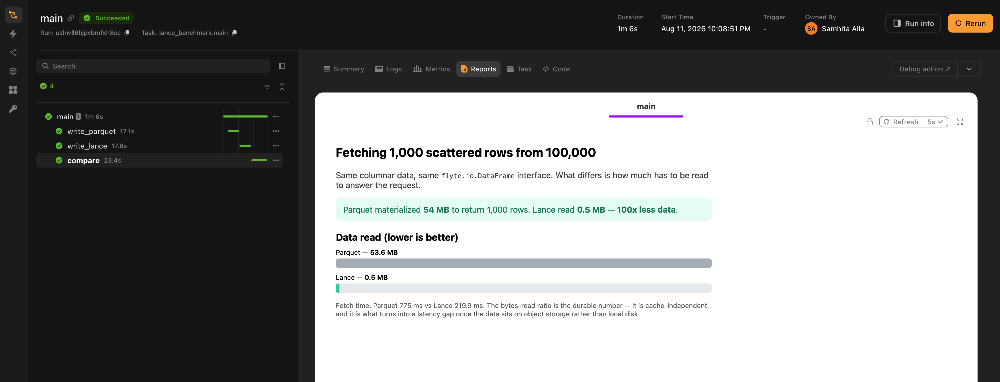

# Lance

The Lance plugin adds a `lance` format to `flyte.io.DataFrame`, so a [Lance](https://lancedb.github.io/lance/) dataset can be passed between tasks as a typed input and output.

Lance datasets are lazy. Opening one reads its manifest and nothing else; rows arrive when you ask for them, sequentially for a scan or by index for a shuffled training loop. The plugin is built to keep that intact across a task boundary, so the decoder hands you a live `lance.LanceDataset` rather than a table it downloaded on your behalf.

## Lance vs. Parquet

Both are columnar and Arrow-native. Read a dataset end to end and they cost about the same. The difference shows up when you want a subset of the rows.

Parquet stores rows in row groups, and a row group is the smallest thing you can decode. Ask for fifty scattered rows and you pay for every row group they happen to land in. Flyte's built-in Parquet decoder is blunter still: it materializes the entire table into memory, and only then can you index into it.

Lance addresses rows individually, and its vector and scalar indices let a query jump to the matching ones. Fifty scattered rows costs about fifty rows.

|                                     | Parquet                                                             | Lance                                                |
| ----------------------------------- | ------------------------------------------------------------------- | ---------------------------------------------------- |
| Full sequential scan                | Fast                                                                | Fast                                                 |
| Random access to scattered rows     | Reads whole row groups; Flyte's decoder materializes the full table | Reads only the requested rows                        |
| Vector similarity search            | Not supported in-format                                             | Built in (IVF-PQ, IVF-HNSW)                          |
| Large binary values (images, audio) | Inflates row groups; every scan pays for them                       | Blob encoding keeps them out of the column layout    |
| Schema evolution                    | Rewrite the dataset                                                 | Add or alter columns without rewriting existing data |
| Versioning                          | External (Delta, Iceberg)                                           | Built into the format, but moot under Flyte          |
| Ecosystem reach                     | Read by nearly every engine                                         | Narrower, growing                                    |

### Which one should you use?

Parquet, if your access pattern is "read all of it" or "read a whole partition of it". That covers most ETL, aggregation, and anything headed for a SQL engine. It is also what you want when the data is going to a team whose tooling you don't control, because everything reads Parquet and that is not a small advantage.

Lance, if you go after scattered rows:

- **Shuffled training:** SGD wants a different random order every epoch. Lance serves it by random access; Parquet re-reads the dataset.
- **Multimodal rows:** Image or audio bytes stored beside their labels, where most tasks touch only the labels.
- **Vector search:** Embeddings with an ANN index in the same dataset as the data they describe.
- **Point lookups:** Fetching individual records by id from a large table.
- **Datasets bigger than memory:** Stream them rather than partition them by hand.

Both are formats on `flyte.io.DataFrame`, so one task can produce Parquet and another Lance in the same workflow. What you cannot do is move a dataset cheaply between them. A `lance` input arrives as a `lance.LanceDataset` or a `pyarrow.Table`, and there is no third option, so this is a choice you make per dataset rather than per task. [Other dataframe types](#other-dataframe-types) covers what that rules out.

### How much does it matter?

The [benchmark below](#measuring-the-difference) pulls 1,000 random rows out of 100,000, each carrying a 512-byte payload. Parquet materializes a 53.6 MB table to answer that. Lance materializes just 0.54 MB, which is only the 1,000 rows you actually asked for.

The 100x gap is the more reliable number because it comes from how the data is laid out, not the machine it’s running on. Flyte’s Parquet decoder has to build the entire table before it can index into it, and a warm cache doesn’t change that. The actual wall-clock speedup is less dramatic: around 10x on local disk and 3.5x against object storage in the same benchmark. Those numbers will vary with row size and batch size though.

## Installation

```bash
pip install flyteplugins-lance
```

Put the plugin in your task image and you're done. Flyte finds it through the `flyte.plugins.types` entry point and registers the `lance` format on startup, so there is nothing to import and nothing to call:



## What the plugin registers

Four handlers, against Flyte's dataframe transformer engine:

| Python type          | Direction | Format            | Behavior                                                                   |
| -------------------- | --------- | ----------------- | -------------------------------------------------------------------------- |
| `lance.LanceDataset` | output    | `lance` (default) | Streams the source dataset fragment by fragment into Flyte-managed storage |
| `lance.LanceDataset` | input     | `lance` (default) | Opens lazily via `lance.dataset(uri)`; you get a live handle               |
| `pyarrow.Table`      | output    | `lance` (opt-in)  | Writes the in-memory table with `lance.write_dataset`                      |
| `pyarrow.Table`      | input     | `lance` (opt-in)  | Materializes the dataset in memory, honoring column subsetting             |

`lance.LanceDataset` already defaults to the `lance` format, so you never have to annotate it. `pyarrow.Table` doesn't, and stays on Parquet unless you say otherwise. That is the one place the format shows up in your type signatures.

### Other dataframe types

Those four are the entire surface, which is worth knowing before you design a workflow around it. The Polars plugin can hand data to pandas and PySpark because all three speak Parquet. Lance has no such common currency here, so there is no lance-to-pandas or lance-to-Polars handler. So do the conversion yourself inside the task. Take the Arrow table and call `to_pandas()`, or take the handle and convert a batch at a time:



On anything large, use the second one. A whole-table `to_pandas()` throws away the streaming property you picked Lance for, and hands the result to pandas, which will sit on it in memory.

## Passing a dataset between tasks

Two ways to do this, and they are not interchangeable.

### Return a live handle

Return a `lance.LanceDataset`, accept one on the other side. No wrapper, no `open()`:



The `ds` the consumer gets is already open. `count_rows()` answers from metadata, `to_batches()` pulls a batch at a time, and at no point does the whole dataset come down.

Encoding is memory-bounded too, since it streams the source through an Arrow `RecordBatchReader`. Bounded is not the same as cheap, though: every fragment still gets read and written again.

### Hand off by reference

If the task already wrote the dataset, usually in chunks because it was too big to hold, don't make Flyte read it back. Hand over the path:



`DataFrame(uri=..., format="lance")` uploads the `.lance` directory as it sits. No Arrow round trip. The consumer can still ask for a plain `lance.LanceDataset`; the `lance` format sorts out the handoff no matter which form the producer chose.

### Choosing between them

The distinction is mechanical, not stylistic. Return a `lance.LanceDataset` and the encoder runs: it reads your dataset through Arrow and writes a new one at the destination. Return a `DataFrame` carrying a URI and no encoder runs at all, because Flyte just uploads the directory recursively, the same way it treats any pre-written path for any format.

So one gives you a copy of a directory and the other gives you a dataset reconstructed from its rows. Whatever isn't in those rows doesn't survive the trip:

|                           | Return `lance.LanceDataset`          | Return `DataFrame(uri=…)`  |
| ------------------------- | ------------------------------------ | -------------------------- |
| Cost                      | Re-reads and rewrites every fragment | Byte-for-byte upload       |
| Vector and scalar indices | **Dropped**                          | Preserved                  |
| Blob-encoded columns      | **Fails to encode**                  | Preserved                  |
| Fragment layout           | Coalesced; fragment ids change       | Identical                  |

> [!WARNING] Indices and blob columns need the reference form
> An ANN index does not survive a handle return, and nothing warns you: the task succeeds and the copy on the other side is simply unindexed. A blob column is louder about it. The encoder re-reads the dataset through a scanner, which for a blob column yields the `{position, size}` descriptors rather than the values, and writing those back out fails with `Blob v2 struct input requires file version >= 2.2`. Hand both kinds of dataset off with `DataFrame(uri=..., format="lance")`.

Rough rule: the handle is fine when the task just built something small in memory. Reach for the reference once the dataset is large, was written in chunks, or carries indices or blob columns.

Neither form copies data at call time, which means the usual dataframe caching caveat applies here: a downstream cached task won't hit on identical content sitting at a new path. [Content-based caching](../../user-guide/tasks/task-configuration/caching#content-based-caching-for-dataframes-files-and-directories) is the fix.

## Arrow tables and the explicit `lance` format

`pyarrow.Table` defaults to Parquet, so this is where you name the format explicitly. `Annotated[DataFrame, "lance"]` does it:



Those same stored bytes read back either way. `read_as_dataset` gets a streaming handle. `read_as_table` decodes eagerly into memory, narrowed to whichever columns its `OrderedDict` annotation names.

Eager decode pulls in the whole dataset, which is fine for a small lookup table and wrong for anything big or multimodal.

## Reading only what you need

Narrowing happens on the open handle, inside the task, and because the dataset is lazy it comes straight off the bytes you fetch:



- **Column projection**: `columns=[...]` on `scanner()` or `take()`. Columns you don't name are never touched.
- **Predicate pushdown**: `filter="value > 98000000"` is SQL, evaluated inside Lance. Rows that don't match are never decoded, and a scalar index on that column turns the whole scan into a lookup.
- **Random access**: `take([...])` fetches the row indices you hand it. This is the one Parquet can't do cheaply, and it is what makes shuffled training practical.

There's a fourth, `batch_size` on `scanner()`, in the streaming example above. It caps peak memory no matter how big the dataset gets.

## Multimodal data

Blob encoding moves large binary values out of the regular column layout, so a scan that doesn't ask for the column doesn't pay for it. Mark the field in the schema:

> [!NOTE] A blob column reads differently from every other column
> `take()` and `scanner()` do not return a blob value. They return a `{position, size}` descriptor, and it is easy to miss, because code that treats it as bytes usually runs without complaining. Read the bytes with `take_blobs()`, which hands back file objects instead.



Write it in chunks and hand it off by reference, which blob columns require anyway:



### Streaming a shuffled epoch

Draw a fresh random order each epoch, pull it in batches, straight out of object storage. Labels come from `take()` and the image bytes from `take_blobs()`, both scoped to the same rows:



Peak memory is one batch whether the dataset holds 4,000 rows or 40 million.

Tar and WebDataset stream this just as well, to be fair. What they can't do is shuffle it properly: reaching an arbitrary row means reading forward to it, so they approximate with interleaved shards and a buffer window. Lance addresses rows directly, so the shuffle is the real thing.

### Reading the labels without the images

The images being blob-encoded means a scan over the structured columns skips them:



A `BlobFile` is a file object, so you can also read part of a value rather than all of it, which is how you inspect headers or sample a few frames without pulling whole images across:



## Parallel reads across fragments

Lance stores a dataset as fragments, which makes them an obvious unit of parallelism: give each mapped task one fragment id and every worker reads a disjoint set of files.

Pass the dataset as a `flyte.io.DataFrame` here, not a `lance.LanceDataset`. The reference form leaves the bytes alone, so a fragment id the parent computed still points at the same fragment in every child. Return a handle instead and the re-encode coalesces the fragments underneath you, leaving those ids pointing at nothing:



Every worker opens the same URI, so nothing gets copied per worker and how wide you fan out is a question about your cluster, not your storage.

## Indices and schema evolution

These belong to Lance, not to the plugin. They show up here because the handoff form decides whether they make it across a task boundary.

**Vector and scalar indices:** Build them on the open handle: `create_index()` for vectors (`IVF_PQ`, `IVF_HNSW_PQ`, `IVF_HNSW_SQ`), `create_scalar_index()` for the rest (`BTREE`, `BITMAP`, `INVERTED`, and others). Query with `scanner(nearest={"column": "vec", "q": query, "k": 10})`. A scalar index also speeds up the predicate pushdown above, including as a pre-filter on a vector search. Because indices live inside the dataset directory, they ride along on a reference handoff and vanish on a handle return.

**Schema evolution:** `add_columns()` adds a column without rewriting the ones already on disk, and can compute it from a SQL expression over the existing ones. It is cheap, and it is worth reaching for on a dataset your own task just built, before you hand it on.

Apply it to an input, though, and it writes to the producing task's output. The decoder hands you a live handle onto storage rather than a copy, which is what makes streaming work, and Lance's in-place operations write wherever the dataset actually lives. Treat a dataset you were handed as read-only and return a new one instead.

Lance's versioning comes out of that same in-place model, and there is not much for it to do here: Flyte writes every output once, to a new path, so the only versions you will ever see are the producing task's own write steps.

## Object storage and credentials

The plugin feeds Flyte's storage configuration into Lance's `storage_options`, so reads and writes against remote storage use the same credentials as the rest of the run:

| Backend                       | What is passed through                                                                                                     |
| ----------------------------- | -------------------------------------------------------------------------------------------------------------------------- |
| S3 (`s3://`)                  | Access key, secret key, region, and custom endpoint. An `http://` endpoint (a local MinIO, say) also sets `aws_allow_http` |
| GCS (`gs://`, `gcs://`)       | Nothing explicit; Lance's object store picks up application default credentials                                            |
| Azure (`abfs://`, `abfss://`) | Account name and key, plus tenant, client id, and client secret when present                                               |

In practice this means a task on a cluster picks up its IAM role or workload identity without you doing anything, and the code you ran locally is the code that runs there. Lance pulls only the row ranges and columns each batch needs, direct from the bucket, with no staging step on local disk.

One wrinkle worth knowing if you ever assemble `storage_options` by hand: Lance spells the S3 endpoint key `aws_endpoint`, where several other object-store-backed libraries use `aws_endpoint_url`. The plugin already accounts for it.

## Measuring the difference

The benchmark writes the same data twice, once as Parquet and once as Lance, then fetches an identical shuffled batch from each and renders a report. Both producers build the same Arrow table:



and differ only in the return annotation:



What it compares is how much each side has to materialize to answer the request, via `pa.Table.nbytes` on the result. This measures decoded size rather than I/O, which is exactly the point: Parquet's number is much larger because the decoder has to build the entire table first.



Each task publishes the result as a report on the run:



That run is on a cluster, reading from object storage, and it shows the two numbers pulling apart: the materialized-size ratio holds at 100x, while the wall-clock gap is roughly 3.5x. On local disk the same benchmark comes out nearer 10x. Scattered reads against a bucket pay per-request latency that a local file doesn't, which eats into the advantage without erasing it.

The gap widens as the dataset grows, since Parquet's cost tracks the dataset while Lance's tracks the batch, and it narrows as individual rows get fat relative to the batch.

## Running the examples

Each example is a self-contained script. Compose the tasks in a driver task and run that:



The other two are shaped the same way. `multimodal_streaming.py` builds a blob-backed dataset and streams an epoch out of it:



and `parquet_vs_lance.py` writes both formats and compares them:



Running a script directly with `python lance_example.py` submits to whatever cluster your Flyte config names. To try the same code against local disk first:

```bash
flyte run --local lance_example.py main
```

Same code path either way. A local run just can't show you the parts that only exist in a bucket: per-request latency, credential threading, and how big the bytes-read advantage really is on your data.

## Common use cases

- **Training-data pipelines**: convert a swarm of tiny per-sample files into one Lance dataset, then stream shuffled batches from object storage on every epoch, with no per-file connection setup.
- **Vector search and RAG**: keep embeddings, an ANN index, and the source documents in one dataset that tasks query directly.
- **Feature stores and point lookups**: fetch individual records by id out of a large table without scanning it.
- **Multimodal datasets**: image, audio, or video bytes stored beside structured labels, where most stages read only the labels.
- **Datasets larger than memory**: stream them in bounded batches instead of hand-partitioning them across tasks.
