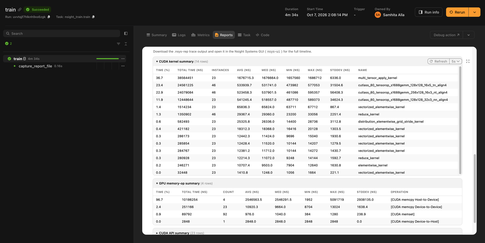

# NVIDIA Nsight Systems

The Nsight plugin runs a Flyte task under [NVIDIA Nsight Systems](https://developer.nvidia.com/nsight-systems) (`nsys`). Add the `[[flyteplugins.nsight.nsys_profile|@nsys_profile]]` decorator to a task and each run gives you two things:

- A **GPU Profile** tab in the task's report, with summary metrics, the most expensive CUDA kernels, a breakdown of your NVTX ranges, and detail tables from `nsys stats`.
- The raw `.nsys-rep` trace, which you can download and open in the Nsight Systems GUI to see the full timeline.

The decorator doesn't change the task's signature or body. To keep it in your code and switch profiling on only for some runs, see [Turning profiling off](#turning-profiling-off).

## Installation

Install the plugin from the `flyte-sdk` repository:

```bash
pip install "flyteplugins-nsight @ git+https://github.com/flyteorg/flyte-sdk@6d3d72b8198d0444ad0471836ca118d32344b268#subdirectory=plugins/nsight"
```

The plugin requires `flyte` 2.5.10 or later. The task image needs the `nsys` CLI on its `PATH`, or the task fails at startup. The [NGC PyTorch images](https://catalog.ngc.nvidia.com/orgs/nvidia/containers/pytorch) include it.

## Quick start

Define an image that has `nsys`, torch, and the plugin:



Give the task a GPU:



Then add `@nsys_profile` above `@env.task`. The `[[flyteplugins.nsight.nvtx.range|nvtx.range]]` labels are optional, but they make the timeline and the report easier to read:



Run it like any other task:



`@nsys_profile` must be the outermost decorator, above `@env.task`. Placed anywhere else, it raises `TypeError` when the module is imported.

The decorator also turns on the task's [report](../../user-guide/tasks/task-programming/reports), so you don't need `report=True`.

## Reading the profile

Open the run, select the task, and go to **Reports** → **GPU Profile**. The tab shows:

| Section                      | What it tells you                                                                                                  |
| ---------------------------- | ------------------------------------------------------------------------------------------------------------------ |
| Summary tiles                | Total GPU kernel time, kernel launches, distinct kernels, host-to-device and device-to-host bytes, NVTX range count |
| Top CUDA kernels by GPU time | The ten kernels that used the most GPU time, with long C++ signatures shortened to readable names                  |
| NVTX ranges by time          | Where time went across the regions you labeled with `nvtx.range`                                                  |
| Detail tables                | Full rows for the CUDA kernel, GPU memory-op, CUDA API, and NVTX range summaries, collapsed by default            |




The `.nsys-rep` file is attached to the run as the output of a traced step named `capture_report_file`, or `capture_report_file_sync` for an `nsys.range` block in a synchronous task. Download it from that step's outputs in the UI and open it in `nsys-ui`, the Nsight Systems desktop app, to inspect the timeline. It shows kernel overlap, CPU-side stalls, memory copies, and synchronization gaps that the summary tables don't.

## Profiling part of a task

A long task profiled end to end can produce a trace of several gigabytes. Its first steps also include one-time startup work, such as CUDA context creation, cuDNN autotuning, and module loading. To profile only the code you're investigating, set `capture="manual"` and wrap that code in `[[flyteplugins.nsight.nsys.range|nsys.range]]`:



`build_model`, `train_step`, and `evaluate` are ordinary PyTorch helpers, defined in the full example file.

With `capture="manual"` the task starts under `nsys`, but nothing is recorded until execution enters an `nsys.range` block. Each block is collected separately. It produces its own `.nsys-rep` and its own section in the GPU Profile tab, titled `Nsight region: <name>`, so the training and evaluation regions in this example get separate traces. A block that runs several times, for example inside a loop, produces a section and a trace each time it runs.

Write the block to match the task function:

- In an `async def` task, use `async with nsys.range(...)`.
- In a plain `def` task, use `with nsys.range(...)`. The decorator profiles synchronous tasks too:



Don't confuse `nsys.range` with `nvtx.range`. `nsys.range` starts and stops a recording, and `nvtx.range` only labels code inside one. Use `nsys.range` only with `capture="manual"`, and don't nest one inside another. Otherwise the block tries to start a second recording while one is running. It retries for about seven seconds, then logs `could not start collection`. Its code is still recorded by the running collection, but it gets no section or trace of its own.

## Labeling the timeline with NVTX

`nvtx.range` marks a block of code as a named span on the Nsight timeline and in the NVTX section of the report. `[[flyteplugins.nsight.nvtx.mark|nvtx.mark]]` records a single point in time:

```python
from flyteplugins.nsight import nvtx

with nvtx.range("forward"):
    out = model(x)

nvtx.mark("checkpoint saved")
```

Both are thin wrappers over `torch.cuda.nvtx`. When torch isn't installed, or is a CPU-only build, they do nothing, so annotated code still runs on a laptop or in a CPU-only test.

Label the phases you'll want to find on the timeline, such as data loading, the forward and backward passes, and the optimizer step. Unlabeled, the timeline shows only kernels and API calls.

## Choosing what to trace

`trace` selects the `nsys` trace domains. The default, `("cuda", "nvtx")`, covers most GPU work and needs no extra permissions.

| Domain   | Records                                      | Extra permissions |
| -------- | -------------------------------------------- | ----------------- |
| `cuda`   | CUDA API calls, kernels and memory copies    | No                |
| `nvtx`   | Your `nvtx.range` spans and markers          | No                |
| `cudnn`  | cuDNN API calls                              | No                |
| `cublas` | cuBLAS API calls                             | No                |
| `osrt`   | OS runtime calls such as `read`, `poll` and locks; useful for spotting CPU-side and I/O stalls | Yes |

`nsys` accepts other domains as well; the plugin passes `trace` through unchanged. See the [Nsight Systems user guide](https://docs.nvidia.com/nsight-systems/UserGuide/index.html) for the full list.

`sample` sets CPU sampling, passed to `nsys --sample`. For example, `sample="cpu"` adds CPU call stacks to the trace and `sample="none"` turns sampling off. When omitted, `nsys` uses its own default.

`reports` lists the `nsys stats` reports the plugin runs. The default is `flyteplugins.nsight.DEFAULT_REPORTS`: `cuda_gpu_kern_sum`, `cuda_gpu_mem_time_sum`, `cuda_gpu_mem_size_sum`, `cuda_api_sum`, and `nvtx_pushpop_sum`. The GPU Profile tab only renders these five, so use `reports` to drop one, not to add others. A report that your `nsys` version doesn't support, or that has no rows, is skipped.

If you only want the report and not the trace file, set `attach_report=False`.

## Profiling distributed training

`@nsys_profile` works on tasks in a [clustered task environment](../../user-guide/tasks/task-configuration/clustered-task-environment) that uses the default `TorchRun` runtime. Only the global primary worker, `RANK` 0, runs under `nsys`. Every other rank runs normally.



In data-parallel training, rank 0 does the same work as the others, and its timeline includes the NCCL all-reduce in the backward pass.

The trace isn't attached as a run output for a clustered task. The plugin uploads the `.nsys-rep` to the task's raw data path instead, and prints its location in the GPU Profile tab, below the charts. To download it, pass that location to `File.from_existing_remote`:

```python
import flyte
from flyte.io import File

flyte.init_from_config()
# Replace with the location shown in the GPU Profile tab.
File.from_existing_remote("<trace-location>").download_sync("rank0.nsys-rep")
```

## Turning profiling off

Running under `nsys` adds overhead. To keep the decorator in your code but skip profiling, set `enabled=False`. The decorator then returns the task unchanged.

`enabled` is evaluated each time the module is imported: on your machine when you run `flyte run` or `flyte deploy`, and again in the task container. Both must get the same value. If you drive it from an environment variable, pass that variable to the task as well:

```python{hl_lines=[12,16]}
import os

import flyte
from flyteplugins.nsight import nsys_profile

PROFILE_GPU = os.getenv("PROFILE_GPU", "0")

env = flyte.TaskEnvironment(
    name="train",
    image=image,  # the image from the quick start
    resources=flyte.Resources(gpu="L4:1"),
    env_vars={"PROFILE_GPU": PROFILE_GPU},
)


@nsys_profile(enabled=PROFILE_GPU == "1")
@env.task
async def train() -> float: ...
```

```bash
PROFILE_GPU=1 flyte run train.py train
```

With `flyte deploy`, the value in your shell at deploy time applies to every run of that deployed version.

Profiling also switches itself off when it can't run:

- In a local run, the task runs unprofiled and `nsys.range` blocks do nothing.
- If `nsys start` fails, the plugin logs a warning and runs the task unprofiled.

Profiling errors never fail the task. If the task body raises an exception, the plugin stops collection, renders the report, and uploads the trace before the exception propagates, so a failed run has a profile too.

## Permissions

The `osrt` trace domain needs `CAP_SYS_ADMIN` and an unconfined AppArmor profile. Without them, `nsys` reports a permission error such as `insufficient privileges` in the task logs, or the trace has no OS runtime data.

Grant both with `pod_template=flyte.PodTemplate().allow_nested_sandboxing()`. It imports the `kubernetes` package, so add that to the task image and to your local environment:

```python{hl_lines=[1,7,11]}
image = image.with_pip_packages("kubernetes")  # the image from the quick start

env = flyte.TaskEnvironment(
    name="train",
    image=image,
    resources=flyte.Resources(cpu="4", memory="16Gi", gpu="L4:1"),
    pod_template=flyte.PodTemplate().allow_nested_sandboxing(),
)


@nsys_profile(trace=["cuda", "nvtx", "osrt"])
@env.task
async def train() -> float: ...
```

`allow_nested_sandboxing()` adds `CAP_SYS_ADMIN` and an unconfined AppArmor profile, sets `allowPrivilegeEscalation: false`, and doesn't make the container privileged. See [Pod templates](../../user-guide/tasks/task-configuration/pod-templates) for how pod templates work.

If your cluster doesn't allow that capability, leave `osrt` out of `trace` and drop the pod template. The `cuda`, `nvtx`, `cudnn`, and `cublas` domains need no extra permissions.

If `nsys` reports `ERR_NVGPUCTRPERM`, the GPU driver restricts profiling to administrators. A cluster administrator can lift that by setting the NVIDIA driver option `NVreg_RestrictProfilingToAdminUsers=0` on the GPU nodes.

## Troubleshooting

| Symptom                                                            | Likely cause and fix                                                                                                                                                             |
| ------------------------------------------------------------------ | -------------------------------------------------------------------------------------------------------------------------------------------------------------------------------- |
| The task fails at startup with `FileNotFoundError` for `nsys`      | The image doesn't include Nsight Systems. Use an NGC PyTorch base image, or install the `nsys` CLI.                                                                             |
| `ModuleNotFoundError: No module named 'torch'` on an NGC image     | The task venv can't see NGC's system packages. Add the `include-system-site-packages` command from the quick start, and set `python_version` to the base image's Python version.                                                              |
| `ModuleNotFoundError: No module named 'kubernetes'`                | `allow_nested_sandboxing()` needs the `kubernetes` package in the image.                                                                                                         |
| A permission error, or no OS runtime data with `osrt` enabled      | The pod lacks the capabilities `osrt` needs. See [Permissions](#permissions).                                                                                                    |
| `step_0` dominates the report                                      | The first iteration pays one-time CUDA and library startup costs. Run a few unlabeled warmup steps before the labeled loop to keep them out of the NVTX table, or use `capture="manual"` to keep them out of the trace entirely. |
| An `nsys.range` block logs `could not start collection`            | The task uses `capture="task"`, or the block is nested inside another `nsys.range`. Use `capture="manual"` and keep regions side by side.                                         |
| A clustered task logs `primary clustered worker (RANK 0) is not under nsys` | The runtime didn't start rank 0 under `nsys`. Check that the image has `flyte` 2.5.10 or later and that nothing overrides the environment variables the decorator sets on the task. |

## How it works

`@nsys_profile` adds environment variables to the task's container. When the Flyte runtime starts the action, it reads them and re-executes the whole process under `nsys launch`, which opens a profiling session that doesn't record yet. Inside the task, the plugin runs `nsys start` before the profiled code and `nsys stop` after it, around the whole body for `capture="task"` or around each `nsys.range` block for `capture="manual"`. `nsys stop` writes the `.nsys-rep` to disk while the task keeps running. The plugin then summarizes the trace with `nsys stats`, renders the GPU Profile tab, and uploads the trace file.

## Reference

`[[flyteplugins.nsight.nsys_profile|nsys_profile]]` parameters:

| Parameter       | Default            | Description                                                                          |
| --------------- | ------------------ | ------------------------------------------------------------------------------------ |
| `trace`         | `("cuda", "nvtx")` | `nsys` trace domains. See [Choosing what to trace](#choosing-what-to-trace).         |
| `sample`        | `None`             | CPU sampling mode passed to `nsys --sample`, such as `"cpu"` or `"none"`.            |
| `capture`       | `"task"`           | `"task"` profiles the whole body. `"manual"` profiles only `nsys.range` blocks.      |
| `reports`       | `DEFAULT_REPORTS`  | `nsys stats` reports to run. Only the five defaults are rendered.                    |
| `attach_report` | `True`             | Upload the `.nsys-rep` trace alongside the report.                                   |
| `enabled`       | `True`             | When `False`, the decorator returns the task unchanged.                              |

Other public names in `flyteplugins.nsight`:

| Name                          | Description                                                                                |
| ----------------------------- | ------------------------------------------------------------------------------------------ |
| `nsys.range(name)`            | Profile the wrapped block as its own region. Accepts `reports`, and `attach` in place of `attach_report`. `nsys.profile` is an alias. |
| `nvtx.range(message)`         | Label a block on the timeline.                                                             |
| `nvtx.mark(message)`          | Label a single point in time.                                                              |
| `under_nsys()`                | `True` when the current process is running under `nsys`.                                   |
| `nsys_available()`            | `True` when the `nsys` CLI is on `PATH`.                                                   |

See the [Nsight API reference](../../api-reference/integrations/nsight/_index) for full signatures.
