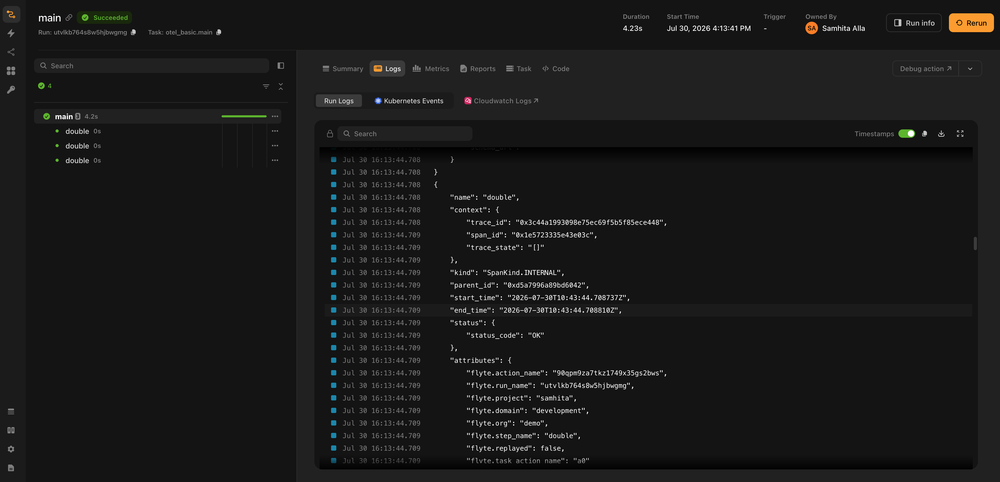

# OpenTelemetry

`flyteplugins-otel` turns a Flyte run into an [OpenTelemetry](https://opentelemetry.io/) trace.

Every task becomes a span. Every [traced function](../../user-guide/tasks/task-programming/traces) becomes a child span inside it. Spans created by your own code or by any OpenTelemetry instrumentation library nest underneath without extra wiring. Export goes wherever OTLP goes: Grafana Tempo, Jaeger, Honeycomb, an OpenTelemetry Collector or several at once.

None of this is specific to agents or to LLM workloads. It is ordinary distributed tracing for ordinary Flyte tasks, plus two behaviors that exist because Flyte runs are durable and a stock OpenTelemetry setup has no way to model them:

- **A crashed and resumed run is one trace, not several:** Each attempt is a fresh process with a fresh OpenTelemetry SDK, so each would normally mint its own trace ID. The plugin derives the trace ID from the run instead, so every process converges on the same trace with no coordination.
- **Steps served from the durable log still appear.** A resumed run replays completed steps rather than re-executing them, so nothing instruments them and the trace would otherwise have holes exactly where durability did its job. The plugin records them as spans marked `flyte.replayed`.

[Traces across crashes and resumes](./durable-traces) covers both in detail.

## Installation

```bash
pip install flyteplugins-otel
```

OTLP over HTTP is included. gRPC ships separately:

```bash
pip install "flyteplugins-otel[grpc]"
```

## Quick start

Call `init()` once at module scope, then write tasks as you normally would:

```python{hl_lines=[2,6]}
import flyte
from flyteplugins.otel import init

# Module scope, not inside a task. The task span opens before the task body runs,
# so initializing from within the body means that task's own span is already missed.
init(service_name="my-service")

env = flyte.TaskEnvironment(
    name="my_env",
    image=flyte.Image.from_debian_base().with_pip_packages("flyteplugins-otel"),
)


@flyte.trace
async def double(x: int) -> int:
    return x * 2


@env.task
async def main(n: int = 3) -> int:
    total = 0
    for i in range(n):
        total += await double(i)
    return total


if __name__ == "__main__":
    flyte.init_from_config()
    print(flyte.run(main, n=3).url)
```

That produces one trace shaped like this:

```text
main                          ← task span
├── double                    ← flyte.trace step span
├── double
└── double
```



With no arguments, `init()` reads the standard `OTEL_EXPORTER_OTLP_ENDPOINT` and `OTEL_EXPORTER_OTLP_HEADERS` variables, which is how most vendors document their setup. See [Exporters and configuration](./configuration) for pointing it at a real backend and for supplying credentials as a `flyte.Secret` instead of hardcoding them.

> [!WARNING] Call `init()` at module scope
> The task span opens before the task body runs, so calling `init()` from inside a task means
> that task's own span has already been missed. The symptom is a trace holding step spans with
> no task span to hang them from. The plugin logs a warning when it detects this.

## What becomes a span

| Flyte concept                                                    | Span                              | Parent                                             |
| ---------------------------------------------------------------- | --------------------------------- | -------------------------------------------------- |
| A task executing in its container                                | Task span, named after the task   | The inbound trace context if any; otherwise a root |
| A [`flyte.trace`](../../user-guide/tasks/task-programming/traces) step | Step span                         | The task span that owns it                         |
| A step replayed from the durable log                             | Step span, `flyte.replayed=true`  | The task span of the attempt that replayed it      |
| A sub-action (a task calling another task)                       | Its own task span, in another pod | The calling task's span, via `custom_context`      |
| Anything an instrumentation library emits                        | Whatever that library emits       | The active span, which is the task or step span    |

Task lifecycle itself is not instrumented: there are no spans for scheduling, queueing or the control plane's decision to retry. A span starts when a container begins executing a task.

You will however, see HTTP client spans for Flyte's own calls to the control plane once tracing is on. Those come from Flyte's transport rather than from this plugin; [Flyte's own control-plane spans](./durable-traces#flytes-own-control-plane-spans) explains where they come from and how to switch them off.

## Span attributes

Every span the plugin emits carries the identifiers needed to get back to the run that produced it. These names are effectively public API: a Grafana data link queries on them to jump from a span into the Flyte UI and [`GrafanaTrace`](./configuration#linking-back-from-grafana) is built on them.

| Attribute                                    | On         | Meaning                                           |
| -------------------------------------------- | ---------- | ------------------------------------------------- |
| `flyte.run_name`                             | All spans  | The run, and what the trace ID is derived from    |
| `flyte.action_name`                          | All spans  | The action that produced the span                 |
| `flyte.project`, `flyte.domain`, `flyte.org` | All spans  | Where the run lives                               |
| `flyte.task_name`                            | Task spans | The task being executed                           |
| `flyte.step_name`                            | Step spans | The traced function                               |
| `flyte.task_action_name`                     | Step spans | The task that owns the step                       |
| `flyte.replayed`                             | Step spans | Whether this step was served from the durable log |

## Your own spans

Spans you create with a plain OpenTelemetry tracer nest inside the task span automatically. Parenting in OpenTelemetry comes from the active context and the plugin keeps the task span active for the whole task body, so there is nothing to extract and no context to pass around:

```python
from opentelemetry import trace

tracer = trace.get_tracer("my.app")


@env.task
async def etl(rows: int = 100) -> int:
    with tracer.start_as_current_span("extract") as span:
        span.set_attribute("rows.requested", rows)
        extracted = rows

    with tracer.start_as_current_span("transform"):
        # Spans nest as deeply as you like; this one lands under transform.
        with tracer.start_as_current_span("validate"):
            transformed = extracted - 1

    with tracer.start_as_current_span("load") as span:
        span.set_attribute("rows.loaded", transformed)

    return transformed
```

The same is true of third-party auto-instrumentation. An HTTP client instrumentor, a database instrumentor or an LLM instrumentor needs no extra wiring:

```python
from opentelemetry.instrumentation.httpx import HTTPXClientInstrumentor

init(service_name="my-service")
HTTPXClientInstrumentor().instrument()
```

Call `init()` before the other library so everything stays on one export pipeline. For libraries that want to be handed a tracer, `get_tracer()` returns the one the plugin built.

## What's next

- **[Exporters and configuration](./configuration)**: point the plugin at a backend, adopt a tracer provider you already have, and link back from Grafana into the Flyte UI.
- **[Traces across crashes and resumes](./durable-traces)**: trace context in and out of a run, run-derived trace IDs, and replayed steps.
- **[Grafana Agent Observability](../grafana-agent-observability/_index)**: add LLM generations, tool calls, token usage and cost on top of these traces.

> [!NOTE] Runnable examples
> The plugin ships [eight worked examples](https://github.com/flyteorg/flyte-sdk/tree/main/plugins/otel/examples)
> covering console export, custom spans, nested tasks, adopting an existing provider, joining a
> caller's trace, HTTP auto-instrumentation, Grafana Cloud and a crash-and-resume trace. All but
> the last run either locally or on a cluster; the crash-and-resume one needs a cluster, because
> the replay it demonstrates comes from a platform retry.
