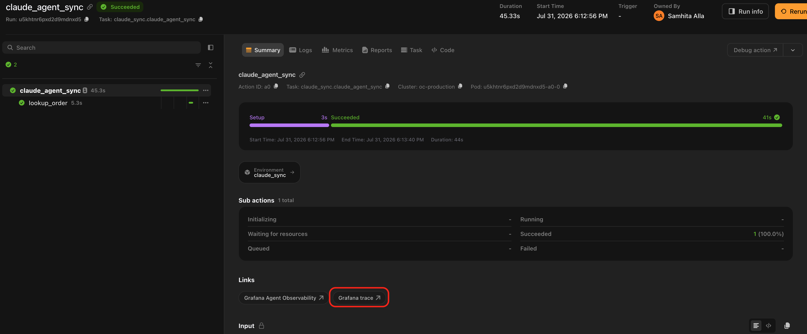
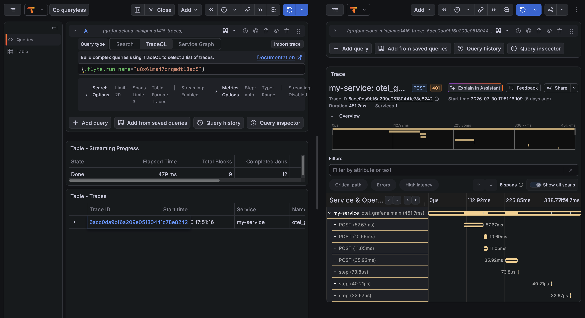

# Exporters and configuration

`init()` builds an OTLP exporter by default because OTLP is what most backends document but nothing in the plugin requires it. Any `SpanExporter` works, several can run side by side, and a tracer provider you configured yourself is adopted whole.

## Environment variables

The lowest-friction setup is to configure nothing in code and let the standard OpenTelemetry variables do the work:

| Variable                             | Effect                                                                             |
| ------------------------------------ | ---------------------------------------------------------------------------------- |
| `OTEL_EXPORTER_OTLP_ENDPOINT`        | Where spans are sent. A base gateway URL is fine on HTTP; `/v1/traces` is appended |
| `OTEL_EXPORTER_OTLP_TRACES_ENDPOINT` | Same, but traces-only. Takes precedence over the general endpoint                  |
| `OTEL_EXPORTER_OTLP_HEADERS`         | Export headers, in `k=v,k2=v2` form. This is where auth goes                       |
| `OTEL_EXPORTER_OTLP_PROTOCOL`        | `http/protobuf` (default) or `grpc`                                                |
| `OTEL_EXPORTER_OTLP_TRACES_PROTOCOL` | Same, but traces-only. Takes precedence                                            |
| `OTEL_SERVICE_NAME`                  | Value for `service.name` when `service_name` is not passed                         |

With those set, `init()` needs no arguments:

```python
from flyteplugins.otel import init

init()
```

Endpoints and credentials belong in a `flyte.Secret` rather than in your source. Attach them to the task environment as environment variables and the exporter picks them up:

```python{hl_lines=["5-6"]}
env = flyte.TaskEnvironment(
    name="my_env",
    image=flyte.Image.from_debian_base().with_pip_packages("flyteplugins-otel"),
    secrets=[
        flyte.Secret(key="otlp_endpoint", as_env_var="OTEL_EXPORTER_OTLP_ENDPOINT"),
        flyte.Secret(key="otlp_headers", as_env_var="OTEL_EXPORTER_OTLP_HEADERS"),
    ],
)
```

See [Secrets](../../user-guide/tasks/task-configuration/secrets) for creating and managing them.

## Configuring in code

Everything the variables cover can also be passed directly:

```python
init(
    service_name="my-service",
    endpoint="https://otlp-gateway-prod-us-east-0.grafana.net/otlp",
    headers={"Authorization": "Basic <base64>"},
)
```

### `init()` parameters

| Parameter             | Default                             | What it does                                                                                                               |
| --------------------- | ----------------------------------- | -------------------------------------------------------------------------------------------------------------------------- |
| `service_name`        | `OTEL_SERVICE_NAME`, then `"flyte"` | Value for `service.name` on every span                                                                                     |
| `endpoint`            | The `OTEL_` variables               | OTLP endpoint. On HTTP a base gateway URL is fine and `/v1/traces` is appended; on gRPC the base endpoint is used as given |
| `headers`             | The `OTEL_` variables               | Export headers, as a mapping or the `k=v,k2=v2` string form                                                                |
| `protocol`            | `http/protobuf`                     | OTLP transport, `http/protobuf` or `grpc`. gRPC needs the `[grpc]` extra                                                   |
| `resource_attributes` | None                                | Extra resource attributes attached to every span                                                                           |
| `exporter`            | None                                | One `SpanExporter` or several, used instead of building an OTLP exporter                                                   |
| `tracer_provider`     | None                                | Adopt a provider you configured yourself. Cannot be combined with the arguments above                                      |
| `disable_batch`       | `False`                             | Export each span as it ends instead of batching                                                                            |
| `set_global`          | `True`                              | Install the provider as the global one, so other instrumentation shares it                                                 |

`init()` is idempotent: calling it a second time returns the observer registered by the first call and changes nothing.

### Choosing an exporter

Pass any `SpanExporter` or a list of them to fan out to several at once, which is useful for keeping a console exporter alongside a real backend while you develop:

```python
from opentelemetry.sdk.trace.export import ConsoleSpanExporter

init(exporter=[ConsoleSpanExporter(), JaegerExporter(...)])
```

Each exporter gets its own span processor, so they run independently.

### gRPC

The gRPC exporter ships as a separate distribution:

```bash
pip install "flyteplugins-otel[grpc]"
```

```python
init(endpoint="http://collector:4317", protocol="grpc")
```

Note the endpoint difference between transports: gRPC takes the base endpoint, HTTP wants the signal-specific path (which the plugin appends for you).

### Batching

Spans are batched by default, which is the right production setting. `disable_batch=True` exports each span as it ends: slower, but nothing is buffered when the process dies, which matters when the thing you are looking at is a crash.

```python
init(service_name="my-service", disable_batch=True)
```

## Adopting a tracer provider you already have

If your codebase already configures OpenTelemetry with its own resource, sampler and exporters, hand the provider over instead of letting the plugin build one:

```python{hl_lines=[11]}
from opentelemetry import trace
from opentelemetry.sdk.resources import Resource
from opentelemetry.sdk.trace import TracerProvider
from opentelemetry.sdk.trace.export import BatchSpanProcessor, ConsoleSpanExporter

provider = TracerProvider(resource=Resource.create({"service.name": "my-existing-service"}))
provider.add_span_processor(BatchSpanProcessor(ConsoleSpanExporter()))
trace.set_tracer_provider(provider)

# Sampler, resource and exporters are left exactly as configured above.
init(tracer_provider=provider)
```

Nothing about your setup changes. The plugin only wraps the provider's ID generator which is what lets trace IDs still be [derived from the run](./durable-traces#one-run-one-trace) so a crash and its resume share a trace.

Passing `tracer_provider` alongside `endpoint`, `headers`, `exporter`, `protocol` or `resource_attributes` raises a `ValueError` rather than silently overriding: those settings belong to the provider you configured.

## Grafana Cloud

Grafana Cloud is an ordinary OTLP backend so the same shape works for any other. Both values come from the OTLP section of the Grafana Cloud portal:

```python
env = flyte.TaskEnvironment(
    name="otel_grafana",
    image=flyte.Image.from_debian_base().with_pip_packages("flyteplugins-otel"),
    secrets=[
        flyte.Secret(key="otlp_endpoint", as_env_var="OTEL_EXPORTER_OTLP_ENDPOINT"),
        flyte.Secret(key="otlp_headers", as_env_var="OTEL_EXPORTER_OTLP_HEADERS"),
    ],
)

# With the two variables set, init needs nothing else. Passing them explicitly:
#   init(
#       service_name="my-service",
#       endpoint="https://otlp-gateway-<zone>.grafana.net/otlp",
#       headers={"Authorization": "Basic <base64 instance_id:token>"},
#   )
init(service_name="my-service")
```

## Linking back from Grafana

`flyteplugins.otel.grafana` builds [links](../../user-guide/tasks/task-programming/links) from a Flyte action into Grafana, rendered on the action in the Flyte UI. They are plain URL builders with no Grafana dependency:

```python{hl_lines=[3]}
from flyteplugins.otel.grafana import GrafanaTrace


@env.task(links=(GrafanaTrace(host="https://myorg.grafana.net", datasource_uid="<tempo-uid>"),))
async def my_task() -> str:
    ...
```



*`GrafanaTrace` renders in the action's **Links** section in the Flyte UI, on every run of the task.*



*Following it opens Grafana Explore with the query already scoped to this run, so you land on its spans instead of searching for the run name by hand.*

| Parameter        | Default           | What it does                                                    |
| ---------------- | ----------------- | --------------------------------------------------------------- |
| `host`           | Required          | Stack URL, for example `https://myorg.grafana.net`              |
| `datasource_uid` | Required          | UID of the Tempo datasource                                     |
| `name`           | `"Grafana trace"` | Label shown in the Flyte UI                                     |
| `lookback`       | `"now-7d"`        | Start of the Explore time range, in Grafana's relative syntax   |
| `action_scoped`  | `False`           | Narrow the query to the single action rather than the whole run |

The datasource UID is per-stack and not guessable. Find it under **Connections > Data sources** in Grafana; it is the last path segment of `/connections/datasources/edit/<uid>`.

Two design details worth knowing:

- The link runs a TraceQL query on `flyte.run_name` rather than addressing a trace by ID. That means it finds a run's spans whatever their trace IDs turn out to be, including runs whose trace context arrived from outside Flyte. Addressing by ID would depend on the derivation and break the moment something upstream propagated a context.
- It embeds a time range because Grafana Explore otherwise defaults to the last hour and a link to an older run would open on an empty pane.

For a link to a run's conversation in Grafana Agent Observability, see [`GrafanaAgentObservability`](../grafana-agent-observability/_index#linking-back-from-grafana). That one lives in `flyteplugins-agento11y` because it is that package's identity binding that makes a run addressable by conversation ID at all.

## Shutting down

`shutdown()` unregisters the observer and flushes pending spans. You rarely need it: the OpenTelemetry SDK registers its own exit hook, so a task that finishes normally flushes on the way out. Reach for it when you want to stop tracing inside a long-lived process or in tests.

```python
from flyteplugins.otel import shutdown

shutdown()
```

A provider you passed in with `tracer_provider=` is never shut down since it belongs to you.

## When nothing is configured

With no OTLP endpoint anywhere, no `OTEL_EXPORTER_OTLP_ENDPOINT`, no `endpoint=` and no explicit exporter, spans are recorded but not exported, and `init()` logs a warning once.

This is the normal state of the process that submits a run: it imports your module, and therefore runs `init()`, without having any reason to export. Nesting and context propagation behave exactly as they would otherwise; the spans are simply dropped instead of shipped.

If you run a local collector, point the variable at it explicitly (`http://localhost:4318`) rather than relying on the OTLP specification's default of the same address. Without the explicit setting the plugin assumes you meant nothing at all.
