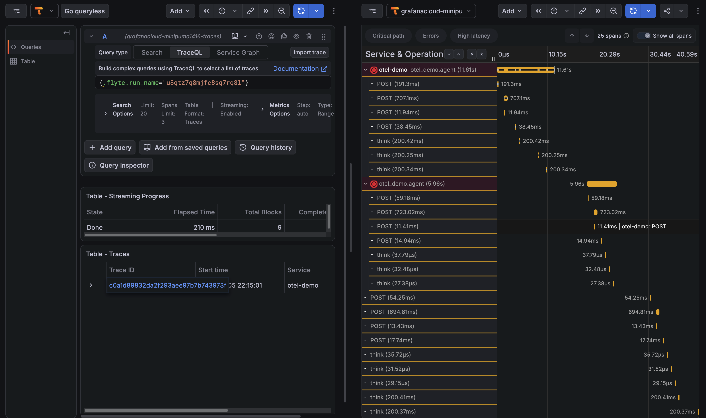

# Traces across crashes and resumes

A durable Flyte run is not one process. It crashes, resumes and retries, and each attempt starts a fresh OpenTelemetry SDK that knows nothing about the earlier ones.

Point a stock OpenTelemetry setup at a durable run and two things go wrong. Every attempt mints its own trace ID, so one run arrives at the backend as several unrelated traces. And every step the resumed run replayed out of its durable log is missing entirely because replayed steps never execute and so nothing instruments them. The trace ends up with holes in it exactly where durability did its job.

`flyteplugins-otel` fixes both and it does so without any coordination between the processes.

## Trace context, in and out

Flyte propagates a key-value `custom_context` through a run and into every sub-action. The plugin uses it as a [W3C trace context](https://www.w3.org/TR/trace-context/) carrier in both directions.

### Inbound: joining a trace that started outside Flyte

When a run is kicked off from inside an existing span, a web request, a scheduler, another service, you usually want the run to appear inside that trace rather than as a separate one. Inject a carrier into `custom_context` at submit time and the plugin picks it up: the task span starts under the caller's span instead of becoming a root.

```python{hl_lines=["24-25",27]}
import flyte
from opentelemetry import trace
from opentelemetry.propagate import inject

from flyteplugins.otel import init

init(service_name="my-service")
tracer = trace.get_tracer("my.caller")

env = flyte.TaskEnvironment(name="my_env")


# The task you submit. Flyte 2 has no separate workflow entrypoint: `run` takes the
# task itself, and any tasks it awaits become sub-actions of the same run.
@env.task
async def handle(url: str) -> str:
    return f"handled {url}"


if __name__ == "__main__":
    flyte.init_from_config()

    with tracer.start_as_current_span("incoming_request"):
        carrier: dict[str, str] = {}
        inject(carrier)

        run = flyte.with_runcontext(custom_context=carrier).run(handle, url="https://example.com")
        print(run.url)
```

The carrier is a plain `dict[str, str]`, which is exactly what `custom_context` expects.

`tracer` here is the caller's own tracer, not the plugin's. The plugin only needs `init()` to have run; it parents the task span off whatever `traceparent` arrives in the carrier, whoever produced it.

### Outbound: nested tasks, in other pods

Once the task span is open, the plugin publishes it back into `custom_context`. A child task running in a different pod nests under the task that spawned it with nothing passed by hand:

```python
import asyncio


@flyte.trace
async def score(item: int) -> int:
    return item * 3


@env.task
async def worker(item: int) -> int:
    return await score(item)


@env.task
async def coordinator(n: int = 3) -> int:
    results = await asyncio.gather(*[worker(item=i) for i in range(n)])
    return sum(results)
```

```text
coordinator
├── worker
│   └── score
├── worker
│   └── score
└── worker
    └── score
```

Because `custom_context` travels in the action's persisted inputs, this survives a resume as well.

Nothing in your task bodies has to call `extract` to get spans parented correctly; the plugin's own spans are already in the right place. Reach for `extract` only when you want to open your own spans under the incoming context.

## One run, one trace

When no trace context arrives from outside, the trace ID is derived from the run identity rather than generated randomly.

Every process computes the same 16 bytes from values it already has, the org, project, domain and run name, so spans recorded before a crash and spans recorded after the resume land in the same trace even though neither process ever spoke to the other.

Only the trace ID is derived. Span IDs stay random, which keeps each attempt a distinct subtree under the shared trace rather than a set of colliding IDs. A resumed run therefore reads as the attempt that crashed followed by the attempt that finished.

Deriving from the fully-qualified run identity rather than the run name alone means two runs that happen to share a name in different projects or domains stay distinct.

You can compute the same value yourself, which is useful for building your own links into a tracing backend:

```python
from flyteplugins.otel import format_trace_id, trace_id_for_run

trace_id = format_trace_id(trace_id_for_run(flyte.ctx().action))
```

## Replayed steps

A resumed run serves already-completed [traced steps](../../user-guide/tasks/task-programming/traces) out of its durable log without re-executing them. The plugin records those as spans marked `flyte.replayed=true`.

They have no meaningful duration, because no work happened in this process, but they are present, so the trace is complete and you can see exactly which steps the resume skipped.

For an agent loop, this is also where the money is: a replayed step does not call the model again, so a resume does not pay for the generations the first attempt already bought.

## A worked crash and resume

The example below crashes partway through its first attempt. The retry resumes: steps 0 through 2 come back from the durable log as replayed spans, steps 3 and 4 actually execute, and both attempts share one trace.

```python{hl_lines=[3,13]}
# disable_batch keeps nothing buffered, so spans recorded before the crash are already
# exported when the process dies. Batching is the better default in production.
init(service_name="otel-demo", disable_batch=True)


@flyte.trace
async def think(step: int) -> str:
    """Stands in for a model call."""
    await asyncio.sleep(0.2)
    return f"thought-{step}"


@env.task(retries=3)
async def agent(steps: int = 5, fail_at: int = 2) -> list[str]:
    # Crash on the first attempt only. FLYTE_ATTEMPT_NUMBER is 1-based.
    crash = flyte.ctx().attempt_number <= 1

    results = []
    for step in range(steps):
        results.append(await think(step))
        if crash and step == fail_at:
            raise RuntimeError(f"crashed at step {step}")
    return results
```

The resulting trace:

```text
agent                          ← attempt 1, ended in error
├── think  (0)
├── think  (1)
└── think  (2)
agent                          ← attempt 2, succeeded
├── think  (0)  flyte.replayed=true
├── think  (1)  flyte.replayed=true
├── think  (2)  flyte.replayed=true
├── think  (3)
└── think  (4)
```



## Flyte's own control-plane spans

Once tracing is on, you will see `POST` client spans for Flyte's calls to the control plane, `Enqueue`, `CreateRun`, `UploadInputs`, alongside your own.

These do not come from this plugin. Flyte's HTTP transport takes an `enable_otel` flag that defaults to true and falls back to the global tracer provider when it is not given one. `init(set_global=True)`, the default, installs that provider, so the transport starts recording through it.

Mostly this is useful. Inside a task the spans nest under the task span, so you can see how much of a task's wall clock went on talking to the control plane, and the 401-then-200 pairs show the auth retry. Two things to be aware of:

- The volume scales with sub-action count, so a wide fan-out produces a lot of them.
- Calls made outside a task span, during submission, arrive as their own root traces rather than joining the run's trace.

There is no switch for this in the plugin, since the transport is Flyte's rather than the plugin's. `init(set_global=False)` keeps the provider out of the global slot, which stops the transport finding it, at the cost of other instrumentation not finding it either.

## Limitations

**Replayed spans have no duration:** The original timing is written to the control plane but does not come back over the channel a resumed run reads from. What you get is the step's presence, identity and outcome.

**Trace context rides in `custom_context`:** That is a flat string map which Flyte propagates wholesale, so the `traceparent` key is visible to task code and will be overwritten if something else writes that key.

**Nothing is emitted for control-plane lifecycle:** Scheduling, queueing and the retry decision itself are not instrumented. The spans you get start when a task's container begins executing it.
