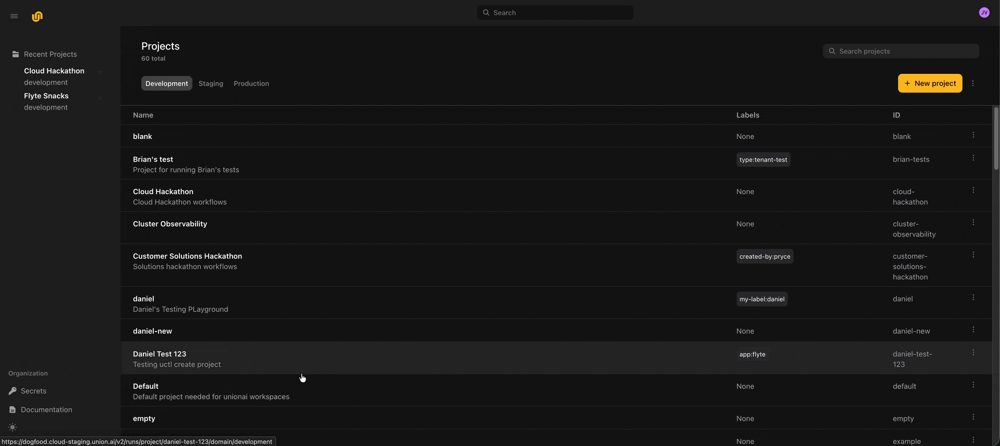
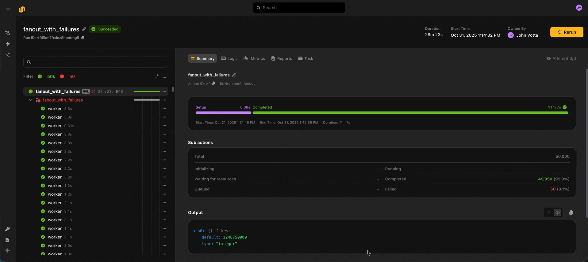
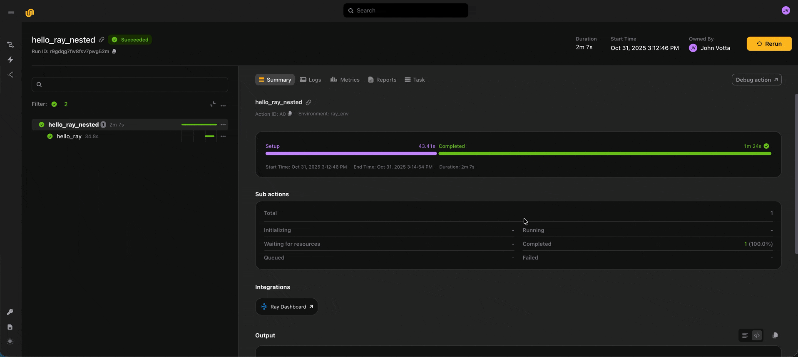
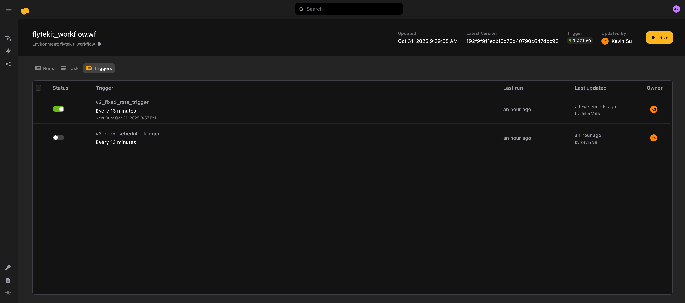
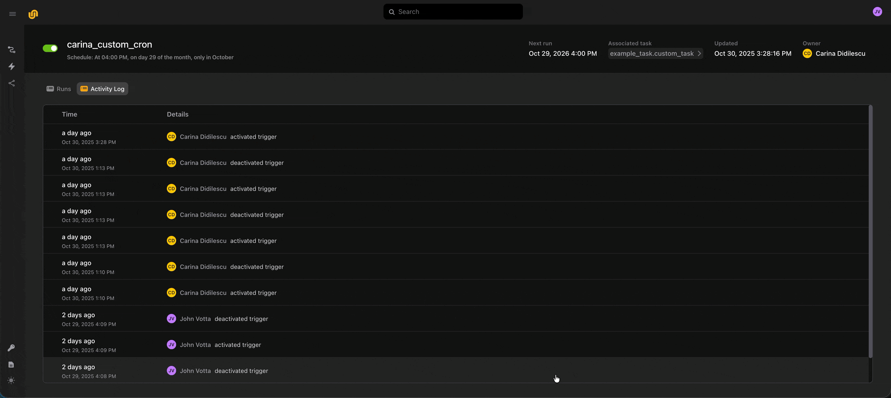
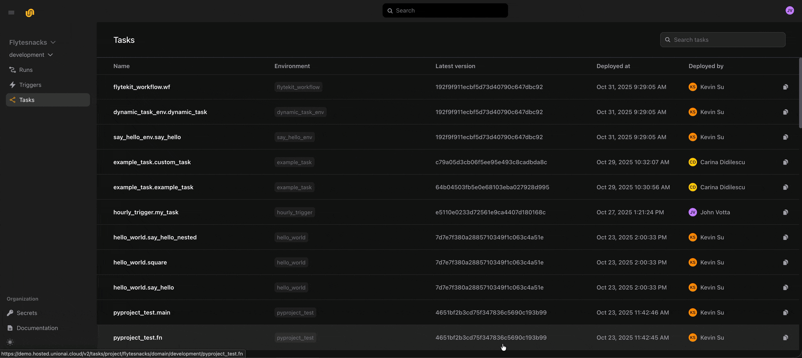

# Release notes

## August 2026


### :rocket: Flyte 2 Is Generally Available

Flyte 2 is generally available. The SDK README and documentation are updated for the GA release.


### :robot: LLM Gateway

An org-level gateway gives your teams one OpenAI-compatible endpoint for every model provider they use, so application code targets a single base URL. The gateway issues managed virtual keys as its credential and supports provider fallback, budgets, rate limits, and per-key and per-provider usage reporting. Set the expected requests per second and Union sizes and autoscales the proxy for you. Whether the endpoint accepts requests without Union sign-in is configurable at deploy time or from the gateway's configuration card, and gateway administration is governed by role-based access control.


### :package: Artifacts, End to End

A task that declares `produces_artifacts` now registers its outputs as versioned artifacts when the run completes. Artifact triggers fire a run when a new version is published, including artifacts published from outside the platform. On an artifact's details page, an interactive lineage graph shows the run that produced it and everything downstream: the triggers watching it (expand one to see the runs it fired) and the apps consuming it. An Apps tab lists the exact artifact version each app was deployed against. The artifacts list filters by metadata and creator, with filters kept in the URL so you can share or bookmark a view, and a prefetched model is published as an artifact that apps can consume. See [Artifacts](../user-guide/artifacts/_index), [Artifact triggers](../user-guide/triggers/artifact-triggers), and [Lineage](../user-guide/artifacts/lineage).


### :computer: Tracked Local Runs

`flyte run --tracked` reports a run executing on your own machine to the platform: live phases, inputs, outputs, and reports. A Local Runs page in the Console lists and live-streams these runs with the same details experience as platform runs. You can abort a tracked run from the Console, though this cannot stop the process running on your machine. Per-organization limits apply to concurrent local runs and actions, actions per run, and monthly run creations. See [Track local runs in the console](../user-guide/get-started/run-modes/running-locally#track-local-runs-in-the-console).


### :chart_with_upwards_trend: GPU Observability

The run Metrics tab now shows per-GPU health: temperature, power draw, clocks, tensor-core and memory-bandwidth activity, PCIe throughput, thermal and power throttling, and ECC memory errors. Each pod keeps a consistent color across every metrics chart, with its GPUs drawn as shades of that color. CPU-only tasks are unaffected.


### :mag: Kubernetes Events in the Run View

Mount failures, image pull errors, and other cluster events now appear in the run view with severity, reason, and repeat count, with warnings highlighted. A stuck action's failure message includes the warning events that explain it, and before a pod starts the Logs tab shows events instead of an empty log view.


### :sparkles: App Status, Self-Healing Deployments, and Logs

Apps now report fine-grained status (Pulling image, Initializing, Running, Scaled to zero, Scaling up or down), and crash or out-of-memory exits report the real cause instead of appearing stuck in Deploying. A failed deployment webhook retries for about five minutes and recovers to Active on its own once the cause, such as a missing secret, is fixed, with no redeploy needed. Logs can follow running replicas live or show persisted output from replicas that have stopped, labelled and colored by replica, with a replica filter on both Logs and Metrics. The app view adds a Summary tab, a cards/list toggle, sorting, and status and deployed-by filters. In the CLI, `flyte serve --follow` streams app logs.


### :gear: Queue and Cluster Lifecycle

A drained queue can now be soft-deleted and later restored; deleted queues appear behind a Deleted filter and open read-only. The organization default queue cannot be deleted. A queue's cluster membership is editable while it is active, and its cluster pool can be changed once it is drained. Drained queues are visible on the Queues page by default, and a queue used as `run.default_queue` can be drained. Cluster details gain a Compute tab listing node groups with instance types, interruptibility, autoscaling bounds, per-node allocatable resources, labels, and taints. Queue activity adds a Throughput chart and a completions-by-outcome breakdown. See the [Queues documentation](../user-guide/cluster-workload-management/queues).


### :bar_chart: Console Dashboards

Organization and project overview dashboards show actions executed, the work Union saved you (cache hits and recovered actions), runs completed, active apps, builders and triggers, actions over time, and the busiest users. The projects list shows per-project activity sparklines, ordered so the busiest projects sit at the top. The runs and local-runs lists gain run-completion charts, and a per-project triage view surfaces failures, retries, and stuck apps.


### :sparkles: Secrets and Timeouts on the Launch Form

For tasks that declare secrets, a Secrets tab on the launch form lets you change which secret store entry is injected into each declared target before launching. A Timeout field sets the overall task attempt timeout, prefilled from the task's existing value.


### :lock: Volumes Without Elevated Privileges

Tasks now mount volumes with no elevated privileges. A node-level broker performs the privileged filesystem setup and hands the task an already-connected file descriptor, so pods keep running under restricted Pod Security Standards: no `CAP_SYS_ADMIN`, no device mount, and no host paths. Volume data access uses the pod's own cloud identity, and the broker holds no storage credentials. This is available on demo and playground clusters in this release, with wider enablement to follow.


### :recycle: Recovery and Reusable Ray Improvements

Run recovery is now available from the Console with a Recover button. Recovered actions show their inputs and outputs correctly, and action names are stable across code changes, so recovery matches the right work. Reusable Ray clusters are shared correctly across tasks in an environment that sets a pod template, and aborted runs no longer leak a cluster past its idle TTL. The image shown on a task or run links to the build that produced it, even when the image was served from cache.


### :zap: Faster Console

The Apps list loads quickly and returns cached results instantly while it refreshes. Artifact and code-rendering pages load in under half a second instead of several, and a class of intermittent stuck spinners and slow uploads is fixed across logs, reports, code, secrets, app metrics, launch forms, file uploads, and trigger creation.


### :wrench: SDK Updates

- `flyte run hello` and `flyte serve hello` give you a first run and a first app with no files on disk.
- Devbox: `flyte get devbox`, a `--devbox` shortcut on `flyte create config`, and support for GitHub Codespaces, Google Colab, and Windows.
- `flyte.load_interactive_ctx()` restores task context inside a debugger, and the Python debugger extension is installed by default.
- Task-level cache max age, and the root action's cache key now honors `Literal.hash` the way sub-actions do.
- Speculative decoding and cache-aware routing for vLLM and SGLang model serving.
- `service_account` on a task environment, a termination grace period, and `Image.from_pixi_script()`.
- Clustered tasks resume from checkpoints across whole-set restarts.


### :wrench: Reliability and Fixes

Spark tasks launch again after a plugin registration fix, and with a pod template the driver and executor no longer inherit the task container's entrypoint. The VS Code link appears for Ray tasks with interactive debugging enabled. Every API response carries an `X-Request-ID` header: supply your own and it is echoed back, or one is generated for you; quote it in a support request so Union can find the exact request. Structured outputs render their real values in the formatted view, organization creation shows live provisioning progress, and the Console login and signup pages have clickjacking protection.


### :gear: Self-Managed Dataplane Updates

Update to the latest Union helm chart to pick up:

- Artifact registration for tasks declaring `produces_artifacts`, and artifact triggers on new versions.
- The node-level mount broker for unprivileged volume mounts.
- Kubernetes event enrichment in failure messages and the Logs tab.
- Fine-grained app status and self-healing deployment webhooks.
- Reusable Ray cluster fixes, Spark fixes, and Ray metrics and logs across head and worker pods.
- Live logs for a distributed task no longer fail when one pod has been evicted.

The action scheduling and lease services can also be backed by PostgreSQL, with no behavior change for existing deployments.


### :warning: Breaking Changes

- **Runs against a draining or drained queue now fail immediately.** The implicit fallback to the `default` queue is removed. Target an active queue, or set `run.default_queue` explicitly.
- **Moving a queue to a different cluster pool requires draining it first.** Cluster membership remains editable while a queue is active.
- **Calling a sync task from async code must now use `.aio`.** Change the call site to `await task.aio(...)`. In exchange, `asyncio.run()` now works inside sync tasks.

## July 2026


### :recycle: Run Recovery

Recovering a failed run now reuses the actions that already succeeded and re-executes only what failed or changed, so you stop paying twice for compute. Use `--recover` or `--recover-from` on the CLI; a new "Recovered" action status is shown across the platform. See [Recover runs](../user-guide/tasks/task-deployment/recover-runs).


### :robot: Bring Your Own Agent Framework

New plugins run CrewAI, LangGraph, LangChain, PydanticAI, and Hermes agents as Flyte tasks, with native tool calling preserved under durable execution. The agent event stream carries multiple agents, so a supervisor and its sub-agents report coherently, and agent runs emit OpenTelemetry traces and metrics. Human-in-the-loop approval runs on native conditions. For MCP servers, `transport="stdio"` now serves stdio. See [Bring your own framework](../user-guide/agents/build-agent/bring-your-own-framework).


### :zap: Reusable Ray Clusters

Declare a `ReusePolicy` on a task environment and Ray tasks with identical configuration share one long-lived Ray cluster instead of paying full cold start each time. Idle clusters are reclaimed after a configurable TTL, and Ray task metrics and logs cover head and worker nodes, not only the driver pod. See [Reusable containers](../user-guide/tasks/task-configuration/reusable-containers).


### :bell: Notifications on Paused Runs

Notification rules can subscribe to the `PAUSED` phase, so a webhook or email fires the moment an action pauses to wait for a human signal. Paused notifications carry the paused action's identifier and the condition's prompt, description, and prompt type.


### :gear: Queue Lifecycle Management

Queues can now be drained: they stop accepting new work while in-flight work completes. A queue set as a default in settings is validated before draining, and a draining or drained queue cannot be set as a default. You can move a queue between cluster pools and register clusters into pools from the CLI. A cluster cannot be deleted while an explicit queue still points at it. Queue metrics stream for live display.


### :mag: Cluster Visibility

`flyte get cluster-config` reads the live configuration of your clusters' core components directly from the cluster, and lists any component it cannot read with the reason. It is available to Viewer and above. `flyte get system-logs` streams system component logs from the target cluster, and a cluster Logs tab in the Console shows the same logs live. Hovering over a pool in the clusters and queues lists shows its object store, secret store, and image registry.


### :lock: Editable Roles and Policies

You can now edit which actions a custom role grants from the Console. Descriptions on roles and policies persist, admins can access system logs without also holding the separate support role, and fetching a role or policy that doesn't exist returns "not found" instead of an internal error.


### :sparkles: Launch Form Version Selector

When launching a task or rerunning a run or action, a searchable selector in the launch drawer picks the version to launch. Switching versions updates the inputs to match. The Inputs tab defaults to the form view with raw JSON one toggle away, and closing the form without launching discards unsubmitted changes.


### :zap: Fail Fast and Stay Connected

A run whose pod spec Kubernetes will reject, such as one with an empty container image, now fails at run creation with the reason instead of sitting in Queued for about 30 minutes. Watching runs, streaming logs, and app watches are no longer cut off after 20 minutes, and in-flight API requests survive gateway deployments, autoscaling, and availability-zone disruption. The dataplane operator reconnects with backoff instead of restarting when the control plane is briefly unreachable.


### :sparkles: Metrics, Apps, and Sign-In Fixes

GPU utilization, SM active cycles, and SM occupancy charts now render for GPU tasks. An app with no running pods shows recent persisted logs instead of an empty stream, and the Apps list splits into active cards and an inactive table. Email and password sign-in works for self-serve organizations in every region and from CLI authentication flows, and the macOS keychain no longer prompts once per virtual environment. Raw container tasks start again, app pod template annotations are preserved, and a cluster not yet assigned to a cluster pool reports an error naming the command to fix it.


### :wrench: SDK Updates

- `flyte.remote.Run.get_report()` and `Action.get_report()` pull run and action HTML reports.
- A remote TUI for browsing runs from the terminal.
- `Image.with_pixi_project` and `Image.from_pixi_script()`, a base registry override, a default push registry, and extra `docker buildx` flags through an environment variable.
- `plugin_config` in `TaskTemplate.override`, and a `--status` filter on `flyte get apps`.
- A new fork verb in the CLI and SDK forks a run or volume, optionally merging new inputs over the source run's.
- Authentication tokens are stored in a single keychain item.


### :gear: Self-Managed Dataplane Updates

Update to the latest Union helm chart to pick up:

- The shared-cluster plugin manager required for `ReusePolicy` on Ray tasks.
- Permission for the operator proxy to read the component ConfigMaps that `flyte get cluster-config` returns. Against a dataplane that has not been updated, the command succeeds but every entry reports "permission denied".
- Fail-fast on invalid pod specs, operator reconnection with backoff, the raw container task startup fix, and preserved app pod template annotations.
- An S3 mount startup probe, and a clear error for a cluster with no cluster pool.

An alternative ingress provider is now supported as an opt-in, each dataplane is provisioned with its own operator and API-key OAuth client, and the separate control-plane and dataplane multi-cluster topology is available on AWS as well as GCP.


### :warning: Breaking Changes

- **SDK versions older than 2.0.4 can no longer create runs.** Upgrade to Flyte SDK 2.0.4 or later.
- **The earlier human-in-the-loop tool-approval mechanism is deprecated** in favor of native conditions. It still works and emits a deprecation notice. Move `@tool(requires_approval=True)` approvals onto native conditions at your convenience.
- **A cluster with an explicit queue pointing at it can no longer be deleted.** Drain and remove or re-point the queue first.

## June 2026


### :bug: Interactive Debugging

`flyte debug` opens an interactive session against a task over a WebSocket tunnel, so it works without direct network access to the cluster. You can attach SSH or VS Code to a running task's container, and `debug.relaunch` on `flyte.rerun` relaunches a failed action straight into a debug session with the same inputs. See [Debug runs](../user-guide/tasks/task-deployment/debug-runs).


### :rocket: Distributed Multi-Node Tasks

`ClusteredTaskEnvironment` runs a single task across a coordinated group of pods for multi-node training and other tightly coupled distributed work. A failed member exits non-zero and the error is recorded once the whole set is terminal, so a partial failure reports as one failure. GPU configuration flows through to every member. See [Clustered task environment](../user-guide/tasks/task-configuration/clustered-task-environment).


### :floppy_disk: Persistent Volumes

A new `Volume` type gives tasks a durable, mountable filesystem. The platform records which runs wrote to a volume, so you can trace data back to the work that produced it, and a three-pane terminal explorer browses volume contents and lineage. Clusters advertise FUSE as a requestable device, so a task opts in with `allow_fuse()` instead of running as a privileged container. See [Volumes](../user-guide/tasks/task-programming/volumes).


### :traffic_light: Run-Level Action Concurrency and Queue Binding

Set `max_action_concurrency` on a run (`flyte run --max-action-concurrency 5 ...`) or as a default per org, domain, or project to bound how many of a run's actions execute at once. Excess actions wait and start as running actions complete. Leaving it unset, or setting `0`, means unlimited; `1` is rejected because a parent awaiting its children would deadlock. Every queue now binds to a cluster pool, and queue creation, editing, and per-run queue selection are available from the CLI and the Console. See the [Queues documentation](../user-guide/cluster-workload-management/queues).


### :label: Labels on Runs

Set labels when you create a run, from the SDK, the CLI, or the launch form. Filter runs by label in the API (`labels.<key>` filters) and the Console runs list, including grouped views. Labels render in every run listing with stable per-value colors.


### :wrench: Settings in the Console

A Settings surface in the Console edits org, domain, and project settings with inheritance, and shows where each effective value comes from. New settings include a default queue, `run_base_dir`, and run-level max action concurrency. Max-GPU settings now apply only when a task requests GPUs.


### :bell: Notifications and Conditions in the Console

A Notifications tab on the launch form configures notifications, with email as the default channel. You can resolve a condition from the run details page, abort an action from the condition UI, and see who aborted an action or resolved a condition, including the value they supplied. Condition timeouts surface as a user error that explains the timeout.


### :robot: Agent Updates

Agents gain `code_mode`, which runs tool calls as generated code in a sandbox, with a `call_handler` hook on `@tool`. `MemoryStore` is decoupled from `Agent`, agent tools accept `File`, `Dir`, and `DataFrame`, and human-in-the-loop approval runs on native conditions.


### :package: Usage-Based Image Retention on AWS

On AWS, images built by ImageBuilder are no longer deleted 30 days after they were built. They move to archive after 60 days without a pull and are deleted 90 days after that, so actively used images are never removed. Archived images can be restored on request within that window. GCP and Azure registries keep 30-day age-based cleanup.


### :wrench: Reliability Improvements

Task resources, Ray head and worker resources, and app resources are merged into your pod template's primary container instead of replacing it. Action phases no longer get stuck on "Initializing" after a lost status update, large uploads auto-size their multipart chunks, and Ray tasks requesting GPUs through a pod template land on the intended GPU pools. Apps in a project assigned to a non-default cluster pool deploy to the right cluster, and cloud log links resolve to the right log group, region, and project.


### :rocket: Retries with Backoff and Timeout Controls

Tasks now accept a `flyte.RetryStrategy` with exponential backoff and a `flyte.Timeout` with three independent bounds: `max_runtime` (per-attempt running time), `max_queued_time` (per-attempt time waiting for capacity), and `deadline` (an absolute wall-clock budget across all attempts). The `max_runtime` budget starts when your code actually begins running. Pod scheduling and image pulls no longer count against it. See the [Retries and timeouts documentation](../user-guide/tasks/task-configuration/retries-and-timeouts) for details.

```python
import flyte
from datetime import timedelta

env = flyte.TaskEnvironment(name="resilient")

@env.task(
    retries=flyte.RetryStrategy(
        count=4,
        backoff=flyte.Backoff(base=timedelta(seconds=1), factor=2.0, cap=timedelta(seconds=3)),
    ),
    timeout=flyte.Timeout(
        max_runtime=timedelta(minutes=10),
        max_queued_time=timedelta(minutes=5),
        deadline=timedelta(minutes=30),
    ),
)
async def bounded_work() -> str: ...
```


### :robot: Flyte-Native Agent Construct

You can now author agents as a first-class construct: define an agent with registered tools, persist memory across runs with `MemoryStore`, and serve it behind a chat interface using the pre-built app environment. Mark sensitive tools with `@tool(requires_approval=True)` to pause the run until a human approves. `agent.run(...)` works synchronously, and `await agent.run.aio(...)` works in async code.


### :memo: Multi-Pod Log Streaming

Log streaming now covers every pod of a distributed action (Ray, Spark, multi-node training), for both live tail and persisted logs. A pod filter in the Console log viewer selects which pod you're reading, and task metrics can be filtered by pod for multi-pod executions.


### :computer: Build and Deploy MCP Servers

You can now author a Model Context Protocol server with the SDK and deploy it as a Union app, so agents and IDEs can call your tasks and data as tools. See the [MCP server documentation](../user-guide/agents/build-mcp/_index) to get started.


### :sparkles: Smarter Failure Classification

A task that raises `flyte.errors.NonRecoverableError` now fails on the first attempt without consuming its retry budget. Image pulls rejected by registry rate limits are classified as system errors rather than user failures, so they no longer burn your retries.


### :zap: Faster CLI Startup and Unified Local Caches

Heavy imports have been moved off the CLI's direct path for faster startup. Image and bundle caches are consolidated into a single local database, and the local cache is scoped by init config so different configurations no longer collide.


### :sparkles: Friendlier Build and Deploy Errors

Missing image source folders, unknown image references at deploy time, and user-module import failures now surface as specific, actionable error types instead of raw tracebacks. Dependency-export failures include the underlying tool output.


### :zap: More Resilient Uploads

Uploads now honor server `Retry-After` hints on 429/503 responses, use a higher retry backoff cap, and report clearer errors when retries are exhausted.


### :wrench: SDK Reliability Improvements

DNS resolution now uses the operating system's resolver, fixing connectivity in VPN and split-DNS environments. Pydantic and dataclass default values are resolved correctly at serialization time, and CLI clients request refresh tokens by default so you log in less often.


### :wrench: Exclude Files from Code Bundles with `.flyteignore`

You can now exclude files from code bundles even when they are tracked in git: large datasets, notebooks, docs. `.flyteignore` files use gitignore-style patterns and are applied automatically during every bundle build.


### :wrench: Settings Applied at Run Creation

Org- and domain-scoped settings are now fully applied when runs are created: tasks submitted without explicit resource values pick up the defaults configured in Settings. See the [Settings documentation](../user-guide/get-started/core-concepts/settings).


### :sparkles: Console Run Exploration Improvements

The runs list now supports unconstrained lookback past the previous 7-day window. Run labels render in Run Info, trace action durations are accurate in the run sidebar, the log viewer's full-screen mode matches the reports experience, inputs and outputs past their retention window show a clear retention notice, the versions table scrolls infinitely with graceful handling of invalid versions, browser tab titles include the entity name, and secrets are cluster-pool aware.


### :sparkles: Task Environment Details Drawer

From a run's details page in the Console, you can now inspect the environment behind the run: name, version, image, resources, and the full reuse policy.


### :gear: Cluster and Cluster Pool Management from the CLI

You can now register and manage clusters and cluster pools directly from the CLI. `flyte create|get|delete cluster` registers clusters into your org, with a detail view covering identity, health, cloud and storage, config drift, capacity, and bound queues. `flyte create|get|delete cluster-pool` manages the shared object-store, secret-store, and image-registry configuration for a group of clusters.


### :chart_with_upwards_trend: GPU Configuration for Ray Clusters

Accelerator and shared-memory settings now propagate automatically from your resource requests to Ray head and worker groups.


### :sparkles: Pydantic Union Types with Field Annotations

Pydantic `Union` types with `Field` annotations are now supported in task signatures.


### :sparkles: Queues with Concurrency and Depth Control (Beta)

Queues now support concurrency control (how many actions a queue runs at once) and depth control (how deep the queue can grow), with runnable SDK examples. Queues are in Beta: queue definitions are not yet enforced by the execution engine, and full queue management from the CLI and Console arrives with general availability. See the [Queues documentation](../user-guide/tasks/task-configuration/queues).


### :sparkles: Events API (Beta)

A new top-level SDK construct lets you emit events from your tasks, with a runnable example. Signalling events from the Console is not yet available.


### :gear: Self-Managed Dataplane Updates

Update to the latest Union helm chart to pick up accurate `max_runtime` anchoring and per-attempt `max_queued_time` enforcement, immediate failure on `NonRecoverableError`, multi-pod log streaming, VSCode debugger links routed through the dataplane ingress, app connector endpoint fixes with project/domain propagation, billing metering on the dataplane operator in low-privilege mode, and configurable Azure OAuth app secret expiry.

Later in June, the chart also adds coordinated task groups for `ClusteredTaskEnvironment`, unprivileged FUSE mounts for Volumes and `allow_fuse()`, task memory metrics reported from cgroup usage instead of working set, retried action status updates, an app startup-failure classifier, and heartbeat reliability fixes. Secret-bearing payloads are no longer written to operator logs. New self-managed topologies include a separate control-plane and dataplane multi-cluster setup on GCP, OpenShift kubeconfig support for operator access through browser-based login, and Helm v4 compatibility.


### :warning: Breaking Changes

- **A cluster now belongs to exactly one cluster pool.** Clusters that were assigned to multiple pools were migrated so each sits in a single pool. Confirm each cluster is in the intended pool, and create an explicit pool first if you need a queue to target something other than the default.

## May 2026


### :robot: AI Agent Components in `flyte.ai`

The new `flyte.ai` submodule ships pre-built components for agentic applications: `flyte.ai.agents.CodeModeAgent` wraps the orchestrator sandbox with a customizable `litellm`-compatible LLM generator, and `flyte.ai.AgentChatAppEnvironment` serves chat-shaped agents. End-to-end examples cover vLLM serving, Claude Code, and token-level batching with `TokenBatcher` inside a FastAPI app.


### :wrench: Hierarchical Settings

A new Settings hierarchy spans the SDK, control plane, and Console. The interactive `flyte settings edit` CLI command views and edits hierarchical settings, tasks created without explicit CPU, GPU, memory, or storage values inherit org- and domain-scoped defaults, and a Console Settings page exposes the same hierarchy with org-level controls including configurable retention for user-built images.


### :sparkles: Interactive Triggers

Triggers grow from a list view into a fully interactive surface. Pass arbitrary input through a trigger with `custom_context`, attach multiple triggers or links in a single `@env.task` decorator, and use first-class sleep tasks for explicit delays. In the Console you can create a trigger directly from a task's details page, bulk-delete triggers with confirmation, and view the full trigger spec on the details page.


### :hammer: Non-Root Images by Default

Default built images now create a non-root `flyte` user and switch to it at the end of the build. Files added via `with_source_folder`, `with_source_file`, and `with_code_bundle` are copied with the right ownership automatically.


### :sparkles: Actionable CLI Error Messages

Common failures (missing Docker, missing `kubectl`, missing source files, unpicklable deployments, and user-module load failures) now surface as actionable error messages. Uploads automatically retry on transient network errors.


### :hammer: Image Building Enhancements

A new reference architecture covers bringing your own externally built images into Flyte v2 workflows. A top-level `--builder` flag on `flyte` and `flyte build` resolves from config when not provided, `FLYTE_DOCKER_BUILDKIT_BUILDER_NAME` selects a custom buildx builder, the `exclude-newer` uv option quarantines new dependency releases for five days to protect builds from upstream regressions, and cache behavior accepts common aliases like `enable` and `off`.


### :sparkles: Console Enhancements

Task details gain a Versions tab for side-by-side comparison, the entry file path, descriptions, and sub-action totals. App details pages show parameters, descriptions, and a delete action, with a Kubernetes service account selector in the launch form. Run logs get a full-screen button and an actor filter, policies and roles get confirm-delete dialogs, and a logout option lands in the Console.


### :computer: TUI and Shell Task Improvements

Trace output is now readable for long-running runs in the TUI. Shell tasks gain a `defaults` parameter plus rendering fixes, directories can be passed alongside files into sandbox-based agents, and long-form descriptions render in `flyte --help`.


### :sparkles: New Plugins and Examples

New plugins land for HuggingFace datasets, Hydra, omegaconf, and papermill. New examples cover conditional caching, custom-context triggers, an autoresearch loop, genomics helper utilities, and a Vue app alongside the existing FastAPI, Streamlit, and Gradio examples.


### :wrench: User-Facing Logger

`flyte.logger` is now a user-facing logger, separated from the internal SDK logger, with an INFO default and no prefix.


### :wrench: Keyring Opt-Out

The new `disable_keyring` config option skips storing and retrieving tokens from the system keyring, useful in CI and headless environments.


### :gear: Cluster-Aware Data Access

Workflows running against a specific dataplane can resolve their data proxy directly, and authentication continues to land on the control plane even when the data plane endpoint is used directly.


### :gear: OpenShift Support for Self-Managed Deployments

Self-managed deployments gain platform-level OpenShift support: restricted-module installs, AWS EBS CSI driver, ECR pull secrets, AWS pod identity webhook, and post-install helper tooling. The helm chart also adds `external-secrets` v1 API support, a configurable worker-pod security context, connector logs configuration, and a per-deployment network policy toggle.

## March 2026

### :wrench: Extended Idle Timeout for Panel Apps

Panel apps now support longer idle times for websocket connections, with session token expiration increased to 3 hours. New parameters for managing unused session lifetimes improve stability of long-running applications.

### :wrench: Plugin Variants Documentation

The new `--plugin-variants` flag in `flyte gen docs` generates variant-scoped CLI documentation. Plugin-contributed CLI commands are wrapped in Hugo `` shortcodes, so core commands appear unconditionally while plugin commands are shown only in specified variants (e.g., `flyte`, `union`).

### :rocket: Google Gemini Plugin Integration

You can now integrate Google's Gemini API with Flyte using the new `function_tool` decorator to automatically convert Flyte tasks into Gemini agent tools. Both synchronous and asynchronous operations are supported.

```python
import flyte
from flyteplugins.gemini import function_tool, run_agent

env = flyte.TaskEnvironment("gemini-agent")

@env.task
async def get_weather(city: str) -> str:
    return f"The weather in {city} is sunny."

# Run Gemini agent with a tool
async def agent_task(prompt: str):
    tools = [function_tool(get_weather)]
    return await run_agent(prompt=prompt, tools=tools, model="gemini-2.5-flash")
```

### :hammer: Forced Image Build Caching

You can now force a rebuild of images by setting `force=True`, which skips the existence check and rebuilds even if the image already exists. When using the remote image builder, this also sets `overwrite_cache=True`.

```python
import flyte

image = flyte.Image("your_image")
result = await flyte.build.aio(image, force=True)
```

### :computer: LLM-Powered Code Generation

The new `flyteplugins-codegen` plugin generates code from natural language prompts, runs tests, and iterates in isolated sandboxes using LLMs.

```python
from flyteplugins.codegen import AutoCoderAgent

agent = AutoCoderAgent(model="gpt-4.1", name="data-processor", resources=flyte.Resources(cpu=1, memory="1Gi"))

result = await agent.generate.aio(
    prompt="Process the CSV data to calculate total revenue and units.",
    samples={"sales": csv_file},
    outputs={"total_revenue": float, "total_units": int},
)
```

### :wrench: Updated AI Plugin Examples

Fixed and improved plugin examples for working with OpenAI and Anthropic in Flyte 2.0, using updated versions of `flyteplugins-openai` and `flyteplugins-anthropic`.

```python
from flyteplugins.openai.agents import function_tool

agent_env = flyte.TaskEnvironment(
    "openai-agent",
    resources=flyte.Resources(cpu=1),
    secrets=[flyte.Secret(key="openai_api_key", as_env_var="OPENAI_API_KEY")],
)

@function_tool
@agent_env.task
async def get_bread() -> str:
    await asyncio.sleep(1)
    return "bread"
```

### :wrench: Debug Mode Integration

The Flyte SDK now supports a `--debug` flag to initiate tasks in VS Code debug mode from the CLI or Python interface. Specify `debug=True` in `flyte.with_runcontext` to attach a VS Code debugger during task execution.

```python
import flyte

env = flyte.TaskEnvironment(name="debug_example")

@env.task
def say_hello(name: str) -> str:
    greeting = f"Hello, {name}!"
    print(greeting)
    return greeting

if __name__ == "__main__":
    flyte.init_from_config()
    run = flyte.with_runcontext(debug=True).run(say_hello, name="World")
    print(run.name)
    print("Run url", run.url)
    print("Waiting for debug url...")
    print("Debug url", run.get_debug_url())
```

### :sparkles: Improved CLI Enum Support

The Flyte CLI now supports `EnumParamType`, allowing you to pass enum names directly (e.g., `--color=GREEN`) instead of requiring internal values.

### :memo: Programmatic Log Access

You can now access logs programmatically using the `get_logs()` method on `remote.Run` and `remote.Action`. This returns an iterator over log lines with support for asynchronous processing via `.aio()`, filtering system-generated logs, and including timestamps.

### :zap: Simplified PyTorch Example Setup

PyTorch environment setup is simplified: specify `flyteplugins-pytorch` directly via `with_pip_packages` instead of the internal `PythonWheels` API.

### :chart_with_upwards_trend: Distributed Training Evaluation

Flyte now supports distributed training with callback-driven evaluation. `EvalOnCheckpointCallback` automatically triggers evaluation tasks after each training checkpoint, running evaluations in parallel with training and monitoring convergence. Upon convergence, a stop signal gracefully halts training.

### :zap: Improved Benchmark Flexibility

The benchmark script for large I/O operations has been refactored. CPU and memory allocations are now parameterizable, file and directory tests can be run independently, and HTML report generation handles missing data gracefully.

### :computer: CLI Project Management

You can now create, update, and manage Flyte projects directly from the CLI, including setting IDs, names, descriptions, labels, and archive status.

```bash
# Example usage
flyte create project --id my_project_id --name "My Project" --description "Project description" -l team=dev -l env=prod
flyte update project my_project_id --archive
flyte get project --archived
```

### :robot: Anthropic Claude Integration

You can now integrate Flyte tasks as tools for Anthropic Claude agents. Define tasks in Flyte and convert them into Claude tool definitions using the `function_tool` utility.

### :hourglass_flowing_sand: Panel App Enhancements

The Flyte SDK panel app now uses a threaded asynchronous execution model, so actions like code execution no longer block the interface. Reo.Dev tracking integration provides monitoring capabilities.

### :gear: AWS Config File Support

Flyte now supports S3 authentication via the `AWS_CONFIG_FILE` environment variable. When both `AWS_PROFILE` and `AWS_CONFIG_FILE` are set, Flyte uses a boto3-backed credential provider for profile-based authentication.

### :sparkles: Improved Task Execution Reliability

Flyte now automatically uses `task.aio()` for both synchronous and asynchronous tasks, ensuring consistent execution through the Flyte controller. The previous fallback to `asyncio.to_thread()` for synchronous tasks has been removed.

### :wrench: Enhanced Action Service Integration

You can now attach custom gRPC headers when interacting with the Actions service, enabling consistent request metadata for routing and integration in distributed environments.

### :rocket: Async Training with Early Stopping

A new ML pattern example runs asynchronous training with periodic evaluations using Flyte's durable task management. The training task saves checkpoints asynchronously while evaluation tasks assess convergence, gracefully stopping training when convergence is detected.

```python
async def train(checkpoint_dir: str, total_epochs: int, seconds_per_epoch: float) -> File:
    # Training logic
    pass

async def evaluate(checkpoint_file: File, eval_round: int, convergence_loss: float) -> bool:
    # Evaluation logic
    pass

async def main(total_epochs, seconds_per_epoch, convergence_loss, eval_interval_seconds, max_eval_rounds):
    # Orchestration logic
    pass
```

Use `flyte run examples/ml/async_train_eval.py` to execute this pattern locally.

### :wrench: Improved Include Path Handling

Flyte now correctly resolves include paths relative to the app directory during deployment. Previously, include paths that escaped the app script's directory caused deployment failures due to invalid tar entries.

### :zap: Enhanced Retry Management

Task retries during local runs now support exponential backoff and detailed tracking of retry attempts, allowing recovery from transient errors. Retry visibility is improved in both the controller logic and the terminal UI.

### :zap: Improved Module Loading

The Flyte SDK's module loading now respects `.gitignore` and standard ignore rules, excluding directories like `.venv` and `__pycache__`.

### :zap: Dynamic Batching for Improved GPU Utilization

New `DynamicBatcher` and `TokenBatcher` classes allow concurrent tasks to share a single GPU, improving throughput for use cases like large-scale inference. An example demonstrates `TokenBatcher` for inference tasks with reusable containers.

### :sparkles: Run Cache Disabling

You can now disable run-level task result caching. When caching is disabled for a specific run, no cache hits are reported and cache operations are bypassed. The TUI reflects this with a clear indication that caching is disabled.

### :computer: Vim Key Navigation for TUI

The TUI (`FlyteTUIApp` and `ExploreTUIApp`) now supports Vim keys `j` and `k` for cursor movement in the `ActionTreeWidget` and `RunsTable`.

### :sparkles: Clickable Image Build URLs

Image URIs in TaskMetadata are now clickable in the Union frontend, linking directly to the Flyte run that built the image.

### :sparkles: Enhanced Run Filters

You can now filter runs and actions by project, domain, and creation/update time ranges. The new `TimeFilter` class supports filtering by `created_at` and `updated_at` timestamps, and filters are available through both the SDK and the CLI.

```python
from flyte.remote import TimeFilter

# Example usage to fetch runs created after a specific date
runs = Run.listall(
    project="my-project",
    created_at=TimeFilter(after="2026-03-01")
)
```

### :wrench: Simplified Dependency Management

`UVProject`'s `dependencies_only` mode now copies only the `pyproject.toml` files of each editable dependency instead of the entire directory, reducing build context size and speeding up image builds.

### :robot: MLE Agent Enhancements

Two new agents, the MLE Orchestrator Agent and the MLE Tool Builder Agent, use LLMs to automatically generate orchestration and processing code. They create, execute, and iteratively optimize ML models in an isolated sandbox environment with configurable computing resources.

### :sparkles: Improved Task Command Initialization

The Flyte CLI now initializes configuration when listing or resolving task commands via `TaskPerFileGroup`, preventing failures for config-dependent operations.

```python
import flyte
from flyte.io import File

env = flyte.TaskEnvironment(name="example_env")

@env.task
async def test_file(project: str, input_file: File) -> str:
    return f"Got input {project=}, {input_file=}"
```

### :zap: New Example Applications & Bug Fixes

New example applications added:

- Distributed training using async tasks
- MNIST model handling with PyTorch
- Agent workflows with LangGraph & Gemini API

Also includes a bug fix for scaling metric serialization.

### :gear: Phase Transitions Tracking

You can now view phase transition details for actions, showing time spent in each phase (QUEUED, INITIALIZING, RUNNING, etc.). Use the `get_phase_transitions` method and properties like `queued_time` and `running_time` to identify bottlenecks programmatically.

```python
action = Action.get(run_name="my-run", name="my-action")
details = action.details()
transitions = details.get_phase_transitions()
for t in transitions:
    print(f"{t.phase}: {t.duration.total_seconds()}s")
```

### :wrench: Multiple Source Files Support

`with_source_file` now accepts a list of file paths, allowing multiple files in a single image layer. An error is raised if duplicate filenames target the same location.

```python
from flyte._image import Image
from pathlib import Path

# Example usage with two different files
img = Image.from_debian_base(name="my-image").with_source_file([Path("a.py"), Path("b.py")])
```

### :package: Simplified Code Bundling

The new `with_code_bundle()` method packages source code into Docker images. When `copy_style` is set to `"none"` in `with_runcontext()` or during `flyte deploy`, source code is automatically baked into the image. Use `"loaded_modules"` to include specific Python modules or `"all"` for entire directories.

### :wrench: Improved Error Messaging for Deployment

When using a `src/` layout, the "Duplicate environment name" error during deployment now hints at the `--root-dir` option to help resolve dual-import issues.

```python
# New deployment configuration example
flyte deploy --dry-run --recursive --root-dir src src/my_module
```

### :wrench: Improved Debugging for Reusable Tasks

Reusable tasks now automatically disable debugging. Previously, debugging was enabled by default, which could cause issues with reusable tasks.

### :sparkles: JSONL Plugin Support

The new JSONL plugin adds `JsonlFile` and `JsonlDir` types for Flyte workflows. It supports async and sync read/write operations with optional `zstd` compression, using `orjson` for fast serialization.

```python
from flyteplugins.jsonl import JsonlFile, JsonlDir

# Example usage of JsonlFile
@env.task
async def process_file(f: JsonlFile):
    async for record in f.iter_records():
        print(record)

# Example usage of JsonlDir for sharded directories
@env.task
async def process_dir(d: JsonlDir):
    async for record in d.iter_records():
        print(record)
```


## February 2026

### :sparkles: JSON Schema Enhancement

Flyte now accurately converts Python types to JSON Schemas by leveraging Flyte's internal type system. Previously, certain types like `Literal["C", "F"]` were incorrectly mapped. Now, input schemas for Flyte tasks reflect precise JSON Schemas, improving integrations with tools like Anthropic's Claude.

```python
# Example: Converting Literal to JSON Schema correctly
def my_func(unit: Literal["C", "F"]) -> str:
    return unit

schema = NativeInterface.from_callable(my_func).json_schema
assert schema["properties"]["unit"] == {"type": "string", "enum": ["C", "F"]}
```

### :abacus: Panel Calculator Example

A new example showcases a calculator app embedded in a Panel interface using Flyte's `AppEnvironment`, demonstrating how to build interactive web-based UIs with Flyte.

### :sparkles: Spark Plugin Update

The `flyteplugins-spark` dependency has been updated to `>=2.0.0`, moving away from pre-release versions.

### :lock: Secure Package Specification

Package version constraints like `apache-airflow<=3.0.0` are now automatically quoted in generated Dockerfiles. Previously, unquoted constraints could cause incorrect shell interpretation and build failures.

### :zap: Enum Name Acceptance in CLI

The Flyte CLI now accepts enum names as valid inputs. Previously, only enum values were accepted, so `--color=RED` would fail when the value was `"red"`. Both names and values are now accepted.

```python
import enum
import flyte

class Color(enum.Enum):
    RED = "red"
    GREEN = "green"
    BLUE = "blue"

@flyte.task
def example_task(color: Color):
    return f"Selected color is {color.name}"
```

### :wrench: Enhanced Pod Template Handling

Pod templates are now properly maintained across task overrides. Previously, overriding certain task attributes could inadvertently discard custom pod templates. Pod specifications, labels, and annotations now persist even after renaming tasks or modifying other properties.

### :zap: Stress Testing Example Added

A new stress testing example demonstrates a fan-out execution pattern, creating a dynamic tree of asynchronous tasks to simulate high concurrency. You can control the number of tasks spawned at each layer and introduce variability with a jitter parameter.

### :bug: Correct Serialization Field

Fixed a bug in the serialization of scaling metrics: the correct field `target_value` is now used instead of `val`. This ensures proper serialization for `Scaling.Concurrency` and `Scaling.RequestRate` metrics as expected by the protobuf definitions.

### :wrench: Improved Async Task Handling

Async Flyte tasks now route execution through `task.aio()`, ensuring consistent invocation through Flyte's controller and correct handling of nested async tasks.

### :wrench: Sync Alignment of File Upload Methods

`File.from_local_sync` and `File.from_local` now handle filenames consistently when uploading to remote storage. Previously, the sync and async methods could produce different filenames for the same upload.

```python
# Example of uploading a file with consistent naming:
import flyte

with tempfile.TemporaryDirectory() as temp_dir:
    local_path = os.path.join(temp_dir, "source.txt")
    remote_path = os.path.join(temp_dir, "destination.txt")

    # Ensure the file content
    with open(local_path, "w") as f:
        f.write("sample content")

    # Upload the local file to a remote location
    uploaded_file = File.from_local_sync(local_path, remote_path)

    print(f"Uploaded file path: {uploaded_file.path}")
```

### :hourglass: Request Timeout Configuration

You can now configure request timeouts for Flyte applications using the new `Timeouts` dataclass. Set a `request` timeout (as an integer or `timedelta`) to limit the maximum duration a request can take within an application environment.

### :wrench: Enhanced Bundling and Error Handling

Flyte now ignores `.git` directories in deployment code bundles, reducing artifact size and improving deployment speed. Additionally, explicit error handling for the `copy_style` parameter provides clear guidance when bundling is unnecessary.

### :wrench: Dynamic Pydantic Model Creation

The new `PydanticTransformer.guess_python_type` method dynamically creates Pydantic models from JSON schema metadata. This handles cases where the original Pydantic model class isn't available, enabling flexible deserialization of complex nested structures.

### :busts_in_silhouette: Human-in-the-Loop Plugin

The new Human-in-the-Loop (HITL) plugin enables workflows to pause and wait for human input via a web interface or programmatically. Create events that prompt for human interaction through an auto-served FastAPI app.

```python
import flyteplugins.hitl as hitl

# Create event and wait for human input
event = await hitl.new_event.aio(
    "input_event",
    data_type=int,
    scope="run",
    prompt="Enter a number"
)
value = await event.wait.aio()
```

### :rocket: Stateless Code Sandbox

Flyte now supports running arbitrary Python code and shell commands in an isolated, stateless Docker container with the `flyte.sandbox.create()` API. Three execution modes are available: Auto-IO, Verbatim, and Command, each handling inputs and outputs differently while running code in fresh, ephemeral containers.

### :wrench: Improved CLI Logging Initialization

The Flyte SDK now ensures a consistent logging setup when using the CLI. Previously, CLI commands would initialize configuration multiple times, leading to duplicated log entries. Now:

- Initialization occurs once per command execution.
- `RichHandler` is enabled from the start, so all logs display in rich format.
- The `hello.py` example script now has a default value, so it runs without arguments.

```python
@env.task
def main(x_list: list[int] = [1, 2, 3, 4, 5, 6, 7, 8, 9, 10]) -> float:
    x_len = len(x_list)
    if x_len < 10:
        raise ValueError(f"x_list doesn't have a larger enough sample size, found: {x_len}")
    y_list = list(flyte.map(fn, x_list))
    y_mean = sum(y_list) / len(y_list)
    return y_mean
```

### :wrench: Enhanced Ignore Handling

Flyte SDK now skips processing of `.gitignore` and `.flyteignore` files inside commonly ignored directories such as `.venv` or `__pycache__`, avoiding redundant file processing.

### :whale: CI Image Builder

A new example script automates Docker image building and pushing from CI. Configure it with your source and target image details to integrate with continuous deployment pipelines.

### :wrench: TypedDict Compatibility Fix

The Flyte SDK now correctly handles `TypedDict` for Python versions earlier than 3.12 by using `typing_extensions.TypedDict`.

```python
# Importing TypedDict based on Python version
import sys
if sys.version_info >= (3, 12):
    from typing import TypedDict
else:
    from typing_extensions import TypedDict
```

### :globe_with_meridians: Cross-Platform Code Bundling

The Flyte SDK now uses POSIX-style paths for file hashing and tarball creation, ensuring consistent code bundling behavior across Windows and Unix systems.

### :wrench: Improved CLI JSON Formatting

The `flyte` CLI now uses the `to_dict()` method when available for JSON output, fixing `TypeError` failures that occurred with certain non-iterable object types.

### :wrench: Improved Pod Image Handling

Flyte now consistently merges container images when using a pod template. The primary container uses `app_env.image` if no explicit image is set, with correct handling of both `"auto"` and specific image values.

### :sparkles: Flyte Webhook Environment

A pre-built Flyte webhook environment makes it easier to integrate with FastAPI endpoints for common Flyte operations like running tasks, managing apps, and handling triggers. This update uses `httpx` for HTTP requests and expands endpoint exports for better customization.

### :repeat: Retry Interceptor for gRPC

A new retry interceptor for gRPC channels allows you to define how many times a gRPC call should be retried on transient failures. Specify the number of retry attempts using the `rpc_retries` option during channel creation.

### :sparkles: Orchestration Sandbox Feature

Flyte 2.0 now supports dynamic orchestration within a sandbox using `flyte.sandbox.orchestrator_from_str()`. Create reusable orchestration templates directly from Python code strings without defining decorated functions, useful when code is dynamically generated from UIs or language models.

### :wrench: Task Shortname Override Fix

You can now override the shortname for tasks in the UI by setting the `short_name` parameter in task overrides. Previously, overridden shortnames were not reflected in the Flyte UI.

### :sparkles: NVIDIA H100 GPU Support

Flyte now supports NVIDIA H100 GPUs with various MIG partitions for fine-grained resource allocation.

```python
from flyte import GPU, Resources

h100_mig_env = flyte.TaskEnvironment(
    name="h100_mig",
    resources=Resources(
        cpu="1",
        memory="4Gi",
        gpu=GPU(device="H100", quantity=1, partition="1g.10gb"),
    ),
)
```


### :zap: Enhanced Error Handling in PyTorch Elastic Jobs

Flyte's PyTorch integration now includes configurable NCCL timeout settings to better manage CUDA out-of-memory (OOM) situations. This prevents elastic jobs from hanging due to OOM by introducing faster failure detection and customizable restart policies. You can reduce timeout durations, enable asynchronous error handling, and activate built-in monitoring.

### :wrench: Reverse Path Priority Fix

The Flyte SDK's handling of `sys.path` when running tasks remotely now respects local path priority. Previously, the `entrypoint` directory could override top-level packages. This fix ensures consistent path prioritization between local development and remote execution.

### :globe_with_meridians: S3 Virtual Hosted-Style Support

You can now specify the addressing style for S3-compatible backends by setting the `FLYTE_AWS_S3_ADDRESSING_STYLE` environment variable to `virtual`. This constructs URLs in the format `https://<bucket>.<endpoint>/<key>`, enabling compatibility with more storage providers.


## November 2025

### :fast_forward: Grouped Runs
We redesigned the Runs page to better support large numbers of runs. Historically, large projects produced so many runs that flat listings became difficult to navigate. The new design groups Runs by their root task - leveraging the fact that while there may be millions of runs, there are typically only dozens or hundreds of deployed tasks. This grouped view, combined with enhanced filtering (by status, owner, duration, and more coming soon), makes it dramatically faster and easier to locate the exact runs users are looking for, even in the largest deployments.


### :globe_with_meridians: Apps (beta)

You can now deploy apps in Union 2.0. Apps let you host ML models, Streamlit dashboards, FastAPI services, and other interactive applications alongside your workflows. Simply define your app, deploy it, and Union will handle the infrastructure, routing, and lifecycle management. You can even call apps from your tasks to build end-to-end workflows that combine batch processing with real-time serving.

To create an app, import `flyte` and use either `FastAPIAppEnvironment` for FastAPI applications or the generic `AppEnvironment` for other frameworks. Here's a simple FastAPI example:

```python
from fastapi import FastAPI
import flyte
from flyte.app.extras import FastAPIAppEnvironment

app = FastAPI()
env = FastAPIAppEnvironment(
    name="my-api",
    app=app,
    image=flyte.Image.from_debian_base(python_version=(3, 12))
        .with_pip_packages("fastapi", "uvicorn"),
    resources=flyte.Resources(cpu=1, memory="512Mi"),
    requires_auth=False,
)

@env.app.get("/greeting/{name}")
async def greeting(name: str) -> str:
    return f"Hello, {name}!"

if __name__ == "__main__":
    flyte.init_from_config()
    flyte.deploy(env) # Deploy and serve your app
```

For Streamlit apps, use the generic `AppEnvironment` with a command:

```python
app_env = flyte.app.AppEnvironment(
    name="streamlit-hello-v2",
    image=flyte.Image.from_debian_base(python_version=(3, 12)).with_pip_packages("streamlit==1.41.1"),
    command="streamlit hello --server.port 8080",
    resources=flyte.Resources(cpu="1", memory="1Gi"),
)
```

You can call apps from tasks by using `depends_on` and making HTTP requests to the app's endpoint. Please refer to the example in the [SDK repo](https://github.com/flyteorg/flyte-sdk/blob/main/examples/apps/call_apps_in_tasks/app.py). Similarly, you can call apps from other apps (see this [example](https://github.com/flyteorg/flyte-sdk/blob/main/examples/apps/app_calling_app/app.py)).

### :label: Custom context

You can now pass configuration and metadata implicitly through your entire task execution hierarchy using custom context. This is ideal for cross-cutting concerns like tracing IDs, experiment metadata, environment information, or logging correlation keys: data that needs to be available everywhere but isn't logically part of your task's computation.

Custom context is a string key-value map that automatically flows from parent to child tasks without adding parameters to every function signature. Set it once at the run level with `with_runcontext()`, or override values within tasks using the `flyte.custom_context()` context manager:

```python
import flyte

env = flyte.TaskEnvironment("custom-context-example")

@env.task
async def leaf_task() -> str:
    # Reads run-level context
    print("leaf sees:", flyte.ctx().custom_context)
    return flyte.ctx().custom_context.get("trace_id")

@env.task
async def root() -> str:
    return await leaf_task()

if __name__ == "__main__":
    flyte.init_from_config()
    # Base context for the entire run
    run = flyte.with_runcontext(custom_context={"trace_id": "root-abc", "experiment": "v1"}).run(root)
    print(run.url)
```

### :lock: Secrets UI

Now you can view and create secrets directly from the UI. Secrets are stored securely in your configured secrets manager and injected into your task environments at runtime.



### Image builds now run in the same project-domain
The image build task is now executed within the same project and domain as the user task, rather than in system-production. This change improves isolation and is a key step toward supporting multi-dataplane clusters.

### Support for secret mounts in Poetry and UV projects
We added support for mounting secrets into both Poetry and UV-based projects. This enables secure access to private dependencies or credentials during image build.

```python
import pathlib

import flyte

env = flyte.TaskEnvironment(
    name="uv_project_lib",
    resources=flyte.Resources(memory="1000Mi"),
    image=(
        flyte.Image.from_debian_base().with_uv_project(
            pyproject_file=pathlib.Path(__file__).parent / "pyproject.toml",
            pre=True,
            secret_mounts="my_secret",
        )
    ),
)
```

## October 2025

### :infinity: Larger fanouts
You can now run up to 50,000 actions within a run and up to 1,000 actions concurrently.
To enable observability across so many actions, we added group and sub-actions UI views, which show summary statistics about the actions which were spawned within a group or action.
You can use these summary views (as well as the action status filter) to spot check long-running or failed actions.



### :computer: Remote debugging for Ray head nodes
Rather than locally reproducing errors, sometimes you just want to zoom into the remote execution and see what's happening.
We directly enable this with the debug button.
When you click "Debug action" from an action in a run, we spin up that action's environment, code, and input data, and attach a live VS Code debugger.
Previously, this was only possible with vanilla Python tasks.
Now, you can debug multi-node distributed computations on Ray directly.



### :zap: Triggers and audit history
[Triggers](../user-guide/triggers/_index) let you templatize and set schedules for your workflows, similar to Launch Plans in Flyte 1.0.

```python
@env.task(triggers=flyte.Trigger.hourly())  # Every hour
def example_task(trigger_time: datetime, x: int = 1) -> str:
    return f"Task executed at {trigger_time.isoformat()} with x={x}"
```

Once you deploy, it's possible to see all the triggers which are associated with a task:



We also maintain an audit history of every deploy, activation, and deactivation event, so you can get a sense of who's touched an automation.



### :arrow_up: Deployed tasks and input passing

You can see the runs, task spec, and triggers associated with any deployed task, and launch it from the UI. We've converted the launch forms to a convenient JSON Schema syntax, so you can easily copy-paste the inputs from a previous run into a new run for any task.


