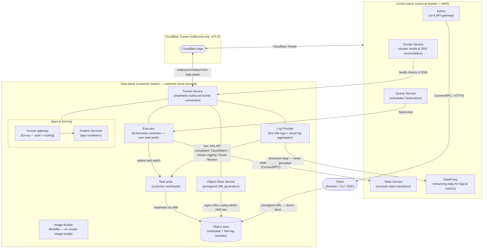

# Compute and control plane components

## Component architecture

All cross-plane traffic flows through the Cloudflare Tunnel -- an outbound-only, mTLS-encrypted connection initiated from the data plane. No inbound ports are opened on the customer's cluster.

**Key relationships:**

| From | To | What flows |
| --- | --- | --- |
| Queue Service | Executor | TaskAction custom resources (orchestration instructions) |
| Executor | State Service | Phase transitions (Queued -> Running -> Succeeded/Failed) |
| Executor | Task pods | Pod lifecycle management |
| Task pods | Object store | Task inputs/outputs via IAM role (workload identity) |
| Object Store Service | Object store | Presigned URL generation using admin IAM role |
| Log Provider | DataProxy | Log streams relayed in memory -- optionally persisted on customer storage |
| Cluster Service | Tunnel Service | Health checks and DNS record reconciliation |
| Tunnel Service | Cloudflare edge | Single outbound-only mTLS connection covering all data-plane services |

## Executor

The Executor is a Kubernetes controller on the customer's data plane. It watches for `TaskAction` custom resources created by the Queue Service, reconciles each through its lifecycle (`Queued`, `Initializing`, `Running`, `Succeeded`/`Failed`), reports state transitions to the control plane's State Service via ConnectRPC through the tunnel, and creates Kubernetes pods for task execution.

The Executor accesses the customer's object store and secrets using IAM roles bound to its Kubernetes service account via workload identity federation. It communicates with external services only through the Cloudflare tunnel to the control plane.

## Apps and serving

Apps and Serving enables deployment of long-running web applications (Streamlit dashboards, FastAPI services, notebooks, inference endpoints) on the customer's data plane:

- Apps run as Knative Services within tenant-scoped Kubernetes namespaces, with the Union Operator managing lifecycle including autoscaling and scale-to-zero
- No application code, data, or serving traffic passes through the control plane
- Inbound traffic routes through Cloudflare for DDoS protection to a Kourier gateway (Union's Envoy fork) on the customer's cluster, which enforces authentication before forwarding to the app container
- Browser access uses SSO; programmatic access requires a Union API key. All endpoints require authentication by default, with optional per-app anonymous access.
- Union's RBAC controls which users can deploy and access apps per project, and resource quotas constrain consumption
- The load balancer, serving infrastructure, and app containers all run within the customer's cluster
- In BYOC, Union.ai manages the [serving infrastructure lifecycle](./deployment-models#infrastructure-management)

## Object store service

The Object Store Service runs on the data plane and provides presigned URL signing using the customer's IAM credentials (admin role):

- `CreateSignedURL` -- generates presigned URLs for object access
- `CreateUploadLocation` -- generates presigned `PUT` URLs for fast registration with `Content-MD5` integrity verification
- `Presign` -- generic presigning for arbitrary object store keys
- `Get`/`Put` -- direct object store read/write used internally by platform services

Two buckets are provisioned per cluster: a metadata bucket (task inputs, outputs, reports, intermediate data) and a fast-registration bucket (code bundles). Object layout follows `org/project/domain/run-name/action-name`, providing natural namespace isolation.

## Log provider

The Log Provider runs on the data plane and serves task logs from two sources: live logs streamed from the Kubernetes API (pod stdout/stderr) and completed task logs read from the cloud log aggregator (CloudWatch, Cloud Logging, or Azure Monitor). Union also supports persisting logs in object storage. Log lines include structured metadata (timestamp, message content, originator classification) enabling security teams to distinguish application-generated from platform-generated logs.

## Image builder

When enabled, the Image Builder runs on the data plane using Buildkit. It pulls base images from a customer-approved registry, accesses user code via a time-limited presigned URL, builds the container image with specified layers, and pushes to the customer's container registry. Source code and built images never leave the customer's infrastructure.

## Tunnel service

The Tunnel Service maintains the Cloudflare Tunnel connection. It initiates and maintains the outbound-only encrypted connection, performs periodic health checks and heartbeats, and reconnects automatically on network disruption. The Cluster Service on the control plane performs periodic reconciliation to ensure tunnel health and DNS records are current.
