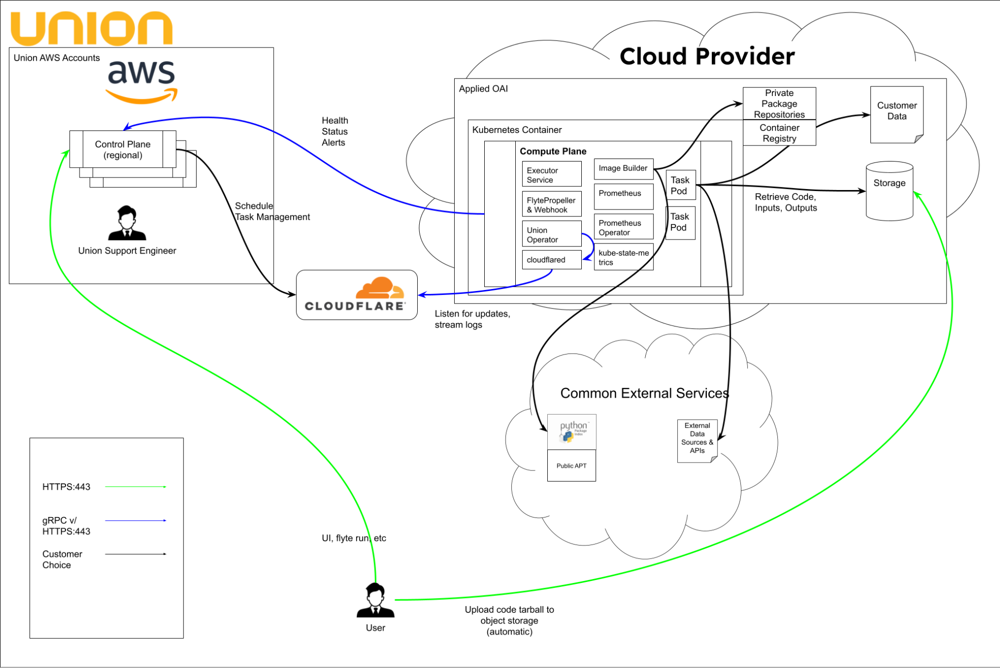

# Outbound-only network architecture

The data plane initiates all connections to the control plane. No inbound firewall rules are required on the customer's network.

Union.ai uses a Cloudflare Tunnel initiated **outbound** from the customer's data plane:

* No inbound ports need to be opened on the customer's network
* No VPN is required between Union.ai and the customer
* Network security teams only need to allow outbound HTTPS connections to Cloudflare's edge network

## Security benefits

| Benefit | Description |
| --- | --- |
| No inbound attack surface | No open ports on customer network means no port scanning, no exploitation of listening services |
| Simplified firewall management | Only outbound rules to well-known Cloudflare CIDR blocks |
| mTLS encryption | All tunnel traffic is encrypted with mutual TLS -- both ends authenticate |
| Customer-initiated trust | The data plane decides when and whether to connect |
| Network perimeter integrity | Customer's existing network security posture is unaffected |

## Egress configuration

In locked-down environments, networking teams can limit egress access to published Cloudflare CIDR blocks, and further restrict to specific regions in coordination with the Union networking team.

> [!NOTE]
> In BYOC deployments, Union.ai additionally maintains a private management connection to the customer's K8s cluster via PrivateLink/PSC. See [Private connectivity (BYOC)](./private-connectivity).
