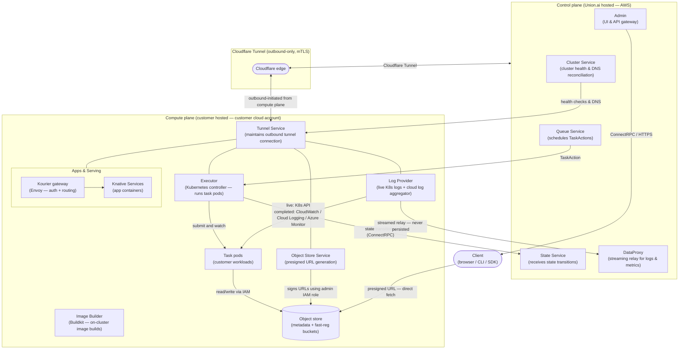

# Compute and control plane components reference

This section provides a detailed reference for each security-relevant component running on the compute plane and/or control plane.
Understanding these components is essential for enterprise security teams conducting architecture reviews.

## Component architecture

The diagram below shows the major components in both planes and how they communicate.
All cross-plane traffic flows through the Cloudflare Tunnel—an outbound-only, mTLS-encrypted connection initiated from the compute plane.
No inbound ports are opened on the customer’s cluster.

**Key relationships:**

| From | To | What flows |
| --- | --- | --- |
| Queue Service | Executor | TaskAction custom resources (orchestration instructions) |
| Executor | State Service | Phase transitions (Queued → Running → Succeeded/Failed) |
| Executor | Task pods | Pod lifecycle management |
| Task pods | Object store | Task inputs/outputs via IAM role (workload identity) |
| Object Store Service | Object store | Presigned URL generation using admin IAM role |
| Log Provider | DataProxy | Log streams relayed in memory — optionally persisted on customer storage |
| Cluster Service | Tunnel Service | Health checks and DNS record reconciliation |
| Tunnel Service | Cloudflare edge | Single outbound-only mTLS connection covering all compute-plane services |

## Executor

The Executor is a Kubernetes controller that runs on the customer’s compute plane.
It is the core component responsible for translating orchestration instructions into actual workload execution.
The Executor watches for `TaskAction` custom resources created by the Queue Service, reconciles each `TaskAction` through its lifecycle (`Queued`, `Initializing`, `Running`, `Succeeded`/`Failed`), reports state transitions back to the control plane’s State Service via `ConnectRPC` through the Cloudflare tunnel, and creates and manages Kubernetes pods for task execution.

The Executor runs entirely within the customer’s cluster.
It accesses the customer’s object store and secrets using IAM roles bound to its Kubernetes service account via workload identity federation.
At no point does the Executor communicate directly with external services outside the customer’s cloud account (except through the Cloudflare tunnel to the control plane).

## Apps and serving

- Apps and Serving enables customers to deploy long-running web applications — Streamlit dashboards, FastAPI services, notebooks, and inference endpoints — directly on the customer's compute plane.
- Apps run as Knative Services within tenant-scoped Kubernetes namespaces, with the Union Operator managing the full lifecycle including autoscaling and scale-to-zero.
- No application code, data, or serving traffic passes through the Union control plane.
- Inbound traffic routes through Cloudflare for DDoS protection to a Kourier gateway (Union's Envoy fork) running on the customer's cluster, which enforces authentication against the control plane before forwarding to the app container.
- Browser access uses SSO; programmatic access requires a Union API key.
- All endpoints require authentication by default, with optional per-app anonymous access.
- Union's RBAC controls which users can deploy and access apps per project, and resource quotas constrain consumption.
- The load balancer, serving infrastructure, and app containers all run within the customer's cluster, maintaining the same data residency guarantees as workflow execution.

## Object store service

The Object Store Service runs on the compute plane and provides the signing capabilities that enable the presigned URL security model.
Its key operations include:  
- `CreateSignedURL` (generates presigned URLs using the customer’s IAM credentials via the admin role). 
- `CreateUploadLocation` (generates presigned `PUT` URLs for fast registration with `Content-MD5` integrity verification)  
- `Presign` (generic presigning for arbitrary object store keys)  
- `Get`/`Put` (direct object store read/write used internally by platform services).

Two object store buckets are provisioned per compute plane cluster: a metadata bucket for task inputs, outputs, reports, and intermediate data, and a "fast-registration" bucket for code bundles uploaded during task registration.
Object layout follows a hierarchical pattern: org/project/domain/run-name/action-name, providing natural namespace isolation.

## Log provider

The Log Provider runs on the compute plane and serves task logs from two sources.
For live tasks, logs are streamed directly from the Kubernetes API (pod stdout/stderr) in real time.
For completed tasks, logs are read from the cloud log aggregator (CloudWatch, Cloud Logging, or Azure Monitor) after pod termination.
Union also supports persisting logs in object storage.
Log lines include structured metadata: timestamp, message content, and originator classification (user vs. system).
This structured approach enables security teams to distinguish between application-generated logs and platform-generated logs for audit purposes.

## Image builder

When enabled, the Image Builder runs on the compute plane and uses Buildkit to construct container images without exposing source code or built artifacts outside the customer’s infrastructure.
The build process pulls the base image from a customer-approved registry (public or private), accesses user code via a presigned URL with a limited time-to-live, builds the container image with specified layers (pip packages, apt packages, custom commands, UV/Poetry projects), and pushes the built image to the customer’s container registry (ECR, GCR, ACR, or others).
Source code and built images never leave the customer’s infrastructure during the build process.

## Tunnel service

The Tunnel Service maintains the Cloudflare Tunnel connection between the compute plane and control plane.
It is responsible for initiating and maintaining the outbound-only encrypted connection, performing periodic health checks and heartbeats, and reconnecting automatically in case of network disruption.
The Cluster Service on the control plane performs periodic reconciliation to ensure tunnel health and DNS records are current.
