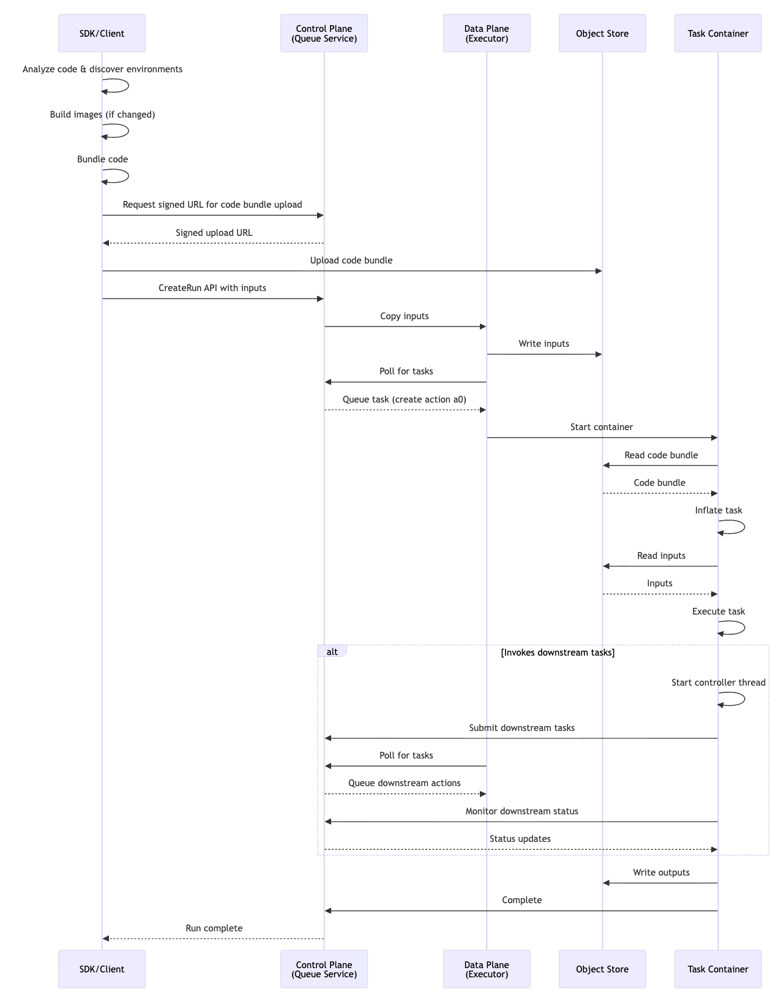

# Security architecture

> [!TIP] Updated for zero-trust architecture
> This page has been substantially revised to reflect the zero-trust security architecture. Tabbed comparisons below highlight key changes.

Union.ai's security architecture is founded on the principle of strict separation between orchestration (control plane) and execution (data plane).
This architectural decision ensures that customer data remains within the customer's own cloud infrastructure at all times.

## Zero-trust data isolation




Union.ai enforces a zero-trust data isolation model: **no customer data, metadata, or logs ever transit through the Union.ai control plane**.

This guarantee is achieved through two architectural decisions:

1. **DataProxy runs on the data plane.** The `dataproxy` service, which generates presigned URLs and serves data to clients, runs entirely within the customer's VPC. It never runs on or communicates through the control plane.
2. **Direct-to-DataPlane tunnel.** A dedicated Cloudflare tunnel connects clients (browsers, SDK) directly to the data plane for all data access. This tunnel is separate from the control plane tunnel used for orchestration. All data, logs, metrics, app serving endpoints, and presigned URLs are served through this direct path.

The result is that the control plane handles only orchestration metadata (task definitions, run status, timestamps, RBAC). All customer data access flows directly between the client and the customer's data plane.

Union.ai offers two deployment tiers for the Direct-to-DataPlane tunnel:

* **Default** -- Direct-to-DataPlane via Cloudflare. The tunnel terminates at Cloudflare's edge network, which routes traffic to the data plane in the customer's VPC.
* **Enterprise** -- Customer-managed VPN-routable load balancer. The customer provisions their own load balancer for the data plane endpoint, eliminating the Cloudflare dependency for data access.

See [Deployment models](./deployment-models) for full details on each tier.

This zero-trust data isolation is a contractual guarantee, not merely an implementation detail.




This section did not exist in the previous architecture.




## Control plane / data plane separation

The control plane and data plane serve fundamentally different purposes and handle different types of data:

### Control plane (Union.ai hosted)

The control plane is responsible for workflow orchestration, user management, and providing the web interface.
It runs within Union.ai's AWS account and stores only orchestration metadata in a managed PostgreSQL database.
This metadata includes task definitions (image references, resource requirements, typed interfaces), run and action metadata (identifiers, phase, timestamps, error information), user identity and RBAC records, cluster configuration and health records, and trigger/schedule definitions.

The control plane never stores, proxies, relays, or otherwise handles customer data payloads.
It stores only references (URIs) to data in the customer's object store.
All data access is performed directly between the client and the data plane via the Direct-to-DataPlane tunnel.

**See comprehensive list of control plane roles and permissions in [Kubernetes RBAC: control plane](./kubernetes-rbac-control-plane).**

### Data plane (customer hosted)

The data plane runs inside the customer's own cloud account on their own Kubernetes cluster.
All customer data resides here, including:

| Data Type | Storage Technology | Access Pattern |
| --- | --- | --- |
| Task inputs/outputs | Object Store | Read/write by task pods via IAM roles; served to clients via presigned URLs generated on the data plane |
| Code bundles (TGZ) | Object Store (fast-registration bucket) | Write via presigned URL; read by task pods and served to clients via presigned URL generated on the data plane |
| Container images | Container Registry | Built on-cluster; pulled by K8s |
| Task logs | Cloud Log Aggregator + live K8s API | Served directly from data plane via Direct-to-DataPlane tunnel |
| Secrets | K8s Secrets, Vault, or Cloud Secrets Manager | Injected into pods at runtime |
| Observability metrics | Prometheus (in-cluster / customer managed) | Served directly from data plane via Direct-to-DataPlane tunnel |
| Reports (HTML) | Object Store (S3/GCS/Azure Blob) | Served to clients via presigned URL generated on the data plane |
| Cluster events | K8s API (ephemeral) | Served directly from data plane via Direct-to-DataPlane tunnel |

**See comprehensive list of data plane roles and permissions in [Kubernetes RBAC: data plane](./kubernetes-rbac-data-plane).**

## Network architecture

Network security is enforced through multiple layers:

> [!NOTE]
> In BYOC deployments, Union.ai additionally maintains a private management connection to the customer's K8s cluster. See [BYOC deployment differences: Network architecture](./byoc-differences#network-architecture) for details.

### Control plane tunnel (outbound only)

The data plane connects to the control plane via a Cloudflare Tunnel -- an outbound-only encrypted connection initiated from the customer's cluster.
This tunnel carries only orchestration traffic (task scheduling, status updates, metadata queries).
It does not carry customer data.

This architecture provides several critical security benefits:

* No inbound firewall rules are required on the customer's network
* All traffic through the tunnel uses mutual TLS (mTLS) encryption
* The Tunnel Service performs periodic health checks and state reconciliation
* Connection is initiated outward to Cloudflare's edge network, from the data plane, which then connects to the control plane

Union.ai operates regional control plane endpoints:

| Area | Region | Endpoint |
| --- | --- | --- |
| US | us-east-2 | hosted.unionai.cloud |
| US | us-west-2 | us-west-2.unionai.cloud |
| Europe | eu-west-1 | eu-west-1.unionai.cloud |
| Europe | eu-west-2 | eu-west-2.unionai.cloud |
| Europe | eu-central-1 | eu-central-1.unionai.cloud |

In locked-down environments, networking teams can limit egress access to published Cloudflare CIDR blocks, and further restrict to specific regions in coordination with the Union networking team.

### Direct-to-DataPlane tunnel (outbound only)




The Direct-to-DataPlane tunnel provides a separate, dedicated path for all data access between clients and the data plane.
This tunnel is distinct from the control plane tunnel and carries all customer data, logs, metrics, and presigned URL traffic.

In the Default deployment tier, this tunnel uses Cloudflare's edge network. An Envoy router on the data plane authenticates incoming requests and enforces RBAC checks before serving data.

> [!NOTE] Information needed
> Specific Envoy authentication mechanism details (JWT validation, token exchange flow) to be documented.

In the Enterprise deployment tier, the customer provisions their own VPN-routable load balancer, replacing the Cloudflare dependency for data access while maintaining the same Envoy-based authentication and RBAC enforcement on the data plane.




This section did not exist in the previous architecture. All tunnel traffic flowed through a single Cloudflare Tunnel shared between orchestration and data relay.




### Communication paths

| Communication Path | Protocol | Encryption |
| --- | --- | --- |
| Client → Control Plane | ConnectRPC (gRPC-Web) over HTTPS | TLS 1.2+ |
| Control Plane ↔ Data Plane | Cloudflare Tunnel (outbound-initiated) | mTLS |
| Client → Data Plane (Direct-to-DataPlane) | HTTPS via Cloudflare Tunnel or customer LB | TLS 1.2+ |
| Client → Object Store (presigned URL) | HTTPS | TLS 1.2+ (cloud provider enforced) |
| Fluent Bit → Log Aggregator | Cloud provider SDK | TLS (cloud-native) |
| Task Pods → Object Store | Cloud provider SDK | TLS (cloud-native) |

> [!NOTE]
> BYOC deployments add a PrivateLink/PSC management path between Union.ai and the customer's K8s API. See [BYOC deployment differences: Network architecture](./byoc-differences#network-architecture).

## Data flow architecture

All data access in Union.ai flows directly between the client and the customer's data plane. The control plane is never in the data path.

### Presigned URL pattern

For task inputs, outputs, code bundles, and reports, the data plane's `dataproxy` service generates time-limited presigned URLs using customer-managed credentials.
The client obtains these URLs via the Direct-to-DataPlane tunnel and then fetches or uploads data directly to the customer's object store. The control plane is not involved at any point in this flow.

Presigned URLs generated on the data plane are single-object scope, operation-specific (GET or PUT), time-limited (default 1 hour maximum), and transport-encrypted at every hop.

Union.ai applies several controls:

* **TTL enforcement** -- URLs expire after a configurable window (default 1 hour, configurable shorter)
* **Single-object scope** -- each URL grants access to exactly one object, not a bucket or prefix
* **Operation specificity** -- each URL is locked to a single operation (GET or PUT)
* **Transport encryption** -- URLs are transmitted only over TLS-encrypted channels
* **No URL logging** -- presigned URLs are not persisted in any logs or databases outside the data plane

Organizations with stricter requirements can configure shorter TTLs. The presigned URL model was chosen because it eliminates the need for the control plane to hold persistent cloud IAM credentials, which would represent a larger and more persistent attack surface than time-limited bearer URLs.

### Direct data serving pattern




For logs, observability metrics, and Kubernetes events, the data plane serves data directly to the client through the Direct-to-DataPlane tunnel. An Envoy router on the data plane authenticates each request and enforces RBAC checks before returning data. The data is never relayed through, cached in, or written to disk on the control plane.

This pattern replaces the previous streaming relay architecture. Data now flows:

1. Client sends authenticated request through Direct-to-DataPlane tunnel
2. Envoy router on the data plane validates the request and checks RBAC permissions
3. Data plane service retrieves the data (from the log aggregator, Prometheus, or K8s API)
4. Data is returned directly to the client through the tunnel




For logs and observability metrics, the control plane acted as a stateless relay — streaming data from the data plane through the Cloudflare tunnel to the client in real time. The data passed through the control plane's memory as a TLS encrypted stream. It was never written to disk, cached, or stored.




### SDK direct upload (planned)




> [!NOTE] Information needed
> SDK direct upload for task inputs is planned. In this pattern, the SDK retrieves a signed URL directly from the data plane and uploads input data to the customer's object store without involving the control plane. Specific timeline and implementation details to be documented.




This section did not exist in the previous architecture. Input data was uploaded through the control plane.




### Execution flow diagram

> [!NOTE] Information needed
> The execution flow diagram above predates the zero-trust architecture and may not accurately reflect the current Direct-to-DataPlane data flow. An updated diagram is needed.

### Data in the UI




| Field | What is it? | Where is it stored? | How is it retrieved? |
| --- | --- | --- | --- |
| Task names | Python function and module names | Control Plane | CP API |
| Users' names | First and last names of users on the platform | IDP | Cached in memory in CP, otherwise retrieved directly from IDP |
| Inputs/Outputs | Primitive inputs/outputs returned by tasks (e.g. return 5) | Data plane's object store | Direct-to-DataPlane tunnel (presigned URL generated on data plane, browser fetches from object store) |
| Logs | Runtime logs written by the task code/SDK | Data plane K8s for live logs, data plane log aggregator for persistent logs | Direct-to-DataPlane tunnel (served directly from data plane) |
| K8s Events | Pod autoscaling events explaining whether a node is found or the cluster needs to scale up, etc. | Data plane K8s | Direct-to-DataPlane tunnel (served directly from data plane) |
| Report | Reports produced by the task code in HTML | Data plane's object store | Direct-to-DataPlane tunnel (presigned URL generated on data plane, browser renders in iframe) |
| Code explorer | Code bundled when the task was kicked off, containing the task code and surrounding dependencies/functions it calls | Data plane's object store | Direct-to-DataPlane tunnel (presigned URL generated on data plane, JS in browser downloads and unzips the bundle to render) |
| Timeline timestamps | Showing when a task started, when it moved from queued to running to completed | Control Plane | CP API |
| Errors | Showing the failure message written into stderr or raised exceptions for a task attempt | Control Plane | CP API |
| Observability metrics | Prometheus metrics for task and workflow performance | Data plane Prometheus | Direct-to-DataPlane tunnel (served directly from data plane) |




| Field | What is it? | Where is it stored? | How is it retrieved? |
| --- | --- | --- | --- |
| Task names | Python function and module names | Control Plane | CP API |
| Users' names | First and last names of users on the platform | IDP | Cached in memory in CP, otherwise retrieved directly from IDP |
| Inputs/Outputs | Primitive inputs/outputs returned by tasks (e.g. return 5) | Dataplane's S3 bucket | Cloudflare Tunnel |
| Logs | Runtime logs written by the task code/SDK | Dataplane K8s for live logs, dataplane S3/Cloudwatch/Stackdriver for persistent logs | Cloudflare Tunnel |
| K8s Events | Pod autoscaling events explaining whether a node is found or the cluster needs to scale up… etc. | Dataplane K8s | Cloudflare Tunnel |
| Report | Reports produced by the task code in HTML | Dataplane's S3 bucket | A signed URL is generated through the tunnel, then the browser renders it in iframe |
| Code explorer | Code bundled when the task was kicked off, that contains the task code and surrounding dependencies/functions it calls| Dataplane's S3 bucket | A signed URL is generated through the tunnel, then JS in the browser downloads and unzips the bundle to render |
| Timeline timestamps | Showing when did a task start, when it moved from queued to running to completed | Control Plane | CP API |
| Errors | Showing the failure message written into stderr or raised exceptions for a task attempt | Control Plane | CP API |



