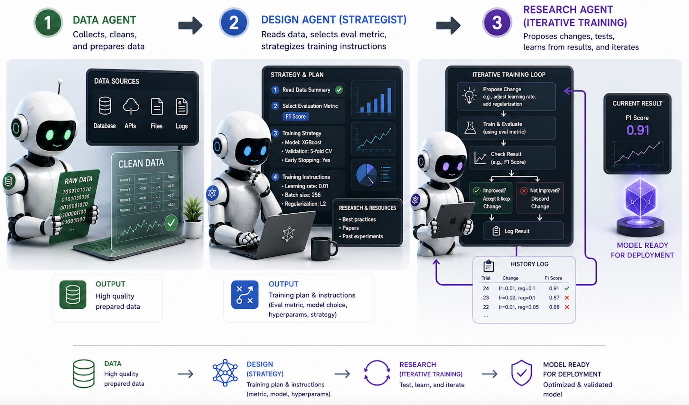

# AutoTrain: A Multi-Agent AutoML Pipeline on Union

<!-- placeholder image, e.g.:

-->

## Background

Most AutoML tools stop at trying a handful of models and picking the best one. Real machine learning work involves more: understanding a raw, often messy dataset, choosing a sane starting architecture for its size and modality, then iterating the way a researcher would, reading results, diagnosing failures, and deciding what to try next.

AutoTrain automates that whole loop behind a simple web interface: a user submits a dataset link and a few fields, and a FastAPI app kicks off a three-stage Flyte pipeline. A **data agent** profiles and cleans the dataset, a **design agent** turns that profile into a concrete experiment plan and a starting `train.py`, and a **research agent** runs an iterative improve-and-evaluate loop with the Claude Agent SDK, committing progress to GitHub and opening a PR with the results. Every step is a task or trace visible in the Union UI. Architecturally, this is a hybrid app-task graph: the frontend and the pipeline's tasks are deployed to the same Union project/domain, and the app submits runs programmatically (`flyte.run.aio()`) on the user's behalf, then polls the cluster to report progress back to them.

> [!NOTE]
> Full code available [here](https://github.com/unionai/unionai-examples/tree/main/v2/tutorials/auto_train).

## Layout

| Path | Purpose |
|---|---|
| `app.py` | FastAPI frontend + `FastAPIAppEnvironment` (web image only) |
| `pipeline.py` | Task environments (cpu/gpu images, secrets) and the `automl_pipeline` task |
| `agents/` | Data / design / research agents (imported lazily inside tasks) |
| `templates/` | Jinja2 pages for the submission form and the status page |

## The Frontend App

The frontend is a small FastAPI app (`app.py`) whose only job is to take a submission, kick off a Flyte run, and let the user watch it progress - it holds no state of its own. That statelessness is deliberate: every submission becomes a Flyte run named `automl-<job_id>`, labeled `app=automl-webapp` and `automl-job-id=<job_id>`, and the status endpoint always resolves progress by querying the cluster for that run. If the app restarts or gets redeployed mid-run, the status page keeps working, because nothing about job progress lived in the app's memory to begin with.

### The web image is deployed separately from the pipeline images

`app.py` builds its own lightweight image (fastapi, uvicorn, jinja2, flyte client) and only imports `pipeline.py` lazily, inside the `/run` handler. This matters because `pipeline.py` pulls in the cpu and gpu task images - heavyweight, GPU-capable containers with torch, transformers, etc. If `app.py` imported `pipeline` at module scope, `flyte serve app.py automl_webapp` would try to build all of those images just to stand up the frontend. Deploying the app therefore only builds the web image; the task images are built lazily, the first time a run actually needs them.



<!-- placeholder - wrap the _web_image definition and the FastAPIAppEnvironment(...) block
     (app.py, roughly lines 40-147) with:
     # {{docs-fragment web_image_and_environment}}
     ...
     # {{/docs-fragment}}
-->

### Submitting a run from inside a request handler

The `/run` endpoint is the interesting part: it has to submit a Flyte run from within an async request handler without blocking the response, and it has to do so on the same event loop where Flyte was initialized - `flyte.run.aio()` cannot be driven from a separate thread's event loop, or you get `Event loop stopped before Future completed`. The handler generates a short job id, fires off the submission as a background `asyncio.create_task`, and immediately 303-redirects the browser to a status page. Submission failures (which happen *before* a run exists, so there's no cluster state to query) are captured in a small in-process error map purely so the status page has something to show - this is diagnostic, not tracked state, and is lost on restart.



<!-- placeholder - wrap the /run handler (app.py, roughly lines 164-209) with:
     # {{docs-fragment submit_run_endpoint}}
-->

### Resolving status from the cluster, not from memory

Because the app keeps no job state, `/api/status/{job_id}` has to reconstruct everything by asking Flyte: the run's phase maps to a status (`starting` / `running` / `done` / `error`), and on success the run's outputs become the result string. While the run is in flight, the app also walks the run's child actions to build a step list (data agent → design agent → research agent) with per-step phases, so the status page can show real progress instead of a single spinner.



<!-- placeholder - wrap _job_status and _pipeline_steps (app.py, roughly lines 227-322) with:
     # {{docs-fragment job_status_resolution}}
-->

### The submission form and status page

The UI itself is two Jinja2 templates with no client-side framework: `templates/index.html` is a plain HTML form (GitHub repo, dataset link, target column, domain hint, and training-budget fields), and `templates/status.html` polls `/api/status/{job_id}` on an interval and renders whichever state comes back - a running step list, a completed result with a link to the GitHub PR, or an error traceback.



<!-- placeholder - wrap the poll() / updateRunning() / showDone() functions
     (templates/status.html, roughly lines 94-208) with a similar marker.
-->

## Three Agents, One Pipeline

The pipeline itself (`pipeline.py`) is three tasks chained together, each running in its own `TaskEnvironment` with the resources the job actually needs, plus a lightweight orchestrator task that calls them in sequence. Each stage is deliberately a separate task, not a function call inside one big task: the data and design stages are cheap CPU work, while the research stage needs a GPU for hours at a time - collapsing them into one task would mean paying for GPU time during data profiling.



<!-- placeholder - wrap the cpu_image / gpu_image / data_env / design_env / research_env / pipeline_env
     block (pipeline.py, roughly lines 47-98) with:
     # {{docs-fragment task_environments}}
-->

### Agent 1: Data Agent - ingest, profile, clean

`DataAgent` (`agents/data_agent.py`) takes whatever the user points it at - a CSV/Parquet URL, a HuggingFace dataset ID, a Kaggle dataset, a zipped image folder, FASTA sequences - and turns it into a `DataProfile`: modality (tabular / image / sequence / timeseries), inferred task type, class distribution, missingness, and a quality score with concrete recommendations (e.g. "severe class imbalance, use focal loss or oversampling"). Modality detection combines file-extension sniffing with domain-hint keywords (`"satellite"` → image, `"dna"`/`"protein"` → sequence), because a bare CSV of DNA k-mers looks tabular until you actually read the values.



<!-- placeholder - wrap the DataProfile dataclass (agents/data_agent.py, roughly lines 33-62) with:
     # {{docs-fragment data_profile_dataclass}}
-->



<!-- placeholder - wrap _detect_modality (agents/data_agent.py, roughly lines 361-388) with:
     # {{docs-fragment modality_detection}}
-->

The Flyte task wrapping this agent (`run_data_agent`) is careful about what it uploads: raw downloads live in a scratch dir that's never persisted, and only `profile.json` plus the cleaned data get packaged into the `flyte.io.Dir` that's handed to the next stage.



<!-- placeholder - wrap run_data_agent (pipeline.py, roughly lines 119-149) with:
     # {{docs-fragment data_agent_task}}
-->

### Agent 2: Design Agent - from profile to experiment plan

`DesignAgent` (`agents/design_agent.py`) runs once and produces everything the research loop needs to get started: it picks a GPU tier based on data size and modality, asks Claude to choose the right evaluation metric (`roc_auc`, `macro_f1`, `rmse`, ...) for the task, and - the more interesting decision - asks Claude to pick a *starting tier* off a modality-specific strategy ladder (e.g. for images: frozen-backbone-plus-sklearn for under 1k samples, up through a full EfficientNet-B4 fine-tune for 50k+). This means the research agent doesn't waste its first few experiments discovering that a linear model is too weak for a 200k-row image dataset; the design agent already reasoned about that from the data profile.



<!-- placeholder - wrap _select_compute_tier (agents/design_agent.py, roughly lines 36-61) with:
     # {{docs-fragment compute_tier_selection}}
-->



<!-- placeholder - wrap _select_starting_strategy (agents/design_agent.py, roughly lines 166-274) with:
     # {{docs-fragment starting_strategy_selection}}
-->

The agent then has Claude generate a **data-loading skeleton only** - explicitly no model, optimizer, or training loop - and writes it as `train.py` alongside a `program.md` (the research agent's instructions: metric, strategy ladder, hard constraints) and an empty `progress.csv`. All three files get pushed to a new branch in the target GitHub repo. This branch is the handoff between design and research - it's why a **writable** GitHub token is required even for public repos.



<!-- placeholder - wrap _generate_train_py (agents/design_agent.py, roughly lines 373-432) with:
     # {{docs-fragment generate_train_skeleton}}
-->

### Agent 3: Research Agent - the improve-and-evaluate loop

`ResearchAgent` (`agents/research_agent.py`) is where most of the engineering complexity lives. It clones the branch the design agent pushed, then runs a bounded loop (up to `max_experiments` iterations, each capped at `time_budget_per_experiment_seconds`):

1. **Experiment 0** hands `train.py` (still just the data-loading skeleton) to a `claude-agent-sdk` session, which reads `program.md`'s recommended starting tier and implements a complete baseline - model, training loop, metric printing.
2. **Every subsequent experiment** hands the current `train.py` plus `progress.csv`'s history to a fresh, short SDK session (`max_turns=10`) that reads what's been tried, diagnoses the current bottleneck, and applies exactly one focused change - or replies `STOP` if it thinks nothing further will help.
3. Python - not Claude - actually **runs** `train.py` as a subprocess with a hard timeout, parses the printed metric, and decides whether the change was an improvement. If it crashed, one extra LLM call attempts a targeted fix and one retry. Improvements get committed and pushed; non-improvements get the previous best `train.py` restored.

The reason this is split between "Claude decides what to change" and "Python runs the training" is that training is slow and needs a strict timeout, while proposing a change is fast and bounded - mixing them into one long agent session would make timeouts and reproducibility much harder to reason about.



<!-- placeholder - wrap implement_baseline (agents/research_agent.py, roughly lines 145-211) with:
     # {{docs-fragment implement_baseline}}
-->



<!-- placeholder - wrap propose_change (agents/research_agent.py, roughly lines 214-352) with:
     # {{docs-fragment propose_change}}
-->



<!-- placeholder - wrap the main `for exp_id in range(max_experiments):` loop inside
     ResearchAgent.run (agents/research_agent.py, roughly lines 706-825) with:
     # {{docs-fragment research_loop}}
-->

Every step of the loop - CLI setup, git clone, the baseline implementation, each change proposal, each training run, crash fixes, commits, PR creation, the final convergence check - is wrapped in `@flyte.trace`, so it shows up as a distinct traced action in the Union UI with its own inputs, outputs, and timing, all nested inside the single `run_research` task. Because a trace's identity is `(function name, input hash)`, every per-experiment call takes `exp_id` (and `run_training` an attempt counter) as an explicit input - otherwise a repeated call with the same arguments would replay a cached result instead of re-running.



<!-- placeholder - wrap run_training (agents/research_agent.py, roughly lines 593-654) with:
     # {{docs-fragment run_training_subprocess}}
-->

The loop also streams a `flyte.report` as it goes: the main tab is a live, styled trace of what each experiment tried and how it turned out, and a "Performance" tab holds a Plotly chart - the running best as a step line, rejected experiments as gray dots, improvements as green dots - rebuilt from `progress.csv` after every experiment.



<!-- placeholder - wrap _build_progress_plot (agents/research_agent.py, roughly lines 978-1051) with:
     # {{docs-fragment progress_plot}}
-->

At the end of the loop, the agent opens (or finds) a results PR on GitHub and asks Claude one more time to judge convergence - is the best metric actually good given the dataset, or did every experiment plateau/crash - and streams that verdict into the report and back to the app via a callback.



<!-- placeholder - wrap the tail of ResearchAgent.run from the final commit through
     create_pull_request / analyze_convergence (agents/research_agent.py, roughly lines 827-872) with:
     # {{docs-fragment pr_and_convergence}}
-->

### Orchestration

`automl_pipeline` is the thin task that wires the three agents together: data → design → research, `await`-ing each handoff. `pipeline_env`'s `depends_on=[data_env, design_env, research_env]` ensures its image is only built once the environments it calls into are resolved.



<!-- placeholder - wrap automl_pipeline (pipeline.py, roughly lines 267-299) with:
     # {{docs-fragment pipeline_orchestration}}
-->

## Running the Pipeline

### Prerequisites

1. A Flyte config (`~/.flyte/config.yaml`) pointing at your target cluster.
2. Two secrets created in the project/domain you deploy to:

   ```sh
   flyte create secret --project flytesnacks --domain development internal-anthropic-api-key <key>
   flyte create secret --project flytesnacks --domain development autotrain-github-token <PAT>
   ```

   The GitHub token must be able to **push and open PRs** on the experiments repo - for a fine-grained PAT that means Repository access limited to the target repo(s), **Contents: Read and write**, **Pull requests: Read and write**. (The "Public repositories" preset is read-only and will not work.) For an org-owned repo, the token's resource owner must be the org, and org policy may require approving it first.

3. [`uv`](https://docs.astral.sh/uv/) installed locally - the deploy command below runs the app via `uvx`.

### Deploy

```sh
uvx --with fastapi --with uvicorn --with jinja2 --with python-multipart \
    --with "connectrpc==0.10.1" --from "flyte==2.5.9" \
    flyte serve --project flytesnacks --domain development app.py automl_webapp
```

This only builds the **web** image - the cpu/gpu task images are built remotely the first time a run actually needs them (the gpu image takes roughly 5-7 minutes the first time; it's cached after that). The app itself scales to zero when idle, so the first request after a quiet period can take 30-60 seconds.

For local UI development against your real cluster config: `python app.py --local`.

### Using it

Open the deployed app's URL (`flyte get app --project flytesnacks --domain development` will print it) and submit the form, or POST directly:

```sh
curl -i -X POST https://<app-endpoint>/run \
  -d "dataset_link=https://raw.githubusercontent.com/datasciencedojo/datasets/master/titanic.csv" \
  -d "target_column=Survived" \
  -d "github_repo=your-org/your-experiments-repo" \
  -d "domain=auto" -d "max_experiments=1" -d "time_budget=60" -d "max_samples_raw=100"
```

The response is a 303 redirect to `/status/{job_id}` (a browser-friendly progress page); `/api/status/{job_id}` returns the same status as JSON, for scripting.

### Debugging

Because the app tracks no state of its own, the run itself is always the source of truth:

```sh
flyte get run    --project flytesnacks --domain development                 # recent runs
flyte get action --project flytesnacks --domain development <run>           # actions + errorInfo
flyte get logs   --project flytesnacks --domain development <run> <action>  # task logs
```

The most common failure isn't a bug - it's the status page sitting on "Building container images…" during the very first run, while the gpu image builds. If a run never appears at all, the submission itself failed before creating one; the status page will show the traceback in that case, and the app logs will have it too.

## What You Get

After a run completes:

- **Union UI**: a live report on the research task - the running trace of what each experiment tried, a Performance tab charting the metric across experiments, and full logs for every stage.
- **GitHub**: an experiment branch with the full history of `train.py` revisions (one commit per improvement) and a PR summarizing the best result, ready to review or merge.
- **The status page**: the best metric value, a link to the PR, and - if the agent's own convergence check flagged the result as unsatisfactory - a plain-language explanation of what went wrong and what to try next.

## Why Union?

You could wire something similar together with a cron job or a long-running script on a VM. A few things would be harder to get back once you did.

**Compute isolation.** Data profiling and experiment design are cheap CPU work; the research loop needs a GPU for hours at a stretch. Because each stage is its own `TaskEnvironment`, you only pay for GPU time during the part of the pipeline that actually needs one - the data and design agents run on 2-core CPU containers regardless of how large the eventual model turns out to be.

**Observability into an unattended, multi-hour process.** The research loop can run for a long time with no one watching. Every internal step - installing the CLI, cloning the branch, implementing the baseline, each change proposal, each training run, crash fixes, commits, PR creation, the final convergence check - is wrapped in `@flyte.trace`, so it shows up as its own action in the Union UI with inputs, outputs, and timing, nested inside the single task container. If experiment 14 crashes, you're not left with a bare stack trace - you can see exactly what the previous 13 experiments tried and why.

**Live results instead of a black box.** `flyte.report` streams the trace and a Plotly performance chart as the loop runs, so you can watch the metric improve (or stall) in real time instead of waiting for the whole run to finish before finding out it went nowhere.

**Secrets scoped to what needs them.** The Anthropic API key and the GitHub token are injected as `flyte.Secret`s on the task environments that need them, not baked into an image or handled in application code. A task pod that references a secret which doesn't exist in the target project/domain fails fast at admission, rather than midway through a training run.

**A frontend that doesn't carry the pipeline's weight.** The FastAPI app builds and deploys a small web image; the cpu/gpu task images are only built the first time a run actually needs them. Deploying or redeploying the frontend is fast, and because the app keeps no state of its own - status is always resolved from the run itself - a redeploy mid-run doesn't lose anyone's progress.

AutoTrain is a specific example of a more general pattern: an LLM decides what to try next, and Union handles how that work actually runs - on the right compute, with the right secrets, with every step traceable, whether the loop takes five minutes or five hours.
