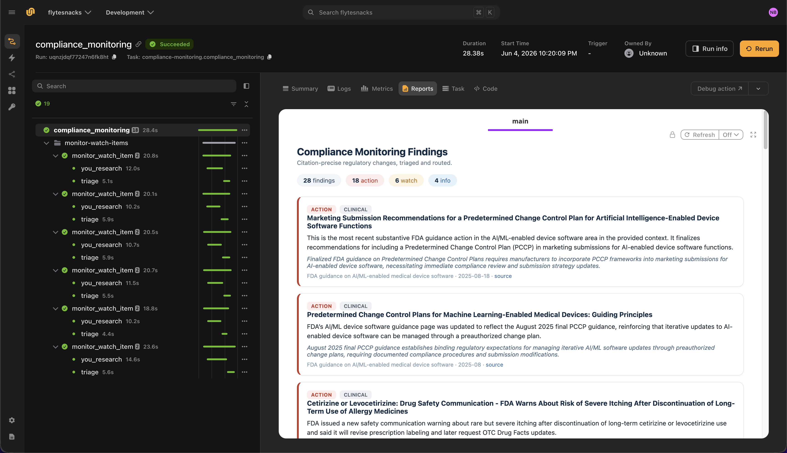

# Compliance monitoring agent

> [!NOTE]
> Code available [here](https://github.com/unionai/unionai-examples/tree/main/v2/tutorials/compliance_monitoring_agent).

This example demonstrates how to build a regulatory and compliance monitoring agent on Flyte. The agent watches trusted regulatory sources — FDA guidance, SEC filings, sanctions lists, state-level privacy laws — and routes structured, **citation-precise** findings to the right downstream team (compliance, legal, or clinical ops).

Compliance monitoring requires **citation precision and recency** so every finding can be verified. The [You.com Research API](https://you.com/docs/research/overview) returns a grounded, synthesized answer plus structured sources (URL, title, snippet). Use `source_control` to restrict research to trusted government and regulator domains within a recency window, and `output_schema` when you need machine-readable findings. [Claude](https://docs.anthropic.com/) via [LiteLLM](https://docs.litellm.ai/) triages each finding for severity and routing. Combined with Flyte's audit lineage, you get end-to-end traceability from query to citation.

Flyte provides:

- **Fan-out parallelism** across watch items
- **`@flyte.trace`** on every You.com Research and LLM call
- **Retries** on monitoring tasks for robustness
- **Flyte reports** grouped by team and severity



## Setting up the environment

The agent runs in a `TaskEnvironment` with secrets for the You.com and Anthropic API keys and a container image built from the `uv` script dependencies.



The Python packages are declared at the top of the file using the `uv` script style:

```
# /// script
# requires-python = "==3.13"
# dependencies = [
#     "flyte>=2.4.0",
#     "httpx>=0.27.0",
#     "litellm>=1.72.0",
# ]
# ///
```

## Data types

Each `WatchItem` specifies a regulatory topic, a list of trusted domains for `source_control`, and a routing destination team. Findings carry citation metadata — source URL, published date, and snippet — so every claim can be verified.



## Research with the You.com Research API

The `you_research` helper calls the [You.com Research API](https://you.com/docs/research/overview) at `https://api.you.com/v1/research`. It passes `source_control` with an `include_domains` allowlist and a `freshness` filter, and requests structured output via `output_schema`.

See the [Research API reference](https://you.com/docs/api-reference/research/v1-research) for `research_effort` levels (`lite`, `standard`, `deep`, `exhaustive`), `source_control`, and `output_schema` parameters.



## Triage findings with Claude

After the Research API returns structured findings, Claude assigns a severity (`info`, `watch`, or `action`) and a routing rationale for each one.



## Monitor one watch item

The `monitor_watch_item` task researches a single regulatory topic, enriches findings with source metadata from the Research API response, and triages each finding for severity and routing.



## Orchestration

The `compliance_monitoring` driver task fans out across all watch items, aggregates findings, and renders a Flyte report sorted by severity and team.



## Run the agent

### Create secrets

Get a You.com API key from the [You.com platform](https://you.com/platform) (see the [quickstart guide](https://you.com/docs/quickstart)). Get an Anthropic API key from the [Anthropic console](https://console.anthropic.com/).

Register both keys as Flyte secrets. The secret key names must match those declared in the `TaskEnvironment`:

```
flyte create secret youdotcom-api-key <YOUR_YOU_API_KEY>
flyte create secret internal-anthropic-api-key <YOUR_ANTHROPIC_API_KEY>
```

See [Secrets](../../../user-guide/task-configuration/secrets) for scoping and file-based secrets.

### Run locally or remotely

From the [example directory](https://github.com/unionai/unionai-examples/tree/main/v2/tutorials/compliance_monitoring_agent):

```
cd v2/tutorials/compliance_monitoring_agent
uv run --script main.py
```

To test locally without Flyte secrets:

```
export YOU_API_KEY=<YOUR_YOU_API_KEY>
export ANTHROPIC_API_KEY=<YOUR_ANTHROPIC_API_KEY>

uv run --script main.py
```

When the run completes, open the Flyte report to review findings grouped by severity, each with a verifiable You.com Research citation.
