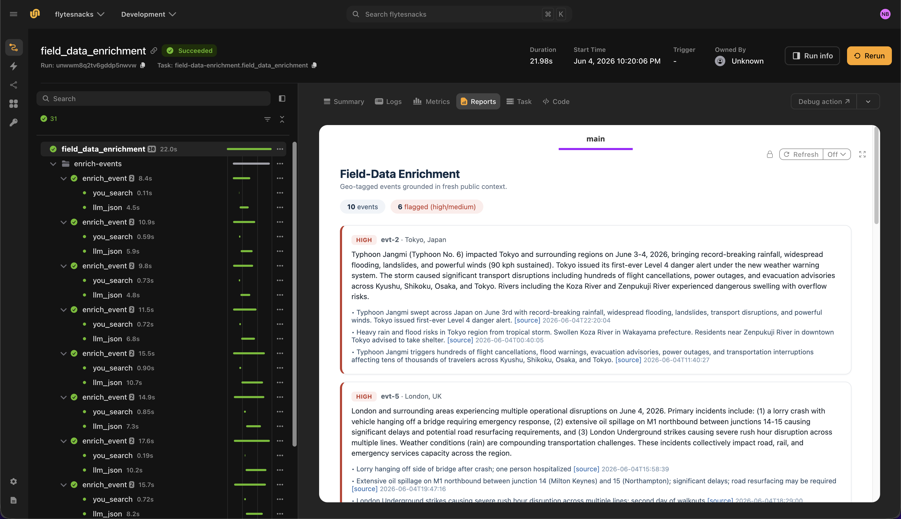

# Field data enrichment agent

> [!NOTE]
> Code available [on GitHub](https://github.com/unionai/unionai-examples/tree/main/v2/tutorials/field_data_enrichment_agent).

This example demonstrates how to build an autonomous systems and field-data enrichment agent on Flyte. The agent enriches geo-tagged operational events (from autonomous vehicles, aircraft, satellites, or field sensors) with **real-world public context**: road closures, weather events, airspace changes, or local incidents tied to a geofence.

Operational data stays in your environment while public-web grounding queries go to the [You.com Search API](https://you.com/docs/search/overview). The API provides unified web and news results with `freshness` and `country` targeting, and [Claude](https://docs.anthropic.com/) via [LiteLLM](https://docs.litellm.ai/) summarizes the relevant context for each geo-tagged event.

Flyte provides:

- **Fan-out parallelism** across geo-tagged events
- **`cache="auto"`** so repeated geofence checks within the cache window reuse prior results
- **`@flyte.trace`** on every external call for lineage
- **Flyte reports** with operational severity and per-incident citations



## Setting up the environment

The agent runs in a `TaskEnvironment` with secrets for the You.com and Anthropic API keys, automatic caching, and a container image built from the `uv` script dependencies.



The Python packages are declared at the top of the file using the `uv` script style:

```
# /// script
# requires-python = "==3.13"
# dependencies = [
#     "flyte>=2.4.0",
#     "httpx>=0.27.0",
#     "litellm>=1.72.0",
# ]
# ///
```

## Data types

Each `GeoEvent` carries an event ID, location, ISO country code for geo-targeting, and an event type. Enriched events include a context summary, operational severity, and discrete incidents with source citations.



## Search with the You.com Search API

The `you_search` helper calls the [You.com Search API](https://you.com/docs/search/overview) with `freshness` and `country` parameters to retrieve location-relevant web and news results. See the [Search API reference](https://you.com/docs/api-reference/search/v1-search) for supported country codes and freshness values.



## Enrich one event

The `enrich_event` task builds a location- and type-scoped query, calls the You.com Search API, and asks Claude to summarize relevant real-world context, extract discrete incidents, and assign an operational severity, all grounded in the returned sources.



## Orchestration

The `field_data_enrichment` driver task fans out across all events and renders a Flyte report sorted by severity.



## Run the agent

### Create secrets

Get a You.com API key from the [You.com platform](https://you.com/platform) (see the [quickstart guide](https://you.com/docs/quickstart)). Get an Anthropic API key from the [Anthropic console](https://console.anthropic.com/).

Register both keys as Flyte secrets. The secret key names must match those declared in the `TaskEnvironment`:

```
flyte create secret youdotcom-api-key <YOUR_YOU_API_KEY>
flyte create secret internal-anthropic-api-key <YOUR_ANTHROPIC_API_KEY>
```

See [Secrets](../../../user-guide/task-configuration/secrets) for scoping and file-based secrets.

### Run locally or remotely

From the [example directory](https://github.com/unionai/unionai-examples/tree/main/v2/tutorials/field_data_enrichment_agent):

```
cd v2/tutorials/field_data_enrichment_agent
uv run --script main.py
```

To test locally without Flyte secrets:

```
export YOU_API_KEY=<YOUR_YOU_API_KEY>
export ANTHROPIC_API_KEY=<YOUR_ANTHROPIC_API_KEY>

uv run --script main.py
```

When the run completes, open the Flyte report to review enriched events with operational severity and timestamped You.com source citations for each incident.
