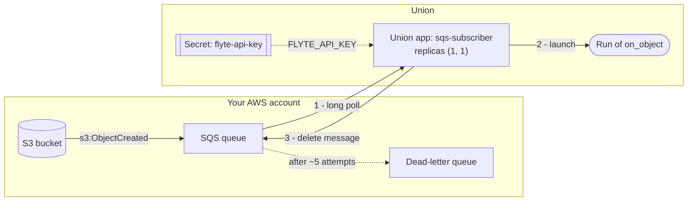
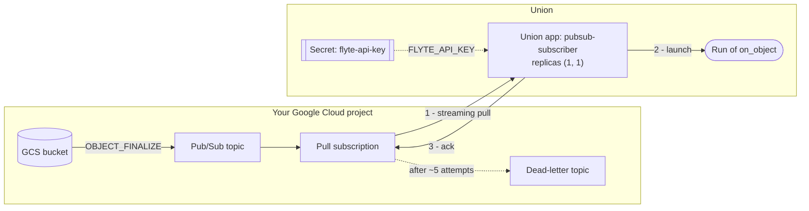
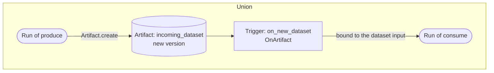

# Event-driven executions

> [!NOTE]
> Code available [on GitHub](https://github.com/unionai/unionai-examples/tree/main/v2/tutorials/event_driven_executions).

An event happens outside Flyte — a file lands in a bucket, a partner drops a batch, an
upstream service finishes a job — and a task should run. This tutorial builds that with
AWS SQS or Google Cloud Pub/Sub, then shows the version that needs no queue at
all, and ends with how to choose.

Every approach launches the same task:



Deploy it twice — once under a tag that is a permanent record, and once under a label the
caller pins:

```bash
flyte deploy --version 2026-09-23-a3f9c21 pipeline.py env   # immutable record
flyte deploy --version prod               pipeline.py env   # what production runs
```

The caller then names `prod` and never changes. Releases and rollbacks happen on the
Flyte side. Avoid resolving "latest" in the caller: every deploy would become an
immediate production change with no way to pin or roll back.

## Reading from SQS



Steps 2 and 3 are in that order on purpose: the message is deleted once the run exists,
not once it finishes.

A subscriber reads the queue and launches a run per message. It runs as a Union app, so
there is no cluster resource to operate — deploy it and the platform keeps it alive:

```bash
flyte deploy sqs_subscriber.py app_env
```

The app calls back into Union to launch runs, so it needs credentials of its own. Mint an
[API key](../../../user-guide/authenticating#api-key) and store it as the secret the app
mounts:

```bash
flyte create api-key --name sqs-subscriber
flyte create secret flyte-api-key <the-key-value>
```

The key carries the endpoint, so `flyte.init_from_api_key` needs nothing else. It also
inherits the permissions of whoever minted it — scope it to the project and domain the
subscriber launches into rather than reusing a personal key.

Two settings matter. Apps scale to zero by default and autoscale on request volume, so it needs `Scaling(replicas=(1, 1))` or it will be scaled
away. It also needs something listening on the app port, which the health endpoint
provides.



The polling loop runs on a background thread. Deleting a message is the acknowledgement,
and it happens once the run exists — not once the run finishes:



S3 notifications need mapping. The message body is a JSON string wrapping records that
describe the object, which is not the same shape as the task's inputs:



A newly configured notification also sends an `s3:TestEvent` with no `Records` at all.
Treat it as nothing to do rather than as an error, or it will be retried until it reaches
the dead-letter queue.

### Queue configuration

| Setting | Recommendation |
|---|---|
| Visibility timeout | at least 6× the time to launch a run |
| Message retention | 7 days |
| Redrive policy | a dead-letter queue with `maxReceiveCount` around 5 |

The queue policy must allow `s3.amazonaws.com` to `sqs:SendMessage` **before** you
configure the bucket notification. S3 tests that it can reach the destination when the
configuration is saved, and without the policy it fails with `Unable to validate the
following destination configurations`. The queue and bucket must also be in the same
region.

## Reading from Pub/Sub



The same pieces as SQS, with delivery split in two: the bucket publishes to a topic, and
the subscriber reads a subscription on it. Pub/Sub also manages the polling threads, so
the handler is a callback rather than a loop:



Deploy it the same way, with its own [API key](../../../user-guide/authenticating#api-key)
stored as the `flyte-api-key` secret:

```bash
flyte deploy pubsub_subscriber.py app_env
```

`flow_control` bounds how much work is in flight, which decides whether draining a backlog
launches a controlled number of runs or a flood.



GCS notifications carry routing data in `attributes` and the object resource in `data`.
Read the attributes: the resource describes the file rather than the work to be done.



### Subscription configuration

Create a pull subscription with an ack deadline of 60 seconds, 7 days of retention, and a
dead-letter topic after about 5 delivery attempts. Grant the GCS service agent
`pubsub.publisher` on the topic, or the notification config will exist and deliver
nothing. Filter by object prefix and event type in the notification so unrelated bucket
activity never reaches the subscriber.

## What both versions have to handle

The code above is short, but every line of it is doing something, and the reasons are the
same on both clouds.

**Delivery is at-least-once.** Both services can deliver a message more than once. The run
name is derived from the message id, so a redelivery collides with the run that already
exists rather than starting a second one. Uniqueness is enforced by Flyte, which means
this holds even across several subscriber replicas.

**Acknowledge on launch, not on completion.** Waiting for a run to finish exhausts the
visibility timeout or ack deadline, and the message is redelivered while the first run is
still going.

**Dead-letter what cannot be processed.** A message that never parses is retried
indefinitely otherwise. Acknowledge it and let the dead-letter queue hold genuine
failures.

**Ordering is about delivery, not completion.** Two runs launched in order can finish out
of order. If a pipeline must not run concurrently for the same key, enforce that in Flyte
rather than at the transport.

### Acknowledgement is not completion

This is the part that outlives the setup work. Because the subscriber acknowledges as soon
as the run is created, a successful acknowledgement means *launched*, not *succeeded* —
and the message is then gone.

If that run later fails, the queue has no idea. Flyte retries within a run, but a run that
ends terminally failed leaves no message to redeliver and nothing to dead-letter. Closing
that gap means building a reconciliation of your own: which messages produced runs, how
each one ended, which failures should be re-fired, and how a deliberate re-fire avoids
colliding with the message-id-derived run name that exists to prevent duplicates.

It is a second system holding state about the first, and it has to
stay correct as both change.

## The version without a queue



Nothing sits outside Union: no queue, no subscriber, no dead-letter path, and no stored
credentials.

When the event originates inside Flyte, none of the above is needed. A task publishes a
new version of a named artifact, and any task with an `OnArtifact` trigger on that name
runs automatically:



Publishing is what fires it:



When you run `produce` a run of `consume` triggers automatically, with the artifact bound
to its `dataset` input.

Two things disappear. The run is recorded against the artifact version that fired it, so
there is no state to keep outside the platform and no reconciliation to build. And
`TriggeredArtifact` delivers a typed artifact straight to the task input, so there is no
payload to decode and no mapping to maintain — the mapping in the queue versions has no
type checking against the task signature and breaks silently when either side changes.

## Choosing between them

| | Message queue | Artifact trigger |
|---|---|---|
| Producer | anything, including systems you do not control | a Flyte task |
| Components to operate | a subscriber | none |
| Credentials to store | Union API key, plus cloud credentials | none |
| Acknowledgement semantics | yours to get right | not applicable |
| Duplicate handling | message-id-derived run names | platform-managed |
| Event to task inputs | a mapping you maintain | typed, bound directly |
| Run to event lineage | build it yourself | recorded on the run |

The deciding question is where the event comes from, regardless of the cloud provider.

If an upstream Flyte task can publish the artifact — including one that ingests from a
bucket on a schedule — the artifact trigger is simpler than the queue in every dimension.

If the producer is a partner, another team, or a system you cannot change, nothing
publishes an artifact and nothing fires. The event has to be observed, and the queue is the
right tool. Registering an externally created object as an artifact does not bridge the
gap: you would still need to notice the object before you could register it, which is the
original problem.

## Next steps
 
Learn more about the Union features used in this tutorial:

- [Triggers](../../../user-guide/triggers/artifact-triggers.md) for schedule and artifact automation
- [Apps](../../../user-guide/apps/build-apps/_index.md/) for the subscriber runtime
