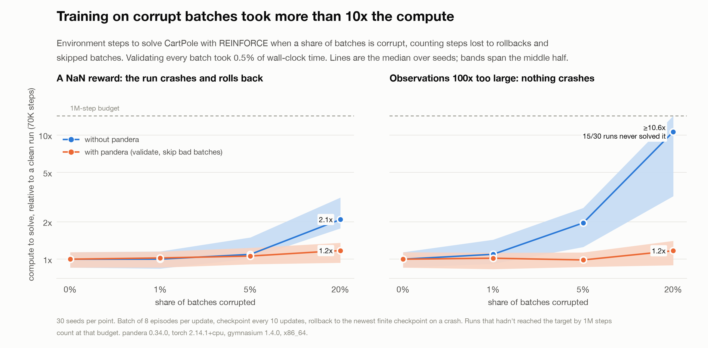

# The cost of not validating

> [!NOTE]
> Code available [on GitHub](https://github.com/unionai/unionai-examples/tree/main/v2/tutorials/pandera_cost_of_not_validating).

The [per-batch validation overhead](../validation-overhead/_index) tutorial measures what validating every batch
costs. This one measures the other side: what happens to training when corrupt batches reach the model. The overhead
benchmark's "without pandera" mode can't answer that, because it skips corrupt batches with a precomputed mask, for
free. A real pipeline has no mask, so here the unvalidated loop trains on whatever it gets.

## What it measures

The benchmark trains a REINFORCE policy (a 4-64-2 MLP, Adam at lr 1e-2) on CartPole-v1 from gymnasium. Each update
collects a batch of 8 episodes into a `TensorDict` (`observation`, `action`, `reward`, `episode`). Before the
update, a share of batches is corrupted in one of two ways:

| Corruption | What it simulates | What happens without validation |
|---|---|---|
| `nan_reward` | one reward in the batch is `NaN` | the loss and then the weights go `NaN`, the next rollout raises, and the run rolls back to its last good checkpoint |
| `obs_scale` | the batch's observations are 100x too large (a units or normalization bug) | nothing crashes; the update pushes the policy the wrong way |

Each cell runs in two modes with the same seeds and the same corruption schedule:

| Mode | What the loop does with a batch |
|---|---|
| without pandera | trains on it |
| with pandera | calls `Transition.validate(td, inplace=True)` and skips the batch on `SchemaError` |

**The cost is environment steps to reach a 475 return**, CartPole-v1's "solved" threshold, averaged over the last
20 episodes. Every collected step counts, including steps thrown away by a rollback and steps in a batch the
validated loop skipped. Steps are deterministic for a given seed, so the result doesn't depend on how busy the node
is. Wall-clock time and time spent in `validate()` are recorded too.

## Setting up the environment

Each run is single-threaded and small, so cells run in parallel as separate tasks rather than as threads in one pod.
The constants set the target return, the checkpoint interval, and the 1M-step budget after which a run that hasn't
solved CartPole stops and counts at the budget.



## The schema

The schema checks dtypes and shapes on every key, observations within ±10 (CartPole terminates long before any
observation gets near that), actions in `{0, 1}`, and rewards in `[0, 1]`, which also rejects `NaN`:



## Corrupting and validating a batch

Corruption draws from its own random stream, so both modes see the same schedule. In the validated mode, a batch
that fails is skipped, and its steps still count toward the cost:



## Rolling back after a crash

A `NaN` update makes the next rollout raise. The loop checkpoints every 10 updates and, on a crash, rolls back to
the newest checkpoint whose weights **and optimizer state** are finite. A checkpoint saved right after a `NaN`
update is poisoned, and restoring it would crash again forever, so the loop steps back past it, the way an operator
would.



Two harness bugs turned up while building this, and both would have inflated the cost of not validating:

- Without the poisoned-checkpoint handling, a run could roll back to `NaN` weights forever.
- `Optimizer.load_state_dict` keeps references to the tensors it's given, so restoring a checkpoint directly let
  the next `NaN` update write into the stored checkpoint. Its weights stayed finite while its Adam state went `NaN`,
  and one run crashed 574 times. The loop now loads copies and checks optimizer state for finiteness.

## Fanning out the cells

`run_cell` runs every seed of one (corruption, rate) cell in both modes. `main` launches one `run_cell` per cell
with `asyncio.gather`, so the clean cell and each corruption at each rate run in parallel, then summarizes the
medians and quartiles and renders the report.





Corruption rates are per batch: 1%, 5%, and 20% of updates. A per-row rate would be much harsher, since a 0.1%
bad-row rate puts at least one bad row in almost every 8-episode batch. Each cell runs 30 seeds, reported as the
median and interquartile range, because REINFORCE on CartPole is noisy: clean runs alone range from 39K to 114K
steps.

## Results

The run used 30 seeds per cell, 420 runs in all, on x86_64 with torch 2.14.1+cpu, pandera 0.34.0, tensordict
0.14.3, and gymnasium 1.4.0.



Median environment steps to reach a 475 return, with the interquartile range in parentheses. A clean run took
69.9K.

| Corruption | Batches corrupted | Without pandera | With pandera | Solved without / with |
|---|---:|---:|---:|---:|
| none | 0% | 69.9K (59.8–79.6K) | 69.9K (59.8–79.6K) | 30 / 30 |
| `NaN` reward | 1% | 69.9K (58.7–80.8K) | 71.5K (59.8–80.5K) | 30 / 30 |
| `NaN` reward | 5% | 76.4K (70.6–104.6K) | 74.0K (63.6–86.3K) | 30 / 30 |
| `NaN` reward | 20% | **145.8K** (123.9–219.4K) | 82.0K (65.4–94.8K) | 30 / 30 |
| observations ×100 | 1% | 76.5K (64.1–100.3K) | 71.1K (58.1–78.8K) | 30 / 30 |
| observations ×100 | 5% | **137.0K** (87.6–181.0K) | 68.9K (60.5–79.2K) | 30 / 30 |
| observations ×100 | 20% | **≥744K** (225K–1M) | 81.7K (62.5–98.2K) | **15** / 30 |

How to read it:

- **Validation cost 0.5% of wall-clock time** in every cell (0.47–0.51%, `validate()` time over total run time).
  Here most of the time goes to collecting episodes, so this isn't directly comparable to the overhead benchmark,
  which times the update step alone.
- **The silent corruption is the expensive one.** Scaled observations never crash anything, so nothing tells the
  loop to stop. At 5% of batches the unvalidated runs needed twice the compute; at 20%, half of them hadn't solved
  the task by 1M steps, and the median of ≥744K is a lower bound. The validated runs solved it every time, at
  1.0–1.2x a clean run's compute.
- **The crash is cheaper, because it's loud.** A `NaN` reward kills the run within one update, so the loop loses at
  most a checkpoint interval. At 5% that was 2 crashes and 15K wasted steps per run (median), and the total cost was
  close to the validated loop's; at 20% it was 25 crashes, 89K wasted steps, and 2.1x the compute. 103 checkpoints
  across all runs were saved right after a `NaN` update and had to be skipped on rollback.
- **At 1% there's no measurable difference**, which is expected: at about 45 updates per run, a 1% rate corrupts
  fewer than one batch per run on average.
- **The validated loop pays for skipped batches**, since their steps count too. At 20% that's why its median rises
  to 1.2x: a fifth of the collected data is thrown away rather than trained on.

## Caveats

- **The cost is conditional on how often your data goes bad.** The benchmark can't know that rate for any real
  pipeline, so it reports the cost at a few rates rather than an expected value.
- **Crash cost depends on checkpoint spacing.** Rolling back 10 updates is cheap; rolling back an hour of GPU time
  isn't. The `nan_reward` numbers scale with the checkpoint interval.
- **CPU only.** On a GPU, an out-of-range action becomes a delayed device-side assert that points at the wrong
  line, and `float64` inputs double memory. Neither shows up here, and debugging time isn't measured at all.
- **One task and one algorithm.** CartPole with REINFORCE is small and recovers quickly; a larger model can take
  longer to recover from a bad update, or not recover.

## Run it

```bash
# On your cluster; builds the image remotely, then writes results/ locally
uv run main.py

# Locally, with a short configuration
uv run main.py --local --seeds 3 --rates 0.05
```
