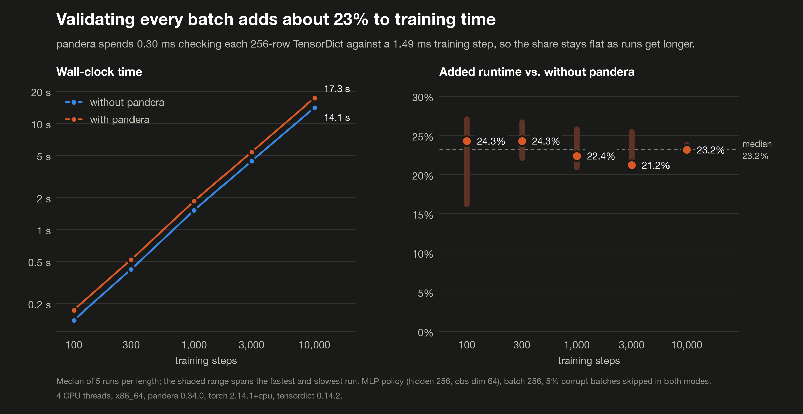
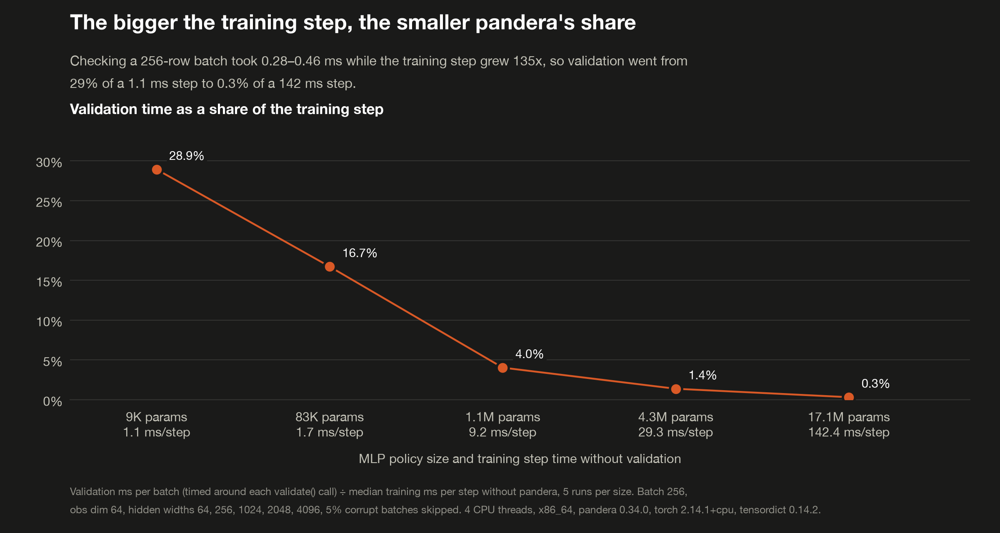

# Per-batch validation overhead

> [!NOTE]
> Code available [on GitHub](https://github.com/unionai/unionai-examples/tree/main/v2/tutorials/pandera_validation_overhead).

[pandera](https://pandera.readthedocs.io) 0.34 can validate PyTorch `TensorDict` batches: dtypes, shapes, and
values on every key. The obvious place to do that is inside the training loop, right before each batch reaches the
model. This benchmark measures what that costs in wall-clock time.

It trains a 3-layer MLP policy (REINFORCE-style loss, Adam) on `TensorDict` batches of RL transitions. 5% of the
batches are corrupted in one of three ways: `float64` observations, one action outside the action space, or one
`NaN` reward. Every training length runs in two modes on the same pod:

| Mode | How it skips corrupt batches |
|---|---|
| without pandera | looks up a precomputed `is_valid` mask, so skipping is free |
| with pandera | calls `Transition.validate(td)` and skips on `SchemaError` |

Both modes train on exactly the same batches, and the benchmark asserts that pandera skips the same steps as the
mask, so the difference in wall-clock time is the cost of validation and nothing else. The baseline is deliberately
generous. A real pipeline has no mask, and without one the corrupt batches would crash the step (`float64` input to
a `float32` layer, an out-of-range index into `gather`) or silently poison the weights (`NaN`). The
[cost of not validating](../cost-of-not-validating/_index) tutorial measures that side.

## Setting up the environment

The benchmark runs on CPU with the CPU-only torch wheel. Two settings matter for the measurement:

- torch's thread count is pinned to the CPU request. In a pod, `os.cpu_count()` reports the node's cores, not the
  container's limit, and an oversubscribed 4-CPU limit made a run that normally takes a few minutes still be going
  after 30.
- The CPU limit sits above the thread count. With the limit equal to the thread count, the larger models trained 5
  to 17% *faster* with validation than without, consistent with CFS throttling: a matmul-heavy step uses up the
  quota, and short validation calls between steps change where the throttling lands. Raising the limit removed the
  effect, and the step-size sweep records cgroup throttling per run to confirm it stays at zero.



## The schema

The `Transition` model checks dtype and shape on all four keys, plus value checks on observations, actions, and
rewards:



## Corrupt batches

Batches come from a pre-generated pool of 200 that the loop cycles through, so data generation stays outside the
timer and memory stays flat at long lengths. Each batch carries its `is_valid` flag, which is the mask the baseline
mode uses:



## The training loop

When a schema is passed, the loop times each `validate()` call on its own, as well as the whole run, so the
benchmark can report validation milliseconds per batch directly:



## Timing both modes

Both paths are warmed up for 50 steps before any timing. Each length is repeated five times, alternating which mode
runs first so drift on the node doesn't favor one of them. The results come back as an inline JSON string rather
than a `File`, so the local driver can read them from `run.outputs()` without credentials for the cluster's object
store.



## Results

The run used 4 torch threads on x86_64, with torch 2.14.1+cpu, pandera 0.34.0, and tensordict 0.14.2.



| Steps | Without pandera (s) | With pandera (s) | Overhead |
|---:|---:|---:|---:|
| 100 | 0.14 | 0.17 | 24.3% |
| 300 | 0.42 | 0.52 | 24.3% |
| 1,000 | 1.52 | 1.85 | 22.4% |
| 3,000 | 4.41 | 5.37 | 21.2% |
| 10,000 | 14.06 | 17.31 | 23.2% |

Validation cost about **0.30 ms per batch** against a training step of about 1.5 ms. An earlier run of the same
code on a slower node measured 0.28 ms per batch and overhead between 16% and 20%: the percentage is a ratio, so
a cheaper step makes the same validation cost look bigger.

How to read it:

- The percentage stays flat as training gets longer, because the cost is paid per batch and there's nothing to
  amortize.
- The percentage is the ratio of a fixed validation cost to the per-step compute, and this setup makes the step
  cheap on purpose (a 3-layer MLP on 4 CPU cores). The step-size sweep below measures how the share falls as the
  step gets more expensive.
- Most of the cost comes from the value checks (observation range, action set, reward range), which scan every
  element; dtype, shape, and key checks only read metadata. In a separate laptop measurement, the full schema took
  0.064 ms per batch and a structural-only schema took 0.021 ms, so the value checks were about two-thirds of the
  cost.
- `validate()` was called with its default `inplace=False`, which clones the `TensorDict` before checking it.
  Passing `inplace=True` skips that copy; in a laptop measurement it cut per-batch validation time by about 10%.
- Every run skipped exactly the corrupt batches (2, 10, 40, 120, 400 across the lengths), matching the mask.
- If the per-step cost matters, validate where data enters the system, such as on insertion into a replay buffer
  or once per data-loader worker batch, instead of on every sampled training batch. The
  [whole-dataset validation](../whole-dataset-validation/_index) tutorial measures validating once, upstream.

## Step-size sweep

`run_step_size_sweep` keeps everything about validation fixed (the same 256-row batches, the same schema, 5% corrupt
batches) and grows the MLP's hidden width from 64 to 4,096, so the forward and backward pass gets more expensive
while pandera's work per step stays the same. Growing the batch instead would grow validation along with it. Each
width runs enough steps to take about 15 seconds per run, five runs per mode, alternating which mode goes first.





The chart plots validation's share of the step: milliseconds per `validate()` call, timed around each call, divided
by the median training milliseconds per step without pandera. Both halves are timed directly, so the ratio isn't
exposed to run-to-run noise the way the end-to-end difference is.

| Hidden width | Params | Train ms/step | Validate ms/batch | Share of step | End-to-end added runtime |
|---:|---:|---:|---:|---:|---:|
| 64 | 8.6K | 1.05 | 0.30 | 28.9% | 32.7% |
| 256 | 83K | 1.67 | 0.28 | 16.7% | 16.7% |
| 1,024 | 1.1M | 9.25 | 0.37 | 4.0% | 4.3% |
| 2,048 | 4.3M | 29.3 | 0.41 | 1.4% | −3.5% |
| 4,096 | 17.1M | 142 | 0.46 | 0.3% | 0.0% |

How to read it:

- The share falls roughly in proportion to step time: a 135x more expensive step took validation from 29% of the
  step to 0.3%.
- Validation's own cost crept up with model size (0.28 to 0.46 ms per batch) even though the batch didn't change.
  The likely cause is cache: a larger model's weights evict the batch between steps. It grows far slower than the
  step does, so the share still falls.
- Where validation is a big share of the step, the end-to-end difference between the two modes agrees with it. From
  1M parameters up, the end-to-end difference is smaller than the run-to-run noise on a shared node, and single
  pairs of runs land on both sides of zero. That's why the chart plots the directly timed share instead.

## Rendering the report

The `plot` task renders both charts in light and dark themes and writes them, with tables, into the run's report
tab. `main` runs the two benchmarks one after the other on separate pods and returns both JSON strings.



## Run it

```bash
# On your cluster; builds the image remotely, then writes results/ locally
uv run main.py

# Locally, with a short configuration
uv run main.py --local --lengths 100 300 --repeats 2 \
    --widths 64 256 --sweep-repeats 2 --sweep-target-seconds 1
```
