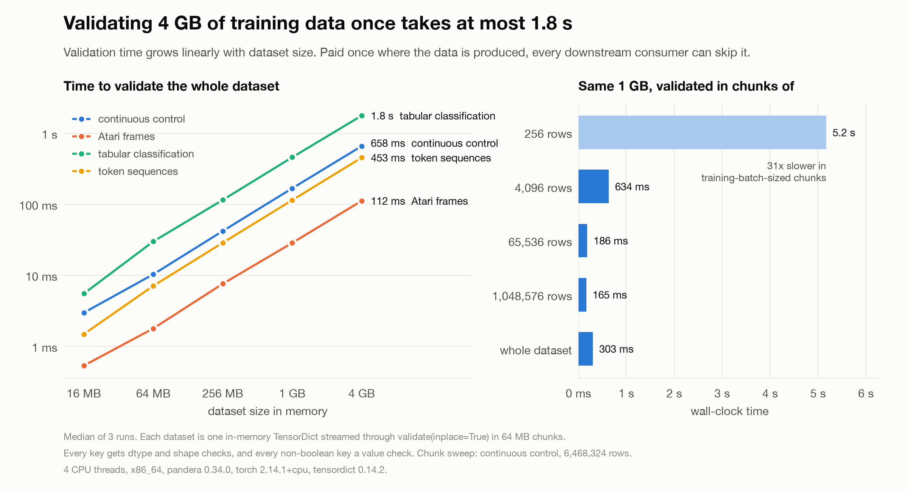

# Whole-dataset validation

> [!NOTE]
> Code available [on GitHub](https://github.com/unionai/unionai-examples/tree/main/v2/tutorials/pandera_dataset_validation).

The [per-batch validation overhead](../validation-overhead/_index) tutorial measures what it costs to validate
inside a training loop, a cost every consumer of the data pays on every epoch. This one measures the alternative:
validate the whole dataset once, where it's produced, so the training jobs downstream can trust it without checking
again. The question it answers is how wall-clock validation time grows with dataset size.

## Datasets

Four synthetic datasets shaped like common training data, all valid by construction:

| Dataset | Modeled on | Keys and checks | Bytes/row |
|---|---|---|---:|
| continuous control | TorchRL / D4RL HalfCheetah replay buffer | `observation` (17) and `next_observation` (17) in [-100, 100], `action` (6) in [-1, 1], `reward`, `done`, `terminated` | 166 |
| Atari frames | DQN frame stacks | `pixels` uint8 (4×84×84) with no blank frames, `action` in the 18-action set, clipped `reward`, `done` | 28,237 |
| tabular classification | supervised tabular training set | `features` (32) finite, `category` (12) valid one-hot rows, `label` in [0, 9], `sample_weight` ≥ 0 | 188 |
| token sequences | LM fine-tuning | `input_ids` (512) in the 32k vocab, `attention_mask`, `labels` that are token ids or the -100 ignore index | 8,704 |

## Setting up the environment

The benchmark runs on 4 CPUs with 12 GiB of memory and the CPU-only torch wheel. torch's thread count is pinned to
the CPU request, since `os.cpu_count()` in a pod reports the node's cores.



## The schemas

Every key gets dtype and shape checks, and every non-boolean key gets a value check that scans every element. The
one-hot, finite, blank-frame, and ignore-index checks are custom `Check`s, which is why the schemas use the
object-based `TensorDictSchema` API: `TensorDictModel` fields don't accept custom checks in pandera 0.34.



## Proving the checks scan everything

A schema that could pass without scanning every row would make validation look cheaper than it is. Before timing a
dataset, the benchmark corrupts one value in the last row of a small copy and asserts that validation raises. If it
doesn't, the benchmark refuses to run. The check also serves as a warmup, so first-call costs don't land on the
smallest size.



## Streaming validation in chunks

Each dataset is one in-memory `TensorDict`, validated by streaming it through `validate(inplace=True)` in 64 MB
chunks. Slicing a `TensorDict` returns views, so chunking adds no copies, and `inplace=True` skips the defensive
clone `validate()` makes by default.



## Timing every dataset and size

Each dataset is validated at 16 MB, 64 MB, 256 MB, 1 GB, and 4 GB, with data generation outside the timer and three
repeats per point. A second sweep validates the same 1 GB continuous-control dataset in chunks of 256, 4,096,
65,536, and 1,048,576 rows, plus the whole dataset at once, to show what chunk size does to the cost.



## Results

The run used 4 torch threads on x86_64, with torch 2.14.1+cpu, pandera 0.34.0, and tensordict 0.14.2.



Validation time at each size (median of 3, streamed in 64 MB chunks):

| Dataset | 16 MB | 256 MB | 1 GB | 4 GB | Throughput |
|---|---:|---:|---:|---:|---:|
| continuous control | 3 ms | 42 ms | 168 ms | 658 ms | 6.5 GB/s · 25 ns/row |
| Atari frames | 0.5 ms | 8 ms | 29 ms | 112 ms | 38 GB/s · 734 ns/row |
| tabular classification | 6 ms | 115 ms | 458 ms | 1.77 s | 2.4 GB/s · 77 ns/row |
| token sequences | 1 ms | 29 ms | 114 ms | 453 ms | 9.5 GB/s · 917 ns/row |

The same 1 GB of continuous-control data (6.5M rows) at different chunk sizes:

| Chunk | Time | ns/row |
|---|---:|---:|
| 256 rows | 5.17 s | 800 |
| 4,096 rows | 634 ms | 98 |
| 65,536 rows | 186 ms | 29 |
| 1,048,576 rows | 165 ms | 26 |
| whole dataset at once | 303 ms | 47 |

How to read it:

- Time is linear in dataset size for every dataset, so throughput is flat from 16 MB to 4 GB. Extrapolating at the
  slowest rate here (2.4 GB/s), a 40 GB dataset would take about 17 seconds on 4 cores; sizes past 4 GB weren't
  measured.
- Throughput depends on how much work the checks do per byte, not on how many bytes there are. The Atari frames are
  mostly uint8 pixels with one cheap reduction per frame, so they validate at 38 GB/s. Tabular data is slowest
  because the one-hot check does several passes (equality, sum) over a small float column.
- Chunk size matters a lot at the small end. In 256-row chunks, the size of a training batch, the same gigabyte
  takes 31x longer than in 1M-row chunks, because every `validate()` call pays a fixed overhead. That's the
  per-batch cost the companion benchmark measures, paid here on one pass instead of every epoch.
- Validating everything in one call was slower than 1M-row chunks (303 ms vs 165 ms). The likely reason is that
  each check's comparison builds a boolean mask the size of the whole tensor, which falls out of cache; that wasn't
  profiled. Either way, moderate chunks were faster and use less peak memory.
- For a rough comparison with the per-batch benchmark (its schema is a little different, and it used the default
  `inplace=False`): there, validating each 256-row batch inside the loop cost about 0.3 ms per step. Validating
  continuous-control data once, upstream, in large chunks costs about 26 ns per row, or about 7 µs per 256 rows.

## Rendering the report

The `plot` task renders the chart in light and dark themes and writes it, with both tables, into the run's report
tab.



## Run it

```bash
# On your cluster; builds the image remotely, then writes results/ locally
uv run main.py

# Locally, with small sizes
uv run main.py --local --sizes-mb 8 32 128 --repeats 2 \
    --sweep-size-mb 64 --sweep-chunk-rows 256 4096 65536
```
