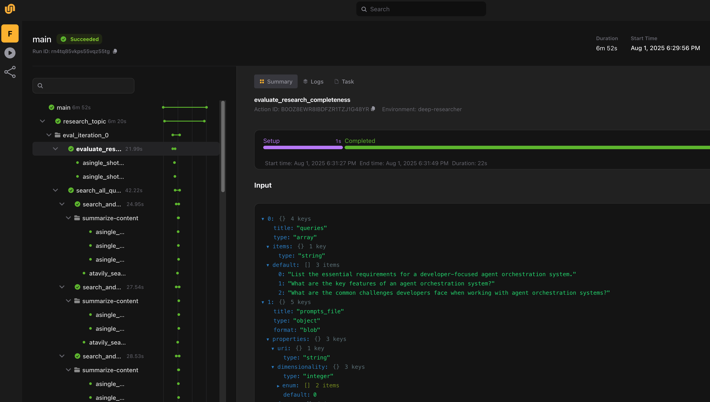

# Deep research

> [!NOTE]
> Code available [here](https://github.com/unionai/unionai-examples/tree/main/tutorials-v2/deep_research_agent); based on work by [Together AI](https://github.com/togethercomputer/open_deep_research).

This example demonstrates how to build an agentic workflow for deep research—a multi-step reasoning system that mirrors how a human researcher explores, analyzes, and synthesizes information from the web.

Deep research refers to the iterative process of thoroughly investigating a topic: identifying relevant sources, evaluating their usefulness, refining the research direction, and ultimately producing a well-structured summary or report. It's a long-running task that requires the agent to reason over time, adapt its strategy, and chain multiple steps together, making it an ideal fit for an agentic architecture.

In this example, we use:

- [Tavily](https://www.tavily.com/) to search for and retrieve high-quality online resources.
- [LiteLLM](https://litellm.ai/) to route LLM calls that perform reasoning, evaluation, and synthesis.

The agent executes a multi-step trajectory:

- Parallel search across multiple queries.
- Evaluation of retrieved results.
- Adaptive iteration: If results are insufficient, it formulates new research queries and repeats the search-evaluate cycle.
- Synthesis: After a fixed number of iterations, it produces a comprehensive research report.

What makes this workflow compelling is its dynamic, evolving nature. The agent isn't just following a fixed plan; it's making decisions in context, using multiple prompts and reasoning steps to steer the process.

Flyte is uniquely well-suited for this kind of system. It provides:

- Structured composition of dynamic reasoning steps
- Built-in parallelism for faster search and evaluation
- Traceability and observability into each step and iteration
- Scalability for long-running or compute-intensive workloads


_How the deep research agent workflow appears in the Union UI_

Throughout this guide, we'll show how to design this workflow using the Flyte SDK, and how to unlock the full potential of agentic development with tools you already know and trust.

## Setting up the environment

Let's begin by setting up the task environment. We define the following components:

- Secrets for Together and Tavily API keys
- A custom image with required Python packages and apt dependencies (`pandoc`, `texlive-xetex`)
- External YAML file with all LLM prompts baked into the container



The Python packages are declared at the top of the file using the `uv` script style:

```
# /// script
# requires-python = "==3.13"
# dependencies = [
#    "flyte>=2.0.0b0",
#    "pydantic==2.11.5",
#    "litellm==1.72.2",
#    "pypandoc==1.15",
#    "pandoc==2.4",
#    "tavily-python==0.7.5",
#    "commonmark==0.9.1",
#    "xhtml2pdf==0.2.17",
# ]
# ///
```

## Generate research queries

This task converts a user prompt into a list of focused queries. It makes two LLM calls to generate a high-level research plan and parse that plan into atomic search queries.



LLM calls use LiteLLM, and each is wrapped with `flyte.trace` for observability:



> [!NOTE]
> We use `flyte.trace` to track intermediate steps within a task, like LLM calls or specific function executions. This lightweight decorator adds observability with minimal overhead and is especially useful for inspecting reasoning chains during task execution.

## Search and summarize

We submit each research query to Tavily and summarize the results using an LLM. We run all summarization tasks with `asyncio.gather`, which signals to Flyte that these tasks can be distributed across separate compute resources.



## Evaluate research completeness

Now we assess whether the gathered research is sufficient. Again, the task uses two LLM calls to evaluate the completeness of the results and propose additional queries if necessary.



## Filter results

In this step, we evaluate the relevance of search results and rank them. This task returns the most useful sources for the final synthesis.



## Generate the final answer

Finally, we generate a detailed research report by synthesizing the top-ranked results. This is the output returned to the user.



## Orchestration

Next, we define a `research_topic` task to orchestrate the entire deep research workflow. It runs the core stages in sequence: generating research queries, performing search and summarization, evaluating the completeness of results, and producing the final report.



The `main` task wraps this entire pipeline and adds PDF generation as the final step.
It also serves as the main entry point to the workflow, allowing us to pass in all configuration parameters, including which LLMs to use at each stage.
This flexibility lets us mix and match models for planning, summarization, and final synthesis, helping us optimize for both cost and quality.



## Run the deep research agent

First, create the required secrets:

```
flyte create secret TOGETHER_API_KEY <>
flyte create secret TAVILY_API_KEY <>
```

Run the agent:

```
uv run --prerelease=allow agent.py
```

If you want to test it locally first, run the following commands:

```
brew install pandoc
brew install basictex # restart your terminal after install

export TOGETHER_API_KEY=<>
export TAVILY_API_KEY=<>

uv run --prerelease=allow agent.py
```

## Evaluate with Weights & Biases Weave

We use W&B Weave to evaluate the full agent pipeline and analyze LLM-generated responses. The evaluation runs as a Flyte pipeline and uses an LLM-as-a-judge scorer to measure the quality of LLM-generated responses.



You can run this pipeline locally as follows:

```
export HUGGINGFACE_TOKEN=<> # https://huggingface.co/settings/tokens
export WANDB_API_KEY=<> # https://wandb.ai/settings

uv run --prerelease=allow weave_evals.py
```

The script will run all tasks in the pipeline and log the evaluation results to Weights & Biases.
While you can also evaluate individual tasks, this script focuses on end-to-end evaluation of the end-to-end deep research workflow.


